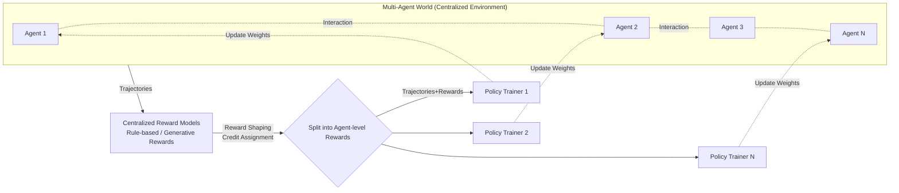

# MARTI: A Framework for Multi-Agent LLM Systems Reinforced Training and Inference

**Conference**: ICLR 2026  
**OpenReview**: [https://openreview.net/forum?id=E7jZqo0A50](https://openreview.net/forum?id=E7jZqo0A50)  
**Code**: [https://github.com/TsinghuaC3I/MARTI](https://github.com/TsinghuaC3I/MARTI)  
**Area**: Multi-Agent LLM Systems / Multi-Agent Reinforcement Learning  
**Keywords**: Multi-Agent System, Reinforcement Learning, LLM Reasoning, Credit Assignment, Reward Shaping  

## TL;DR
MARTI unifies "multi-agent reasoning" and "distributed RL training" into an open-source framework. By utilizing centralized environment interaction and reward allocation, it dispatches each agent's trajectories and rewards back to their respective policy trainers. This enables multiple LLM agents to be trained together via RL during collaboration, achieving a higher mathematical reasoning upper bound than a single agent under the same inference budget.

## Background & Motivation
**Background**: Large reasoning models (such as DeepSeek-R1, o1/o3) have demonstrated that pure RL with rule-based rewards significantly amplifies the reasoning capabilities of LLMs. However, post-training RL primarily "activates" existing capabilities from pre-training; the pass@k of the base model sets the upper bound for RL improvements. Another path is LLM Multi-Agent Systems (MAS), which scale reasoning compute by increasing the number of agents, as seen in frameworks like AutoGen, CAMEL, and MetaGPT.

**Limitations of Prior Work**: Existing MAS frameworks (AutoGen/CAMEL/MetaGPT/GPTSwarm) rely almost entirely on "inference-time LLM calls." Their effectiveness depends heavily on the instruction-following capabilities of the LLM—which is often a point of failure (e.g., agents failing to maintain roles or utilize interaction information from others). Conversely, RL frameworks capable of training LLMs (OpenRLHF, veRL, TRL, AReaL) entirely lack support for multi-agent systems. These two types of tools are naturally fragmented.

**Key Challenge**: A gap exists between "inference collaboration" in MAS and "training optimization" in RL. No existing framework simultaneously supports MAS inference, single-agent RL, and multi-agent RL (Table 1 shows only MARTI achieves all three).

**Goal**: To build a unified framework that uses RL to improve LLM-based MAS, allowing multiple agents to be reinforced together during collaborative interactions, thereby breaking the performance ceiling of single-agent RL.

**Core Idea**: **Centralized Interaction + Distributed Training**. Interaction, reward calculation, and credit assignment occur centrally within a "Multi-Agent World," while policy training is distributed to each agent's respective trainer. Global rewards are decomposed into agent-level rewards through reward shaping and credit assignment before being fed into distributed RL.

## Method

### Overall Architecture
Built upon OpenRLHF, MARTI establishes a closed-loop pipeline for rollout generation, reward allocation, and policy training through three major modules: **Multi-Agent World** (the environment that executes workflows, samples trajectories, and handles credit assignment/format conversion), **Centralized Reward Models** (calculates rewards centrally and performs reward shaping to decompose global rewards into agent-level rewards), and **Agent Policy Trainer** (distributes trajectories and rewards to independent trainers for SFT/RL). It features built-in workflows like Multi-Agent Debate (MAD), Mixture-of-Agents (MoA), and Chain-of-Agents (CoA), supports custom injections, and utilizes multi-round asynchronous rollouts to increase training throughput.

### Key Designs

**1. Two-layer architecture of Centralized Interaction + Distributed Training: Decoupling "collaboration" from "optimization."** The core structural choice of MARTI is to centralize interaction and reward allocation in the Multi-Agent World while distributing policy updates to individual agent trainers. The Multi-Agent World manages prompt-driven rollouts according to specific workflows, handles credit assignment for trajectories, and converts data into formats required for downstream RL; it supports asynchronous generation for high throughput and allows dynamic injection of custom workflows. Centralization enables unified reward calculation across agents, while distribution allows each backbone LLM to be trained independently using OpenRLHF's REINFORCE++, GRPO, or PPO.

**2. Inference-aware reward shaping: Ensuring multi-round collaboration goes beyond single-step correctness.** For tasks with verifiable answers like mathematics, MARTI uses rule-based rewards to score agent outputs against ground truth. However, raw accuracy can lead to overfitting on single steps. This work introduces historical performance estimation $Q_t^i = \frac{1}{|H_t^i|}\sum_{k \in H_t^i} R_k^i$ (where $H_t^i$ is the historical evaluation range, such as "most recent round" or "all history"), with $R_t^i \in [0,1]$ as the immediate correctness reward for agent $i$ at round $t$. A dynamic shaping term $\Delta_t^i$ is defined with two modes: Margin Mode $\Delta_t^i = R_t^i - Q_t^i$ (rewarding performance exceeding historical mean) and Quality Mode $\Delta_t^i = Q_t^i R_t^i - (1-Q_t^i)(1-R_t^i)$ (encouraging consistency between current and historical correctness). The final shaped reward is $\tilde{R}_t^i = R_t^i + \alpha \cdot \Delta_t^i$, where $\alpha \ge 0$ controls the weight of historical consistency. Ablations show that removing reward shaping drops the MAD average score from 45.6 to 36.6.

**3. Generative Reward Model (GenRM) for open-domain coverage: Extending beyond verifiable tasks.** For open-domain problems without standard answers, MARTI employs LLM-as-judge GenRMs to provide scalar scores for "problem-trajectory pairs," supporting local vLLM engines or OpenAI-compatible APIs. The paper also explores GenRMs specifically targeting MAS failure modes (role inconsistency, failure to use interaction info) to allocate rewards for specific roles and behaviors. Rule-based rewards handle verifiable tasks while GenRMs handle open domains; both feed into the same credit assignment system.

**4. Flexible distributed policy training: Mixing RL and imitation learning for stability.** After obtaining trajectories and rewards, MARTI uses OpenRLHF's distributed capabilities to train each policy model, supporting REINFORCE++, GRPO, and PPO. Consistent RL algorithms are typically used across all agents, with extensibility for new algorithms like PRIME. Crucially, it allows mixing SFT and DPO into on-policy rollout training to stabilize training and accelerate convergence, allowing the framework to prioritize stability or speed as needed.

## Key Experimental Results

### Main Results
On Llama-3.2-3B-Instruct, MARTI multi-agent RL consistently outperformed single-agent RL and majority voting baselines under the same inference budget (Data for AIME / AMC / MATH500 / Average):

| Llama-3.2-3B-Instruct | AIME | AMC | MATH500 | Avg |
|---|---|---|---|---|
| Single Agent (Pass@1) | 3.3 | 12.4 | 32.2 | 16.0 |
| + RL | 11.7 | 25.6 | 48.9 | 28.7 |
| Single Agent (Maj@4) + RL | 11.7 | 27.7 | 50.6 | 30.0 |
| MAD 2×2 + RL (MARTI) | 13.3 | 29.5 | 53.6 | **32.1** |
| MoA 3×1 + RL (MARTI) | 11.7 | 28.7 | 52.6 | 31.0 |

For reasoning models, DeepScaleR-1.5B-Preview trained with MARTI multi-agent RL reached an AIME score of **66.7** (65.0 reported in abstract), significantly exceeding the single-agent baseline (53.5) and OpenAI-o1-mini given similar compute.

### Ablation Study
**Reward shaping ablation (Qwen2.5-3B)**: Removing reward shaping leads to a significant performance drop.

| Qwen2.5-3B | AIME | AMC | MATH500 | Avg |
|---|---|---|---|---|
| MAD 2×2 w/ reward shaping | 16.7 | 49.4 | 70.8 | **45.6** |
| MAD 2×2 w/o reward shaping | 6.6 | 36.6 | 66.7 | 36.6 |
| MoA 3×1 w/ reward shaping | 13.3 | 47.0 | 69.0 | **43.1** |
| MoA 3×1 w/o reward shaping | 10.0 | 38.9 | 65.4 | 38.1 |

**Algorithm ablation (Qwen2.5-3B, RF++ vs GRPO)**: Both show substantial gains, with GRPO being slightly superior. MAD 2×2 + RF++ averaged 45.6, while + GRPO averaged 46.0.

### Key Findings
- **Untrained multi-agent workflows perform worse than majority voting**: Under equal compute, untrained MAD/MoA/CoA generally underperform Maj@N. This confirms that single-agent training paradigms lack exposure to multi-agent dynamics, leading to collaboration failure—which MARTI addresses via MARL.
- **Multi-agent RL provides a higher ceiling**: After MARTI training, both base and reasoning models consistently achieve higher upper bounds than single-agent RL under the same inference budget, with MAD usually performing best.
- **Robust across model families and algorithms**: Consistent conclusions across Llama and Qwen families and both RF++ and GRPO suggest gains are not architecture-specific.

## Highlights & Insights
- **Fills a toolchain gap**: It is the first open-source framework to simultaneously support MAS inference, single-agent RL, and multi-agent RL, bridging the divide between existing MAS and RL tools.
- **"Centralized Interaction / Distributed Training" as a clean engineering abstraction**: Using "trajectories + rewards" as the intermediate interface makes both the reward side (rule/generative) and the training side (PPO/GRPO/SFT/DPO) pluggable and extensible.
- **A counter-intuitive empirical insight**: Stacking agents without training is less effective than simple majority voting; the value of multi-agent systems must be realized through "training together via RL."
- **Asynchronous multi-round rollout**: Directly addresses the throughput bottleneck of multi-agent training, a key engineering factor for scalability.

## Limitations & Future Work
- **Narrow task scope**: Experiments are concentrated on competitive mathematics (AIME/AMC/MATH500); open-domain and real-world applications have not yet been fully validated.
- **Immature MAS reward models**: GenRMs targeting multi-agent failure modes are still under "continuous optimization" and listed as future work; the precision of credit assignment directly determines training quality.
- **Preliminary data**: The authors describe these as "preliminary experiments." The scale (3B/1.5B models) and baseline coverage are somewhat limited compared to large-scale multi-agent training.
- **High compute barrier**: Multi-agent RL utilized 3 nodes × 8 × A800-80G, with each agent occupying an entire node, implying high reproduction costs.

## Related Work & Insights
- **Heir to RL for Reasoning**: Built upon DeepSeek-R1 zero-like RL, TTRL, and OpenRLHF, extending single-agent RL successes to multi-agent settings.
- **Comparison to existing MAS frameworks**: While AutoGen/MetaGPT focus on inference, MARTI adds the "trainable" dimension.
- **Reward shaping inspiration**: Inference-aware shaping is derived from MAPoRL, while GenRM concepts stem from the LLM-as-judge series.
- **Insight**: It redefines "multi-agent collaboration" as an object for RL optimization rather than just prompt engineering. It provides a research foundation for "trainable agent teams" or "role-specialized agents." MAS credit assignment remains the most challenging problem to resolve.

## Rating
- **Novelty**: ⭐⭐⭐⭐ — First to unify MAS inference with multi-agent RL at the framework level. The centralized/distributed hybrid is a valuable system contribution.
- **Experimental Thoroughness**: ⭐⭐⭐ — Includes cross-model/algorithm/workflow controls and ablations, but tasks are limited to math and model sizes are small.
- **Writing Quality**: ⭐⭐⭐⭐ — Clear motivation (Table 1 identifies gaps effectively), clean modular division, and sound ablation analysis.
- **Value**: ⭐⭐⭐⭐ — As open-source infrastructure, it fills a genuine gap and lowers the threshold for research into "trainable multi-agent systems."

<!-- RELATED:START -->

## Related Papers

- [\[AAAI 2026\] iMAD: Intelligent Multi-Agent Debate for Efficient and Accurate LLM Inference](../../AAAI2026/multi_agent/imad_intelligent_multi-agent_debate_for_efficient_and_accura.md)
- [\[ICLR 2026\] Graph-of-Agents: A Graph-based Framework for Multi-Agent LLM Collaboration](graph-of-agents_a_graph-based_framework_for_multi-agent_llm_collaboration.md)
- [\[ICLR 2026\] CellAgent: LLM-Driven Multi-Agent Framework for Natural Language-Based Single-Cell Analysis](cellagent_llm-driven_multi-agent_framework_for_natural_language-based_single-cel.md)
- [\[ACL 2026\] Explicit Trait Inference for Multi-Agent Coordination](../../ACL2026/multi_agent/explicit_trait_inference_for_multi-agent_coordination.md)
- [\[ACL 2026\] MASFactory: A Graph-centric Framework for Orchestrating LLM-Based Multi-Agent Systems with Vibe Graphing](../../ACL2026/multi_agent/masfactory_a_graph-centric_framework_for_orchestrating_llm-based_multi-agent_sys.md)

<!-- RELATED:END -->
