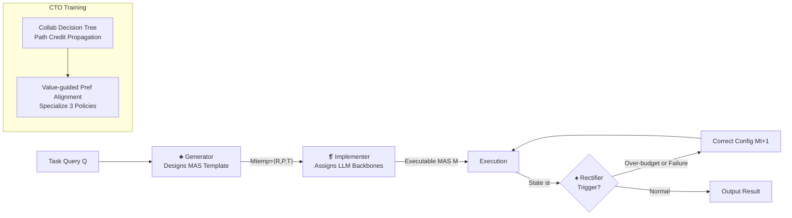

# MAS²: Self-Generative, Self-Configuring, Self-Rectifying Multi-Agent Systems

**Conference**: ICLR 2026  
**OpenReview**: [https://openreview.net/forum?id=qumy27hMDY](https://openreview.net/forum?id=qumy27hMDY)  
**Code**: [https://github.com/yeyeyeah2/MAS2](https://github.com/yeyeyeah2/MAS2)  
**Area**: Multi-Agent Systems / Automated MAS Design / LLM Agent  
**Keywords**: Multi-Agent System, Meta-Agent, Self-Generation, Self-Rectification, Offline RL  

## TL;DR
MAS² enables a "Meta-Multi-Agent System" (Generator–Implementer–Rectifier triad) to architect, configure, and dynamically correct another Multi-Agent System (MAS) for specific tasks at runtime. By utilizing Collaborative Tree Optimization (CTO) for offline RL to specialize these three meta-agents, MAS² achieves up to a 19.6% improvement over SOTA MAS across 8 benchmarks while maintaining a superior cost–performance Pareto frontier.

## Background & Motivation
**Background**: LLM Multi-Agent Systems (MAS) are evolving from "manual configuration of prompts/tools/roles/protocols" (e.g., AutoGen, MetaGPT) toward "automated orchestration." Automation follows two main paths: one relies on external module generation (GNN, Bayesian Optimization, MCTS; e.g., GPTSwarm, AFlow, MaAS), and the other on single LLM agent generation (MAS-GPT, ScoreFlow, FlowReasoner).

**Limitations of Prior Work**: External module approaches are often restricted to predefined atomic operator search spaces (CoT, Reflexion, Debate), lacking architectural innovation. While agent-generation approaches achieve task-level adaptation, they **almost exclusively follow the "generate-once-and-deploy" paradigm**—the system executes as instantiated regardless of success or failure.

**Key Challenge**: Real-world environments are dynamic and error-prone (network failures, tool crashes, missing files). "Generate-once-and-deploy" systems risk total collapse under a single unexpected perturbation, lacking any adaptive capabilities beyond the initial instantiation.

**Goal**: This paper proposes a third paradigm where the MAS possesses both **self-generation** and **self-adaptation** capabilities—one multi-agent system autonomously constructs another and continuously monitors and rectifies it in real-time.

**Core Idea**: **Recursive self-generation**. The responsibility for "building the system" is decomposed into a team of specialized meta-agents: the **Generator** designs high-level workflow templates, the **Implementer** assigns specific LLM backbones to make templates executable, and the **Rectifier** monitors execution state to provide instant corrections. This approach breaks the creativity ceiling of external modules and overcomes the rigidity of the "generate-once-and-deploy" model.

## Method

### Overall Architecture
The Meta-MAS of MAS² consists of three sequential meta-agents: at inference time, the **Generator** $A_{gen}$ receives a task query $Q$ and produces an MAS template $\rightarrow$ the **Implementer** $A_{imp}$ instantiates the template into an executable system $\rightarrow$ the **Rectifier** $A_{rec}$ continuously monitors and adjusts during runtime (§3.1). These meta-agents are trained via the **Collaborative Tree Optimization (CTO)** framework: preference signals are collected through path-level credit propagation (§3.2), followed by value-guided preference alignment to specialize each meta-agent (§3.3).

### Key Designs

**1. Quadruple Formalization of Target MAS and Generator–Implementer Decoupling: Blueprint before Resources**. MAS² formalizes the target system as $M = \langle R, P, T, B \rangle$, where $R$ is the set of agents, $P=\{\rho_{ij}\}$ defines communication protocols, $T$ represents available tools, and $B=\{b_i \mapsto r_i\}$ maps agents to specific LLM backbones. The key innovation is the two-stage construction: the Generator handles the architectural level, producing a workflow template $M_{temp} = \langle R, P, T \rangle \sim \pi_{gen}(\cdot|Q)$ that **abstracts away computational resources**. The Implementer then defines the mapping strategy $\phi: R \to L, r_i \mapsto b_{j(i)}$ from a pool of candidate LLMs $L=\{b_1, \dots, b_{|L|}\}$. This decoupling allows different expert models to handle architectural innovation vs. resource allocation, leading to Pareto efficiency by assigning simple sub-tasks to smaller models and complex reasoning to larger ones.

**2. Rectifier Trigger–Intervention Loop: From "Generate-and-Deploy" to Runtime Self-Correction**. This is the core differentiator of MAS². Once the instantiated $M$ is deployed, the Rectifier $A_{rec}$ acts as an online monitor. Its trigger function $A_R(s_t) = \mathbb{1}[C(s_t) > \theta_C \vee O(s_t) = \text{Failure}]$ monitors the execution state $s_t$: it is activated if cumulative resource consumption $C(s_t)$ exceeds budget $\theta_C$ or if an operation $O(s_t)$ results in explicit failure (e.g., tool error, code execution failure). Upon activation, the Rectifier generates modifications $M_{t+1} \sim \pi_{rec}(\cdot|M_t, s_t)$, which can range from local adjustments (reassigning tools or prompts) to global architectural changes. The system then resumes execution from $s_t$ with $M_{t+1}$.

**3. Collaborative Tree Optimization (CTO) and Path Credit Propagation: Attributing Team Success to Local Meta-Agent Decisions**. To train the three meta-agents, CTO constructs a rooted directed tree $G_Q=(V,E)$ for each query $Q$. Nodes represent decisions by the Generator, Implementer, and Rectifier, with leaves as termination points. A trajectory $\tau$ is a path from root to leaf. A **cost-sensitive conditional reward** is introduced: $R(\tau) = \mathbb{1}[R_p(\tau)] \cdot \frac{1}{C_{norm}(\tau)}$. Successful trajectories are rewarded based on normalized resource consumption $C_{norm}(\tau)$, while failed ones receive zero reward. **Path credit propagation** then attributes rewards back to intermediate nodes: the value $V(v) = \mathbb{E}_{\tau \in T(v)}[R(\tau)] \approx \frac{1}{|T(v)|}\sum_{\tau \in T(v)} R(\tau)$ estimates the expected reward of all trajectories passing through node $v$, distributing the final outcome back to upstream decisions.

**4. Value-Scaled Preference Alignment: Learning Most from "Cleanest Wins"**. The valued decision tree is converted into preference data. Unlike standard binary pairs, CTO tuples include the **win margin** $\Delta V = V(v') - V(v'') > 0$, resulting in $D_\pi = \{(c_v, a_{win}, a_{lose}, \Delta V)\}$. The loss function $L_{CTO} = -\mathbb{E}[\Delta V \cdot \log\sigma(\beta\log\frac{\pi_\theta(a_{win}|c)}{\pi_{ref}(a_{win}|c)} - \beta\log\frac{\pi_\theta(a_{lose}|c)}{\pi_{ref}(a_{lose}|c)})]$ weights each term by $\Delta V$. This ensures the model learns most from high-confidence preference pairs (significant value differences) and is less sensitive to marginal gains. This optimization is applied independently to yield specialized policies $\pi^*_{gen}, \pi^*_{imp}, \pi^*_{rec}$ using Qwen3-8B as the backbone with LoRA fine-tuning.

## Key Experimental Results

### Main Results
Evaluated across 8 benchmarks (Multi-hop search: HotpotQA/Bamboogle/NQ; Research: BrowseComp+; Code: HumanEval/MBPP; Math: MATH). Results are means of three random runs:

| Model | HotpotQA | Bamboogle | NQ | BrowseComp+ | HumanEval | MBPP | MATH |
|---|---|---|---|---|---|---|---|
| GPT-4o | 69.5 | 49.6 | 71.1 | 13.2 | 89.6 | 73.4 | 56.5 |
| DyLAN | 80.8 | 59.7 | 72.1 | 15.8 | 90.4 | 77.3 | 65.7 |
| MaAS | 83.6 | 62.0 | 76.0 | 14.0 | 92.8 | 82.2 | 70.1 |
| AFlow | 77.9 | 59.2 | 74.5 | 10.0 | 92.9 | 82.9 | 68.5 |
| ScoreFlow | 86.0 | 64.8 | 76.4 | 10.4 | 95.9 | 84.7 | 64.4 |
| **MAS²** | **89.3** | **67.2** | **79.1** | **19.7** | **97.0** | **85.1** | **71.3** |

MAS² achieves optimal performance on all 8 benchmarks, with an 8.5% improvement over the manual best (DyLAN) on HotpotQA and a 10.2% maximum improvement on BrowseComp+.

### Ablation Study
Ablations on MBPP, HotpotQA, and MATH:

| Variant | MBPP | HotpotQA | MATH |
|---|---|---|---|
| w/o Generator | 79.0 | 86.6 | 63.1 |
| w/o Rectifier | 81.7 | 87.2 | 64.7 |
| w/o Implementor | 80.4 | 87.3 | 65.3 |
| **MAS² (Full)** | **85.2** | **89.3** | **71.3** |

The removal of the Generator causes the most significant drop, while removing the Rectifier leads to a 6.6% drop in MATH, highlighting the value of runtime self-correction.

### Key Findings
- **Poor Cross-Domain Generalization of Existing Auto-MAS**: MultiPersona is strong in HumanEval (92.9%) but drops 4.3% in MATH; ADAS is good in HotpotQA (78.5%) but only 7.0% in BrowseComp+. MAS² is the only system with stable leadership across all domains.
- **Cross-Backbone Generalization**: Unseen LLMs (Qwen3-Coder, GPT-5-Mini, Gemini-2.5-Pro) can be utilized without retraining, improving MATH performance from 69.7% to 90.6%.
- **Pareto Frontier**: On Bamboogle, it achieves 12.8% higher pass rate than GPT-4o with SC at 25x lower cost. This stems from dual-layer dynamic allocation: LLM-level (small models for easy tasks) and System-level (lightweight MAS for easy problems).

## Highlights & Insights
- **Clear Paradigm Shift**: The paper categorizes automated MAS history into four stages: manual $\rightarrow$ external module $\rightarrow$ single agent $\rightarrow$ MAS-generating-MAS. The "recursive self-generation" of MAS² is a logical progression.
- **Runtime Correction is a Crucial Pain Point**: By addressing the brittleness of "generate-once-and-deploy" in dynamic environments, the Rectifier's trigger function formalizes both the "when" and "how" of correction.
- **Elegant Multi-Agent Credit Assignment**: CTO combines decision trees, path credit propagation, and value-scaled alignment to clearly attribute team outcomes to individual decisions using high-efficiency offline RL.
- **Practical Cost-Aware Rewards**: Including token costs directly in the reward prevents "model stacking" for marginal gains, making the optimization pragmatic.

## Limitations & Future Work
- **Trigger Reliance on Explicit Signals**: The Rectifier depends on error messages or budget caps; its ability to detect "silent errors" (incorrect answers without system crashes) remains unverified.
- **Fixed Meta-Agent Backbones**: The meta-agents are fixed to Qwen3-8B; sensitivity to different meta-model sizes and the inherent overhead of the Meta-MAS itself were not fully analyzed.
- **Limited Search Breadth**: Tree expansion parameters $K, N$ are relatively small. Sufficiency for highly complex tasks remains to be validated.
- **Task Scope**: Evaluations are centered on QA, code, math, and search; long-term interactive agentic tasks (e.g., full software engineering projects) are not yet covered.

## Related Work & Insights
- **Automated MAS**: External module route (GPTSwarm, AFlow) vs. model-driven route (MAS-GPT, ScoreFlow). MAS² overcomes the "one-shot deployment" limitation of both.
- **Meta LLM Agents**: Most instantiate from existing strong LLMs (OWL, AgentOrchestra); a few explicitly train leaders. MAS² upgrades the meta-agent from a "single control entity" to a "Meta-MAS."
- **RL for MAS**: CTO sits in the offline RL route for specializing meta-agents, focusing on hierarchical credit assignment.

## Rating
- **Novelty**: ⭐⭐⭐⭐⭐ The recursive "MAS generating MAS" paradigm, the triad decoupling, and runtime self-rectification are highly innovative.
- **Experimental Thoroughness**: ⭐⭐⭐⭐ Covers 8 benchmarks and 13 baselines with cross-backbone analysis, though lacks long-term interactive task evaluation.
- **Writing Quality**: ⭐⭐⭐⭐⭐ Clear historical context, rigorous formalization, and effective visualizations.
- **Value**: ⭐⭐⭐⭐⭐ Directly addresses brittleness and generalization issues in automated MAS; methods are open-source and provide a strong template for adaptive agent design.

<!-- RELATED:START -->

## Related Papers

- [\[ICLR 2026\] Stochastic Self-Organization in Multi-Agent Systems](stochastic_self-organization_in_multi-agent_systems.md)
- [\[ICLR 2026\] MARSHAL: Incentivizing Multi-Agent Reasoning via Self-Play with Strategic LLMs](marshal_incentivizing_multi-agent_reasoning_via_self-play_with_strategic_llms.md)
- [\[ACL 2026\] Towards Self-Improving Error Diagnosis in Multi-Agent Systems](../../ACL2026/multi_agent/towards_self-improving_error_diagnosis_in_multi-agent_systems.md)
- [\[ACL 2026\] AgenticEval: Toward Agentic and Self-Evolving Safety Evaluation of Large Language Models](../../ACL2026/multi_agent/agenticeval_toward_agentic_and_self-evolving_safety_evaluation_of_large_language.md)
- [\[ICLR 2026\] Goal-Aware Identification and Rectification of Misinformation in Multi-Agent Systems](goal-aware_identification_and_rectification_of_misinformation_in_multi-agent_sys.md)

<!-- RELATED:END -->
