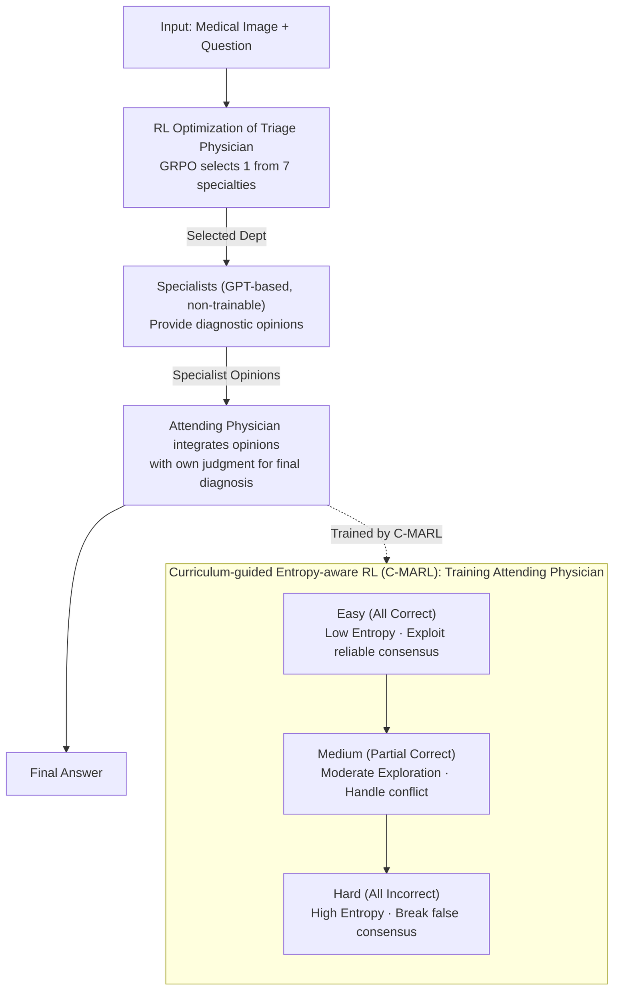

# MMedAgent-RL: Optimizing Multi-Agent Collaboration for Multimodal Medical Reasoning

**Conference**: ICLR2026  
**arXiv**: [2506.00555](https://arxiv.org/abs/2506.00555)  
**Code**: Not open-sourced  
**Area**: Medical Imaging  
**Keywords**: multi-agent collaboration, reinforcement learning, medical VQA, curriculum learning, GRPO, clinical reasoning  

## TL;DR
MMedAgent-RL is proposed to optimize a multi-agent system simulating clinical consultation workflows (Triage → Specialist → Attending) via RL. The core innovation is Curriculum-guided Entropy-aware RL (C-MARL), which enables the Attending Physician agent to adopt distinct exploration-exploitation strategies when facing correct, conflicting, or incorrect specialist opinions, achieving SOTA performance across five in-domain and out-of-domain medical VQA benchmarks.

## Background & Motivation
- **Limitations of Single Agents**: Medical image diagnosis involves multiple sub-specialties (Radiology, Pathology, Oncology, etc.), and a single Med-LVLM struggle to cover all specialized knowledge.
- **Deficiencies in Static Multi-Agents**: MedAgents, MDAgents, and others utilize fixed GP → Specialist → GP workflows where agent interaction patterns are predefined and non-learnable.
- **Unreliable Specialist Opinions**: Specialist model outputs are not always correct and may introduce noise or mislead; majority voting can suppress correct minority opinions.
- **Key Challenge**: The Attending Physician must learn **when to trust specialist consensus (exploit) and when to challenge it and explore independently (explore)**.
- **Opportunities for RL**: DeepSeek-R1 and similar models have proven that RL enhances LLM reasoning, but RL optimization for multi-agent medical collaboration remains unexplored.

## Method

### Overall Architecture
MMedAgent-RL executes a medical VQA task as a clinical consultation: first, the **Triage Physician** selects the appropriate specialty based on the image and question. Then, strong models acting as **Specialists** provide diagnostic opinions. Finally, the **Attending Physician** integrates these opinions with their own judgment to produce the final diagnosis. Both the Triage and Attending Physicians are based on Qwen2.5-VL and trained in stages using RL. Specialists are played by strong models like GPT and are not trained. Crucially, the Attending Physician is not trained to "copy-paste specialist opinions" but uses C-MARL to learn to exploit reliable opinions and question deviant ones.

### Key Designs

**1. RL Optimization of Triage Physician: Learning "Whom to Consult"**

Triage in traditional multi-agent systems often follows hard-coded rules. Here, it is treated as a learnable strategy: given images and text, the model selects from 7 departments (Pathologist, Radiologist, Surgeon, Oncologist, Endocrinologist, Ophthalmologist, Dermatologist) and provides a rationale. Training uses GRPO with supervision from ground truth (GT) image modality labels. The reward consists of format and accuracy scores: $R = R_{format} + R_{accuracy}$, where $R_{format}\in\{0,0.5\}$ and $R_{accuracy}\in\{0,1\}$. This improves triage accuracy and enforces explicit reasoning chains.

**2. Curriculum-guided Entropy-aware RL (C-MARL): Learning to Trust or Question**

Specialist opinions are not always accurate—they can be correct, conflicting, or collectively misleading. C-MARL categorizes training samples by specialty reliability and adjusts exploration intensity accordingly. Accuracy $s = \text{Acc}(y_d, y^*)$ defines three levels: Easy ($s=1$), Medium ($0<s<1$), and Hard ($s=0$, misleading consensus). An entropy regularization term varying with difficulty is added to the GRPO objective:

$$\mathcal{J}_{C\text{-}MARL}(\theta) = \mathbb{E}\big[\mathcal{J}_{GRPO}(\theta) + \gamma_s \cdot H_t(\pi_\theta)\big]$$

The entropy coefficient $\gamma_s$ increases with difficulty: $\gamma_{easy}\approx 0$ (exploit reliable knowledge), $\gamma_{medium}>0$ (avoid overconfidence in conflict), and $\gamma_{hard}\gg\gamma_{medium}$ (force exploration to break false consensus). Training progresses from Easy → Medium → Hard, transitioning the Attending from "following" to "questioning" specialties.

**3. Convergence Guarantees: Why Curriculum Training Outperforms Direct Training**

The authors provide Theorem 4.1, proving curriculum training's superior convergence over standard SGD. Intuitively, total training time depends on the sum of distances between optimal policies of adjacent stages: $\sum_{j=0}^{J-1}\log\|\theta_j^\star - \theta_{j+1}^\star\|_2^2$. If the curriculum is effective, the solution of the previous stage serves as a warm start for the next, resulting in faster convergence. Standard SGD is proven unable to converge to the optimal policy under the same conditions (lower bound existence).

## Key Experimental Results

### Main Results (Accuracy, %)

| Model | VQA-RAD | SLAKE | PathVQA | In-domain Avg | OmniMedVQA | MMMU-Med | Out-of-domain Avg |
|------|---------|-------|---------|---------|------------|----------|---------|
| GPT-4o | 61.0 | 75.5 | 69.4 | 68.6 | 68.5 | 69.7 | 69.1 |
| Qwen2.5-VL-7B | 61.8 | 64.7 | 60.5 | 62.3 | 60.8 | 56.6 | 58.7 |
| MedVLThinker-7B | 63.7 | 67.8 | 65.2 | 65.6 | 62.4 | 57.0 | 59.7 |
| MDAgents | 66.8 | 68.2 | 65.4 | 66.8 | 58.2 | 52.3 | 55.1 |
| **MMedAgent-RL (7B)** | **71.5** | **76.2** | **72.3** | **73.3** | **73.3** | **71.9** | **72.6** |
| + Test-Time Scaling | 73.9 | 80.1 | 74.3 | 76.1 | 79.6 | 73.5 | 76.6 |

### Ablation Study

| Configuration | VQA-RAD | SLAKE | OmniMedVQA | MMMU-Med |
|------|---------|-------|------------|----------|
| Full MMedAgent-RL | 71.5 | 76.2 | 73.3 | 71.9 |
| w/o Triage | 66.3 | 69.9 | 66.2 | 59.3 |
| w/o Specialists | 65.8 | 67.8 | 64.4 | 54.2 |
| w/o C-MARL | 63.5 | 65.5 | 57.9 | 50.2 |
| + Easy only | 64.7 | 69.3 | 68.2 | 58.0 |
| + Easy + Medium | 69.4 | 76.9 | 70.8 | 68.8 |
| + Easy + Medium + Hard | 71.5 | 76.2 | 73.3 | 71.9 |

### Key Findings
1. **C-MARL Contribution**: Removing C-MARL drops performance by 18.6% on average, making it the most critical component.
2. **Curriculum Efficacy**: The Easy→Medium→Hard progression cumulatively improves performance, validating the curriculum design.
3. **Crucial Hard Stage**: The largest gain (+20%) occurs in "Hard" scenarios where specialists are all wrong, showing the model learns to distrust misleading consensus.
4. **Generalization**: OmniMedVQA (+13%) and MMMU-Med (+15%) significantly outperform the base model and GPT-4o.
5. **Triage Impact**: Optimized triage boosts overall chain performance by +3% by ensuring correct specialty consultation.
6. **TTS Benefits**: Test-Time Scaling via majority voting yields an additional 4.5% improvement.

## Highlights & Insights
- The entropy regulation in C-MARL elegantly addresses specialty noise in multi-agent systems via an exploration-exploitation trade-off.
- Combining curriculum learning with RL has theoretical grounding (convergence proofs) rather than being purely heuristic.
- A 7B model surpassing GPT-4o on multiple benchmarks demonstrates the potential of RL optimization.
- Extensive evaluation covers in/out-of-domain performance, specialty selection accuracy, and difficulty stratification.

## Limitations & Future Work
- Specialists rely on closed-source models (GPT), which increases deployment costs and API dependency.
- Triage is limited to 7 fixed departments and may not cover all clinical scenarios.
- The three-level curriculum relies on ground truth labels, which are unavailable during inference.
- Evaluation is limited to multiple-choice VQA, excluding open-ended clinical reasoning or report generation.
- Theoretical analysis assumes strong convexity, which deep networks may not satisfy.

## Related Work & Insights
- **Medical VLM**: Single-agent models like LLaVA-Med, HuatuoGPT-Vision, and VILA-M3.
- **Medical Multi-Agent**: Agent Hospital, MedAgents, and MDAgents—utilizing static, predefined workflows.
- **RL Reasoning**: Post-training paradigms like DeepSeek-R1 and VLM-R1 using GRPO.
- **Curriculum Learning**: Progressive training strategies from easy to hard (Bengio et al., 2009).

## Rating
⭐⭐⭐⭐⭐ (5/5)

The method design is elegant; the entropy-regulation strategy of C-MARL is both intuitive and theoretically supported. The experiments are comprehensive, and the 7B model's performance exceeding GPT-4o is impressive. The integration of curriculum learning and RL provides a new paradigm for multi-agent collaboration.

<!-- RELATED:START -->

## Related Papers

- [\[ACL 2026\] ConSensus: Multi-Agent Collaboration for Multimodal Sensing](../../ACL2026/multi_agent/consensus_multi-agent_collaboration_for_multimodal_sensing.md)
- [\[ICLR 2026\] AgentPO: Enhancing Multi-Agent Collaboration via Reinforcement Learning](agentpo_enhancing_multi-agent_collaboration_via_reinforcement_learning.md)
- [\[ICLR 2026\] Multi-Agent Design: Optimizing Agents with Better Prompts and Topologies](multi-agent_design_optimizing_agents_with_better_prompts_and_topologies.md)
- [\[NeurIPS 2025\] MedAgentBoard: Benchmarking Multi-Agent Collaboration with Conventional Methods for Diverse Medical Tasks](../../NeurIPS2025/multi_agent/medagentboard_benchmarking_multi-agent_collaboration_with_conventional_methods_f.md)
- [\[AAAI 2026\] MedLA: A Logic-Driven Multi-Agent Framework for Complex Medical Reasoning with Large Language Models](../../AAAI2026/multi_agent/medla_a_logic-driven_multi-agent_framework_for_complex_medic.md)

<!-- RELATED:END -->
