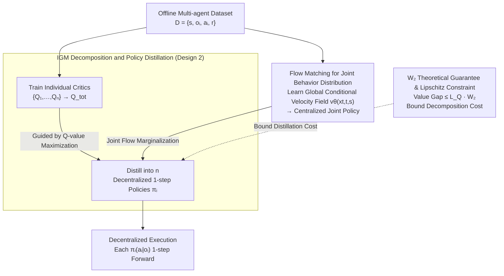

# Multi-agent Coordination via Flow Matching

**Conference**: ICLR 2026  
**arXiv**: [2511.05005](https://arxiv.org/abs/2511.05005)  
**Code**: None  
**Area**: Multi-agent Coordination  
**Keywords**: Multi-agent Coordination, Flow Matching, Offline MARL, IGM Policy Distillation, Decentralized Execution

## TL;DR

Ours proposes MAC-Flow, which first learns a centralized joint behavior distribution using Flow Matching, then distills it into decentralized single-step policies via Individual-Global-Max (IGM) decomposition. Combined with Q-value maximization for behavior regularization training, it achieves approximately 14.5x inference acceleration compared to diffusion-based methods across 34 datasets in 12 environments while maintaining comparable coordination performance.

## Background & Motivation

**Background**: Offline multi-agent reinforcement learning (offline MARL) requires learning coordinated policies from pre-collected datasets without online interaction. Current methods are broadly categorized into two types: generative methods based on diffusion models (e.g., MADiff, DoF), which model joint action distributions through multi-step denoising iterations, and discriminative methods based on Gaussian policies (e.g., OMAC, CFCQL, ICQ), which use simple parameterization for fast action generation.

**Limitations of Prior Work**: Both approaches have significant drawbacks. Diffusion policies are expressive and can model multi-modal joint behaviors, but inference requires 50-200 denoising steps; training DoF on SMAC takes about 60 hours, failing to meet real-time decision-making requirements. Gaussian policies require only a single forward pass for inference but are naturally unimodal, failing to capture the complex structure of "multiple equivalent coordination plans for the same state" in multi-agent systems, making them fragile in multi-agent interactions.

**Key Challenge**: Multi-agent coordination simultaneously requires (i) rich representation capability for diverse joint behaviors in offline data and (ii) efficient execution capability in real-time environments. These two constitute a fundamental performance-efficiency trade-off where previous methods had to sacrifice one for the other.

**Goal**: How to achieve inference speeds comparable to Gaussian policies while maintaining multi-modal expressiveness close to diffusion models? Specifically, three sub-problems need to be addressed: (1) how to efficiently learn rich representations of joint behaviors; (2) how to decompose joint representations into independent agent policies; (3) how to avoid losing coordination information during decomposition.

**Key Insight**: The authors observe that Flow Matching provides a unified framework—it is comparable to diffusion models in expressiveness but has a more direct training objective (matching velocity fields rather than learning a denoising process) and produces smoother probability flows more suitable for distillation. More importantly, Flow Matching distillation naturally integrates with IGM decomposition: learn centralized joint flows first, then distill into independent single-step policies via $W_2$ distance constraints, while using Q-value maximization to guide policies toward high-reward regions.

**Core Idea**: Use Flow Matching to construct a centralized representation of joint behavior, then compress it into decentralized single-step policies via IGM decomposition + $W_2$ distillation + Q-value maximization, thereby obtaining both expressiveness and inference efficiency within a unified framework.

## Method

### Overall Architecture

MAC-Flow adopts a two-stage design for Centralized Training and Decentralized Execution (CTDE). The input is an offline multi-agent interaction dataset $\mathcal{D} = \{(s, o_i, a_i, r)\}$, and the final output is an independent single-step policy $\pi_i(a_i | o_i)$ for each agent $i$, generating actions with a single forward pass.

- **Stage 1 (Joint Flow Learning)**: Conditioned on the global state $s$, a centralized joint policy $\pi_{\text{joint}}(\mathbf{a} | s)$ is trained using Flow Matching, where $\mathbf{a} = (a_1, \dots, a_n)$ represents the joint actions of all agents. This step learns from offline data via behavior cloning (BC) to build a rich representation of the joint behavior distribution.
- **Stage 2 (IGM Distillation + RL Optimization)**: The joint Flow model is distilled into $n$ independent single-step policy networks, with each policy $\pi_i$ conditioned only on local observations $o_i$. Distillation is guided by the IGM principle, combined with actor-critic training for Q-value maximization using behavior regularization, ensuring that factored policies retain coordination while optimizing for high rewards.

### Key Designs

**1. Flow Matching for Joint Behavior Distribution: Replacing Multi-step Denoising with Smooth Probability Flow for Better Distillation**

This step addresses the "diffusion is expressive but slow" pain point. Instead of learning a multi-step denoising process, the authors learn a probability flow from noise to data: define a continuous-time interpolation path $x_t = (1-t) x_0 + t x_1$, where $x_0 \sim \mathcal{N}(0, I)$ is noise and $x_1$ is a joint action from the dataset. A velocity field network $v_\theta(x_t, t, s)$ conditioned on global state $s$ is trained to match the path's tangent vector $x_1 - x_0$. The training loss is a simple mean squared error $\|v_\theta(x_t, t, s) - (x_1 - x_0)\|^2$. During inference, joint actions are sampled by integrating along the velocity field for about 10 steps starting from $x_0 \sim \mathcal{N}(0, I)$. Experiments show Flow performance saturates after 10 steps, whereas diffusion models require 50-200 steps.

The switch to Flow is crucial not necessarily for its inherent strength, but because it is "easier to distill." Compared to diffusion, Flow Matching training is more direct, has fewer hyperparameters, and yields smoother probability flows. Since distillation involves approximating a complex model with a simpler one, a smooth flow distribution is more easily fitted by a single-step policy than the multi-step denoising distribution of diffusion, paving the way for decentralized decomposition.

**2. IGM Decomposition and Policy Distillation: Compressing Centralized Joint Policies into Decentralized 1-step Policies without Losing Coordination**

The centralized joint policy is expressive but must be split into independent policies since agents only perceive local observations $o_i$ during deployment. The authors use the Individual-Global-Max (IGM) principle from QMIX/QTRAN to ensure consistency: if the global Q-value $Q_{\text{tot}}$ can be decomposed into a combination of individual Q-values $Q_i$, and the combination of individual optimal actions equals the global optimal joint action, then independent optimal action selection is equivalent to global optimal selection. During distillation, each $\pi_i$ is trained to approximate the corresponding component of the marginalized joint Flow, with Q-values guiding the policy toward high-reward regions. The distillation loss uses the $W_2$ (Wasserstein-2) distance to measure the difference between the joint distribution and the product distribution $\prod_i \pi_i$.

Why not just perform Behavior Cloning (BC) on the joint Flow? Pure BC only reproduces the distribution existing in the data and fails to discover rare but superior coordination patterns. A toy experiment clarifies this: the dataset is dominated by sub-optimal modes $(0,1)$ and $(1,0)$ (reward +1), while the optimal mode $(1,1)$ (reward +2) is extremely rare. Pure BC Flow only reproduces sub-optimal modes, whereas adding IGM + Q-maximization allows the policy to actively favor $(1,1)$. This is the value of IGM decomposition paired with Q-maximization—staying close to the data distribution while shifting toward superior joint actions.

**3. $W_2$ Theoretical Guarantee & Lipschitz Constraint: Bounding the "Coordination Loss" during Decomposition**

Decomposition is not free—excessive splitting can cause coordination to collapse, and empirical distillation cannot quantify this loss. The authors quantify this using two propositions: Proposition 4.2 provides a $W_2$ distance upper bound between the joint Flow distribution and the decomposed product distribution. Proposition 4.3 further converts this distribution deviation into an upper bound for the value function gap under the assumption that $Q_{\text{tot}}$ is $L$-Lipschitz:

$$|V_{\text{joint}} - V_{\text{factored}}| \leq L_Q \cdot W_2$$

Toy experiments (Figure 3) directly validate this bound: the value gap consistently stays within the theoretical envelope of $L_Q \cdot W_2$ during training and decreases alongside the distillation loss. Its practical significance is providing a monitorable signal—as long as the $W_2$ distillation loss is sufficiently small, the value function gap is bounded, mitigating concerns that decomposition might silently destroy coordination.

### Loss & Training

- **Stage 1 (Flow Training)**: Conditional Flow Matching loss $\mathcal{L}_{\text{FM}} = \mathbb{E}_{t, x_0, x_1}\|v_\theta(x_t, t, s) - (x_1 - x_0)\|^2$, trained via BC on offline datasets.
- **Stage 2 (Distillation + RL)**: Actor optimization for each agent $\max_{a_i} Q_i(o_i, a_i) - \alpha \cdot D_{\text{KL}}(\pi_i \| \pi_{\text{ref}})$, where $\pi_{\text{ref}}$ comes from distilled Flow marginalization and $\alpha$ controls behavior regularization strength; critics aggregate individual $Q_i$ into $Q_{\text{tot}}$ via an IGM mixing network, trained via offline TD learning.
- **Training Efficiency**: On SMAC, MAC-Flow training takes 1-5 hours, whereas DoF (diffusion method) requires about 60 hours; on MA-MuJoCo, it takes only 40-100 minutes, comparable to baselines like OMIGA and ICQ.

## Key Experimental Results

### Main Results

Evaluated on four benchmarks: SMAC v1, SMAC v2, MPE, and MA-MuJoCo, covering discrete and continuous action spaces, 3 to 10 agents, and various data qualities (medium, medium-replay, medium-expert).

| Dimension | Diffusion Methods (DoF/MADiff) | Gaussian Methods (OMAC/CFCQL/ICQ) | **MAC-Flow** |
|------|----------------------|--------------------------|-------------|
| Inference Speed | Slow (50-200 steps) | Fast (1-step) | **Fast (1-step)** |
| Inference Acceleration | 1× (Baseline) | ~14.5× | **~14.5×** |
| SMAC v1 Performance | Best (DoF leads in most) | Medium | **Close to DoF, sig. better than Gaussian** |
| SMAC v2 Performance | DoF leads | Restricted | **Slightly lower than DoF (Stochastic envs)** |
| MA-MuJoCo Performance | MADiff comparable | Baseline level | **Parity with MADiff** |
| MPE Performance | — | Baseline level | **Competitive** |
| Training Time (SMAC) | ~60 hours | 1-3 hours | **1-5 hours** |
| Online Fine-tuning Support | No | Yes | **Yes** |

Key numerical comparisons:
- MAC-Flow's average performance is comparable to DoF on SMAC v1, but slightly lower in high-stochasticity scenarios of SMACv2, which the authors attribute to high-variance joint behavior spaces putting more pressure on decomposition assumptions.
- In continuous control (MA-MuJoCo), MAC-Flow performs on par with MADiff and significantly outperforms the autoregressive method MADT.
- Training speed is an order of magnitude faster than diffusion methods, facilitating a seamless transition from offline to online fine-tuning (Figure 4, RQ3).

### Ablation Study

| Ablation Configuration | Performance Change | Analysis |
|---------|---------|------|
| Full MAC-Flow | Baseline Performance | Synergy of Flow learning + IGM distillation + Q-maximization |
| w/o IGM (Pure BC Distillation) | Significant drop | Pure BC cannot favor rare high-reward coordination patterns |
| w/o Q-maximization | Performance drop | Policy degrades to simple fitting of data distribution |
| Flow Steps 1→4→10 | Fast improvement then saturation | 10 steps are sufficient; 20 steps provide no gain |
| Flow Steps 10→20 | Marginal gain | Shows Flow is much more robust to step count than diffusion |
| Diffusion Steps 50→100→200 | Continuous improvement | DoF performance depends on high denoising step counts |
| Agent Count 3→5→8→10 (SMAC) | Linear growth in time | MABCQ: 1h→2h; DoF: 48h→60h; MAC-Flow: 1.5h→3.5h |
| Agent Count 3→40 (landmark) | Stable performance | Scaled to 40 agents in landmark covering (Appendix H.4) while maintaining coordination |

### Key Findings

- **IGM is the Core Contribution, not Flow Matching itself**: Figure 7 shows that Flow Matching alone is not the primary driver of performance; true gains come from the synergy of IGM decomposition + Q-maximization with Flow distillation.
- **XOR Failure Mode**: In the XOR environment (Appendix H.6), where optimal joint actions require agents to choose opposite directions, IGM decomposition is mathematically unable to maintain consistency. Joint Flow learns the two disjoint high-density modes correctly, but the distilled decentralized policy degrades to near-uniform—a fundamental limitation of the approach.
- **Interaction Intensity Experiment**: Appendix H.7 constructs a payoff game with controllable interaction intensity $\zeta \in [0, 1]$, showing that $W_2$ deviation increases monotonically with interaction intensity; Ours is nearly lossless when interactions are fully decomposable but shows regression when fully indecomposable.
- **Data Quality Robustness**: MAC-Flow performs consistently well across various data qualities, benefiting from Q-maximization's ability to correct dataset bias.

## Highlights & Insights

- **The Trinity of Flow + IGM + Q-maximization**: This design is exquisite—Flow provides expressiveness, IGM provides decomposition guarantees, and Q-maximization compensates for the flaws of BC-style generative models that only replicate data distributions. This combination is more elegant than "diffusion + distillation" because the $W_2$ distillation loss in Flow Matching directly interfaces with the theoretical constraints of IGM decomposition.
- **Theoretical-Experimental Closed Loop**: Propositions 4.2-4.3 provide theoretical bounds, and toy experiments in Figure 3 directly verify that the value gap falls within the theoretical envelope—this "theory-experiment" closure is more convincing than many purely empirical or purely theoretical works.
- **Practical Training-Deployment Narrative**: Training for 1-5 hours → 1-step inference at deployment → support for online fine-tuning. This path is clear, actionable, and friendly for industrial deployment.
- **Migratable Design Paradigm**: The paradigm of "learning an expressive generative model → distilling into a task-efficient execution policy → retaining key structures via constrained optimization" can be generalized to robot control (distilling diffusion policies into lightweight ones), autonomous driving planning, etc.

## Limitations & Future Work

- **IGM Decomposability Assumption is a Hard Constraint**: When optimal joint behavior is inherently indecomposable (e.g., XOR coordination), the method fails. This is a theoretical limit of the IGM principle rather than an engineering issue. Potential improvements include introducing relaxed IGM (e.g., additive decomposition in QTRAN) or conditional decomposition.
- **Performance Gap in High-Stochasticity SMACv2**: In high-variance joint behavior spaces, decomposed policies fail to fully capture the performance of diffusion policies. A potential improvement is introducing value-gradient-based test-time corrective refinement during inference.
- **Offline Evaluation Concentration**: While Figure 4 shows online fine-tuning capability, the main experiments are confined to offline settings. Performance in scenarios requiring dynamic adaptation to teammate changes (ad-hoc teamwork) or opponent distribution drift remains unknown.
- **Lack of Open Source Code**: No public code is available yet, making replication difficult. Reviewers noted that direct comparison with "Graph Diffusion for Robust Multi-Agent Coordination" could not be conducted without code.

## Related Work & Insights

- **vs DoF (Diffusion for Offline MARL)**: DoF is slightly superior in high-stochasticity tasks like SMACv2, but the 50-200 denoising steps required for inference make it impractical for real-time scenarios. MAC-Flow achieves a 14.5x inference speedup for a small performance trade-off—a worthwhile exchange for most practical applications.
- **vs MADiff**: MADiff performs similarly to MAC-Flow in continuous control (MA-MuJoCo, MPE), but as a pure BC-style generative model, MADiff lacks Q-maximization capability and may degrade with poor data quality.
- **vs MADT (Autoregressive)**: Autoregressive policies generate actions sequentially by agent, introducing artificial sequential dependencies. MAC-Flow outperforms MADT across all datasets because Flow's parallel generation + IGM decomposition avoids sequential error accumulation.
- **vs OMAC/CFCQL/ICQ (Gaussian)**: Gaussian policies cannot model multi-modal coordination. MAC-Flow significantly improves coordination quality while maintaining the same inference speed.

**Insight**: This work proves that generative models in multi-agent RL are more than just "better BC"—when combined with value decomposition frameworks (IGM), they can achieve efficient decentralized execution while retaining expressiveness. This logic could be extended to single-agent offline RL (distilling diffusion policies into 1-step policies while retaining multi-modality) or applied to fields like multi-arm robotic coordination.

## Rating

- Novelty: ⭐⭐⭐⭐ — The trinity design of Flow Matching + IGM Distillation + Q-maximization is a first in MARL, though the "generative model → distillation" core idea is not entirely new.
- Experimental Thoroughness: ⭐⭐⭐⭐⭐ — 4 benchmarks × 12 environments × 34 datasets, plus the comprehensive rebuttal additions (40 agents, XOR failure, interaction intensity analysis).
- Writing Quality: ⭐⭐⭐⭐ — Clear problem definition and pipeline description; theoretical bounds are used to justify degradation rather than make over-the-top claims.
- Value: ⭐⭐⭐⭐ — Resolves the practical expressiveness-efficiency trade-off bottleneck in offline MARL; 14.5x speedup is of high engineering value, though some reviewer disagreement on novelty (scores 6/6/4).

<!-- RELATED:START -->

## Related Papers

- [\[ICLR 2026\] Matching Multiple Experts: On the Exploitability of Multi-Agent Imitation Learning](matching_multiple_experts_on_the_exploitability_of_multi-agent_imitation_learnin.md)
- [\[ICLR 2026\] Breaking and Fixing Defenses Against Control Flow Hijacking in Multi-Agent Systems](breaking_and_fixing_defenses_against_control_flow_hijacking_in_multi-agent_syste.md)
- [\[ICLR 2026\] Emergent Coordination in Multi-Agent Language Models](emergent_coordination_in_multi-agent_language_models.md)
- [\[ACL 2026\] Explicit Trait Inference for Multi-Agent Coordination](../../ACL2026/multi_agent/explicit_trait_inference_for_multi-agent_coordination.md)
- [\[ICML 2026\] Voting Protocols as Coordination Mechanisms for Role-Constrained Multi-Agent Tutoring Systems](../../ICML2026/multi_agent/voting_protocols_as_coordination_mechanisms_for_role-constrained_multi-agent_tut.md)

<!-- RELATED:END -->
