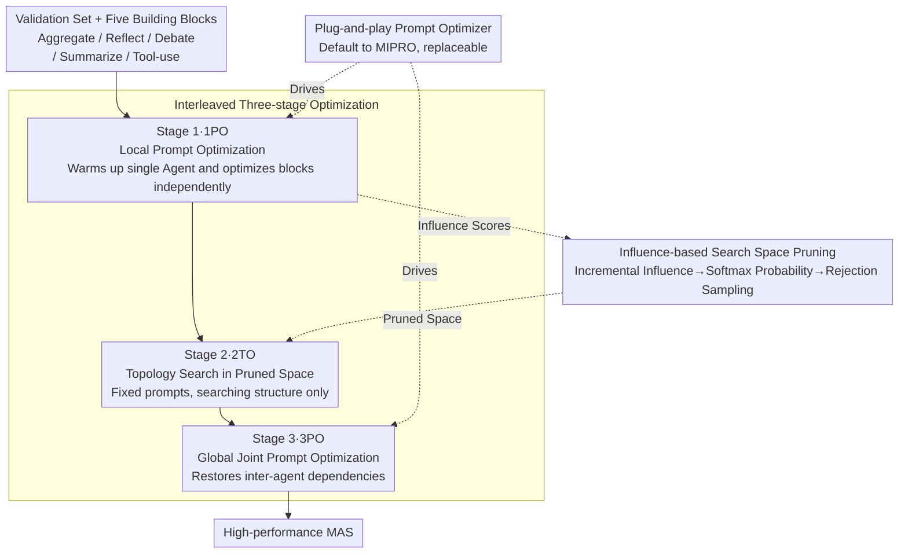

# Multi-Agent Design: Optimizing Agents with Better Prompts and Topologies

**Conference**: ICLR 2026  
**arXiv**: [2502.02533](https://arxiv.org/abs/2502.02533)  
**Code**: None  
**Area**: Multi-Agent Systems  
**Keywords**: Multi-agent systems, prompt optimization, topology search, LLM Agent, automated design

## TL;DR

The Multi-Agent System Search (MASS) framework is proposed, which automatically discovers high-performance multi-agent system designs through a three-stage interleaved strategy for optimizing prompts and topologies (local prompt optimization → topology search → global prompt optimization).

## Background & Motivation

1.  **Background**: LLM-based multi-agent systems (MAS) outperform single-agent systems in complex tasks such as code generation, reasoning, and question answering through interaction and collaboration among multiple agents.

2.  **Limitations of Prior Work**: Designing effective MAS requires simultaneous consideration of each agent's prompt design and the topological orchestration between agents, forming a massive combinatorial search space. Existing automated methods (e.g., ADAS, AFlow) either optimize only topology while ignoring prompts or use coarsely designed search spaces.

3.  **Key Challenge**: Prompts and topology are two critical factors in MAS design, but their interaction is complex—prompt sensitivity is amplified in cascaded agents, and not all topologies have a positive impact on performance. The combinatorial complexity of joint optimization is prohibitively high.

4.  **Goal**: Systematically analyze the influence of various factors in the MAS design space and propose an efficient automated optimization framework.

5.  **Key Insight**: Empirical analysis reveals that prompt optimization is more token-efficient than simply scaling the number of agents, and beneficial topologies constitute only a small fraction of the search space. Based on this, the search space is pruned, and prompts and topologies are optimized in an interleaved manner.

6.  **Core Idea**: An interleaved optimization strategy—advancing from local to global and from prompts to topology—can efficiently conquer the combinatorial complexity of MAS design.

## Method

### Overall Architecture

MASS addresses the problem that multi-agent system (MAS) performance depends on both the prompts of individual agents and the topological arrangement between agents, creating a search space too large for brute-force methods. The solution is to decouple these entangled dimensions into a three-stage pipeline moving "from local to global, and from prompts to topology." The input consists of a task validation set and five types of optional building blocks (Aggregate, Reflect, Debate, Summarize, Tool-use): Stage 1 (1PO) performs prompt warmup for single agents, then optimizes the prompts for each building block in a minimal configuration as an anchor, while recording validation performance; Stage 2 (2TO) takes these optimized prompts, prunes blocks with negative returns based on "influence," and samples and evaluates the best orchestrations within the pruned space; Stage 3 (3PO) performs global joint prompt optimization on the selected topology to recover inter-agent dependencies ignored during the decoupling in the first two stages. This gradient-free workflow narrows the problem step-by-step, addressing a controllable sub-problem at each stage to produce a high-performance MAS.

### Key Designs

**1. Interleaved Three-stage Optimization: Decomposing Joint Search into Manageable Sub-problems**

The fundamental difficulty in MAS design is the joint optimization of prompts and topology. Performing direct Automated Prompt Optimization (APO) on an entire MAS fails because cascaded dependencies between agents amplify small prompt perturbations, and sparse end-to-end rewards provide insufficient signals to the optimizer. MASS breaks this down by dividing and conquering. Stage 1 warms up the single-agent prompt $a_0^* \leftarrow \mathcal{O}_\mathcal{D}(a_0)$, then optimizes each building block prompt independently in a minimal configuration using the anchor $a_i^* \leftarrow \mathcal{O}_\mathcal{D}(a_i \mid a_0^*)$, ensuring that each block's optimization is isolated. Stage 2 fixes these optimized prompts and samples only within the topological dimension, decoupling "what prompts to use" from "what structure to use." Stage 3 finally performs joint fine-tuning of all prompts in the selected topology to account for inter-agent dependencies.

**2. Influence-based Search Space Pruning: Searching Only in Topologies with Positive Gains**

Experiments show that not all topologies contribute positively to performance—for instance, on HotpotQA, only the debate block provides gains, while others may degrade performance. Blindly searching the full space risks including negative-impact blocks. MASS calculates an incremental influence $I_{a_i} = \mathcal{E}(a_i^*) / \mathcal{E}(a_0^*)$ for each block, representing its relative performance gain over the single-agent baseline. These influences are converted into selection probabilities using temperature-scaled Softmax: $p_a = \text{Softmax}(I_a, t)$. During Stage 2, rejection sampling is used: for each dimension, $u \sim \text{Uniform}(0,1)$ is drawn; if $u > p_{a_i}$, the block is rejected. This weights blocks by their "historical positive returns," focusing compute on useful topological subsets.

**3. Plug-and-play Prompt Optimizer: Algorithm Agnostic**

MASS defines an interface for prompt optimizers rather than restricting the implementation. By default, it uses MIPRO to jointly optimize instruction text and few-shot examples (bootstrapping 3 examples, 10 instruction candidates over 10 iterations). This decoupling allows the framework to adopt stronger optimizers as prompt engineering techniques evolve without altering the three-stage scheduling logic.

### Loss & Training

The entire process is gradient-free, with the optimization objective being task metrics on the validation set (e.g., accuracy for MATH, F1 for DROP). Stage 1 and Stage 3 rely on the prompt optimizer (MIPRO) to iterate on prompts, while Stage 2 uses rejection sampling to search the topology space. These stages are independent and can be fully parallelized, providing an efficiency advantage over iterative algorithms like ADAS or AFlow. Topology search involves 10 candidates, each evaluated 3 times to average out noise.

## Key Experimental Results

### Main Results

Performance comparison across 8 benchmark tasks using Gemini 1.5 Pro:

| Method | MATH | DROP | HotpotQA | MuSiQue | MBPP | HumanEval | LCB | Average |
|------|------|------|----------|---------|------|-----------|-----|------|
| CoT | 71.67 | 70.55 | 57.43 | 37.81 | 68.33 | 86.67 | 66.33 | 65.28 |
| Self-Consistency | 77.33 | 74.06 | 58.60 | 41.81 | 69.50 | 86.00 | 70.33 | 68.18 |
| Multi-Agent Debate | 78.67 | 71.78 | 64.87 | 46.00 | 68.67 | 86.67 | 73.67 | 70.26 |
| ADAS | 80.00 | 72.96 | 65.88 | 41.95 | 73.00 | 87.67 | 65.17 | 69.72 |
| **MASS** | **84.67** | **90.52** | **69.91** | **51.40** | **86.50** | **91.67** | **82.33** | **78.79** |

Using Gemini 1.5 Flash, MASS achieved an average score of 74.30%, a 13.43 percentage point improvement over CoT (60.87%).

### Ablation Study

| Configuration | Average Performance | Description |
|------|---------|------|
| CoT (Baseline) | 65.28% | Single-agent zero-shot reasoning |
| Stage 1 (1PO) | ~71% | Local prompt optimization, 6% higher than single-agent APO |
| Stage 1+2 (1PO+2TO) | ~74% | Topology optimization adds 3% extra gain |
| Stage 1+2+3 (Full MASS) | 78.79% | Global prompt optimization adds another ~5% |
| Topology search w/o pruning | Decrease | Introduces negative building blocks |
| Topology search w/o Stage 1 | Decrease | Unoptimized agents lead to search in low-quality space |

### Key Findings

- Prompt optimization is significantly more token-efficient than adding agents: an optimized single agent with Self-Consistency outperforms a 9-agent SC with default prompts.
- Not all topologies have a positive effect; beneficial topologies are a small fraction of the design space.
- MASS allows for the parallelization of Stage 1 and Stage 2, whereas ADAS and AFlow are iterative and require sequential completion.
- Three MAS design principles: (1) Optimize individual agents before combining them; (2) Combine influential topologies; (3) Model inter-agent dependencies via global optimization.

## Highlights & Insights

- **Analysis-Driven Design**: The method is grounded in an empirical analysis of factors in the MAS design space.
- **NAS Synergy**: Applies the insight from Neural Architecture Search—that search space design is more important than the search algorithm—to MAS design.
- **Underestimated Importance of Prompt Optimization**: Highlights a critical factor often overlooked in most MAS research.
- **Parallelizable Optimization**: Significantly reduces optimization time costs in practical deployments.

## Limitations & Future Work

- Building blocks in the search space still require pre-definition, which may limit the discovery of entirely new interaction patterns.
- Topology construction rules follow fixed sequences, potentially restricting more flexible agent combinations.
- Optimization costs remain high (requiring many API calls), which may be unsuitable for cost-sensitive scenarios.
- Potential for cross-task transfer—investigating whether discovered MAS design principles can be directly applied to new tasks.

## Related Work & Insights

- DSPy and MIPRO provide infrastructure for prompt optimization; MASS builds MAS-level optimization on top of them.
- ADAS generates new topologies via meta-agents but ignores prompt optimization; AFlow searches via MCTS but uses an unpruned search space.
- Insight: Analyzing component influence and pruning the search space is more efficient than brute-force search in the full space when designing complex systems.

## Rating

- Novelty: ⭐⭐⭐⭐ The interleaved optimization approach is novel and the analysis-driven methodology is commendable.
- Experimental Thoroughness: ⭐⭐⭐⭐⭐ Includes 8 tasks, 4 LLMs, and multiple baselines with comprehensive ablations.
- Writing Quality: ⭐⭐⭐⭐⭐ Rigorous logic, deep analysis, and clear visualizations.
- Value: ⭐⭐⭐⭐ Provides a systematic framework and design principles for automated MAS design.

<!-- RELATED:START -->

## Related Papers

- [\[ICLR 2026\] MAC-AMP: A Closed-Loop Multi-Agent Collaboration System for Multi-Objective Antimicrobial Peptide Design](mac-amp_a_closed-loop_multi-agent_collaboration_system_for_multi-objective_antim.md)
- [\[ICLR 2026\] Strategic Planning and Rationalizing on Trees Make LLMs Better Debaters](strategic_planning_and_rationalizing_on_trees_make_llms_better_debaters.md)
- [\[ICLR 2026\] MMedAgent-RL: Optimizing Multi-Agent Collaboration for Multimodal Medical Reasoning](mmedagent-rl_optimizing_multi-agent_collaboration_for_multimodal_medical_reasoni.md)
- [\[ICML 2026\] Smarter Saboteurs, Better Fixers: Scaling & Security in Linear Multi-Agent Workflows](../../ICML2026/multi_agent/smarter_saboteurs_better_fixers_scaling_security_in_linear_multi-agent_workflows.md)
- [\[ICLR 2026\] Graph-of-Agents: A Graph-based Framework for Multi-Agent LLM Collaboration](graph-of-agents_a_graph-based_framework_for_multi-agent_llm_collaboration.md)

<!-- RELATED:END -->
