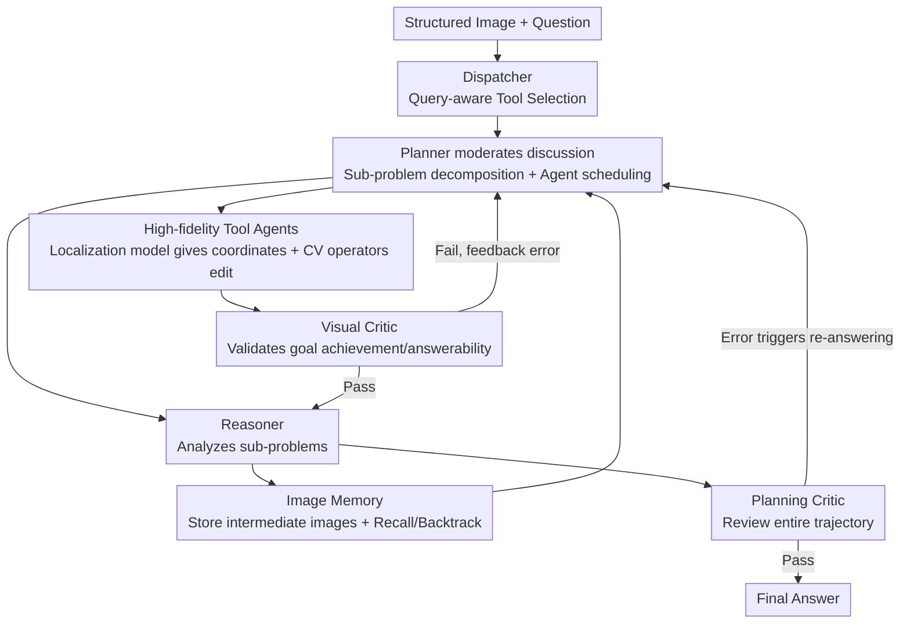

# PixelCraft: A Multi-Agent System for High-Fidelity Visual Reasoning on Structured Images

**Conference**: ICLR 2026  
**OpenReview**: [https://openreview.net/forum?id=HtpjSCs3g5](https://openreview.net/forum?id=HtpjSCs3g5)  
**Code**: https://github.com/microsoft/PixelCraft  
**Area**: Multi-Agent / Multimodal VLM / Visual Reasoning  
**Keywords**: Structured Images, Multi-Agent, High-Fidelity Localization, Image Memory, Self-Criticism

## TL;DR
PixelCraft introduces a multi-agent system comprising a "dispatcher + planner + reasoner + dual critic + visual tool agents." By treating a fine-tuned pixel-level localization model as "eyes" and traditional CV operators as "hands," combined with a backtrackable branch-based image memory, it significantly improves the reasoning accuracy of MLLMs like GPT-4o and Claude on structured images such as charts and geometry (+5.6 to 9.5 points on CharXiv).

## Background & Motivation
**Background**: "Structured images," such as charts and geometric diagrams, remain a significant challenge for Multimodal Large Language Models (MLLMs). Unlike natural images, these encode symbolic and structured elements—coordinates, data points, connection lines, and numerical annotations. They require precise symbolic abstraction rather than texture or object-level pattern recognition and are highly sensitive to granularity; a slight error in reading the height of a bar can lead to entirely incorrect downstream conclusions. Prevailing methods have evolved from pure text CoT fine-tuning to using intermediate "visual cues" (visual CoT) to guide reasoning, such as cropping or annotating images before feeding them back to the model.

**Limitations of Prior Work**: Existing visual CoT methods suffer from two major flaws. First is **low fidelity in image processing**: they rely either on chart source code (often unavailable in reality) or coarse contour/line detection, covering only a narrow range of images and failing on complex real-world benchmarks like CharXiv and ChartQAPro. Second is the **rigid reasoning paradigm**: most are "one-step editing" or linear chain reasoning, where each intermediate image must be derived from the previous one. The model is forced into a unidirectional monologue, unable to "form hypotheses → verify visually → backtrack upon contradiction," as humans do. While some work on natural images shows signs of non-linear exploration (e.g., zoom-in, multi-region annotation), it cannot support the recursive exploration required for structured images.

**Key Challenge**: Structured image reasoning requires both "high-fidelity perception" and "flexible multi-step reasoning." Current methods fail on both counts—low-fidelity tools provide unreliable intermediate images, and linear paradigms prevent error correction or path switching. Furthermore, blindly feeding all historical images into the context causes long-context overhead and performance degradation in MLLMs.

**Goal**: (1) Develop a suite of high-fidelity image processing tools applicable to various charts and geometric diagrams; (2) Enable the reasoning process to branch, backtrack, and adjust dynamically without being overwhelmed by historical images.

**Key Insight**: The authors decouple "perception" from "operation." A small MLLM is fine-tuned as a precise pixel-level localization model serving as "smart eyes" to map textual references to coordinates. Classic CV operators then serve as "robotic hands" to perform precise edits based on these coordinates. Simultaneously, reasoning is organized into a planner-centric non-linear workflow involving multi-role discussion and self-criticism, integrated with a "cognitive whiteboard" style image memory.

**Core Idea**: Replace low-fidelity tools with a "fine-tuned localization model + CV operators" and replace linear visual CoT with a "planner-managed image memory + multi-agent discussion + dual-layer criticism" to achieve high-fidelity, backtrackable visual reasoning on structured images.

## Method

### Overall Architecture
PixelCraft is a multimodal multi-agent system where the MLLM simultaneously acts as a dispatcher, planner, reasoner, and two critics (planning critic / visual critic), supplemented by a set of specialized visual tool agents. Given a structured image and a query, the system executes a **three-stage dynamic workflow**: ① The dispatcher performs query-aware tool selection, activating only relevant tool agents; ② The planner moderates "role-driven discussions," decomposing complex problems into sub-problems, calling tool agents for image processing and the reasoner for analysis, while the visual critic validates intermediate images in real-time; ③ After a preliminary answer is generated, the planning critic reviews the entire trajectory, triggering a second round of answering if errors are detected.

Central to this is the **image memory** managed by the planner: all intermediate visual products (processed images + textual descriptions) are stored in memory. The planner can adaptively recall any historical image as needed, supporting the exploration of different reasoning branches and backtracking to correct assumptions, rather than streaming all images into the context. The "high fidelity" of tool agents stems from a Qwen2.5-VL-3B localization model fine-tuned on synthetic corpora; it provides pixel-level coordinates to drive CV operators for precise cropping, masking, or drawing.

### Key Designs

**1. High-fidelity Tool Agents: Pixel-level Editing via Fine-tuned Localization Model + CV Operators**

To address the low fidelity and narrow coverage of existing visual tools, the authors decouple tools into "eyes" and "hands." Directly tasking an LLM to generate tools often fails due to a lack of precise grounding coordinates or buggy code resulting in erroneous visual output. Thus, a semi-automated solution is adopted: a compact Qwen2.5-VL-3B is fine-tuned as a localization model to map textual references precisely to pixel coordinates. These coordinates drive classic CV operators for actual editing; invalid tools are manually corrected.

For chart scenarios, four tools are provided: sub-figure cropping (cropping a single sub-figure based on descriptions like "row 2, column 1"), region zooming (magnifying a local area with x/y axes), adding auxiliary lines, and masking data by legend (identifying the color of a legend item and masking irrelevant series). For geometry, tools include point connection, perpendicular line construction, and parallel line construction, plus a code execution tool for numerical calculation. The key is that grounding is guaranteed by the specialized model and editing by deterministic CV operators, ensuring the reliability of intermediate images—ablation shows the localization model increases IoU from 0.26 to 0.93.

**2. Planner-Centric Non-linear Workflow + Image Memory: Enabling Branching and Backtracking**

To overcome the rigidity of linear visual CoT, the planner orchestrates the reasoning. Acting as a conductor, the planner decomposes complex queries into manageable sub-problems, deciding which agent (tool or reasoner) to activate next. It issues specific goals to tool agents (e.g., "crop sub-figure at row 1, column 1") and precise sub-questions to the reasoner. Processed images and text flow between agents via the planner.

The **image memory** serves as a "cognitive whiteboard" to unlock flexibility. Unlike traditional methods that cram all history into the context—causing overhead and locking reasoning into a chain—PixelCraft stores all intermediate visual products in memory. The planner can adaptively recall any historical image at any step to explore alternative reasoning branches or revise earlier hypotheses. This liberates reasoning from its "one-off, unidirectional" nature while reducing context overhead; controlled comparisons show this design improves CharXiv performance from 65.0 to 68.1 compared to a single-planner visual CoT.

**3. Two-layer Critic: Blocking Visual Errors and Post-hoc Correction**

Visual tools, unlike deterministic code, can introduce errors that cascade if treated as facts. The authors design **two critics operating at different stages**. The visual critic provides in-loop validation: after a tool processes an image, it checks "goal achievement" (whether the crop/mask fulfilled the planner's request) and "answerability" (whether the reasoner can answer the sub-question based on the image). If issues are found, an error alert is fed back for replanning. The planning critic performs post-hoc review: after a preliminary answer is generated, it examines the tool sequence and logical steps to identify suboptimal tool usage or flawed reasoning paths, suggesting revisions (e.g., adding/removing tools, rewriting sub-problems) as input for a second round of answering. This dual-layer approach forms a robust error-correction loop.

### Loss & Training
The localization model training formalizes structured image grounding as autoregressive sequence prediction. Given an image $I$ and text prompt $P$, the model generates a sequence $Y=(y_1,\dots,y_T)$ encoding the text answer and corresponding bounding boxes. Spatial positions use absolute coordinates to align with the model's native grounding format. The training data is a hybrid dataset: procedurally synthesized charts (using GPT-4o for JSON specs + Matplotlib template rendering with instrumented coordinate extraction; 43k single-panel + 10k multi-panel combinations, totaling 53k pairs) plus 2,000 geometric samples from Inter-GPS (extracting coordinates and labels). Qwen2.5-VL-3B is fine-tuned on this data.

## Key Experimental Results

### Main Results
Evaluation was conducted on three challenging chart benchmarks (CharXiv reasoning subset, ChartQAPro, and EvoChart) using GPT-4.1-mini as LLM-as-a-judge across three backbones:

| Backbone | Benchmark | CoT | Best Previous Baseline | PixelCraft | Gain (vs Direct) |
|----------|-----------|-----|------|------------|------|
| GPT-4o | CharXiv | 51.1 | 52.4 (Reconcile) | **55.2** | +5.6 |
| GPT-4o | ChartQAPro | 56.52 | 56.52 (CoT) | **58.83** | +6.32 |
| GPT-4o | EvoChart | 68.64 | 68.64 (CoT) | **70.24** | +7.60 |
| GPT-4.1-mini | CharXiv | 63.8 | 63.8 (CoT) | **68.1** | +9.5 |
| GPT-4.1-mini | ChartQAPro | 62.21 | 62.21 (CoT) | **65.56** | +7.71 |
| Claude-3.7 | CharXiv | 68.3 | 68.5 (Reconcile) | **73.9** | +6.8 |

Notably, pure multi-agent methods (Debate / Reconcile) showed almost no gain, proving that multi-agent systems without specialized visual tools cannot handle chart reasoning. Methods like Refocus ("LLM + chart tools") were unstable, often performing worse than CoT, confirming their tools' inability to handle complex structured images. In geometry (Geometry3K auxiliary line subset), PixelCraft also led (GPT-4.1-mini 34.38, Claude 33.59).

### Ablation Study
Incremental ablation of roles (GPT-4.1-mini):

| Configuration | CharXiv | ChartQAPro | Description |
|------|---------|------------|------|
| CoT (No components) | 63.8 | 62.21 | Baseline |
| + Tool Agent (TA) | 65.0 | 63.66 | Largest gain; specialized tools are essential |
| + TA + Dispatcher | 65.9 | 64.43 | Filtering irrelevant tools improves accuracy |
| + TA + Visual Critic (VC) | 66.0 | 63.96 | Filters invalid intermediate images |
| + TA + Disp + VC | 67.5 | 64.89 | Synergistic effect |
| Full Model (+ Planning Critic) | **68.1** | **65.56** | Best performance |

### Key Findings
- **Tool Agents contribute most**: Adding TA to CoT yields a +1.2 gain on CharXiv, the highest for any single component, confirming that "high-fidelity tools" are the core bottleneck.
- **Localization accuracy determines the ceiling**: Fine-tuning the localization model increased IoU from 0.26 to 0.93, resulting in significantly higher system accuracy compared to base models, which often failed to locate sub-figures.
- **Tool calls are query/image-driven**: "Sub-figure cropping" was called 351 times on CharXiv (due to multi-panel deep analysis), while "point connection" was called most (56 times) for geometry. Every tool provided gains in its activated subset.
- **Self-criticism accurately identifies errors**: Most errors identified during the three-round review were true positives, and accuracy improved steadily after re-answering, showing the planning critic's effectiveness.

## Highlights & Insights
- **"Eyes + Hands" Decoupling**: Separating perception (fine-tuned localization) from operation (deterministic CV operators) bypasses the difficulty of having LLMs generate reliable visual tools—a design choice born from failures in automated tool generation.
- **Image Memory as a "Cognitive Whiteboard"**: Replacing "full history in context" with adaptive recall solves both the "no backtracking" and "multi-image degradation" issues in visual CoT.
- **Hierarchical Dual Critics**: The visual critic handles "image correctness" (in-loop), while the planning critic handles "path correctness" (post-hoc), providing more control than a single critic.
- **Efficiency of Small Specialized Models**: A 3B localization model achieving 0.93 IoU proves that specialized small models combined with classic algorithms can be more cost-effective than large-scale models in agent systems.

## Limitations & Future Work
- **Tool Scalability**: Automated tool generation is still largely ineffective; tools were manually designed for charts/geometry. Adapting to other domains (e.g., circuit diagrams, sheet music) might require new tools and localization data.
- **Computational Cost**: The multi-agent, multi-round discussion and criticism significantly increase latency and cost compared to single CoT.
- **Synthetic-Real Gap**: Reliance on synthetic charts and Inter-GPS labels may limit generalization to complex real-world images (hand-drawn, scanned, or infographics).
- **Sample Size**: The geometry evaluation used a small subset (128 samples), requiring larger-scale validation for robustness.

## Related Work & Insights
- **vs Refocus / Visual Sketchpad**: These rely on contour/line detection or source code, which is narrow and linear. PixelCraft uses fine-tuned localization for high fidelity and image memory for non-linear reasoning.
- **vs Debate / Reconcile**: These aggregate answers from multiple reasoners but lack visual tools, showing little gain on charts. PixelCraft emphasizes role-based synergy and tool-use.
- **vs Set-of-Mark**: While SoM provides visual vocabulary for natural images, PixelCraft focuses on the high-fidelity requirements of structured images and organizes them into a non-linear reasoning system.

## Rating
- Novelty: ⭐⭐⭐⭐ The combination of "localization + CV ops" and "backtrackable image memory" is a distinctive system-level innovation.
- Experimental Thoroughness: ⭐⭐⭐⭐ Comprehensive evaluation across benchmarks and backbones, though the geometry sample size is small.
- Writing Quality: ⭐⭐⭐⭐ Clear motivation and intuitive metaphors ("eyes/hands," "whiteboard").
- Value: ⭐⭐⭐⭐ Plug-and-play improvement for MLLMs on structured images with open-source code.

## Related Papers

- [\[ICLR 2026\] From What to Why: A Multi-Agent System for Evidence-based Chemical Reaction Condition Reasoning](from_what_to_why_a_multi-agent_system_for_evidence-based_chemical_reaction_condi.md)
- [\[ACL 2026\] From Query to Counsel: Structured Reasoning with a Multi-Agent Framework and Dataset for Legal Consultation](../../ACL2026/multi_agent/from_query_to_counsel_structured_reasoning_with_a_multi-agent_framework_and_data.md)
- [\[CVPR 2026\] Visual Document Understanding and Reasoning: A Multi-Agent Collaboration Framework with Agent-Wise Adaptive Test-Time Scaling](../../CVPR2026/multi_agent/visual_document_understanding_and_reasoning_a_multi-agent_collaboration_framewor.md)
- [\[ICLR 2026\] MAC-AMP: A Closed-Loop Multi-Agent Collaboration System for Multi-Objective Antimicrobial Peptide Design](mac-amp_a_closed-loop_multi-agent_collaboration_system_for_multi-objective_antim.md)
- [\[ICLR 2026\] CoAct-1: Computer-using Multi-agent System with Coding Actions](coact-1_computer-using_multi-agent_system_with_coding_actions.md)

<!-- RELATED:END -->

<!-- RELATED:START -->

## Related Papers

- [\[ICLR 2026\] From What to Why: A Multi-Agent System for Evidence-based Chemical Reaction Condition Reasoning](from_what_to_why_a_multi-agent_system_for_evidence-based_chemical_reaction_condi.md)
- [\[ICLR 2026\] CoAct-1: Computer-using Multi-agent System with Coding Actions](coact-1_computer-using_multi-agent_system_with_coding_actions.md)
- [\[ICLR 2026\] Benefits and Limitations of Communication in Multi-Agent Reasoning](benefits_and_limitations_of_communication_in_multi-agent_reasoning.md)
- [\[ICLR 2026\] MAD-Logic: Multi-Agent Debate Enhances Symbolic Translation and Reasoning](mad-logic_multi-agent_debate_enhances_symbolic_translation_and_reasoning.md)
- [\[ICLR 2026\] Unlocking the Power of Multi-Agent LLM for Reasoning: From Lazy Agents to Deliberation](unlocking_the_power_of_multi-agent_llm_for_reasoning_from_lazy_agents_to_deliber.md)

<!-- RELATED:END -->
