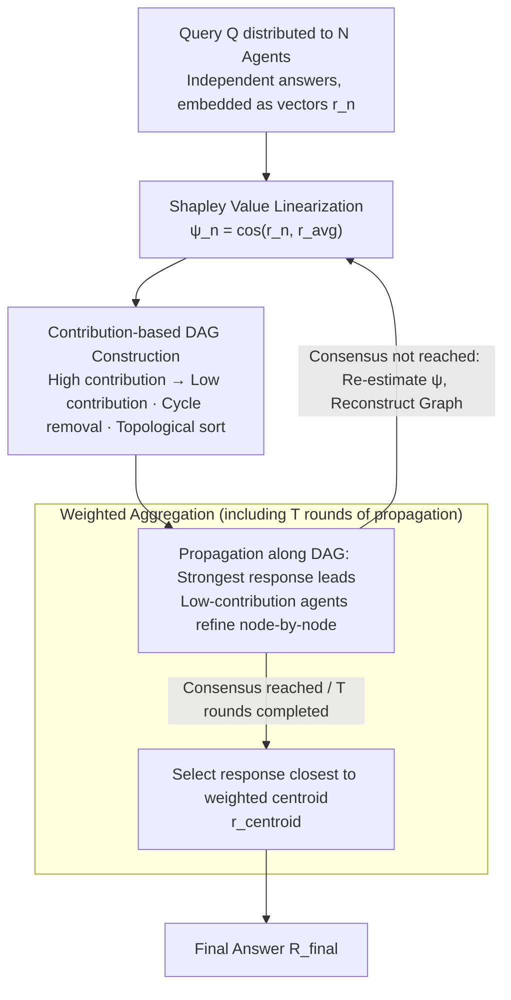

# Stochastic Self-Organization in Multi-Agent Systems

**Conference**: ICLR 2026  
**arXiv**: [2510.00685](https://arxiv.org/abs/2510.00685)  
**Code**: To be confirmed  
**Area**: LLM Pre-training  
**Keywords**: multi-agent systems, self-organization, Shapley value, communication graph, DAG, LLM collaboration

## TL;DR

Proposes the SelfOrg framework, which dynamically constructs Directed Acyclic Graphs (DAGs) for communication based on the semantic similarity of Agent responses and Shapley value contribution estimation. It achieves self-organized collaboration in multi-agent systems, showing particularly significant advantages in weak model scenarios.

## Background & Motivation

Theoretically, Multi-Agent Systems (MAS) based on LLMs can solve tasks that single LLMs cannot, but the effectiveness of collaboration depends heavily on the communication topology. Core problems with existing methods include:

**Fixed Topologies** (Chain, Tree, Fully Connected): Cannot adapt to different tasks and instances.

**Optimizable Topologies** (GPTSwarm, AgentPrune): Require policy gradients or mask training, incurring high overhead.

**External LLM Judges** (DyLAN): Introduce additional LLM evaluation costs.

**Pre-trained Graph Generators** (G-Designer, MAS-GPT): Require additional training.

The key insight of this paper is that since LLMs are inherently stochastic, different runs of the same agent on the same problem can produce entirely different answers. Therefore, **the communication structure should be decided dynamically based on the current response state**, rather than being based solely on the task type or the problem itself. Especially in weak model scenarios, the value of the orchestration system lies in amplifying rare correct responses and suppressing noise.

## Method

### Overall Architecture

SelfOrg allows each agent to first provide an independent answer, projects these answers into an embedding space, ranks them based on their respective contributions to the collective consensus using Shapley values, and constructs a Directed Acyclic Graph (DAG). High-contribution agents are placed upstream in the information flow to guide low-contribution agents. After several rounds of propagation, the system selects the response closest to the "contribution-weighted centroid" as the final output. The entire process involves no external LLM judge, no pre-trained graph generator, and no reinforcement learning; all computation occurs during inference. The following pipeline connects the inference-time steps: contribution estimation → DAG construction → multi-round propagation and weighted aggregation. At the end of each round, contributions are re-estimated and the graph is reconstructed until consensus is reached or $T$ rounds are completed.

### Key Designs

**1. Shapley Value Linearization: Reducing Contribution Estimation from Exponential to Linear Complexity**

To determine which agent is more trustworthy, it is natural to use the Shapley value from cooperative game theory to measure marginal contribution. However, exact calculation requires traversing $2^N$ subsets, which is infeasible for LLM systems. SelfOrg observes that high-contribution agents tend to produce responses that align with the "mainstream" direction of the group. Consequently, it uses a lightweight embedding model $f$ (e.g., the 6-layer all-MiniLM-L6) to map each response to a vector $\mathbf{r}_n = f(\mathcal{R}_n)$, and uses the cosine similarity between this vector and the average embedding $\mathbf{r}_{\text{avg}}$ as a contribution proxy $\psi_n$: $\phi_n \approx \psi_n := \cos(\mathbf{r}_n, \mathbf{r}_{\text{avg}})$. This requires only one embedding pass and one averaging operation, reducing complexity from exponential to linear. Theorem 1 establishes the reliability of this approximation: when response embedding norms are equal and pairwise inner products are lower-bounded, the approximation error is bounded by $I\Gamma^2$. Corollary 1 further states that if the true contribution gap between two agents is large enough, the ranking provided by cosine similarity will not flip—providing the stability required for subsequent graph construction.

**2. Contribution-based DAG Construction: Directing Information from Strong to Weak Agents**

Given contribution values, the system must decide who influences whom. SelfOrg establishes a directed edge $e_{m\to n}$ between two agents if their responses are sufficiently similar and $m$ has a higher contribution, i.e., $\cos(\mathbf{r}_n, \mathbf{r}_m) \geq \tau$ and $\psi_m > \psi_n$, ensuring information flows only from high contribution to low contribution. The similarity threshold $\tau$ filters out semantically irrelevant edges to prevent noise contamination. Since tied contribution values may introduce loops, the construction detects cycles and breaks them by deleting the edge where the "weakest agent in the cycle points to the strongest agent." The nodes are then topologically sorted, using contribution values to break ties, resulting in a strict DAG. This rule converts the abstract problem of "who should listen to whom" into a deterministic structure determined instantly by the response state.

**3. Contribution-weighted Aggregation: Amplifying Sparse Correct Answers and Suppressing Scattered Noise**

During propagation along the DAG, the strongest response initializes the next round, and low-contribution agents refine their answers node-by-node by referencing upstream responses. Each round concludes with re-estimating contributions and reconstructing the graph, iterating until consensus or $T$ rounds (in practice, $T=2$ is usually sufficient: one round for exploration and one for consolidation). After propagation, the system does not use simple voting. Instead, it calculates a contribution-weighted centroid $\mathbf{r}_{\text{centroid}}^{(T)} = \frac{\sum_{n=1}^N \psi_n^{(T)} \mathbf{r}_n^{(T)}}{\sum_{n=1}^N \psi_n^{(T)}}$, and selects the real response $n_\star = \arg\max_{n} \cos(\mathbf{r}_n^{(T)}, \mathbf{r}_{\text{centroid}}^{(T)})$ closest to the centroid as the output (note that the final answer is selected from existing responses rather than being re-generated). Using a weighted centroid means high-contribution agents have more weight in the final decision, allowing a few correct responses to be amplified while scattered incorrect responses cancel each other out—this is the core value of orchestration in weak model scenarios.

**4. Theoretical Guarantee of Correctness Amplification: Explaining Effectiveness on Weak Models**

The design relies on an empirical observation formalized by two lemmas: correct answers repeatedly fall in the same semantic location across multiple stochastic runs, while incorrect answers are diverse and highly scattered. Lemma 1 (Coincidence Concentration) points out that the probability $\Pr[X_c]=p^2$ of two independent agents both being correct is greater than the sum of probabilities $\sum_k p_k^2$ of them coinciding on any arbitrary error, provided errors are sufficiently scattered. Lemma 2 (Contribution Dominance) proves that under the assumption that correct answer embeddings cluster tightly while incorrect ones scatter (Assumption 1), the contribution $\psi$ of a correct agent is strictly higher than that of an incorrect agent. Together, these imply that cosine contribution ranking naturally pushes correct responses to the upstream of the DAG, allowing SelfOrg to stably amplify the sparse correct signals in weak models.

## Key Experimental Results

### Main Results

**Weak Model Scenario (Qwen-2.5-1.5B)**:

| Method | MATH | GSM8K | AQUA | GSM-H | MMLU | MMLU-P | AIME | AVG | AVG-Rank |
|------|------|-------|------|-------|------|--------|------|-----|-------|
| Single | 49.20 | 70.40 | 51.18 | 36.20 | 49.60 | 28.80 | 3.33 | 41.24 | 2.57 |
| DyLAN | 49.80 | 67.80 | 51.18 | 27.20 | 50.00 | 15.40 | 3.33 | 37.82 | 4.00 |
| AgentVerse | 45.20 | 69.00 | 50.39 | 27.80 | 38.20 | 24.00 | 0.00 | 36.37 | 4.86 |
| AutoGen | 11.60 | 69.40 | 28.74 | 5.40 | 12.20 | 5.20 | 0.00 | 18.93 | 6.06 |
| **Ours (SelfOrg)** | **52.40** | **74.60** | **58.27** | **38.00** | **53.80** | **31.60** | **6.67** | **45.05** | **1.00** |

SelfOrg improves over the strongest single-agent baseline by approximately **+4 percentage points** and is the only method consistently ranked first.

**Strong Model Scenario (LLaMA-3.3-70B)**:

| Method | MATH | GSM8K | AQUA | MMLU | GPQA | AIME | AVG | AVG-Rank |
|------|------|-------|------|------|------|------|-----|-------|
| CoT | 75.00 | 95.80 | 79.92 | 85.20 | 56.70 | 26.67 | 68.46 | 2.50 |
| MacNet | 74.80 | 96.00 | 79.13 | 83.00 | 58.26 | 26.67 | 67.31 | 3.63 |
| **Ours (SelfOrg)** | **79.80** | **96.60** | **81.10** | 85.00 | **59.82** | **30.00** | **70.19** | **1.25** |

### Ablation Study

**Scaling Analysis (Qwen-2.5-X)**:

| Model Size | AQUA Single | AQUA SelfOrg | Gain | MMLU-P Single | MMLU-P SelfOrg | Gain |
|---------|-------------|-------------|---|--------------|----------------|---|
| 1.5B | 51.18 | 58.27 | +7.09 | 28.80 | 31.60 | +2.80 |
| 3B | 65.35 | 73.62 | +8.27 | 42.60 | 46.20 | +3.60 |
| 7B | 73.62 | 78.35 | +4.73 | 53.20 | 56.40 | +3.20 |
| 72B | 81.10 | 80.71 | -0.39 | 70.60 | 71.20 | +0.60 |

Gains are largest for weak/medium models and nearly disappear for the 72B model (with a slight decrease in AQUA), aligning with theoretical expectations.

### Key Findings

1. **Maximum Gain on Weak Models**: Existing MAS baselines mostly "collapse" on 1.5B models (some even performing worse than a single agent). SelfOrg is the only method that achieves significant improvements.
2. **Heterogeneous Agents are Effective**: By mixing four 7B models (Qwen/Falcon/LLaMA/Mistral), SelfOrg improves the random baseline of the pool from 53.94 to 66.14 (AQUA-RAT).
3. **Reasonable Contribution Ranking**: Stronger models (Qwen, Falcon) consistently receive higher rankings, while weaker models (Mistral) are downgraded.
4. **2 Rounds are Sufficient**: In practice, the first round is used for exploration and the second for consolidation.

## Highlights & Insights

1. **Response-Conditioning > Task-Conditioning**: It breaks the assumption that "every task type has an optimal topology" and instead constructs topology dynamically based on current response states, which is a more grounded modeling approach.
2. **No External Judge, No Pre-training, No RL**: Uses lightweight embedding models (6-layer MiniLM) instead of expensive LLM judges, significantly reducing overhead.
3. **Theoretical and Experimental Alignment**: The probabilistic model accurately predicts the experimental phenomena where correct answers cluster and incorrect answers scatter.
4. **Clever Approximation of Shapley Values**: Reduces complexity from exponential to linear while maintaining ranking stability.
5. **Practical Value in Weak Model Scenarios**: SelfOrg provides stable and significant gains when using small, low-cost models.

## Limitations

1. Relies on the quality of the embedding model—if embeddings cannot distinguish semantic differences between correct and incorrect responses, contribution estimation will fail.
2. The implicit "Majority-is-Right" assumption—if the majority of agents are wrong and their errors are consistent, SelfOrg might amplify the error.
3. Gains disappear at the 72B model scale, suggesting the method is primarily applicable to small-to-medium LLMs.
4. Evaluation is limited to reasoning benchmarks; its effectiveness on open-ended generation tasks is unknown.

## Related Work & Insights

- Compared to GPTSwarm (parameterized topology optimization) and G-Designer (pre-trained graph generator), SelfOrg is a zero-overhead online method.
- The application of Shapley values in federated learning is successfully transferred to MAS scenarios.
- Insight: This self-organization mechanism could be combined with Mixture of Experts (MoE) to achieve dynamic expert routing during inference.
- The principle of "contribution-dominated information flow" in DAG construction can be generalized to larger-scale agent orchestration systems.

## Rating

- **Novelty**: ⭐⭐⭐⭐ — Response-conditioned topology construction is a significant conceptual contribution with solid theoretical analysis.
- **Experimental Thoroughness**: ⭐⭐⭐⭐⭐ — 7 benchmarks, multiple backbone models (1.5B–72B), heterogeneous settings, and scaling analysis.
- **Practicality**: ⭐⭐⭐⭐ — Lightweight method requiring no training, though it still requires multiple LLM calls.
- **Writing Quality**: ⭐⭐⭐⭐ — Clear theoretical derivations and comprehensive experiments.
- **Overall Rating**: ⭐⭐⭐⭐ (4/5)

<!-- RELATED:START -->

## Related Papers

- [\[ICLR 2026\] MAS²: Self-Generative, Self-Configuring, Self-Rectifying Multi-Agent Systems](mas2_self-generative_self-configuring_self-rectifying_multi-agent_systems.md)
- [\[ACL 2026\] Towards Self-Improving Error Diagnosis in Multi-Agent Systems](../../ACL2026/multi_agent/towards_self-improving_error_diagnosis_in_multi-agent_systems.md)
- [\[ICLR 2026\] MARSHAL: Incentivizing Multi-Agent Reasoning via Self-Play with Strategic LLMs](marshal_incentivizing_multi-agent_reasoning_via_self-play_with_strategic_llms.md)
- [\[ICLR 2026\] Aegis: Automated Error Generation and Attribution for Multi-Agent Systems](aegis_automated_error_generation_and_attribution_for_multi-agent_systems.md)
- [\[ICLR 2026\] Stop Wasting Your Tokens: Towards Efficient Runtime Multi-Agent Systems](stop_wasting_your_tokens_towards_efficient_runtime_multi-agent_systems.md)

<!-- RELATED:END -->
