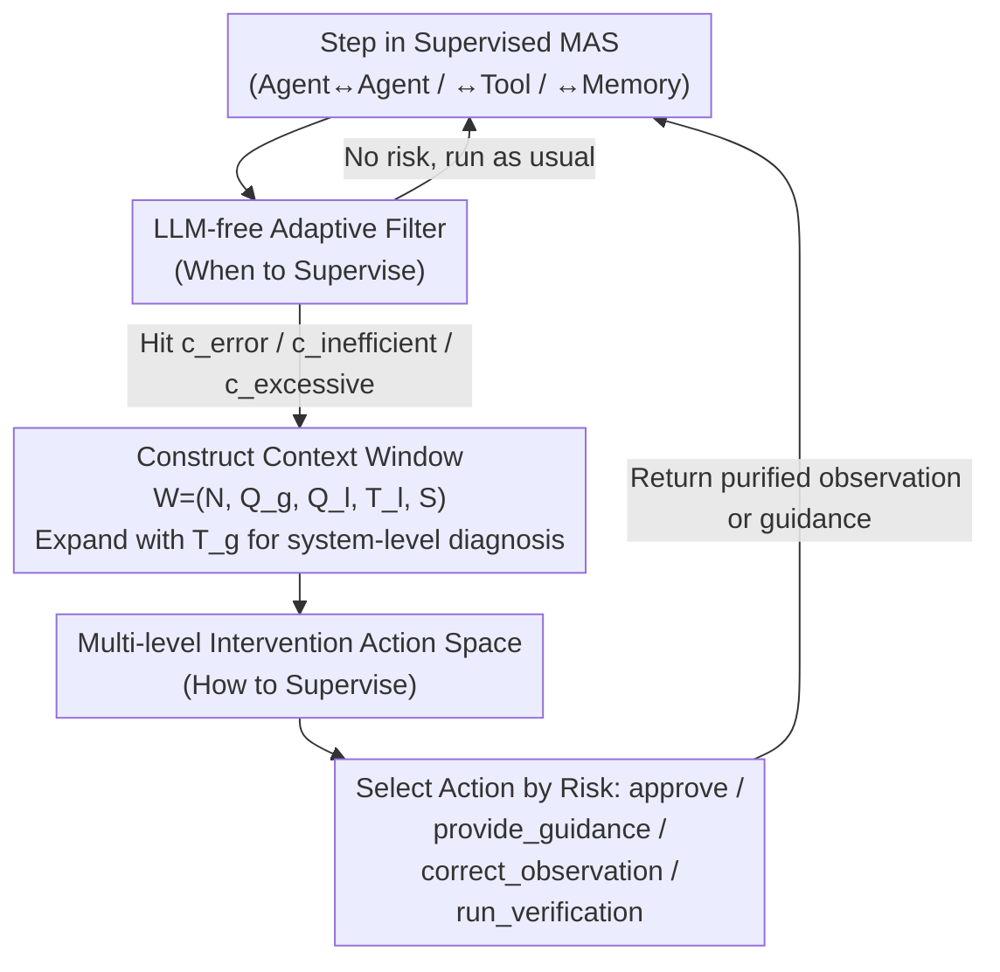

# Stop Wasting Your Tokens: Towards Efficient Runtime Multi-Agent Systems

**Conference**: ICLR 2026  
**arXiv**: [2510.26585](https://arxiv.org/abs/2510.26585)  
**Code**: None  
**Area**: Social Computing  
**Keywords**: Multi-Agent Systems, Token Efficiency, Runtime Supervision, Adaptive Filtering, Error Correction

## TL;DR

Proposes SupervisorAgent, a lightweight real-time adaptive supervision framework. It uses an LLM-free adaptive filter to proactively intervene (error correction, guidance, observation purification) at critical interaction nodes. It reduces the token consumption of Smolagent by 29.68% on the GAIA benchmark without compromising success rates.

## Background & Motivation

- Multi-Agent Systems (MAS) excel at complex tasks but face an **efficiency vs. robustness paradox**:
    - **Error Propagation**: A single piece of hallucinated information can contaminate the entire downstream reasoning chain.
    - **Inefficient Behavior**: Agents enter repetitive operation loops or select unnecessarily complex paths.
    - **Context Bloat**: Verbose tool returns (e.g., raw HTML) flood the context window.
- Existing methods primarily focus on **post-hoc failure attribution**, lacking **real-time proactive intervention**.

## Method

### Overall Architecture

The core of the method is to overlay a meta-level control agent, SupervisorAgent, on top of the original Multi-Agent System (MAS), forming a Supervised MAS (SMAS). The design revolves around three progressive questions: **what to supervise, when to supervise, and how to supervise**. The objects of supervision (what to supervise) are the three types of high-risk interactions in MAS most prone to issues: Agent-Agent (prone to spreading hallucinations), Agent-Tool (may return inaccurate or outdated data), and Agent-Memory (may retrieve flawed historical information). For every step taken by a supervised agent, it first passes through a cost-effective, LLM-free filter to determine if it touches a risk (when to supervise). Only when a risk is hit is the SupervisorAgent awakened; it then collects a compact context window and selects an intervention action from a multi-level action space with matching intensity (how to supervise). This framework does not alter the base agent architecture but minimizes supervision overhead via the "when" and "how" knobs.

### Key Designs

**1. LLM-free Adaptive Filter: Using Heuristics to Decide When to Supervise**

If an LLM were invoked for every interaction to decide whether to intervene, the cost of supervision would consume the tokens it aims to save. The authors' key trade-off is making the "when to supervise" step entirely free of LLM calls, using a set of lightweight heuristic signals triggered at critical nodes: explicit errors $c_{error}$ (tool call failures, code execution errors), inefficient behavior $c_{inefficient}$ (falling into repetitive loops, such as repeated page_down instead of searching directly), and excessive observations $c_{excessive}$ (verbose tool returns like entire raw HTML pages). SupervisorAgent is only awakened when one of these conditions is met, ensuring that most normal interactions incur no extra cost. This cheap filter is the prerequisite for supervision to achieve token savings.

**2. Memory-enhanced Context Window: Feeding Only Necessary States for Diagnosis**

To make correct judgments, the supervisor must possess a more comprehensive view of the system state than any single supervised agent, yet it cannot re-manufacture context bloat by stuffing in the entire history. Thus, its input is organized into a fixed compact window $\mathcal{W} = (N, Q_g, Q_l, T_l, S)$, where $N$ is the agent name, $Q_g$ and $Q_l$ are global and local goals, $T_l$ is the agent's recent local trajectory, and $S$ is the summary of the latest interaction. When diagnosing system-level inefficiencies across agents, it switches to an expanded window $\mathcal{W}_{ext} = \mathcal{W} \cup \{T_g\}$, adding the global trajectory $T_g$. This "expansion-on-demand" design provides a global perspective without introducing irrelevant details into reasoning.

**3. Multi-level Intervention Action Space: Matching Intervention Intensity to Problem Severity**

After triggering supervision, the "how to supervise" stage employs an action space ranging from light to heavy. The allowed subset of actions $\mathcal{A}(c)$ is restricted based on the trigger condition $c$ to ensure intensity matches risk. In inefficient scenarios $c_{inefficient}$, $\{approve,\ provide\_guidance\}$ are permitted: the light `approve` allows repetitive behaviors that are actually valid (handling false positives), while `provide_guidance` appends a prompt to pull the reasoning path back on track. Explicit errors $c_{error}$ allow $\{correct\_observation,\ provide\_guidance,\ run\_verification\}$, with `run_verification` invoking a sub-agent for external fact-checking. Excessive observations $c_{excessive}$ only allow $\{correct\_observation\}$, which purifies long raw HTML into a useful summary. Actions like `correct_observation` eliminate the source of context bloat before it enters downstream chains, saving tokens without losing success rate.

### A Complete Example

In a typical web search task on GAIA: a supervised agent calls a browsing tool and returns a page of raw HTML, triggering $c_{excessive}$. The filter awakens SupervisorAgent; the supervisor reads the compact window $\mathcal{W}$, judges the observation has low value for $Q_l$, and selects `correct_observation`. It replaces the raw HTML with a purified summary. The bloated context is truncated before downstream reasoning. Case studies show a single successful intervention can reduce token consumption by over 70%. If the agent instead enters a page_down loop, $c_{inefficient}$ is triggered, and the supervisor uses `provide_guidance` to suggest a different strategy or `approve` if the repetition is necessary.

## Key Experimental Results

### Main Results (GAIA Benchmark)

| Method | Average Accuracy | Average Token (K) | L2 Token (K) |
|------|----------|--------------|-------------|
| CodeAgent | 40.00 | 120.40 | — |
| Smolagent (pass@1) | — | Baseline | Baseline |
| **SMAS (pass@1)** | Comparable | **-29.68%** | **-35%** |

### GAIA Level 2 Detailed Analysis

| Metric | Smolagent | SMAS | Gain |
|------|----------|------|------|
| Token Consumption | Baseline | -35% | Significant |
| Variance | Baseline | -63% | Major Reduction |
| Steps (Case) | Baseline | -43% | Significant |

### Cross-Benchmark Validation

| Benchmark | Area | Token Reduction | Accuracy Change |
|------|------|----------|----------|
| HumanEval | Code Generation | **-23.74%** | + Improvement |
| MBPP | Code Generation | Significant Reduction | Comparable/Improvement |
| AIME 2024 | Math Reasoning | Reduction | Comparable |
| GSM8k-Hard | Math Reasoning | Reduction | Comparable |
| DROP | QA | Reduction | Comparable |

### Key Findings

1. Accuracy improved while achieving a 23.74% token reduction on HumanEval.
2. SupervisorAgent is effective across GPT-4.1, Gemini-2.5-pro, and Qwen3 series.
3. The adaptive filter effectively controls supervision overhead, avoiding redundant checks.
4. Case analysis indicates a single successful intervention can reduce token consumption by 70%+.

## Highlights & Insights

- **Real-time Proactive Intervention vs. Post-hoc Analysis**: A paradigm shift from reactive to proactive.
- **Pareto Improvement**: Reduces token consumption without losing (and sometimes improving) success rates.
- **LLM-free Filter**: A key innovation using simple heuristics instead of LLMs to decide "when to supervise."
- **Orthogonal to Existing Methods**: Can be layered onto any existing MAS framework.
- **Significant Variance Reduction**: Results in more stable and reliable system behavior.

## Limitations & Future Work

- The adaptive filter relies on predefined heuristics and might miss new types of high-risk interactions.
- SupervisorAgent's LLM calls have their own costs, requiring a balance between supervision benefits and overhead.
- Primarily validated on the Smolagent framework; adaptation to other MAS frameworks may require adjustments.
- Limited applicability to pure dialogue tasks that do not utilize tools.

## Related Work & Insights

- Failure Attribution: Post-hoc analysis methods like Aegis and AgenTracer.
- Efficiency Optimization: AgentDropout (pruning agents), MetaAgent (design-time topology optimization).
- Context Compression: Observation summarization/distillation.

## Rating

- **Novelty**: ⭐⭐⭐⭐ — The concept of runtime supervision is novel; the non-intrusive design is practical.
- **Technical Depth**: ⭐⭐⭐ — The method is relatively intuitive with moderate technical complexity.
- **Experimental Thoroughness**: ⭐⭐⭐⭐⭐ — 6 benchmarks × multiple base models × detailed case studies.
- **Value**: ⭐⭐⭐⭐⭐ — Directly deployable and highly valuable for reducing MAS operational costs.

<!-- RELATED:START -->

## Related Papers

- [\[ICLR 2026\] Learning Efficient and Interpretable Multi-Agent Communication](learning_efficient_and_interpretable_multi-agent_communication.md)
- [\[ICLR 2026\] KVComm: Enabling Efficient LLM Communication through Selective KV Sharing](kvcomm_enabling_efficient_llm_communication_through_selective_kv_sharing.md)
- [\[AAAI 2026\] iMAD: Intelligent Multi-Agent Debate for Efficient and Accurate LLM Inference](../../AAAI2026/multi_agent/imad_intelligent_multi-agent_debate_for_efficient_and_accura.md)
- [\[ACL 2026\] Efficient Multi-Agent System Training with Data Influence-Oriented Tree Search](../../ACL2026/multi_agent/efficient_multi-agent_system_training_with_data_influence-oriented_tree_search.md)
- [\[ICLR 2026\] Stochastic Self-Organization in Multi-Agent Systems](stochastic_self-organization_in_multi-agent_systems.md)

<!-- RELATED:END -->
