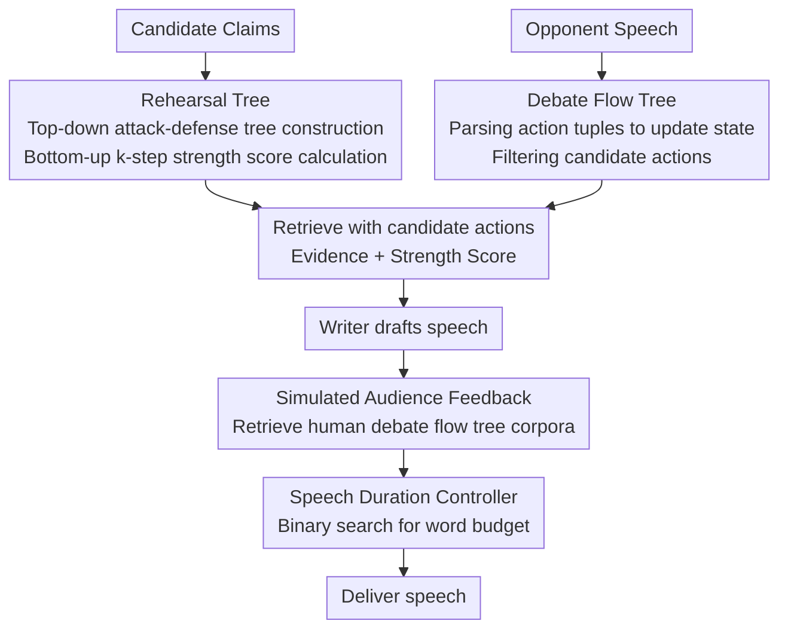

# Strategic Planning and Rationalizing on Trees Make LLMs Better Debaters

**Conference**: ICLR 2026  
**OpenReview**: [https://openreview.net/forum?id=E1hbqtHrvg](https://openreview.net/forum?id=E1hbqtHrvg)  
**Code**: https://github.com/LeiLiLab/TreeDebater  
**Area**: Agent / Multi-Agent / LLM Reasoning  
**Keywords**: Competitive Debate, Tree-structured Planning, Multi-Agent, Time Budget, Persuasiveness

## TL;DR
This paper proposes TreeDebater, which utilizes a "Rehearsal Tree" to pre-simulate opponent moves and a "Debate Flow Tree" to track the status of the debate. Combined with simulated audience feedback and a speech duration controller, it enables LLMs to allocate precious speaking time to the most impactful actions in strictly timed competitive debates. In human evaluations, it achieved a +15.6% gain in per-stage persuasiveness and a +10% win rate in overall opinion shifts compared to the previous SOTA multi-agent debate system.

## Background & Motivation

**Background**: There are currently two approaches to using LLMs for debate. One is "debating for solutions"—where multiple agents debate different proposals to improve reasoning, evaluation, or safety; these problems have optimal solutions, and debate is merely a means to converge on the answer. The other is "competitive debate"—where two sides clash over the same topic with no standard answer, and the winner is determined by who can better persuade the audience. Representative work such as Agent4Debate uses four collaborative agents (searcher/analyzer/writer/reviewer) to generate arguments, approaching human debater levels.

**Limitations of Prior Work**: However, human judges still find AI debaters less persuasive than humans. The root cause lies in two unique difficulties of competitive debate ignored by existing methods. The first is **strict time limits**: 4 minutes for opening, 4 minutes for rebuttal, and 2 minutes for conclusion. Debaters cannot expand on every candidate argument and must choose between "attacking the opponent's claims" and "defending their own," betting limited time on the most critical actions. The second is the **lack of objective reward signals**: unlike games like Go or Werewolf with rule-based outcomes, the winner of a debate depends on the evolving process of arguments. A single "final state" cannot characterize the persuasiveness of the argumentation.

**Key Challenge**: Time constraints force debaters to make strategic "which point to hit" decisions, while the lack of objective rewards means such decisions cannot be learned through traditional planning based on end-game returns—LLMs neither know how to save time nor how to evaluate if a point is worth making.

**Key Insight**: The authors observe that human debate experts implicitly use "tree-based reasoning." Before a match, they **rehearse**: anticipating claims the opponent might make and preparing responses, naturally forming an attack-defense tree. During the match, they use another tree for **note-taking**, recording which points have been addressed and which remain unresolved, maintaining a structured mental map.

**Core Idea**: Explicitly model the dynamic interaction of debate into two trees—use a Rehearsal Tree to pre-simulate attacks and defenses and calculate a "strength score" for each claim before the match, and use a Debate Flow Tree to track the state and filter candidate moves during the match. This allows the LLM to perform strategic planning guided by the trees, spending time where it matters most.

## Method

### Overall Architecture

The core of TreeDebater consists of two phases: pre-tournament preparation and in-tournament loops. **Pre-tournament**: For several candidate claims of the self-side (and anticipated opponent-side), an attack-defense tree (Rehearsal Tree) is generated top-down, and a $k$-step strength score is calculated recursively bottom-up for each argument. **In-tournament (per stage)**: After listening to a speech, it is parsed into action tuples to update the Debate Flow Tree; candidate actions are filtered from the Flow Tree; the Rehearsal Tree is then queried using these candidate actions to retrieve prepared evidence and strength scores; the Writer drafts the speech; a Simulated Audience provides feedback based on human debate flow tree corpora; the speech is revised based on feedback; finally, a speech duration controller compresses the speech into the required time limit before delivery.

### Key Designs

**1. Rehearsal Tree: Pre-simulating attack-defense and evaluating arguments with minimax-style $k$-step strength scores**

To address the issue of "not knowing which argument is worth the time," TreeDebater proposes $n$ candidate claims $C=\{c_0,\dots,c_n\}$ and builds a Rehearsal Tree with maximum depth $L$ for each claim $c=x^{(0)}$. Each node in the tree is an argument $x$, and its children are potential counter-arguments—thus, each node and its grandfather share the same stance. The attack score $r_a(x_l, x_{l-1})$ of a node $x_l$ at level $l$ measures its attack impact on the parent, and the support score $r_s(x_l, x_{l-2})$ measures its support impact on the grandfather. $r_a$ and $r_s$ are two scoring models (LLaMA-3.2-3B reward models trained on the Kialo dataset).

Single-layer scores are insufficient; the goal is to calculate the "comprehensive utility of an argument considering subsequent moves." Thus, the strength score $f_k(x_l)$ is defined to incorporate the node's own score and the influence of its $k$-layer subtree. For $k=0$:

$$f_0(x_l)=\begin{cases} r_s(x_l, s) & l=0 \\ r_a(x_l, x_{l-1}) & l=1 \\ \tfrac{1}{2}\big(r_a(x_l, x_{l-1})+r_s(x_l, x_{l-2})\big) & l\ge 2\end{cases}$$

For $k>0$, a minimax recursion from our side's perspective is used—assuming the opponent will always choose a counter-argument that maximizes their utility (minimizes ours):

$$f_k(x_l)=f_0(x_l)-\gamma\cdot\max_{x_{l+1}\in \text{Child}(x_l)} f_{k-1}(x_{l+1}),$$

where $\gamma=0.8$ is a decay coefficient. The $k$-step strength score answers: "If there are $k$ rounds remaining, what is the worst-case utility this claim can leave me?" This quantifies "whether time should be invested" into a comparable number.

**2. Debate Flow Tree: Real-time state tracking and move filtering**

It is easy to lose track of points in the back-and-forth of a debate. The Debate Flow Tree $T_d$ simulates human note-taking by storing all proposed claims along with their corresponding attacks and defenses in a tree structure. Each node contains a claim, supporting evidence, status (proposed/attacked), and visit count. After each speech, TreeDebater parses it into a sequence of (Action, Claim, Evidence, Target) tuples to update the tree: new claims are attached under the root as "proposed" nodes; if an existing claim is attacked, its status changes to "attacked" and a child node records the attack; new evidence updates the corresponding node.

Crucially, the Flow Tree **filters valid candidate actions** based on the current state: `propose` is only allowed in the opening stage; `rebut` targets the opponent's latest leaf nodes; `reinforce` targets self-nodes; `attack` targets opponent nodes. Once candidate actions are identified, the Rehearsal Tree is queried: for `propose`/`reinforce`, it retrieves evidence supporting the claim; for `attack`/`rebut`, it retrieves counter-claims. It also extracts the $k$-step strength score matching the remaining turns. Embeddings are calculated using Gemini-text-embedding-4, with cosine similarity > 0.8 treated as the same claim. Consequently, the LLM Writer receives a "list of candidate actions with prepared evidence and utility scores" instead of vague instructions.

**3. Simulated Audience Feedback: Leveraging human debate flow tree corpora for stylistic refinement**

Logic alone is not enough to persuade. A simulated audience refines the speech. The authors first build a corpus of human debate flow trees from debate data. During a match, the current flow tree is converted to a string and queried against the corpus using Gemini-text-embedding-4. The top-1 most similar human flow tree is injected into the simulated audience's instructions to provide a "real-world" sense of flow and style. The audience then provides feedback on clarity, impact, evidence, and persuasive elements, which TreeDebater uses for revision, learning time allocation and persuasive expression from human structures.

**4. Speech Duration Controller: TTS estimation + binary search for word budget**

Competitive debates are timed by actual speaking duration. However, LLMs struggle to control length by word count, and word count does not precisely map to speech time. A speech duration controller is introduced: drafting starts with a rough word budget (approx. 130 words/min). In each iteration, a lightweight TTS model (FastSpeech) converts the draft to audio to calculate actual time $t$, which is combined with the word budget $n$ to search for a new budget. Since time $t$ correlates with word count $n$, **binary search** is used to find the target word count: identifying an interval $[n_l, n_r]$ and halving it until the duration falls within $[t_l, t_r]$ or the maximum revision limit is reached.

## Key Experimental Results

The evaluation uses the SOTA multi-agent framework Agent4Debate as the baseline, with Gemini-2.0-flash and DeepSeek-V3 as backbone LLMs. Both use the same Tavily search and stage prompts for fairness. Human evaluation includes per-stage head-to-head comparisons (120 groups across 10 topics) and end-to-end full-match comparisons (Oxford-style debate measuring opinion shifts). 212 Prolific participants from the US were recruited, with a 60.7% inter-annotator agreement.

### Main Results

| Evaluation | Backbone | Metric | Agent4Debate | TreeDebater |
|------|------|------|--------------|-------------|
| Per-stage Persuasiveness (Avg) | Gemini | 1–5 scale | 3.54 | **3.69** |
| Per-stage Persuasiveness (Avg) | DeepSeek | 1–5 scale | 3.47 | **4.01** |
| End-to-End (Avg of all stages) | Gemini | 1–5 scale | ~2.95 | **~3.57** |
| Overall Opinion Shift Win Rate | Gemini | Shift % | 0.13 | **0.46** |
| Overall Opinion Shift Win Rate | DeepSeek | Shift % | 0.30 | **0.40** |

The improvement on DeepSeek-V3 is particularly significant (+15.6% persuasiveness). TreeDebater was preferred over the baseline by 1.5× (Gemini) and 2.5× (DeepSeek) in per-stage win rates, and 3.5× (Gemini) and 1.3× (DeepSeek) in end-to-end opinion shifts. TreeDebater achieved higher average persuasiveness and win rates in 11/12 per-stage comparisons.

### Ablation Study

| Configuration | Opening | Rebuttal | Conclusion |
|------|------|------|------|
| TreeDebater (Full) | 3.50 | 3.50 | 3.75 |
| w/o Rehearsal Tree | 3.00 | 3.25 | 3.50 |
| w/o Rehearsal & Flow Tree | 3.00 | 3.00 | 3.50 |

### Key Findings
- **Both trees are vital, especially in earlier stages**: Removing the Rehearsal Tree dropped the opening score from 3.50 to 3.00, and removing the Flow Tree dropped the rebuttal from 3.50 to 3.00, showing the Rehearsal Tree helps prepare arguments while the Flow Tree helps track and select moves.
- **Flow Tree leads to diversified expert-like moves**: The full TreeDebater uses a mix of "attack+rebuttal," "pure attack," and "pure reinforcement," consistent with human experts who shift focus back to their own ground. Baseline models tend to focus solely on the opponent's latest speech.
- **Audience bias sometimes outweighs strategy**: When both sides perform well (avg score ≥ 3), audience prior beliefs play a larger role. In some DeepSeek topics, one side won regardless of assignment, which is why head-to-head comparison is more indicative of strategy differences.
- **Effectiveness of Format and Duration**: TreeDebater consistently generated valid formats and durations, whereas Agent4Debate (Gemini) was only 77% valid and often timed out, especially in conclusions.

## Highlights & Insights
- **Explicitly modeling "pre-match rehearsal" and "in-match note-taking"** into two trees with distinct responsibilities is a clear and transferable paradigm for bridging LLM shortcomings with structured memory.
- **Generating comparable utility signals in rewardless tasks**: Using minimax $k$-step strength scores to quantify argument value—with $k$ adapting to remaining turns—offers inspiration for other zero-sum strategy games without standard answers.
- **The speech duration controller is a simple but effective engineering insight**: Acknowledging that LLMs cannot control length precisely, it uses TTS measurement and binary search closes the loop, solving the "seconds-counting" constraint often ignored in AI debating.

## Limitations & Future Work
- Evaluation relies heavily on subjective human labeling; the 60.7% agreement is moderate. Findings suggest that as performance improves, audience prior beliefs weaken the evaluation signal.
- The reliability of strength scores depends on the $r_a$/$r_s$ 3B reward models. Argument impact scoring is inherently noisy, and the minimax assumption of optimal opponent moves may not hold in reality.
- The framework is complex (two trees, simulated audience, duration controller, multiple embedding queries). The overhead of pre-tournament construction and repeated TTS runs is not fully discussed.
- Validated on a simplified three-stage Oxford-style debate with limited models and topics; generalizability to more complex formats remains to be tested.

## Related Work & Insights
- **vs Agent4Debate**: While Agent4Debate uses multi-agent collaboration to write better arguments, TreeDebater focuses on strategic decision-making and "which point to hit" under time constraints.
- **vs Project Debater (Slonim et al. 2021)**: The first autonomous debate system used manual templates for construction; TreeDebater replaces fixed templates with dynamic Flow Tree tracking.
- **vs Language Game Agents (Werewolf/Diplomacy)**: Those games provide objective rewards to learn strategies; for the rewardless competitive debate, this paper uses the $k$-step strength score as a proxy for planning.

## Rating
- Novelty: ⭐⭐⭐⭐⭐ Explicitly modeling human intuition via trees and creating minimax scores for planning is highly novel.
- Experimental Thoroughness: ⭐⭐⭐⭐ Includes dual backbones, two types of human evaluation, ablation, and move distribution analysis, though topics are limited.
- Writing Quality: ⭐⭐⭐⭐⭐ Motivation is logical; the roles of both trees and the algorithms are clearly explained.
- Value: ⭐⭐⭐⭐ Provides a reusable planning framework for timed, open-ended tasks; the duration controller is a practical contribution.

<!-- RELATED:START -->

## Related Papers

- [\[ICLR 2026\] MARSHAL: Incentivizing Multi-Agent Reasoning via Self-Play with Strategic LLMs](marshal_incentivizing_multi-agent_reasoning_via_self-play_with_strategic_llms.md)
- [\[ICLR 2026\] Multi-Agent Design: Optimizing Agents with Better Prompts and Topologies](multi-agent_design_optimizing_agents_with_better_prompts_and_topologies.md)
- [\[ICML 2026\] Does Persona Make LLMs K-pop Fans? A Pilot Study of LLM-Based Online Concert Audience Agents](../../ICML2026/multi_agent/does_persona_make_llms_k-pop_fans_a_pilot_study_of_llm-based_online_concert_audi.md)
- [\[ICLR 2026\] Stronger-MAS: Multi-Agent Reinforcement Learning for Collaborative LLMs](stronger-mas_multi-agent_reinforcement_learning_for_collaborative_llms.md)
- [\[ICLR 2026\] ATLAS: Constraints-Aware Multi-Agent Collaboration for Real-World Travel Planning](atlas_constraints-aware_multi-agent_collaboration_for_real-world_travel_planning.md)

<!-- RELATED:END -->
