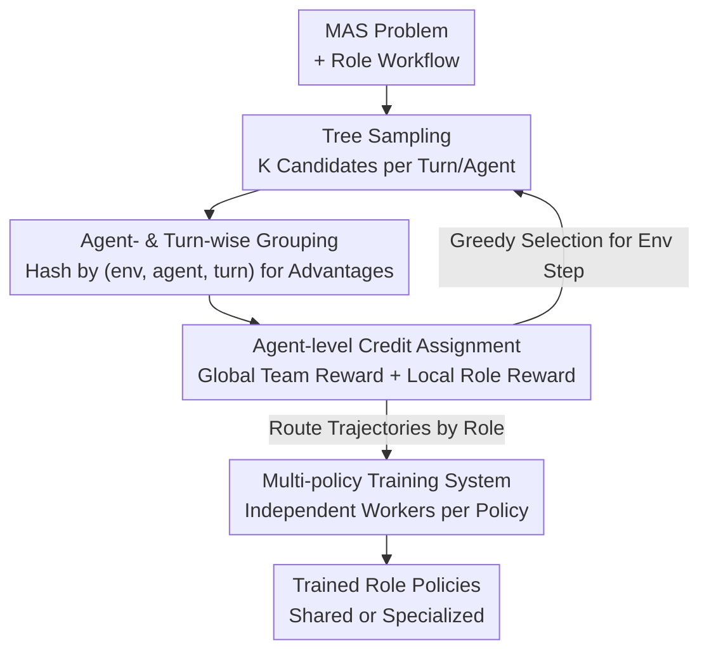

# Stronger-MAS: Multi-Agent Reinforcement Learning for Collaborative LLMs

**Conference**: ICLR 2026  
**OpenReview**: [https://openreview.net/forum?id=IdF6JqXWzx](https://openreview.net/forum?id=IdF6JqXWzx)  
**Code**: https://github.com/pettingllms-ai/PettingLLMs  
**Area**: Multi-Agent / Agent / Reinforcement Learning  
**Keywords**: Multi-agent systems, on-policy RL, GRPO, role specialization, LLM collaboration

## TL;DR
To address the gap in applying on-policy RL to Multi-Agent Systems (MAS), this paper proposes AT-GRPO—a group-relative RL algorithm grouped by "agent + turn" (featuring tree-based sampling and hybrid global/local rewards) alongside a system supporting concurrent multi-policy on-policy training. It achieves consistent improvements across game, planning, code, and math tasks, specifically increasing the success rate of long-horizon planning tasks from 14–47% in single-agent RL to 96.0–99.5%.

## Background & Motivation
**Background**: Currently, enhancing LLM agent capabilities follows two complementary paths. One is Multi-Agent Systems (MAS): utilizing frameworks like AutoGen or MetaGPT to perform role-based orchestration (e.g., coder/tester, reasoner/tool-user) on a shared LLM, providing gains during inference. Recently, "role specialization" has emerged—assigning different models to different roles. The other is Reinforcement Learning (RL): treating the LLM as a policy and iteratively updating weights based on environmental rule-based rewards (notably via group-relative optimization like GRPO/GiGPO).

**Limitations of Prior Work**: These two paths largely operate in isolation. Most MAS research is limited to prompt design during inference without actual training. Meanwhile, mature on-policy RL frameworks (VERL, AReaL, OpenRLHF) primarily support single-agent setups—single interaction patterns, single policies, and single resource pools—making them incapable of concurrently running independent on-policy updates for multiple models. Consequently, using RL to train MAS remains largely unexplored.

**Key Challenge**: Implementing RL in MAS encounters a fundamental algorithmic conflict. When calculating advantages, GRPO requires candidate responses within a group to share the same prompt for a fair comparison (reward masks only score response tokens). However, in MAS, the "prompt" is not just the problem; it embeds role-specific context and cross-agent interaction history. For instance, a coder's prompt in turn 2 contains the code and unit tests from turn 1. Thus, **prompts vary by role and turn**. Directly applying single-agent parallel sampling (executing $K$ full trajectories from the initial state) results in different prompts for each trajectory when $t>1$, causing the group size to degrade to 1 and rendering GRPO's variance reduction ineffective and updates unstable.

**Goal**: (1) Design a group-relative algorithm valid for multi-turn, multi-agent environments that ensures prompt consistency within groups; (2) Develop a system capable of concurrent multi-policy on-policy training while supporting diverse MAS workflows.

**Key Insight**: Refine the grouping granularity from "same problem" to "same agent + same turn + same environment instance," and perform on-the-spot tree sampling at each step to construct valid comparison groups—replacing "trajectory-wise grouping" with "agent-wise + turn-wise grouping" to re-enable GRPO in MAS.

## Method

### Overall Architecture
AT-GRPO models an N-agent MAS as a Markov game: in each **turn** $t$, all agents sequentially emit a "macro-action" ( a full LLM rollout, i.e., a token sequence), with agent-specific micro-transitions $s_{t,i}=\mathcal{T}(s_{t,i-1},a_{t,i},i)$. Training iterates through two phases: **Phase 1 (on-policy rollout)** performs tree sampling at each turn for every agent, constructs groups locally, calculates advantages, performs credit assignment, and greedily selects the best action to advance the environment; **Phase 2 (per-model update)** routes sampled data to the corresponding policy by role, with each model performing a PPO-style clipped update in parallel. The key is aligning "grouping—advantage—update" to the fine-grained "agent × turn × env" level, preserving GRPO's fair comparison premise while supporting both shared (M=1) and specialized (M=N) policy configurations.

### Key Designs

**1. Tree Sampling: Constructing Valid Comparison Groups On-the-fly**

Applying single-agent "parallel sampling" (running $K$ full trajectories from the start) fails in MAS because once $t>1$, every trajectory carries a different interaction history, meaning no other sample shares the same prompt, causing the group size to become 1. Tree sampling adopts a different approach: **instead of branching at the trajectory level, it branches $K$ candidate actions $a^{(c)}_{t,i}$ at the current state of turn $t$ and agent $i$** (Alg.1 line 7). These $K$ candidates naturally share the same observation/prompt, forming a valid comparison group. After calculating advantages within the group, the **candidate with the highest reward is greedily selected** $c^\star=\arg\max_c r^{(c)}_{t,i}$ as the actual action to advance the environment (line 10–11), while all branches are used for training. This ensures prompt identity within the group, concentrates exploration on "critical coordination points," maintains a balance of positive and negative samples, and stabilizes optimization.

**2. Agent- and Turn-wise Grouping: Aligning Granularity to Role and Turn**

This addresses the core conflict where prompts vary by role and turn in MAS. Instead of grouping by "same problem," this paper extends the tabular-wise grouping of GiGPO to multi-agent settings: **using a lightweight hash $g=\text{hash}(e,i,t)$ to assign a unique group key to each "environment instance $e$ × agent $i$ × turn $t$" combination** (Alg.1 line 8). Candidates within the same group necessarily share the same role and turn position, ensuring prompt identity. Intra-group advantages use the standard group-relative formula for mean-centering and normalization:

$$A_g\!\left(a^{(c)}_t\right)=\frac{R(a^{(c)}_t)-\mathrm{mean}\big(\{R(a^{(c)}_t)\}_{c=1}^{K}\big)}{F_{norm}\big(\{R(a^{(c)}_t)\}_{c=1}^{K}\big)}$$

Sampled data tuples are stored in the dataset $D_i$ of the policy belonging to agent $i$. During updates, data is aggregated into corresponding models via $\mathcal{B}_m=\bigcup_{i:\sigma(i)=m}D_i$. This grouping prevents advantage estimation bias caused by averaging heterogeneous states.

**3. Agent-level Credit Assignment: Mixing Global Team and Local Role Rewards**

In collaborative tasks, it is necessary to reward both team success and individual contribution. Borrowing from cooperative MARL, individual agent rewards per turn are decomposed into a global team reward $r^{team}_t$ and a role-specific local reward $r^{loc}_{t,i}$, weighted by coefficient $\alpha$:

$$r_{t,i}=\alpha\, r^{team}_t + r^{loc}_{t,i}$$

For example, in a coder–tester setup: the team reward is the pass rate of the generated program on gold unit tests; local rewards are role-specific—the coder is rewarded for its code's pass rate, and the tester is rewarded for the pass rate of gold implementations on its generated tests. This encourages coordination while preventing free-riding.

**4. Multi-policy MAS Training System: Enabling Concurrent On-policy Updates**

Mainstream RL frameworks typically support only single models and resource pools. This work builds a system to handle multiple policies (Fig.4): **each policy $m$ has a dedicated GPU resource pool**, split into RolloutWorkers (inference) and UpdateWorkers (optimization), similar to HybridFlow. Environment steps run on CPU EnvWorkers, each managing a sandbox instance (with seeding, timeouts, and IO quotas) to support thousands of concurrent rollouts. A Router distributes experience: data from agent $i$ is sent to the UpdateWorker of its assigned policy $\sigma(i)$, maintaining strict on-policy training flows for each policy.

### Loss & Training
Each model $m$ uses a PPO-style clipped objective on its minibatch $\mathcal{B}_m$:

$$\textstyle \mathcal{L}(\theta^{(m)})=-\mathbb{E}_{g\in\mathcal{B}_m}\Big[\frac{1}{K}\sum_{c=1}^{K}\min\big(r^{(c,m)}_g\,A^{(c)}_g,\ \text{clip}(r^{(c,m)}_g,1-\varepsilon,1+\varepsilon)\,A^{(c)}_g\big)\Big]$$

where $r(\theta)=\pi_\theta(o_i|q)/\pi_{\theta_{old}}(o_i|q)$. Policy sharing ($M=1$) merges all agent data into $\mathcal{B}_1$ for joint updates; policy specialization ($M=N$) updates each role independently. Experiments use Qwen3-1.7B/8B in no-thinking mode on 8× H100, with sampling $K=4$, turns $T=4$, and $\alpha=1$.

## Key Experimental Results

### Main Results
Evaluation of five variants across four domains on Qwen3-1.7B/8B. Representative results for Qwen3-8B (relative gains over single-agent baseline in parentheses):

| Task | Metric | Single Agent | Single Agent+GRPO | MAS(Prompt) | MAS+GRPO | MAS+AT-GRPO(Specialized) |
| :--- | :--- | :--- | :--- | :--- | :--- | :--- |
| Sokoban | Success Rate | 9.00 | 14.00 | 16.00 | 30.00 | **98.00** (+89.00) |
| Plan-Path | Success Rate | 12.00 | 47.00 | 71.00 | 96.00 | 96.00 (+84.00) |
| Sudoku | Success Rate | 48.00 | 54.00 | 72.00 | 99.00 | 99.00 (+51.00) |
| AIME24 | Acc | 18.30 | 18.30 | 36.60 | 33.30 | **57.00** (+38.70) |
| LiveCodeBench | Acc | 22.80 | 25.70 | 28.00 | 24.20 | **33.10** (+10.30) |

Long-horizon planning shows the most significant improvement: MAS+AT-GRPO boosts success rates from 14–47% to 96.0–99.5%. Code and math domains show absolute gains of +3.87~7.62 and +9.0~17.93 respectively. Notably, **directly applying GRPO to MAS leads to performance drops** (e.g., Qwen3-8B on CodeContests 17.60→10.30), confirming the dangers of incorrectly averaging heterogeneous states.

### Ablation Study

| Comparison | Configuration | Key Metric | Description |
| :--- | :--- | :--- | :--- |
| vs MAPORL (gsm8k) | Ours (MAS un-trained) | 84.4% vs 81.0% | Heterogeneous roles (reasoning+tool) outperform homogeneous debate. |
| vs MARFT (Math) | Ours (MAS un-trained) | 84.4% vs 78.7% | Multi-turn iterative correction outperforms single-turn alignment. |
| vs CURE (CodeContests) | Ours (un-trained→trained) | 30.3%→34.2% vs 25.9% | Self-refinement loops outperform single-turn code+test generation. |
| Plan-Path Ablation | Traind SA, then put in MAS | 16.00 | Training agents individually reaches only 16, far below joint training (96). |
| Plan-Path Ablation | Swap Role Policies | 96.0%→6.0% | Performance collapses, proving learned non-interchangeable specialization. |

### Key Findings
- **Joint training is critical**: Individually training tool/code agents and then combining them in MAS yields only 16.00; joint training in MAS reaches 96.00. Gains stem from "learned coordination" rather than individual role strength.
- **Sharing vs. Specialization is task-dependent**: In coding, where coder/tester functions are highly distinct, specialization is better (+3.05 on 1.7B). In math, where reasoning/tool-use functions overlap, sharing can be superior.
- **Scalability**: Expanding from small teams to 7 agents, MAS+GRPO saturates at 34.1%, while MAS+AT-GRPO grows steadily to 47.7%, demonstrating effective scaling without coordination bottlenecks.
- **Observable Coordination**: Roles exhibit co-evolution (rewards rise in sync), and the "average turns to reach consensus" decreases during training.

## Highlights & Insights
- **Grouping granularity as the key to RL-on-MAS**: The authors identify that GRPO fails in MAS because prompts drift by role/turn. Refining groups to "agent × turn" is a clean, transferable solution.
- **Tree sampling as a dual-purpose solution**: It solves the group-size degradation problem and concentrates exploration on critical coordination points through greedy progression.
- **Structural gains from MAS**: The finding that un-trained MAS (84.4%) beats trained MAPORL/MARFT suggests that structural benefits from heterogeneous roles and multi-turn correction are often underestimated.
- **Policy swapping probe**: The 96%→6% collapse provides compelling evidence that specialized roles learn non-interchangeable labor divisions.

## Limitations & Future Work
- **Limited gains in saturated domains**: In domains like coding/math where base models are already extensively pre-trained, RL gains are compressed compared to planning/game tasks with clear coordination bottlenecks.
- **Lack of automatic selection for Sharing vs. Specialization**: Choosing the policy configuration currently requires manual task-based judgment.
- **Computational overhead**: Tree sampling (K-fold increase per step) and multi-policy resource pools increase complexity; cost analysis is relegated to the appendix.
- **Base model scale**: Restricted to Qwen3-1.7B/8B and no-thinking modes; performance with larger models or thinking modes remains to be verified.

## Related Work & Insights
- **vs Single-agent GRPO/GiGPO**: Single-agent methods rely on "multi-sampling same prompt," which fails in MAS due to prompt drift; this work extends grouping to agent×turn.
- **vs CURE**: CURE generates coder+tester in a single turn without self-correction; this work demonstrates the value of multi-turn self-refinement loops.
- **vs MARFT / MARTI**: MARFT is limited to single-turn interactions; MARTI applies single-agent GRPO to MAS in math only. This work provides a more complete framework (multi-turn, multi-domain, shared/specialized policies).

## Rating
- Novelty: ⭐⭐⭐⭐⭐ (Identifies/fixes GRPO-in-MAS root cause with clean agent×turn grouping).
- Experimental Thoroughness: ⭐⭐⭐⭐⭐ (Comprehensive across four domains, two scales, and multiple baselines/ablations).
- Writing Quality: ⭐⭐⭐⭐ (Clear algorithms and system diagrams).
- Value: ⭐⭐⭐⭐⭐ (The PettingLLMs system and planning gains are of high value to the agent training community).

<!-- RELATED:START -->

## Related Papers

- [\[ICLR 2026\] AgentPO: Enhancing Multi-Agent Collaboration via Reinforcement Learning](agentpo_enhancing_multi-agent_collaboration_via_reinforcement_learning.md)
- [\[ICLR 2026\] Adaptive Collaboration with Humans: Metacognitive Policy Optimization for Multi-Agent LLMs with Continual Learning](adaptive_collaboration_with_humans_metacognitive_policy_optimization_for_multi-a.md)
- [\[ICLR 2026\] BRIDGE: Bi-level Reinforcement Learning for Dynamic Group Structure in Coalition Formation Games](bridge_bi-level_reinforcement_learning_for_dynamic_group_structure_in_coalition_.md)
- [\[ICLR 2026\] MARSHAL: Incentivizing Multi-Agent Reasoning via Self-Play with Strategic LLMs](marshal_incentivizing_multi-agent_reasoning_via_self-play_with_strategic_llms.md)
- [\[ICLR 2026\] MAS²: Self-Generative, Self-Configuring, Self-Rectifying Multi-Agent Systems](mas2_self-generative_self-configuring_self-rectifying_multi-agent_systems.md)

<!-- RELATED:END -->
