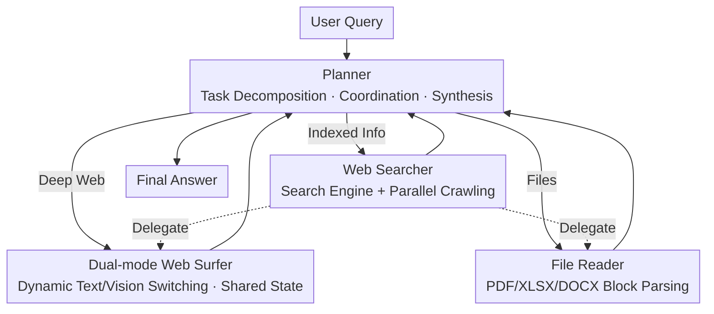

# UIS-Digger: Towards Comprehensive Research Agent Systems for Real-world Unindexed Information Seeking

**Conference**: ICLR 2026  
**arXiv**: [2603.08117](https://arxiv.org/abs/2603.08117)  
**Code**: [https://huggingface.co/datasets/UIS-Digger/UIS-QA](https://huggingface.co/datasets/UIS-Digger/UIS-QA)  
**Area**: LLM Evaluation  
**Keywords**: Unindexed Information Seeking, Multi-Agent Framework, Dual-mode Browser, SFT+RFT Training, Information Retrieval Benchmark

## TL;DR
Identifies and formalizes the "Unindexed Information Seeking" (UIS) problem—targeting dynamic web pages, embedded files, and interactive content that search engines cannot directly index. Proposes the first UIS benchmark, UIS-QA (110 questions), and a multi-agent framework UIS-Digger. A ~30B parameter model trained with SFT+RFT achieves 27.27% accuracy, outperforming systems integrated with O3/GPT-4.1.

## Background & Motivation
**Background**: LLM information retrieval agents (WebSailor, OWL, DDv2, etc.) have achieved high scores on GAIA (70.90%) and BrowseComp-zh (46.70%). However, these benchmarks primarily examine **indexed information** that is directly accessible via search engines.

**Limitations of Prior Work**: A vast amount of critical information on the internet is **unindexed information** (UIS): deep pages of government announcements, product specifications requiring multi-step navigation, data embedded in PDF/XLSX files, and dynamic content displayed only after interaction with date pickers or filters. Current agents are ineffective against these.

**Key Challenge**: Existing evaluation systems **do not distinguish** between indexed and unindexed information, leading to an overestimation of agent capabilities. The accuracy of SOTA agents drops sharply from 70% on GAIA to 24.55% on UIS-QA, exposing two bottlenecks: (a) **Insufficient action space**—search engine agents lack web interaction capabilities; (b) **Limited base model capability**—models struggle to make correct decisions within a large action space.

**Key Insight**: UIS is not a marginal issue but a **fundamental blind spot** in the evaluation of information retrieval agents. Information is strictly categorized into indexed information $\mathcal{II}$ and unindexed information $\mathcal{UI}$ with mathematical definitions. This work introduces the first UIS-QA benchmark and the UIS-Digger system.

**Core Idea**: Expose the severity of the problem through a specialized UIS benchmark and address UIS challenges using a multi-agent system combined with domain-specific training.

## Method

### Overall Architecture
This work delivers two primary outputs: a new benchmark and a new system. UIS-QA is designed to filter out questions that "search engines cannot directly solve" to expose inflated performance metrics. UIS-Digger is built to actually "dig out" this unindexed information.

The UIS-Digger runtime is a **four-agent collaborative system**. Each agent is equipped with specific tools and responsible for a category of sub-tasks, following the ReAct paradigm (Think $\rightarrow$ Act $\rightarrow$ Observe). When the top-level Planner receives a query, it initializes memory, decomposes the query into sub-tasks, and assigns them to three subordinates: the Web Searcher (handles indexed information via search engines/crawlers), the Web Surfer (interacts with browsers for deep web content), and the File Reader (parses downloaded PDF/XLSX/DOCX files). The Web Searcher can further delegate web browsing or file parsing tasks to the other two. Results flow back to the Planner for synthesis, iterating until a final answer is produced.

The design highlights three key components: the UIS-QA benchmark for problem measurement, and the Web Surfer and Web Searcher/File Reader channels for information extraction. The SFT+RFT training strategy ensures the model can effectively utilize this large action space.

### Key Designs

**1. UIS-QA Benchmark: Filtering via Triple Constraints**

The prerequisite for solving UIS is having a proper "ruler." Since existing benchmarks do not isolate unindexed information, agent scores are often "inflated" by search engine capabilities. UIS-QA is constructed by experts manually navigating deep websites to label QA pairs, followed by a triple UIS filter: manual Google search verification, z.ai automated verification, and internal knowledge checks via DeepSeek-R1. Only questions where the answer cannot be directly found via search engines are retained. The final 110 items (84 Chinese, 26 English) cover government announcements, product details, code repositories, etc., requiring objective and time-stable answers.

**2. Dual-mode Browser (Web Surfer): Dynamic Text/Vision Switching with Shared State**

Much UIS information is hidden behind interactive elements like date pickers, filters, and charts. Pure text agents cannot interpret these, while full visual agents (screenshot-based) are too slow. Web Surfer switches dynamically: Text mode for efficient structured content processing and Vision mode for understanding complex UI layouts using screenshots. Crucially, both modes **share memory and browser state**, eliminating the need for page re-synchronization during switching—a common overhead in multimodal agents.

**3. Parallel Tool Execution and File Parsing: Supplementary Information Channels**

UIS information is often embedded in files or requires broad retrieval. The Web Searcher invokes search engines and crawlers in parallel to shorten the acquisition path. The File Reader parses formats like PDF, XLSX, and DOCX, using incremental block-based reading (referencing Yu et al., 2025b) to avoid context overflow from long documents. Together, the search, deep browsing, and file parsing channels cover the full action space required for UIS.

### Loss & Training
A two-stage synthetic data and training process:
- **Data Construction**: (a) Information collected from deep browsing of 100+ real websites $\rightarrow$ LLM generated QA pairs $\rightarrow$ LLM Judge filtering; (b) Building three types of virtual websites (flight booking, statistics query) to generate targeted training data for interaction weaknesses like date pickers and filters.
- **SFT Phase**: A strong teacher model $\mathcal{X}^*$ (temperature=0) generates solution trajectories. After LLM Judge verification for correctness and non-triviality, reject sampling is performed.
- **RFT Phase**: The SFT model $\mathcal{X}^s$ (temp=0.4, 4 samples per question) performs self-sampling. Reject sampling is applied with **difficulty weighting**—trajectories for harder problems (fewer correct samples) are prioritized to yield the final model $\mathcal{X}^r$.

## Key Experimental Results

### Main Results

| System | Backbone Model | UIS-QA | GAIA | BrowseComp-zh |
|------|---------|--------|------|---------------|
| GPT-5 Direct Reasoning | GPT-5 | 0.9% | - | - |
| WebSailor | 32B | 7.3% | 53.2% | 25.5% |
| OWL | GPT-4.1 | 25.45% | 70.90% | 46.70% |
| DDv2 | - | 24.55% | - | - |
| **Ours (UIS-Digger)** | **~30B** | **27.27%** | - | - |

### Ablation Study

| Configuration | UIS-QA Accuracy | Description |
|------|-------------|------|
| Search Only (No Browse) | ~7% | Theoretically unsolvable due to action space gap |
| Text Mode Only | ~20% | Lacks vision mode for dynamic UI |
| Full System (No Training) | ~18% | Base model cannot effectively use tools |
| SFT Only | ~23% | Effective cold start but insufficient exploration |
| **SFT + RFT** | **27.27%** | Difficulty-weighted RFT provides 4pp gain |

### Key Findings
- SOTA agents experience a significant performance drop on UIS-QA (e.g., GAIA 70% $\rightarrow$ UIS-QA 25%), proving UIS is a distinct and severe challenge.
- A ~30B parameter model via specialized training outperforms general systems integrated with O3/GPT-4.1, suggesting UIS requires **specialized optimization**.
- Failure mode analysis: Search strategy errors (42%), tool usage errors (28%), and reasoning errors (30%).
- Dual-mode browsing and file parsing are the differentiating capabilities for solving UIS.

## Highlights & Insights
- **First formalization of the UIS problem**: Strictly categorizes internet information set $\mathcal{P}$ into indexed $\mathcal{II}$ and unindexed $\mathcal{UI}$, laying a theoretical foundation for this neglected direction.
- The **shared state design** of the dual-mode browsing strategy is ingenious—avoiding the mode-switching synchronization issues common in multimodal agents.
- Virtual website data generation is a valuable takeaway: designing training environments directly targeting agent weaknesses (like date picker interaction) replaces expensive manual annotation.
- The difficulty-weighted RFT strategy is simple yet effective—signals from correct trajectories of hard problems are stronger, efficiently boosting the agent's weak areas.

## Limitations & Future Work
- UIS-QA contains only 110 items, which is relatively small, and 84/110 are in Chinese, limiting language and domain coverage.
- Absolute accuracy is only 27.27%, indicating the UIS problem is far from solved—requiring stronger base models and better toolchains.
- Websites requiring login or CAPTCHA were not considered, although they are common in real-world scenarios.
- Evaluation is limited to accuracy; it lacks an analysis of efficiency metrics like interaction steps and time cost.
- Training data construction relies on a specific teacher model, raising questions about generalization.

## Related Work & Insights
- **vs GAIA/BrowseComp**: These benchmarks do not distinguish UIS; high scores may only reflect search engine indexing coverage.
- **vs WebArena/Mind2Web**: These focus on browser operations but evaluate in controlled environments; UIS-QA evaluates in the real, open internet.
- **vs ReAct/Reflexion**: Single-agent action spaces are limited; UIS-Digger’s multi-agent architecture covers the full space of search, browsing, and file parsing.
- Insight: Agent evaluation needs to be subdivided by information source (Indexed vs. Unindexed) to truly reflect an agent's capability boundaries.

## Rating
- Novelty: ⭐⭐⭐⭐⭐ First to identify and formalize UIS.
- Experimental Thoroughness: ⭐⭐⭐⭐ Comprehensive system comparisons, but UIS-QA scale is small.
- Writing Quality: ⭐⭐⭐⭐ Clear definitions and complete formalization.
- Value: ⭐⭐⭐⭐⭐ Reveals a fundamental blind spot in evaluation and establishes a basis for UIS research.

<!-- RELATED:START -->

## Related Papers

- [\[ICLR 2026\] ATLAS: Constraints-Aware Multi-Agent Collaboration for Real-World Travel Planning](atlas_constraints-aware_multi-agent_collaboration_for_real-world_travel_planning.md)
- [\[ACL 2026\] Towards Robust Real-World Spreadsheet Understanding with Multi-Agent Multi-Format Collaboration](../../ACL2026/multi_agent/towards_robust_real-world_spreadsheet_understanding_with_multi-agent_multi-forma.md)
- [\[ICLR 2026\] WideSearch: Benchmarking Agentic Broad Info-Seeking](widesearch_benchmarking_agentic_broad_info-seeking.md)
- [\[ICML 2025\] Is Your LLM-Based Multi-Agent a Reliable Real-World Planner? Exploring Fraud Detection in Travel Planning](../../ICML2025/multi_agent/is_your_llm-based_multi-agent_a_reliable_real-world_planner_exploring_fraud_dete.md)
- [\[AAAI 2026\] FinRpt: Dataset, Evaluation System and LLM-based Multi-agent Framework for Equity Research Report Generation](../../AAAI2026/multi_agent/finrpt_dataset_evaluation_system_and_llm-based_multi-agent_framework_for_equity_.md)

<!-- RELATED:END -->
