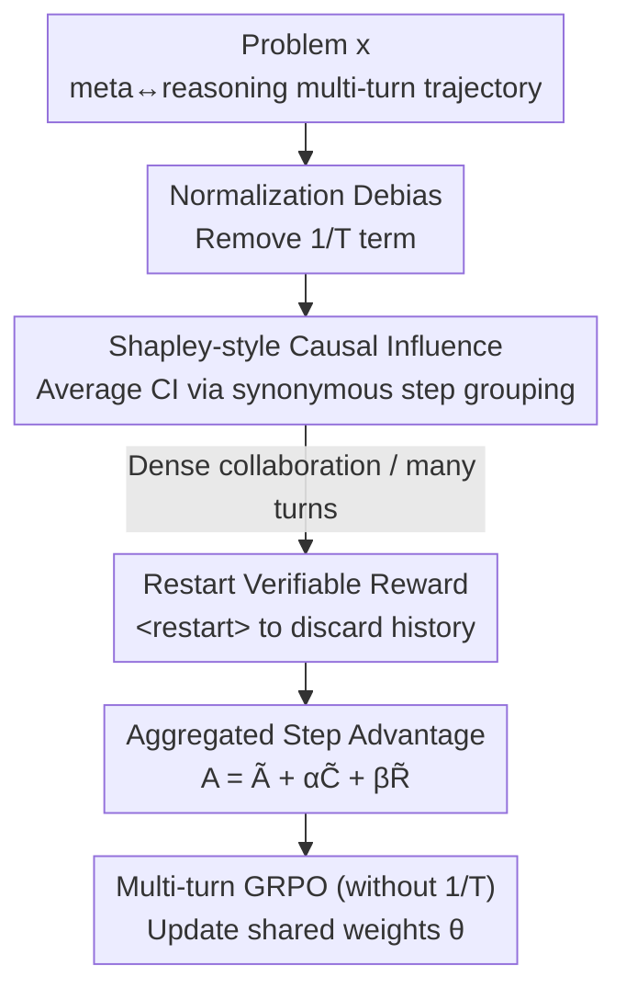

# Unlocking the Power of Multi-Agent LLM for Reasoning: From Lazy Agents to Deliberation

**Conference**: ICLR 2026  
**OpenReview**: [https://openreview.net/forum?id=5J6u03ObRZ](https://openreview.net/forum?id=5J6u03ObRZ)  
**Code**: None  
**Area**: LLM Reasoning / Multi-Agent  
**Keywords**: Multi-agent reasoning, lazy agents, multi-turn GRPO, causal influence, verifiable reward

## TL;DR
This paper identifies the "lazy agent" phenomenon in multi-agent LLM reasoning frameworks (ReMA)—where one agent performs nearly all reasoning while the other merely repeats. It theoretically identifies the root cause as the $1/T$ normalization term in the multi-turn GRPO loss, which biases towards fewer turns. The authors propose Dr. MAMR: removing this normalization + Shapley-style causal influence measurement + verifiable rewards for `<restart>`, elevating multi-agent systems from underperforming single-agent GRPO to comprehensive superiority (7B average 51.97→58.43).

## Background & Motivation
**Background**: LLMs using verifiable rewards for reinforcement learning have become powerful in complex reasoning tasks like mathematics, code, and planning. Recent work extends this paradigm to multi-agent settings, such as ReMA: a **meta-thinking agent (high-level policy $\pi_h$)** responsible for task decomposition and setting intermediate goals, and a **reasoning agent (low-level policy $\pi_l$)** responsible for step-by-step computation. To improve training efficiency, both agents share the same weights $\theta$ and are distinguished by system prompts $S_h$ and $S_l$, trained end-to-end using multi-turn GRPO (turn-level importance ratio).

**Limitations of Prior Work**: Through causal influence experiments, the authors found that the reasoning agent trained in ReMA often "slacks off"—outputting blank space or purely summarizing the meta-thinking agent's words without actual reflection. This **lazy agent** behavior collapses the multi-agent system into an ineffective single-agent setup, nullifying collaboration benefits. Evidence shows that ReMA's performance on MATH500 actually drops from 75.0 to 74.4 after training, performing worse than single-agent GRPO.

**Key Challenge**: Slacking in traditional MARL usually occurs in sparse reward scenarios with **simultaneous** actions. In this setting, agents act **sequentially**, where the previous agent's action shapes the state for the next. Intuitively, this cross-turn dependency should penalize laziness, yet experiments show the opposite. The authors theoretically point to the $1/T$ normalization in the multi-turn GRPO loss, intended to prevent bias toward longer trajectories, as the culprit that inadvertently rewards fewer reasoning turns.

**Goal**: The paper addresses three sub-problems: (1) Theoretically explaining why lazy agents emerge during training; (2) Inexpensively measuring the true contribution of each turn during online training; (3) Preventing the reasoning agent from being misled by early noisy outputs as dialogue turns increase.

**Core Idea**: The approach mitigates the issue by removing the $1/T$ normalization and fundamentally addresses it using **Shapley-style causal influence** for fine-grained credit assignment. Finally, a `<restart>` control token is introduced to allow the reasoning agent to discard noisy history and re-derive instructions, supported by a designed verifiable reward.

## Method

### Overall Architecture
Dr. MAMR (Multi-Agent Meta-Reasoning Done Right) builds on the alternating "meta-thinking ↔ reasoning" cycle of ReMA but modifies the training objective: **Normalization Debias → Causal Influence Measurement → Rewarding Beneficial Restarts**. It flattens a trajectory into a step sequence $s_{i,1},\dots,s_{i,2T}$ and calculates an aggregated step-level advantage $A^{step}_{i,t}=\tilde{A}_{i,t}+\alpha\tilde{C}_{i,t}+\beta\tilde{R}_{i,t}$, integrating outcome rewards, causal influence, and restart rewards into a modified GRPO objective.

### Key Designs

**1. Normalization Debias (ND): Identifying the $1/T$ term as the root of laziness**

The multi-turn GRPO objective contains a $\frac{1}{T_i}$ factor to average turn-level advantages, intended to suppress bias toward long trajectories. However, the authors prove a structural bias (Theorem 1): considering two continuations $\tau^S$ (short, horizon $T_S$) and $\tau^L$ (long, horizon $T_L>T_S$) with the same final reward, letting $\kappa\triangleq\frac{\lVert Z_t(\tau^L)\rVert}{\lVert Z_t(\tau^S)\rVert}$, if $\kappa<\frac{T_L}{T_S}$, then $\frac{\lVert g_t(\tau^S)\rVert}{\lVert g_t(\tau^L)\rVert}>1$. This means gradients favor the shorter sequence unless the long sequence's per-step contribution $Z_t(\tau^L)$ is at least $\frac{T_L}{T_S}$ times that of the short one. Since lazy behaviors are naturally shorter, they are prioritized during critical early training. The fix is to remove $\frac{1}{T_i}$.

**2. Shapley-style Causal Influence (CI): Stable contribution measurement via synonymous grouping**

To suppress laziness, the system must know if a step is useful. While one could measure the change in the next step's probability when a step is masked, online RL rollouts are sparse and biased toward specific wording. Ideally, one would average marginal contributions across all possible continuations like a Shapley value, but resampling is too expensive. Instead, the authors group the anchor step $s_{i,t}$ with **semantically similar** steps $G_S(s_{i,t})=\{s_{j,t'}\mid s_{j,t'}\approx s_{i,t}\}$ from across rollouts. They then calculate the average log-probability change $\Delta\ell_{j,t'}\triangleq\log p^{(j,t')}_{mask}-\log p^{(j,t')}_{full}$ within the group:

$$\mathrm{CI}(s_{i,t})=\frac{1}{|G_S(s_{i,t})|}\sum_{(j,t'):\,s_{j,t'}\in G_S(s_{i,t})}\Delta\ell_{j,t'}.$$

This provides a stable estimate of an idea's contribution without additional sampling.

**3. Restart Verifiable Reward (RB): Discarding noisy history with verifiable signals**

As collaborative intensity increases, LLMs risk getting locked into incomplete or incorrect early contexts. The reasoning agent might be misled by its own early errors. The authors introduced a `<restart>` token that triggers the disposal of previous reasoning outputs. To provide verifiable credit, if a rollout $i$ issues `<restart>` at turn $t$, the causal impact on the final answer confidence is measured: $\Delta\ell_{i,t}\triangleq\log\pi_\theta(s_{i,2T}\mid h^{(i)\backslash Y^{(i)}_{<2t}}_{\le 2T})-\log\pi_\theta(s_{i,2T}\mid h^{(i)}_{\le 2T})$. Combined with the outcome reward $z_i$, a reward is given if the restart increases confidence in a correct answer or decreases it for a wrong one.

### Loss & Training
The objective follows multi-turn GRPO but removes the $\frac{1}{T_i}$ normalization and replaces token-level advantages with the aggregated step-level advantage $A^{step}_{i,t}$. Training uses $\alpha=\beta=0.1$, 8 rollouts per prompt, and a batch size of 128 on the DeepScaleR dataset.

## Key Experimental Results

### Main Results
Evaluated on Qwen2.5-7B/14B-Instruct across 7 math benchmarks:

| Model | Metric | GRPO | ReMA | Dr. MAMR |
|------|------|------|------|----------|
| Qwen2.5-7B | MATH500 | 75.50 | 74.40 | **78.60** |
| Qwen2.5-7B | AIME24 | 16.67 | 13.33 | **20.00** |
| Qwen2.5-7B | AMC23 | 55.00 | 50.00 | **62.50** |
| Qwen2.5-7B | Olympiad | 48.60 | 42.58 | **52.34** |
| Qwen2.5-7B | **Avg** | 55.08 | 51.97 | **58.43** |
| Qwen2.5-14B | AIME24 | 16.67 | 13.33 | **26.67** |
| Qwen2.5-14B | AMC23 | 60.00 | 60.00 | **67.50** |
| Qwen2.5-14B | **Avg** | 58.05 | 57.24 | **62.49** |

Dr. MAMR flips the multi-agent system from being inferior to single-agent GRPO to achieving comprehensive superiority.

### Ablation Study
Ablations on the 7B model:

| Configuration | AIME24 | AMC23 | Gaokao2023en | Olympiad |
|------|--------|-------|--------------|----------|
| Dr. MAMR | 20.00 | 62.50 | 65.20 | 52.34 |
| w/o ND (Keep 1/T) | 13.33 | 55.00 | 63.64 | 47.85 |
| w/o CI (Remove Causal Influence) | 13.33 | 52.50 | 63.38 | 45.31 |
| w/o RB (Remove Restart) | 16.67 | 57.50 | 63.90 | 50.58 |

### Key Findings
- Removing ND and CI results in the steepest performance drops, showing they are primary drivers for suppressing laziness.
- Removing RB leads to more moderate drops; its value lies in recovering from mid-reasoning errors.
- Training curves show that in ReMA, the reasoning agent's causal influence approaches zero. In Dr. MAMR, both agents' CI rises steadily, achieving balanced collaboration.
- Dr. MAMR prevents training instability; while ReMA's rewards collapsed after 150 steps, Dr. MAMR remained stable throughout.

## Highlights & Insights
- Attributing the "lazy agent" phenomenon to a specific normalization term in the loss function and providing Theorem 1 provides a rigorous theoretical foundation.
- The use of semantic grouping for Shapley-style influence is a clever engineering solution to avoid the computational explosion of resampling.
- The restart reward uses the final answer's correctness and probability shift as a binary verifiable signal, rather than relying on heuristics.

## Limitations & Future Work
- Experiments are restricted to mathematical reasoning; generalization to code or open-domain collaboration is unverified.
- Semantic similarity grouping depends on external distance metrics; its sensitivity and robustness are not fully explored.
- The weight-sharing setup is specific; performance on heterogeneous multi-agent systems with independent weights requires validation.

## Related Work & Insights
- **vs. ReMA**: Directly addresses the failure case where ReMA underperforms single-agent baselines due to slacking.
- **vs. Single-agent GRPO / Dr.GRPO**: Proves multi-agent setups can exceed single-agent performance if designed to avoid turn-length bias.
- **vs. Traditional MARL Credit Assignment**: While classical methods focus on simultaneous actions, this work addresses the unique sequential context of multi-turn LLM reasoning.

## Rating
- Novelty: ⭐⭐⭐⭐⭐ (Theoretic root analysis + Shapley CI + Verifiable restarts).
- Experimental Thoroughness: ⭐⭐⭐⭐ (Solid mathematical benchmarks, but lacks domain diversity).
- Writing Quality: ⭐⭐⭐⭐ (Clear logic from phenomenon to theory to solution).
- Value: ⭐⭐⭐⭐⭐ (Critical insight for anyone designing multi-turn RL for agents).

<!-- RELATED:START -->

## Related Papers

- [\[AAAI 2026\] Scalable and Accurate Graph Reasoning with LLM-Based Multi-Agents](../../AAAI2026/multi_agent/scalable_and_accurate_graph_reasoning_with_llm-based_multi-agents.md)
- [\[ICLR 2026\] Graph-of-Agents: A Graph-based Framework for Multi-Agent LLM Collaboration](graph-of-agents_a_graph-based_framework_for_multi-agent_llm_collaboration.md)
- [\[ICLR 2026\] When Agents "Misremember" Collectively: Exploring the Mandela Effect in LLM-based Multi-Agent Systems](when_agents_misremember_collectively_exploring_the_mandela_effect_in_llm-based_m.md)
- [\[ICLR 2026\] MARSHAL: Incentivizing Multi-Agent Reasoning via Self-Play with Strategic LLMs](marshal_incentivizing_multi-agent_reasoning_via_self-play_with_strategic_llms.md)
- [\[ICLR 2026\] Multi-Agent Design: Optimizing Agents with Better Prompts and Topologies](multi-agent_design_optimizing_agents_with_better_prompts_and_topologies.md)

<!-- RELATED:END -->
