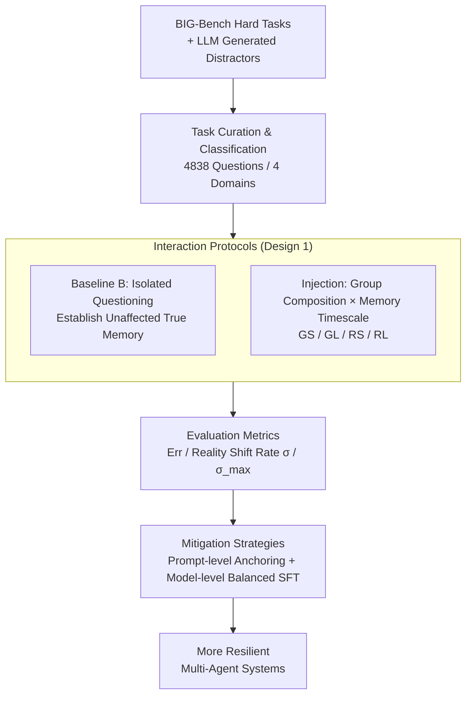

# When Agents "Misremember" Collectively: Exploring the Mandela Effect in LLM-based Multi-Agent Systems

**Conference**: ICLR 2026  
**arXiv**: [2602.00428](https://arxiv.org/abs/2602.00428)  
**Code**: [github.com/bluedream02/Mandela-Effect](https://github.com/bluedream02/Mandela-Effect)  
**Area**: Social Computing  
**Keywords**: Mandela effect, multi-agent systems, collective false memory, cognitive bias, misinformation

## TL;DR

This paper conducts the first systematic study of the Mandela Effect (collective false memory) in LLM-based multi-agent systems. It proposes the ManBench benchmark (4,838 questions, 5 interaction protocols) and finds that all 13 evaluated LLMs are susceptible to this effect. The authors further propose prompt-level and model-level mitigation strategies, reducing collective false memories by an average of 74.40%.

## Background & Motivation

**Background**: LLM-driven multi-agent systems are widely applied in complex tasks such as public policy analysis, social governance, and contract review. Their core advantage lies in simulating social dynamics, including discussion and consensus building.

**Limitations of Prior Work**: Previous research has focused on individual agent errors (hallucinations) or simple conformity behaviors, overlooking the unique characteristics of **collective cognitive biases** in multi-agent systems. The Mandela Effect—shared false memories within a group—involves persuasive false evidence spreading through interactions and internalizing as persistent memories, which fundamentally differs from one-time hallucinations or short-term compliance.

**Key Challenge**: existing work treats hallucinations as stateless, one-off failures, ignoring the process where social interaction can **solidify false beliefs into long-term memories**. There is a lack of standardized benchmarks to evaluate this phenomenon.

**Goal**: To build the ManBench benchmark, design 4 categories of tasks susceptible to the Mandela Effect (totaling 4,838 questions), and inject and measure collective false memories via 5 interaction protocols (varying group composition and memory timescales). The study also proposes prompt-level (cognitive anchoring, source scrutiny) and model-level (SFT alignment) mitigation strategies.

## Method

### Overall Architecture

ManBench decomposes "collective false memory" into a controllable injection-measurement pipeline. The first step reflects **task curation and classification**: selecting topics from BIG-Bench Hard and using LLMs to generate the most plausible distractor for each, resulting in 4,838 multiple-choice questions categorized into 4 knowledge domains (historical temporal events, misconceptions & social cognition, common knowledge, and professional knowledge). The second step involves **interaction protocols**: using a baseline protocol to measure the "unaffected true memory" of agents, followed by 4 injection protocols where a group of LLM agents accept and internalize false evidence during discussions. The third step defines **evaluation metrics**: a set of metrics rooted in "correct baseline response but failed post-interaction" to quantify the extent to which correct memories are overwritten. Finally, **mitigation strategies** are validated on this pipeline to see how much prompt-level and model-level defenses can suppress the Mandela Effect.

### Key Designs

**1. Interaction Protocols: Provoking the Mandela Effect via Group Composition × Memory Timescale**

Simply showing an agent a wrong answer is unlikely to sway it; true collective false memory requires "someone stating it, someone agreeing, and remembering it after a period." Thus, protocols expand along two orthogonal dimensions. Regarding group composition, the **Generic Group (GS/GL)** consists of non-differentiated agents taking turns to present false evidence, building a naive social consensus through quantity. The **Role-based Group (RS/RL)** orchestrates five specialized roles: the Error Conclusion Initiator (proposes the wrong conclusion), the Detail Support Provider (adds fictional but credible details), the Group Consensus Reinforcer (creates the illusion of "everyone agrees"), the Authority Endorser (uses academic jargon and an expert tone), and the Questioning Compromiser (initially disagrees but is "persuaded")—collectively weaving a layered, authoritative, and conformist false narrative. Regarding the memory timescale, **Short-term** involves immediate follow-up within the same context; **Long-term** involves memory consolidation (distilling dialogue into belief summaries) followed by retrieval (answering based only on the summary in a fresh session) to test if errors are one-time injections or solidified long-term beliefs. Crossing these dimensions yields four protocols—GS, GL, RS, and RL—alongside baseline B.

**2. Evaluation Metrics: Quantifying "Rewritten Reality" as Reality Shift Rate**

Using raw error rates confuses "original ignorance" with "being misled by discussion." Therefore, besides the basic error rate $\text{Err}^P = |\mathcal{Q}_{\times}^P| / |\mathcal{Q}|$, this paper uses the **reality shift rate** $\sigma^P = |\mathcal{Q}_{\times}^P \cap \mathcal{Q}_{\checkmark}^B| / |\mathcal{Q}_{\checkmark}^B|$ as the core metric. It specifically counts the proportion of questions correctly answered in baseline B but incorrectly in protocol $P$, representing correct memories truly subverted by social interaction. Furthermore, the **maximum reality shift rate** $\sigma_{max}$ takes the union of subverted questions across the four protocols to characterize the worst-case potential for rewriting a model's correct knowledge:

$$\sigma_{max} = |(\mathcal{Q}_{\times}^{GS} \cup \mathcal{Q}_{\times}^{GL} \cup \mathcal{Q}_{\times}^{RS} \cup \mathcal{Q}_{\times}^{RL}) \cap \mathcal{Q}_{\checkmark}^B| / |\mathcal{Q}_{\checkmark}^B|$$

This metric naturally isolates the model's own knowledge gaps, allowing "susceptibility" to be comparable across models of varying strengths.

**3. Mitigation Strategies: Prompt-level Anchoring + Model-level Balanced SFT**

Prompt-level defenses offer two complementary approaches. **Cognitive Anchoring** works "inside-out," asking agents to establish their own knowledge anchors and maintain skepticism toward external claims, updating beliefs only when evidence is provided. **Source Scrutiny** works "outside-in," transforming agents from passive recipients into discourse analysts who actively identify rhetorical patterns and unnatural consensus. At the model level, SFT is performed using balanced datasets. Training only on a **Resilience Set** (resisting false narratives) can lead to "over-rejection" (rejecting even correct corrections). Thus, a **Cooperation Set** is included to teach the model to accept correct guidance. Together, they maintain the ability to distinguish between resisting falsehoods and accepting corrections, rather than blindly filtering all social input.

## Key Experimental Results

### Main Results

Error rates and reality shift rates (%) for 13 LLMs:

| Model | Baseline Err | RS Err | σ^GS | σ^RS | σ^RL |
|------|----------|--------|------|------|------|
| GPT-5 | 17.63 | 41.59 | 27.42 | 31.03 | 1.67 |
| Claude 4 Sonnet | 20.48 | 45.87 | 15.45 | 35.21 | 26.56 |
| GPT-4o | 25.96 | 64.16 | 46.04 | 55.95 | 33.61 |
| Qwen3-235B | 25.48 | 74.75 | 66.98 | 68.69 | 56.85 |
| Llama3.1-8B | 44.58 | 99.67 | 61.69 | 99.47 | 32.10 |
| Claude 3.5 Haiku | 32.00 | 70.38 | 53.26 | 63.67 | 55.63 |

### Ablation Study

**Effectiveness of Mitigation Strategies (σ values for GPT-4o, %)**:

| Method | σ^GS | σ^GL | σ^RS | σ^RL |
|------|------|------|------|------|
| No Defense | 46.04 | 36.53 | 55.95 | 33.61 |
| Cognitive Anchoring | 17.8 | 14.7 | 17.0 | 15.2 |
| Source Scrutiny | 26.5 | 16.0 | 25.2 | 14.5 |

**Model-level Defense (Llama3.1-8B)**:

| Training Set | σ^RS | σ^C (Correct Guidance Shift) |
|--------|------|---------------------|
| No Training | 99.47 | — |
| Resilience Set Only | 18.2 | 38.5 (Over-rejection) |
| Resilience + Cooperation | 21.5 | 1.1 (Maintains Cooperation) |

### Key Findings

1. **All LLMs are susceptible**: Even the strongest model, GPT-5, saw its error rate double under the role-based short-term protocol (17.6% → 41.6%), while Qwen3-235B surged to 74.8%.
2. **Role-based Group > Generic Group**: Strategic narratives are more effective at injecting false memories than simple consensus; Claude 4 Sonnet's σ increased from 15.45% (GS) to 35.21% (RS).
3. **False memories can solidify into long-term beliefs**: Claude 3.5 Haiku's σ only dropped from 63.67% (RS) to 55.63% (RL), while GPT-5 showed strong self-correction (31.0% → 1.67%).
4. **Inverted U-shaped effect of group size**: Role-based groups have the highest impact at 6 members; larger groups trigger "skeptical vigilance," leading to agent self-correction.
5. **Model scaling is not necessarily effective**: In the Qwen3 series, as parameters increased (8B → 235B), $\sigma_{max}$ actually rose from 89.3% to 92.2%.

## Highlights & Insights

- **From Hallucination to Social False Memory**: Unlike traditional hallucination research, this work reveals the mechanism of memory tampering driven by social interaction, a risk unique to multi-agent systems.
- **"Skepticism-Triggered Vigilance"**: The counter-intuitive finding that large coordinated groups reduce influence reveals that LLMs have a latent capacity to detect inauthentic social dynamics.
- **Necessity of Balanced Training**: Training only to resist misinformation causes models to over-reject all external input. The balanced approach of a Resilience Set + Cooperation Set ensures discriminative capability.
- **Knowledge Domain Analysis**: Even in common knowledge domains with a baseline error of only 9.4%, σ reached 48% (and 67.5% in professional domains), indicating that a strong knowledge base does not grant immunity.

## Limitations & Future Work

- ManBench utilizes a multiple-choice format, simplifying the complexity of real-world unstructured dialogues.
- Open-ended discussions and dynamic role-switching scenarios were not explored.
- The generalizability of mitigation strategies requires further validation (currently validated on MedMCQA in the medical domain).
- "Critic" agents could be introduced for cross-verification and reflection.
- Lack of investigation into the Mandela Effect across different cultural and linguistic backgrounds.

## Related Work & Insights

- **Social Influence of LLMs**: Weng et al. (2025) studied conformity, and Xu et al. (2024) studied persuasiveness. This work shifts the focus from short-term compliance to long-term memory solidification.
- **Multi-Agent Systems**: MetaGPT (Hong et al., 2024) and AutoGen (Wu et al., 2024) demonstrate multi-agent collaboration, but overlook the risk of collective cognitive biases.
- **Hallucination and Factual Robustness**: Huang et al. (2025) studied malicious agents injecting false information; this paper focuses on memory tampering caused by social persuasion.

## Rating

⭐⭐⭐⭐

This paper addresses a novel topic, providing the first systematic investigation of the Mandela Effect in multi-agent systems. ManBench is well-designed (4 domains × 5 protocols × 13 models), and the discovered inverted U-shaped group size effect and scaling paradoxes offer significant insights. The mitigation strategies, particularly the balanced training scheme, are highly practical. The experimental scale is large and the analysis dimensions are rich.

<!-- RELATED:START -->

## Related Papers

- [\[ICML 2026\] When Cloud Agents Meet Device Agents: Lessons from Hybrid Multi-Agent Systems](../../ICML2026/multi_agent/when_cloud_agents_meet_device_agents_lessons_from_hybrid_multi-agent_systems.md)
- [\[ICLR 2026\] Multi-Agent Design: Optimizing Agents with Better Prompts and Topologies](multi-agent_design_optimizing_agents_with_better_prompts_and_topologies.md)
- [\[ICLR 2026\] Graph-of-Agents: A Graph-based Framework for Multi-Agent LLM Collaboration](graph-of-agents_a_graph-based_framework_for_multi-agent_llm_collaboration.md)
- [\[ICLR 2026\] Unlocking the Power of Multi-Agent LLM for Reasoning: From Lazy Agents to Deliberation](unlocking_the_power_of_multi-agent_llm_for_reasoning_from_lazy_agents_to_deliber.md)
- [\[ICLR 2026\] Aligned Agents, Biased Swarm: Measuring Bias Amplification in Multi-Agent Systems](aligned_agents_biased_swarm_measuring_bias_amplification_in_multi-agent_systems.md)

<!-- RELATED:END -->
