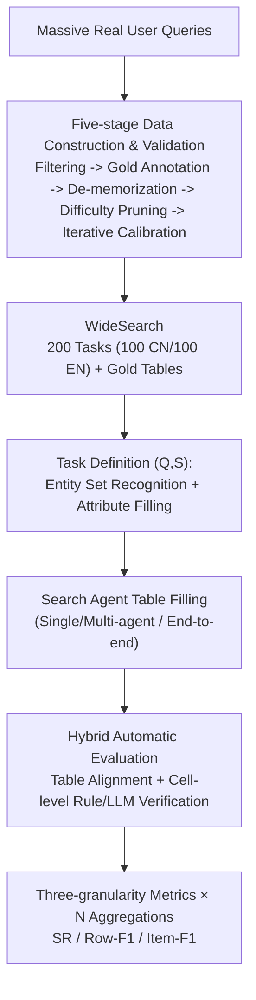

# WideSearch: Benchmarking Agentic Broad Info-Seeking

**Conference**: ICLR 2026  
**Paper**: [Project Page](https://widesearch-seed.github.io) (ByteDance Seed)  
**Code**: https://widesearch-seed.github.io (Includes dataset + evaluation framework, see supplementary materials)  
**Area**: Agent / Information Retrieval Benchmark  
**Keywords**: Search Agent, Broad Information Retrieval, Multi-Agent, Automatic Evaluation, Table Filling

## TL;DR
WideSearch introduces the first benchmark specifically designed to evaluate "wide-scale info-seeking." Given a query and a table schema, the agent must populate the entire table. The benchmark includes 200 Chinese and English human-annotated tasks with five-stage quality control. Results show that the success rate of over 10 mainstream search agents remains near 0%, with the best performing at only 7%, while human cross-validation approaches 100%. This highlights a critical deficiency in current agents regarding "large-scale, zero-tolerance" information collection.

## Background & Motivation
**Background**: With the emergence of agentic frameworks like OpenAI DeepResearch and Manus, the focus of search agent research is shifting from "performing new tasks" to "working reliably in real-world scenarios." Existing benchmarks generally fall into two categories: DeepSearch types (e.g., BrowseComp) which test finding difficult, deeply hidden facts; and DeepResearch types (e.g., DeepResearch Bench) which test synthesizing complex information into long-form reports.

**Limitations of Prior Work**: Analysis of real user queries reveals a category of high-frequency tasks completely missed by existing evaluations. The difficulty is not "hard to find" or "hard to write," but rather "doable but overwhelming in scale." For instance, a financial analyst needs to identify all companies in an industry meeting specific revenue and growth criteria, or a job seeker needs to list all vacancies fitting certain role/location/experience requirements. Each piece of information is simple, but collecting hundreds of items **exhaustively, with zero omissions, zero redundancies, and zero errors** is extremely tedious and error-prone for humans (often requiring over an hour of manual work).

**Key Challenge**: The bottleneck of such tasks is "operational scale and fidelity" rather than "cognitive difficulty." Once assigned to an agent, new failure modes emerge, such as over-extended contexts, factual errors, and incomplete information. **There is no suitable benchmark to quantify these failures.** More sharply: agents can find a single piece of information (item-level F1 can reach ~80% with sufficient retries), but if just one piece of information is added, missing, or incorrect among thousands of atomic facts, the entire task is failed—a "zero-tolerance" reliability test.

**Goal**: ① Formalize the neglected problem space of "wide-scale info-seeking"; ② Create a difficult, realistic, objectively verifiable, and anti-memorization benchmark; ③ Systematically evaluate mainstream single/multi-agent and commercial systems to pinpoint their bottlenecks.

**Key Insight**: Design the task as **table filling**—given a query and a predefined schema, the agent produces a structured table that can be verified cell-by-cell. This aligns with real-world needs (output is directly usable) and allows evaluation to be as precise and reproducible as a database join.

**Core Idea**: Use the task format of "Query + Table Schema → Populated Table" to specifically measure the **completeness and fidelity** of agents in large-scale information collection rather than single-point retrieval capability.

## Method

### Overall Architecture
WideSearch is not a new model but a "benchmark + evaluation pipeline." Each problem is formalized as a pair $(Q, S)$: $Q$ is a natural language query implying a target entity set, and $S=\{C_1,\dots,C_m\}$ is a predefined column schema. The agent's task is split into two steps: **Entity Set Recognition** (identifying the complete set of entities $E=\{e_1,\dots,e_n\}$ satisfying $Q$) and **Attribute Filling** (filling values for every column $C_j$ for each entity $e_i$), resulting in an $n\times m$ table $T_{agent}$, which is aligned and scored against the gold table cell-by-cell.

The system consists of two serial pipelines: a **Five-stage Data Construction and Validation Pipeline** that refines massive real user queries into 200 high-quality problems, and a **Hybrid Automated Evaluation Pipeline** that performs table alignment and cell-wise verification of agent outputs against gold tables, providing final scores through three-granularity metrics across multiple aggregations.

### Key Designs

**1. Table-filling Task Definition: Converting "Broad Retrieval" into Structurally Verifiable Objectives**
If broad retrieval tasks are answered in free-form text, objective scoring is impossible due to scattered answers and varied phrasing. WideSearch defines the task as $(Q,S)$ table filling: $Q$ implies target entities, and $S$ explicitly defines the output column structure. For example, "Find minimum GPA requirements for 2026 Civil Engineering Masters at Ivy League and Group of Eight universities." The entity set consists of 16 universities, and the schema is {Country, University, Alliance, Minimum GPA}. This naturally decomposes the task into **Entity Set Recognition** (testing cross-domain exhaustive search) and **Attribute Filling** (testing attribute-level grounding). The rigid structure allows for precise evaluation and imposes "completeness" pressure—missing one school results in a missing row.

**2. Five-stage Data Construction and Validation: Ensuring Difficulty, Realism, and Reliability**
To ensure the benchmark is difficult yet credible, a five-stage pipeline is used: ① **Source & Refinement**: Annotators sieve clear, unambiguous candidates from real queries. ② **Gold Annotation & Metric Collection**: Annotators create gold answers through exhaustive search, recording time taken, search counts, and unique pages visited. ③ **Parametric Knowledge Filtering**: LLMs attempt the task without tools; tasks they can answer correctly are discarded to ensure reliance on real-time search. ④ **Difficulty Pruning**: Tasks requiring <10 minutes or <10 unique pages are removed. ⑤ **Iterative Refinement & Validation**: Commercial agents run the tasks, and automatic scores are compared with human expert scores; if similarity is <95%, the task is revised.

**3. Hybrid Automatic Evaluation: Combining Rules + LLM-judge for Cell Verification**
Standardizing "correctness" across different columns varies—names require exact matching, numbers allow floating-point errors, dates require semantic equivalence, and URLs need normalization. WideSearch evaluation starts with **Syntax Validation & Alignment**: non-parseable Markdown or mismatched headers result in a 0 score. If valid, mapping prompts normalize primary key columns to join with the gold table. **Hybrid Cell-wise Scoring** then applies specific methods based on column type: Exact Match / Numerical Approximation / Date Comparison / URL Normalization / LLM-as-a-judge (GPT-4.1 by default, for high-variance semantic cells). This maintains deterministic rules while using LLMs for semantic boundary cases, achieving >97.8% consistency with human evaluation.

**4. Three-granularity Metrics × N Aggregations: Layered Characterization and Scaling Analysis**
Binary success rates hide where agents fail. WideSearch provides three granularities: **Success Rate (SR)** is the strictest (requires perfect match of content and structure); **Row-level F1** treats each row as a unit; **Item-level F1** treats each cell as a unit. Each task is run $N$ times with three aggregations: $\text{Avg@}N$ (arithmetic mean), $\text{Pass@}N$ (percentage of tasks succeeded at least once), and $\text{Max@}N$ (average of highest F1 scores over $N$ runs). This separates single-point capability (Item-F1) from zero-tolerance completeness (SR).

## Key Experimental Results

### Main Results
The evaluation covers three types of systems: Single Agent, Multi-agent frameworks (planner + parallel executors), and End-to-end commercial systems. Selected Avg@4 / Pass@4 results (%):

| Mode | System | SR(Avg@4) | SR(Pass@4) | Row-F1(Max@4) | Item-F1(Max@4) |
|------|------|-----------|-----------|---------------|----------------|
| Single Agent | GPT-5 | 6.9 | 13.5 | 52.2 | 68.2 |
| Single Agent | OpenAI o3 | 4.5 | 9.0 | 44.1 | 62.3 |
| Single Agent | Claude Sonnet 4 (Thinking) | 2.3 | 5.0 | 41.9 | 66.7 |
| Single Agent | DeepSeek-R1 | 0.4 | 1.5 | 31.7 | 55.1 |
| Multi-agent | GPT-5 | **7.3** | 12.0 | **54.2** | **74.5** |
| Multi-agent | OpenAI o3 | 5.1 | 9.5 | 50.5 | 68.9 |
| Multi-agent | Claude Sonnet 4 (Thinking) | 3.6 | 6.5 | 52.2 | 73.1 |
| End-to-end | Gemini 2.5 Pro | 4.3 | 8.0 | 45.4 | 67.2 |
| Human (Single) | — | 20.0 | — | 69.2 | 82.4 |

Key Observations: ① Almost all systems have SR near 0%; the strongest multi-agent GPT-5 only reaches 7.3% (Avg@4). ② **Multi-agent consistently outperforms single agent**—the "divide and conquer" approach allows planners to split broad queries into parallel sub-tasks, leading to higher F1. ③ Commercial systems hover around ~5% SR, with some DeepResearch systems tending to generate reports instead of the requested tables. ④ **Even a single human only achieves 20% SR**, indicating task difficulty where one missing atomic fact among thousands leads to total failure.

### Key Findings
- **Bottleneck is "Completeness," not "Finding"**: Item-F1 reaches ~80% with retries, but SR remains <20% even at $N=128$. The root cause is the inability to assemble all atomic info exhaustively without error.
- **Recall is significantly lower than Precision**: Across all subsets, Recall lags behind Precision, indicating that insufficient query decomposition is the primary bottleneck.
- **Four Categories of Cognitive Deficiencies**: ① Incomplete query decomposition (missing sub-queries → missing info); ② Lack of reflective iteration (giving up after one tool failure); ③ Failure in evidence utilization (misinterpreting sources); ④ Hallucination (fabricating knowledge when search fails).
- **Basic Failure Modes**: Tool calling format errors, non-compliant output formatting (no Markdown table), context window overflow (infinite loop in "thinking"), and refusal to answer due to perceived ambiguity or volume.

## Highlights & Insights
- **Transforming "hard-to-evaluate broad tasks" into "joinable table-filling tasks"** is the most ingenious step. Rigid schemas impose completeness pressure while enabling objective automated evaluation.
- **The "Zero-Tolerance" perspective is impactful**: Finding 4999 out of 5000 facts still results in total failure, quantifying the gap between SR and Item-F1.
- **Calibration against human judgment**: The discipline of ensuring automated scores predict human ratings (95% threshold) before finalizing tasks can be transferred to any LLM-judge benchmark.
- **Test-time scaling as a diagnostic tool**: Using the divergence between Pass@N and Max@N to locate the bottleneck level is a valuable analysis paradigm.

## Limitations & Future Work
- Tasks require **temporally and contextually static facts**, excluding time-sensitive or highly localized/cultural retrieval needs.
- LLM-as-a-judge still incurs inevitable misjudgments (e.g., penalizing "Carlosslimhelu family" for minor word differences humans find equivalent).
- The scale of 200 tasks is relatively limited, and the near-zero SR makes it difficult to differentiate systems on the strictest metrics.
- Future Direction: **Multi-agent architectures** with parallel search and cross-verification are identified as the most promising route for large-scale tasks.

## Related Work & Insights
- **vs BrowseComp (DeepSearch)**: BrowseComp focuses on "finding one deeply hidden fact," while WideSearch focuses on "exhaustive collection of many accessible facts."
- **vs DeepResearch Bench (DeepResearch)**: Those focus on synthesizing complex reports (subjective), while WideSearch focuses on structured, objectively verifiable tables.
- **vs Traditional Multi-hop QA**: Multi-hop QA focuses on few-hop reasoning for a single answer; WideSearch focuses on Cartesian collection of entities × attributes, shifting the bottleneck from the "reasoning chain" to "zero-tolerance completeness."

## Rating
- **Novelty**: ⭐⭐⭐⭐⭐ (Defines a clear, neglected problem space).
- **Experimental Thoroughness**: ⭐⭐⭐⭐⭐ (Covers wide range of systems and scaling analysis).
- **Writing Quality**: ⭐⭐⭐⭐ (Logical flow; some aggregated metrics require careful alignment).
- **Value**: ⭐⭐⭐⭐⭐ (Pinpoints "reliable completeness" as the real bottleneck for search agents).

<!-- RELATED:START -->

## Related Papers

- [\[ICLR 2026\] UIS-Digger: Towards Comprehensive Research Agent Systems for Real-world Unindexed Information Seeking](uis-digger_towards_comprehensive_research_agent_systems_for_real-world_unindexed.md)
- [\[ICLR 2026\] GraphPlanner: Graph Memory-Augmented Agentic Routing for Multi-Agent LLMs](graphplanner_graph_memory-augmented_agentic_routing_for_multi-agent_llms.md)
- [\[ICLR 2026\] Learning to Summarize by Learning to Quiz: Adversarial Agentic Collaboration for Long Document Summarization](learning_to_summarize_by_learning_to_quiz_adversarial_agentic_collaboration_for_.md)
- [\[ACL 2026\] AgenticEval: Toward Agentic and Self-Evolving Safety Evaluation of Large Language Models](../../ACL2026/multi_agent/agenticeval_toward_agentic_and_self-evolving_safety_evaluation_of_large_language.md)
- [\[NeurIPS 2025\] Belief-Calibrated Multi-Agent Consensus Seeking for Complex NLP Tasks](../../NeurIPS2025/multi_agent/belief-calibrated_multi-agent_consensus_seeking_for_complex_nlp_tasks.md)

<!-- RELATED:END -->
