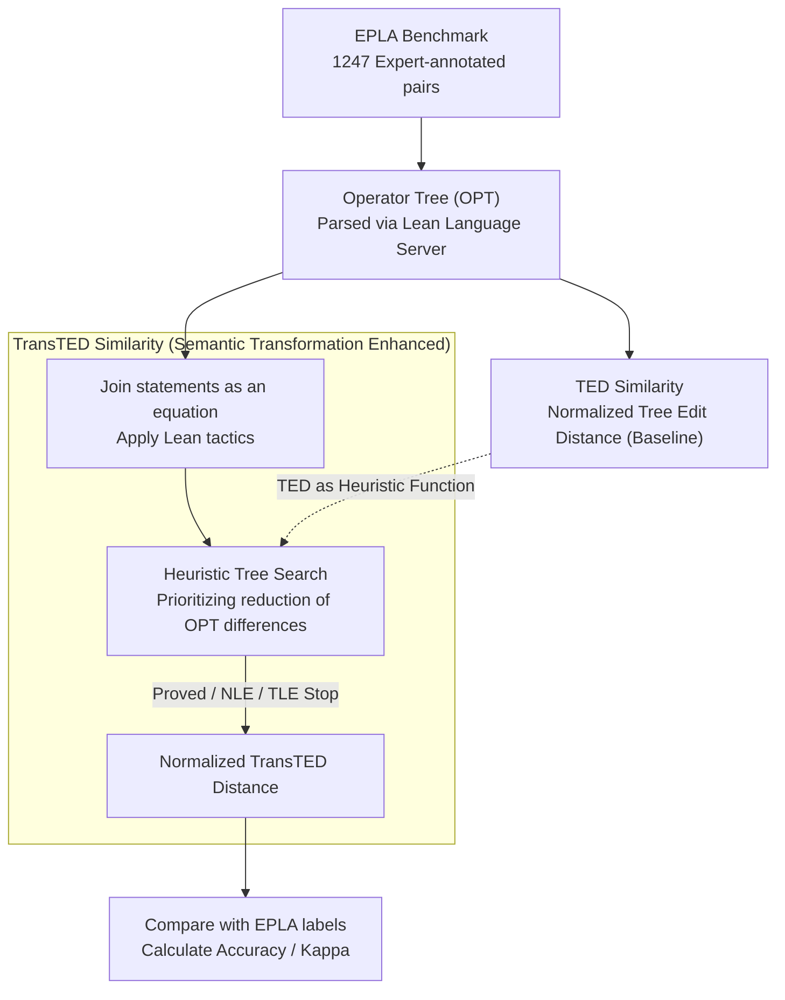

# ASSESS: A Semantic and Structural Evaluation Framework for Statement Similarity

**Conference**: ICLR 2026  
**arXiv**: [2509.22246](https://arxiv.org/abs/2509.22246)  
**Code**: [https://github.com/XiaoyangLiu-sjtu/ASSESS](https://github.com/XiaoyangLiu-sjtu/ASSESS)  
**Area**: Formal Mathematics / Evaluation Metrics  
**Keywords**: autoformalization, evaluation metrics, tree edit distance, Lean, formal mathematics

## TL;DR

Ours proposes the ASSESS framework, centered on the TransTED Similarity metric. By parsing formal mathematical statements into Operator Trees (OPT) and integrating Lean proof tactic-driven semantic transformations into the standard Tree Edit Distance (TED), the method achieves SOTA performance with 70.16% accuracy and a 0.35 Kappa score on the EPLA benchmark, while remaining reproducible using only CPU resources.

## Background & Motivation

**Background**: Autoformalization, the task of translating natural language mathematical statements into formal proof languages like Lean or Isabelle, has advanced rapidly with the development of LLMs. However, how to automatically evaluate translation quality remains a critical unresolved issue—a lack of reliable evaluation metrics significantly hinders progress in this field.

**Limitations of Prior Work**: Existing evaluation methods face a fundamental dilemma between semantics and structure. Text-based metrics (e.g., BLEU) rely solely on n-gram overlap, being sensitive to minor lexical changes while completely ignoring semantics—two semantically equivalent but syntactically different Lean expressions (e.g., $a+b$ and $b+a$) may receive very low BLEU scores. Proof-based metrics (e.g., BEq) attempt to determine similarity by automatically proving the equivalence of two statements, but they are overly strict—many highly similar but not perfectly equivalent statements are judged as dissimilar, and performance is limited by the current capabilities of theorem provers (leading to high false negative rates). LLM-as-Judge methods, while flexible, suffer from non-reproducibility, high computational costs, and the requirement for GPUs.

**Key Challenge**: The trade-off between semantic understanding and structural matching—metrics are either too loose (BLEU only looks at appearances) or too strict (BEq requires complete equivalence proofs), lacking fine-grained evaluation capabilities in the middle ground.

**Key Insight**: Formal mathematical statements can be parsed into Operator Trees (OPT), and tactic operations in Lean correspond to semantic-preserving transformations on these trees. Integrating semantic transformation information into the calculation of Tree Edit Distance introduces semantic awareness on top of structural matching—neither ignoring semantics like BLEU nor requiring absolute equivalence like proof methods.

**Core Idea**: Use semantic transformation-enhanced Tree Edit Distance (TransTED) to measure the similarity of formal statements, finding the optimal balance between purely structural and purely semantic approaches.

## Method

### Overall Architecture

ASSESS aims to solve the problem of "how similar two formal statements actually are"—it must not judge $a+b$ and $b+a$ as dissimilar like BLEU does based only on literals, nor should it discard "closely related but not identical" translations like BEq does when an equivalence proof fails. Its core is a measurement pipeline: first, each formal statement is parsed into an **Operator Tree (OPT)** using the Lean Language Server, converting symbol sequences into hierarchical trees; next, structural similarity is calculated as a baseline using standard **Tree Edit Distance (TED)**; finally, semantic transformations are injected into this distance via Lean tactics to obtain the real-valued **TransTED Similarity**. To verify the accuracy of this metric, the paper constructs the **EPLA Benchmark**—a set of expert-annotated pairs of formal statements used as the ground truth for comparing all metrics. The entire pipeline depends only on CPUs and the Lean Language Server/REPL, requiring no GPUs, thus ensuring reproducibility and low cost.

### Key Designs

**1. Operator Tree (OPT): Converting symbol sequences into structured trees**

Pure text representations lose the critical hierarchical information in formal statements—which symbols are operators, which are operands, and how operation precedence is nested. ASSESS uses the Lean Language Server to parse statements into OPTs: functions, quantifiers, and logical connectives become **internal nodes**, while their operands become ordered child nodes. Two standardizations are applied during construction: non-leaf nodes are unified with `<SLOT>` placeholder labels to distinguish operator positions from operands, and parentheses are omitted because precedence is already implied by the tree structure. The resulting trees encode operator precedence and dependencies more naturally than sequences, providing a foundation for structural comparison.

**2. TED Similarity: Measuring structural difference via Tree Edit Distance**

With trees available, structures can be compared. Here, all OPTs are treated as a **pseudometric space**—intentionally allowing $d(x,y)=0$ even if $x \neq y$, because two "semantically equivalent but syntactically different" trees should have a distance of 0. The tree edit distance $d_{\text{TED}}$ is defined as the minimum cost to transform one tree into another through deletion, insertion, and relabeling operations, which is then normalized into a similarity score:

$$\text{sim}_{\text{TED}}(T_1, T_2) = 1 - \frac{d_{\text{TED}}(T_1, T_2)}{\max(|T_1|, |T_2|)}$$

where $|T|$ is the number of nodes. While TED is sufficient for structural matching, it has systematic biases for semantically equivalent expressions: commutativity-equivalent expressions like $a+b$ and $b+a$ require several edit steps to align on a tree, resulting in an inflated distance—this is precisely the gap addressed in the next step.

**3. TransTED Similarity: Feeding semantic transformations into distance metrics via Lean tactics**

The core improvement is making the distance "understand" semantic equivalence. The paper defines a new pseudometric $d^*$ that must satisfy two constraints: (a) it is upper-bounded by TED, $d^*(T_1, T_2) \leq d_{\text{TED}}(T_1, T_2)$; (b) **Semantic Transformation Monotonicity**—if a statement pair $(e_x, e_y)$ can be transformed into a logically stronger pair $(e_u, e_v)$ (i.e., $e_u=e_v \Rightarrow e_x=e_y$), then $d^*(OPT(e_x), OPT(e_y)) \leq d^*(OPT(e_u), OPT(e_v))$. The paper proves that the unique largest pseudometric satisfying these conditions exists (Theorem 1), which is TransTED. For implementation: the pair of statements is joined by an equality sign into an equation, then a set of curated tactics (e.g., `rw?`, `apply congrArg`, `ext`, `norm_cast`) is applied within the Lean REPL for heuristic search. **TED is used as the heuristic function** to prioritize transformations that reduce the difference between the OPTs on both sides. Search stops under three conditions: equivalence is proved, node limit exceeded (NLE), or time limit exceeded (TLE). Thus, the distance metric "recognizes" semantic equivalences like commutativity or quantifier decomposition, gaining semantic awareness without losing structural information.

**4. EPLA Benchmark: Providing a yardstick for the evaluation metrics themselves**

To verify the quality of a similarity metric, a human-annotated "ground truth" is required. The paper constructs the EPLA (Evaluating Provability and Likeness for Autoformalization) benchmark. It takes natural language statements from miniF2F-test and ProofNet-test, generates formal translations using four models (Herald Translator, Goedel-Formalizer-V2-8B, Gemini-2.5-Pro, Qwen3-Max), filters them via the Lean compiler, and has seven experts annotate semantic equivalence and structural similarity pair-by-pair. This results in 1,247 annotated pairs (831 from miniF2F, 416 from ProofNet). This expert-labeled dataset serves as the judge for all subsequent metric comparisons.

## Key Experimental Results

### Main Results

| Metric | Identity Match | BLEU | Majority Voting | BEq | TED Sim | **TransTED Sim** |
|------|---------------|------|----------------|-----|---------|-----------------|
| miniF2F Accuracy | 32.61% | 68.96% | 46.93% | 59.45% | 69.56% | **70.16%** |
| miniF2F Kappa | 0.05 | 0.26 | 0.14 | 0.29 | 0.31 | **0.35** |
| ProofNet Accuracy | 43.51% | 57.21% | 54.57% | 60.34% | 64.67% | **67.31%** |
| ProofNet Kappa | 0.03 | 0.18 | 0.12 | 0.28 | 0.23 | **0.30** |

TransTED Similarity achieves SOTA performance in both Accuracy and Kappa scores across two datasets. Compared to BEq (a proof-based method), the Kappa score improves from 0.29 to 0.35 on miniF2F, indicating that semantic transformation-enhanced structural comparison balances precision and recall better than rigid proof methods.

### Ablation Study

| Configuration | miniF2F Acc | miniF2F Kappa | ProofNet Acc | ProofNet Kappa |
|------|------------|---------------|-------------|----------------|
| TED Similarity (No Trans.) | 69.56% | 0.31 | 64.67% | 0.23 |
| **TransTED Similarity (With Trans.)** | **70.16%** | **0.35** | **67.31%** | **0.30** |
| Gain | +0.60pp | +0.04 | +2.64pp | +0.07 |

The semantic transformation component is the key factor for performance gains, particularly on ProofNet where the Kappa score increases by 0.07, showing that transformations are more advantageous when dealing with complex mathematical statements.

### Key Findings

- **High Precision but Low Recall of Proof Methods (BEq)**: BEq achieves 98.60% precision on miniF2F but only 45.77% recall, indicating that automated theorem provers frequently judge valid equivalences as unequal. TransTED avoids this rigid dependence through progressive transformations.
- **Complementarity in Tactic Usage Patterns**: `rw?` and `norm_cast` are high-frequency general-purpose tools (exploring the search space), while `apply forall_congr; intro _` and `rw [propext and_imp]` are infrequent but high-adoption specialized tools (precisely solving specific logical structures). The synergy of general and specialized tactics forms a robust search strategy.
- **Stability of TransTED across Thresholds**: Compared to BLEU, which is sensitive to threshold selection, TransTED maintains high performance across a wide range of threshold intervals.

## Highlights & Insights

- **Mathematical Elegance of Pseudometric Spaces**: Allowing $d(x,y)=0$ when $x \neq y$ exactly corresponds to the core requirement of "semantically equivalent but syntactically different" in formal mathematics, making it more suitable than strict metric space requirements.
- **Lean Tactics as Semantic Bridges**: Cleverly utilizes the proof assistant's own tactic system as a semantic transformation engine—no model training or GPUs required, only the Lean Language Server and a curated set of tactics, achieving efficient and reproducible semantic awareness.
- **Unity of Search Heuristics and Metrics**: Using TED simultaneously as a component of the final metric and as a heuristic function for the search process creates a concise design—transformations that reduce TED are meaningful semantic equivalence steps.

## Limitations & Future Work

- **Limited Tactic Set**: Only a small set of manually curated tactic commands are currently used, covering a limited range of semantic transformation types. More Lean tactics or custom transformation rules could further improve performance.
- **Search Efficiency**: Evaluation of a single statement pair can take up to 10 minutes of search time, which may become a bottleneck for large-scale applications.
- **TransTED as an Upper Bound**: Since the actual set of transformations is finite, the calculated value is an upper bound of the theoretical optimal TransTED. The distance is exactly 0 only when the transformation sequence successfully proves equivalence.
- **Limited Scale of EPLA**: While 1,247 pairs are meticulously annotated, they may lack depth in diversity and coverage—natural extensions include supporting broader mathematical domains and more formal languages.

## Related Work & Insights

- **vs BLEU**: BLEU treats formal statements as plain text, completely ignoring mathematical semantics. TransTED introduces semantic awareness while retaining structural matching, improving the Kappa on EPLA from 0.26 to 0.35.
- **vs BEq (Proof-based)**: BEq requires a successful proof of total equivalence, representing an "all-or-nothing" evaluation. TransTED provides continuous similarity scores, better suited for evaluating the quality gradients of "nearly correct" translations.
- **vs GTED (Liu et al., 2025c)**: GTED was the first work to use Operator Trees for formal evaluation, but it suffered from implementation instability and a transformation mechanism limited to variable renaming. ASSESS formalizes this into a rigorous pseudometric space theory and introduces a rich set of proof-based transformations.

## Rating

- Novelty: ⭐⭐⭐⭐ Using the Lean tactic system as a semantic transformation engine within Tree Edit Distance is a clever innovation; the pseudometric space theoretical framework is also elegant.
- Experimental Thoroughness: ⭐⭐⭐⭐ Rich baselines, solid ablation analysis, and insightful tactic patterns; however, the EPLA scale is relatively small.
- Writing Quality: ⭐⭐⭐⭐ Theoretical parts are clearly formalized, and the experimental sections are well-organized.
- Value: ⭐⭐⭐⭐ Provides a more reliable, efficient, and reproducible evaluation tool for the autoformalization community.

<!-- RELATED:START -->

## Related Papers

- [\[ICML 2025\] KELPS: A Framework for Verified Multi-Language Autoformalization via Semantic-Syntactic Alignment](../../ICML2025/multilingual_mt/kelps_a_framework_for_verified_multi-language_autoformalization_via_semantic-syn.md)
- [\[ACL 2026\] Beyond Literal Mapping: Benchmarking and Improving Non-Literal Evaluation Evaluation](../../ACL2026/multilingual_mt/beyond_literal_mapping_benchmarking_and_improving_non-literal_translation_evalua.md)
- [\[ACL 2025\] Statement-Tuning Enables Efficient Cross-lingual Generalization in Encoder-only Models](../../ACL2025/multilingual_mt/statement-tuning_enables_efficient_cross-lingual_generalization_in_encoder-only_.md)
- [\[ACL 2026\] Reinforcement Learning with Semantic Rewards Enables Low-Resource Language Expansion without Alignment Tax](../../ACL2026/multilingual_mt/reinforcement_learning_with_semantic_rewards_enables_low-resource_language_expan.md)
- [\[ACL 2026\] FairQE: Multi-Agent Framework for Mitigating Gender Bias in Translation Quality Estimation](../../ACL2026/multilingual_mt/fairqe_multi-agent_framework_for_mitigating_gender_bias_in_translation_quality_e.md)

<!-- RELATED:END -->
