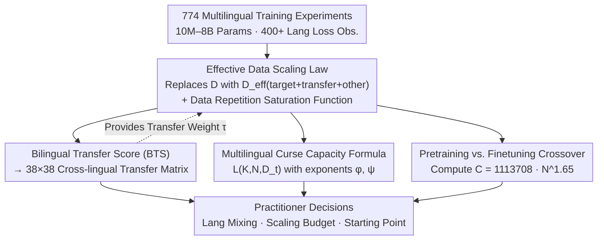

# ATLAS: Adaptive Transfer Scaling Laws for Multilingual Pretraining, Finetuning, and Decoding the Curse of Multilinguality

**Conference**: ICLR 2026  
**arXiv**: [2510.22037](https://arxiv.org/abs/2510.22037)  
**Code**: Not open sourced  
**Area**: Multilingual Translation  
**Keywords**: scaling laws, multilingual, cross-lingual transfer, curse of multilinguality, pretraining vs finetuning

## TL;DR
This paper proposes the Adaptive Transfer Scaling Law (ATLAS), which decomposes the effective data volume into three terms: target language, transfer languages, and other languages, while introducing a data repetition saturation function. Validated across 774 multilingual training experiments (10M–8B parameters, 400+ languages), ATLAS significantly outperforms existing scaling laws (multilingual $R^2$ improved from 0.67 to 0.98). It systematically quantifies the cross-lingual transfer matrix, the capacity constraints of the "curse of multilinguality," and the compute crossover point between pretraining and finetuning.

## Background & Motivation

### Limitations of Prior Work
Scaling laws research has focused almost exclusively on English. The Chinchilla Scaling Law (CSL) models the impact of model size $N$ and data volume $D$ on loss using two power-law terms but suffers from several flaws:

**Inability to model data repetition**: Data for low-resource languages (e.g., Hindi, Swahili) is extremely limited, requiring multiple repetitions during training. CSL cannot model the diminishing returns of such repetitions.

**Neglect of cross-lingual transfer**: Monolingual scaling laws only account for the token count of the target language, failing to exploit the positive or negative transfer effects from other languages.

The **Data-Constrained Scaling Law (DCSL)** considers data repetition but requires a large number of observations both "before 1 epoch" and "after 1 epoch" for its two-stage fitting. Collecting data beyond 1 epoch for high-resource languages (English, French) is costly, while low-resource languages may not even have sufficient observations before reaching 1 epoch.

### Goal
Developers of multilingual models face three core questions that lack systematic answers:
- What are the transfer relationships between different languages? Which pairs are mutually beneficial, and which cause interference?
- How much must compute resources increase when expanding the number of languages served by a model? (Quantitative characterization of the "curse of multilinguality")
- Given a compute budget, is it more efficient to pretrain from scratch or finetune from a multilingual checkpoint?

## Method

### Overall Architecture
ATLAS is not a new training algorithm but a family of fittable scaling laws. It follows the Chinchilla loss form but replaces the "data volume" term with an **effective data volume** $\mathcal{D}_{\text{eff}}$ that is aware of multilingual structures and incorporates a saturation function for data repetition. From the same experimental data, three downstream tools are derived: a cross-lingual transfer matrix based on bilingual transfer scores, a capacity formula for the curse of multilinguality, and a crossover formula for pretraining vs. finetuning. The input to the method is loss observations from 774 training experiments, and the output is a set of fitting parameters with physical meanings, allowing practitioners to determine language mixing, scaling budgets, and training starting points. The transfer matrix also provides empirical values for the transfer weight $\tau$ in the effective data volume formula, linking the three tools under a unified scaling law family.

### Key Designs

**1. Effective Data Decomposition and Saturation Function: Enabling Scaling Laws to Perceive Transfer and Repetition**

In the Chinchilla core formula $\mathcal{L}(N, D) = E + A/N^\alpha + B/D^\beta$, $D$ can only represent the token count of the target language. Consequently, it ignores cross-lingual transfer and assumes every token is fresh, overestimating the value of repeated data in low-resource settings. ATLAS replaces $D$ with the effective data volume $\mathcal{D}_{\text{eff}}$, resulting in $\mathcal{L}(N, \mathcal{D}_{\text{eff}}) = E + A/N^\alpha + B/\mathcal{D}_{\text{eff}}^\beta$. $\mathcal{D}_{\text{eff}}$ is decomposed into three semantically clear sources: the target language’s own data, languages that provide transfer, and all other languages bundled together:

$$\mathcal{D}_{\text{eff}} = \underbrace{\mathcal{S}_{\lambda_t}(D_t; U_t)}_{\text{Target}} + \underbrace{\sum_{i \in \mathcal{K}} \tau_i \mathcal{S}_{\lambda_i}(D_i; U_i)}_{\text{Transfer}} + \underbrace{\tau_{\text{other}} \mathcal{S}_{\lambda_{\text{other}}}(D_{\text{other}}; U_{\text{other}})}_{\text{Other}}。$$

Each term carries a transfer weight $\tau$ (where $\tau_i$ for transfer languages is provided by the transfer matrix) and a saturation parameter $\lambda$, allowing the model to distinguish which data actually helps and by how much. The $\mathcal{S}_\lambda(D; U)$ term is the saturation function for data repetition:

$$\mathcal{S}_\lambda(D; U) = \begin{cases} D, & D \leq U \ (\le 1\ \text{epoch}) \\ U\left[1 + \dfrac{1 - \exp(-\lambda(D/U - 1))}{\lambda}\right], & D > U \ (> 1\ \text{epoch}) \end{cases}$$

Here, $U$ is the number of unique tokens, and $\lambda$ is a repetition decay coefficient shared across languages. Valid data grows linearly within the first epoch and enters exponential saturation once $D > U$. Unlike DCSL, this function is continuous and fittable in a single stage, making it applicable to low-resource languages that lack enough data for a full epoch. This "decomposition + saturation" approach is the key innovation, raising the multilingual $R^2$ from 0.67 to 0.98.

**2. Bilingual Transfer Score (BTS): Quantifying "Language A Helping B"**

To characterize transfer, ATLAS defines the Bilingual Transfer Score (BTS) to measure the influence of source language $s$ on target language $t$:

$$\text{BTS}_{s \to t} = -\frac{\sigma_{\text{bi}}(L_t(d_{\text{mono}})) - 2d_{\text{mono}}}{d_{\text{mono}}},$$

where $d_{\text{mono}}$ is the preset target steps (42B tokens), and $\sigma_{\text{bi}}$ is the number of tokens a bilingual model requires to reach the same loss as a monolingual model. Intuitively, if a bilingual model reaches the monolingual performance level with fewer tokens, BTS is positive; if it takes more, BTS is negative. BTS=0 implies no transfer. The authors measured BTS for 80 pairs and extrapolated the rest ($R^2 = 0.85$) to create a $38 \times 38$ matrix, which serves as the empirical source for $\tau_i$.

**3. Multilingual Curse Capacity Formula: Evaluating Expansion Costs**

The "curse of multilinguality"—where performance per language degrades as more languages are supported—is essentially a dilution of finite capacity. ATLAS explicitly writes the loss of a single target language as a function of the number of languages $K$, model size $N$, and target data $D_t$:

$$L(K, N, D_t) = L_\infty + A \frac{K^\phi}{N^\alpha} + B \frac{K^\psi}{D_t^\beta}。$$

Two new exponents are introduced: $\phi > 0$ indicates that increasing $K$ adds pressure to the model capacity term (the source of the curse), while $\psi < 0$ suggests positive transfer, where the data required per language grows sublinearly (mitigating the curse). When $K=1$, the formula reverts to Chinchilla. Once $\phi$ and $\psi$ are fitted, practitioners can calculate "iso-loss" rules for budget increases.

**4. Pretraining vs. Finetuning Crossover: Optimal Training Starting Points**

This tool addresses whether it is more compute-efficient to pretrain from scratch or finetune from a multilingual checkpoint. By plotting loss curves for both approaches, the authors identified a crossover point. Finetuning is superior initially, but pretraining from scratch overtakes it after approximately 144B–283B tokens. This crossover compute $C$ follows a power law with model size $N$: $C = 113708 \times N^{1.65}$. Larger models have later crossover points, meaning the cost-effectiveness window for starting from an existing checkpoint is longer.

## Key Experimental Results

### Experimental Scale
- **774 independent training experiments** using the MADLAD-400 dataset (400+ languages).
- Model Scale: 10M–8B parameters, 20 scale levels.
- 280 monolingual models + 240 bilingual models + 120 multilingual mixtures + 134 finetuning models.
- Evaluation of vocabulary-insensitive loss across 48 languages.

### Scaling Law Fitting Quality (Table 1)

| Scaling Law | $R^2$ (Overall) | $R^2(N)$ | $R^2(D)$ | $R^2(C)$ | $R^2(M)$ |
|-------------|-----------------|----------|----------|----------|----------|
| Chinchilla (Multilingual) | 0.64 | -0.99 | 0.72 | 0.66 | 0.61 |
| Multilingual SL (He et al.) | 0.67 | -0.65 | 0.73 | 0.67 | 0.70 |
| **ATLAS (Full)** | **0.98** | **0.89** | **0.96** | **0.98** | **0.82** |

ATLAS significantly exceeds previous methods in generalization $R^2$ across all dimensions in multilingual settings, particularly improving the $R^2(N)$ for extrapolation to the largest models from -0.99 to 0.89.

### Key Findings in Cross-lingual Transfer
- **English is the most universal positive transfer source**, ranked in the top 5 most helpful sources for 19 out of 30 target languages.
- French (16/30), Spanish (13/30), and Hebrew (11/30) follow.
- **Language pairs with the same writing system** have a mean BTS of -0.23 versus -0.39 for different systems ($p < .001$).
- Transfer is **asymmetric**: the global Pearson correlation $r = -0.11$, meaning "A helping B" does not imply "B helps A."
- Pairs sharing the same family and script (e.g., French-Spanish, Russian-Ukrainian) are highly symmetric; those differing in both (e.g., Chinese-Persian) are highly asymmetric.

### Key Findings in the Curse of Multilinguality
- Fitted values: $\phi = 0.11$ (moderate capacity curse), $\psi = -0.04$ (slight positive transfer).
- **Compute budget for language expansion**: Scaling from $K$ to $r \cdot K$ languages requires the compute budget to scale by $C \cdot r^{0.97}$.
- Expanding to $4K$ languages requires a 2.74x increase in total tokens and a 1.4x increase in model size.
- Increasing model size $N$ is more effective at mitigating the curse than increasing data volume $D$ ($|\partial S / \partial \log N| > |\partial S / \partial \log D|$).

### Pretraining vs. Finetuning
- For a 2B parameter model, finetuning a Unimax checkpoint is more efficient within 144B–283B tokens.
- Beyond this threshold, pretraining from scratch is superior.
- English reaches the crossover point earliest (due to its low 5% sampling ratio in Unimax).

## Highlights & Insights

1. **Effective data decomposition as a key innovation**: Splitting data into target, transfer, and other terms allows precise capture of contributions. This simple change drives $R^2$ from 0.67 to 0.98.
2. **Value of the transfer matrix**: The 1444 language-pair scores are a major empirical resource for guiding language mixing strategies.
3. **Actionable formulas for the multilingual curse**: The iso-loss formula provides a clear budget planning tool for expanding language coverage.
4. **Writing systems outweigh language families**: Shared scripts have a greater impact on transfer than shared language families, suggesting subword vocabulary sharing is a primary mechanism for positive transfer.
5. **Transfer asymmetry**: This warns against assuming reciprocal benefits and emphasizes the need for empirical measurement.

## Limitations & Future Work

1. **Evaluation limited to perplexity**: All experiments measure vocabulary-insensitive loss; predictive power for downstream tasks (translation, QA) is not yet verified.
2. **Single data source**: Only MADLAD-400 (CommonCrawl) was used; different domains or data qualities may alter transfer relationships.
3. **Uniform sampling assumption**: The multilingual curse model assumes uniform sampling, whereas real deployments often use non-uniform distributions.
4. **Unimax checkpoint specificity**: The crossover point depends on the specific base model's training mixture and duration.
5. **Model size dependence of the transfer matrix**: BTS was measured at 2B; transfer relationships may shift at different scales.
6. **Underrepresentation of low-resource languages**: While covering 400+ languages, deep analysis remains focused on roughly 50.

## Related Work & Insights

| Method | Core Idea | Key Differences from ATLAS |
|------|---------|-----------------|
| **Chinchilla** (Hoffmann 2022) | Monolingual $L = E + A/N^\alpha + B/D^\beta$ | No support for repetition or cross-lingual transfer |
| **DCSL** (Muennighoff 2024) | Data repetition awareness, two-stage fitting | Requires extensive epoch-specific observations |
| **MSL** (He 2024) | Modeling via language family sampling ratios | Only groups by family; ATLAS learns per-language weights |
| **BiMix** (Ge 2024) | Bivariate data mixing scaling law | Focused on English domains, not multilingual |
| **Llama-3** (Dubey 2024) | Brief mention of multilingual scaling laws | Shallow analysis; only 8% non-English tokens |

ATLAS's core advantages include its (1) unified single-stage fitting, (2) fine-grained cross-lingual transfer modeling, and (3) its status as the largest multilingual scaling experiment to date.

## Rating
- Novelty: ⭐⭐⭐⭐ The decomposition and saturation design is elegant; the curse and transfer modeling are major contributions.
- Experimental Thoroughness: ⭐⭐⭐⭐⭐ Unprecedented scale with 774 experiments across 400+ languages.
- Writing Quality: ⭐⭐⭐⭐ Clear structure and comprehensive derivations.
- Value: ⭐⭐⭐⭐⭐ Practical engineering guidance for multilingual training budgets and strategies.

<!-- RELATED:START -->

## Related Papers

- [\[NeurIPS 2025\] Zero-Shot Performance Prediction for Probabilistic Scaling Laws](../../NeurIPS2025/multilingual_mt/zero-shot_performance_prediction_for_probabilistic_scaling_laws.md)
- [\[ICLR 2026\] Language Confusion Gate: Language-Aware Decoding Through Model Self-Distillation](language_confusion_gate_language-aware_decoding_through_model_self-distillation.md)
- [\[ICLR 2026\] From Utterance to Vividity: Training Expressive Subtitle Translation LLM via Adaptive Local Preference Optimization](from_utterance_to_vividity_training_expressive_subtitle_translation_llm_via_adap.md)
- [\[ICLR 2026\] SASFT: Sparse Autoencoder-guided Supervised Finetuning to Mitigate Unexpected Code-Switching in LLMs](sasft_sparse_autoencoder-guided_supervised_finetuning_to_mitigate_unexpected_cod.md)
- [\[ICLR 2026\] Multilingual Routing in Mixture-of-Experts](multilingual_routing_in_mixture-of-experts.md)

<!-- RELATED:END -->
