# DiscoX: Benchmarking Discourse-Level Translation in Expert Domains

**Conference**: ICLR 2026  
**OpenReview**: [https://openreview.net/forum?id=OTCfZ6h8Pe](https://openreview.net/forum?id=OTCfZ6h8Pe)  
**Code**: [https://github.com/ByteDance-Seed/DiscoX](https://github.com/ByteDance-Seed/DiscoX)  
**Area**: Multilingual Machine Translation / Evaluation Benchmark  
**Keywords**: Discourse-level translation, Expert domain translation, ZH-EN translation, LLM-as-a-judge, Reference-free evaluation, Benchmark  

## TL;DR
DiscoX constructs the first benchmark for **discourse-level + expert-level** ZH-EN translation (200 articles, average 1712 tokens, 7 domains, 1330 person-hours of manual refinement) and proposes a multi-agent reference-free evaluation system Metric-S, revealing a significant gap where even the strongest LLM (GPT-5-high: 76.66) still lags behind human experts (80.16).

## Background & Motivation
- **Background**: With the progress of LLMs, segment-level translation has approached human levels. Mainstream benchmarks like WMT, FLORES, and Redtrans Bench remain at the granularity of "translating one or a few sentences at a time," with an average text length of only 45–60 tokens.
- **Limitations of Prior Work**: Translation in expert domains (scientific papers, legal contracts, technical manuals) requires **global coherence** and **strict terminology precision**. Existing benchmarks neither examine a model's ability to maintain discourse-level consistency nor its capacity to handle dense professional terminology and meet expert stylistic standards. Moreover, traditional reference-based metrics (BLEU/COMET) become ineffective for long texts, and single-LLM judgments are unreliable.
- **Key Challenge**: The real demand for discourse-level + expert-level translation $\leftrightarrow$ Evaluation systems that remain stuck at the segment level, are reference-dependent, and lack interpretability.
- **Goal**: Provide a ZH-EN translation benchmark capable of strictly evaluating "discourse coherence + terminology precision + stylistic appropriateness," accompanied by an automated evaluation system highly consistent with human judgment.
- **Core Idea**: **Data side**—Refine 200 long articles using a three-stage "annotation $\rightarrow$ difficulty filtering $\rightarrow$ expert selection" pipeline involving 133 experts, providing rubrics (verifiable scoring points) for each. **Evaluation side**—Decompose "LLM-as-a-judge" into a multi-agent workflow (instruction check $\rightarrow$ 3D quality estimation $\rightarrow$ error de-duplication/attribution $\rightarrow$ hierarchical weighted scoring) to achieve reference-free, interpretable, grain-level scoring.

## Method

### Overall Architecture
DiscoX consists of two parts: (1) A discourse-level expert translation test set of 200 articles (including rubrics for each) constructed through a three-stage expert pipeline; (2) A matching reference-free evaluation system, Metric-S, which provides final scores following a workflow of "Instruction following check $\rightarrow$ 3D quality estimation (Accuracy/Fluency/Appropriateness) $\rightarrow$ Hierarchical error de-duplication $\rightarrow$ Weighted scoring."

```mermaid
flowchart LR
    A[Source Collection<br/>≥1500 words, Professional] --> B[Expert Annotation<br/>+ rubric points]
    B --> C[Difficulty Filtering<br/>2 SOTA LLMs fail ≥8 rubrics]
    C --> D[Expert Selection 200<br/>~30% selection rate]
    D --> E[Metric-S Evaluation]
    E --> E1[Instruction Check]
    E1 --> E2[3D Quality Estimation<br/>Acc/Flu/App]
    E2 --> E3[Hierarchical De-duplication]
    E3 --> E4[Weighted Scoring]
```

### Key Designs
**1. Three-stage Expert Construction Pipeline: Ensuring benchmark challenge through "Difficulty Filtering."** The 200 articles in DiscoX were not sampled randomly but were the product of 1330 person-hours from 133 experts (115 domain experts + 18 linguistic experts). In the first stage, domain experts collected texts that met three conditions: "real professional scenarios / ZH ≥1500 characters or EN ≥1500 words / self-consistent with unambiguous rubrics." They provided an average of 9.38 rubric points per article (covering grammar, keywords, terminology, and culture-loaded words), resulting in 665 candidates. The second stage is the core difficulty filter: each task was tested with two SOTA LLMs. **A task only advanced if both models failed on at least 8 predefined rubric points**, thereby locking the benchmark onto truly difficult samples. In the third stage, experts selected 200 articles from the filtered pool (approx. 30% selection rate) and revised the source texts and rubrics based on error patterns observed during filtering. The final dataset spans academic (121) and non-academic (79) domains across 7 sub-domains, covering both EN $\rightarrow$ ZH and ZH $\rightarrow$ EN, with an average length of 1712.17 tokens—roughly 30 times longer than typical segment-level benchmarks.

**2. Metric-S Multi-agent 3D Quality Estimation: Breaking down translation quality into an attributable error list.** Evaluation no longer produces a vague score. First, an **Instruction Follower** filters invalid outputs—LLMs often degenerate into continuation or summarization in long-form translation; any output that is not a valid translation is penalized with a zero score. Translations that pass are reviewed by judges in three dimensions: Accuracy (focusing on omissions, untranslated parts, mistranslations, and over-translations, while incorporating mandatory rubric checks from the annotation stage), Fluency (language smoothness, lexical consistency, and logical coherence from a native speaker's perspective), and Appropriateness (culture-loaded expressions, stylistic features, and preservation of sentiment/literary tone). Each judge outputs a specific list of errors with severity labels rather than a global score.

**3. Hierarchical Error De-duplication and Attribution: Avoiding double-counting for a single root cause.** In multi-dimensional evaluation, a single root error may derive multiple surface issues (e.g., a word choice error causing both a semantic error and disfluency). Metric-S uses hierarchical de-duplication to ensure "one error is penalized only once": Accuracy errors labeled "Extremely Critical" have the highest priority. Rubric violations are uniformly attributed to Accuracy. Other overlaps are resolved by causal analysis—if a word choice error leads to disfluency, the Accuracy error is kept and the Fluency manifestation is discarded.

**4. Hierarchical Weighted Scoring: Quantifying expert-level quality via deduction from a full score.** The final score is defined as the sum of three dimensions $\text{Score} = S_{\text{Acc}} + S_{\text{Flu}} + S_{\text{App}}$, where each dimension subtracts weighted de-duplicated errors from a maximum: $S_x = \text{MAX}_x - \sum_{i=1}^{N_x} w_i^x e_i^x$. The maximum scores for the three dimensions are 60 / 20 / 20, reflecting the priority of accuracy in expert translation. Deductions are scaled by severity: minor −2, major −5, critical −10, extremely critical −50, and rubric violations −5 each. This design makes the score interpretable (showing exactly where and how much was deducted) while maintaining a unified scale across domains.

## Key Experimental Results

### Main Results
Covering 20 systems (7 open-source LLMs, 11 closed-source LLMs, 1 domain-specific LLM, 1 NMT), using Gemini-2.5-Pro as the Metric-S judge (Total 100: Acc 60 / Flu 20 / App 20):

| Model | Overall | Accuracy | Fluency | Appropriateness |
|------|---------|----------|---------|-----------------|
| **Human Expert** | **80.16** | 49.80 | 15.96 | 14.40 |
| GPT-5-high | 76.66 | 48.65 | 15.21 | 12.80 |
| Gemini-2.5-Pro | 71.25 | 46.68 | 13.14 | 11.43 |
| Qwen-3-235B | 59.66 | 33.15 | 14.96 | 11.55 |
| Kimi-K2 | 55.80 | 27.63 | **16.44** | 11.73 |
| o3-high | 55.57 | 28.78 | 15.79 | 11.00 |
| Claude-4 | 54.04 | 39.38 | 5.98 | 8.68 |
| GPT-4o | 39.93 | 20.35 | 11.28 | 8.30 |

### Evaluation System Consistency

| Metric | Consistency with Human Judgment (DiscoX) |
|------|---------------------------|
| **Metric-S (Ours)** | **70.3%** |
| XCOMET-QE | 34.7% |

### Key Findings
- **Strongest LLMs Still Lag Behind Humans**: The top-ranked GPT-5-high (76.66) leads in accuracy but still trails behind human experts (80.16), proving DiscoX is a realistic and difficult "expert translation stress test."
- **Imbalance in Dimensional Capabilities**: No model achieved balanced performance across all three dimensions—GPT-5 excelled in accuracy, while Kimi-K2 led in fluency and appropriateness. The Claude-4 series was accurate but performed poorly in fluency (only 5.98), reflecting complementary capability profiles among models.
- **Metric-S Far Outperforms Existing Reference-free Metrics**: The 70.3% human consistency is significantly higher than XCOMET-QE's 34.7%, validating the effectiveness of the multi-agent workflow and hierarchical de-duplication.
- **General LLMs Outperform Traditional MT**: General-purpose LLMs clearly surpassed traditional NMT systems, though a visible gap remains compared to expert standards.

## Highlights & Insights
- **"Difficulty Filtering" is Key to Benchmark Durability**: Using the threshold of "two SOTA models failing on $\ge 8$ rubrics" ensures the benchmark will not be easily saturated, providing more reliability than samples selected purely by human intuition of "difficulty."
- **Rubrics Turn Subjective Evaluation into Verifiable Checklists**: Solidifying requirements for specific terms into checkpoints (e.g., *yuanzi* must be translated as "Ditan Park" instead of "garden") provides an objective anchor for long-text translation evaluation.
- **De-duplication Solves the Pain Point of Multi-dim Evaluation**: Adding errors from three dimensions directly would double-penalize the same root cause. Hierarchical attribution (Accuracy precedence, rubrics assigned to Accuracy, causal root determination) is an engineering nuance that makes scores fair and credible.
- **Error-level Interpretability**: Metric-S produces a list of errors with severity rather than a black-box score, naturally supporting fine-grained analysis of model strengths and weaknesses.

## Limitations & Future Work
- **ZH-EN Coverage Only**: As the "first" such benchmark, it focuses on ZH $\leftrightarrow$ EN and has not yet expanded to other language pairs, where discourse or terminology difficulties may vary.
- **Judge Dependency on Strong Models**: Metric-S relies on Gemini-2.5-Pro/Gemini-3-Pro as judges, making evaluation costly and its upper bound constrained by the judge model's capabilities; the 70.3% consistency still has room for improvement.
- **Relatively Small Scale**: While 200 selected samples ensure high quality, the small sample size limits statistical power in distinguishing subtle differences between models.
- **Extremely High Construction Cost**: The pipeline involving 1330 person-hours and 133 experts is difficult to replicate at low cost or expand rapidly to new domains or language pairs.

## Related Work & Insights
- **Comparison with Segment-level Benchmarks**: Compared to WMT, FLORES, and Redtrans Bench (avg. 45–60 tokens), DiscoX differentiates itself through 1712-token long texts + expert domains + a matching reference-free interpretable metric.
- **Comparison with Reference-free Neural Metrics**: The low consistency (34.7%) of neural quality estimation metrics like XCOMET-QE on long texts indicates that decomposing evaluation into a multi-agent workflow is an effective paradigm for long-form evaluation.
- **Insights**: The paradigm presented here (rubric-based scoring points + difficulty filtering for benchmarking + multi-agent de-duplicated evaluation) can be migrated to other generation tasks involving "long text + professional domain + difficulty in reference-based measurement," such as long-form writing, professional QA, and report generation.

## Rating
- **Novelty**: ⭐⭐⭐⭐ First discourse-level + expert-level ZH-EN benchmark; the proposed multi-agent de-deduplication reference-free evaluation system offers clear engineering and methodological innovation.
- **Experimental Thoroughness**: ⭐⭐⭐⭐ Covers 20 systems, includes human expert baselines, and compares consistency across multiple metrics with clear dimension decomposition. Deducted for being limited to ZH-EN and a sample size of 200.
- **Writing Quality**: ⭐⭐⭐⭐ Logical flow from motivation to construction to evaluation and experiments; high-quality diagrams and pipeline descriptions.
- **Value**: ⭐⭐⭐⭐ Provides a credible stress test and evaluation yardstick for "expert-level machine translation," offering direct reference value for future LLM translation evaluation practices.

<!-- RELATED:START -->

## Related Papers

- [\[ACL 2026\] Beyond Literal Mapping: Benchmarking and Improving Non-Literal Translation Evaluation](../../ACL2026/multilingual_mt/beyond_literal_mapping_benchmarking_and_improving_non-literal_translation_evalua.md)
- [\[ACL 2026\] XQ-MEval: A Dataset with Cross-lingual Parallel Quality for Benchmarking Translation Metrics](../../ACL2026/multilingual_mt/xq-meval_a_dataset_with_cross-lingual_parallel_quality_for_benchmarking_translat.md)
- [\[ACL 2025\] Memorization Inheritance in Sequence-Level Knowledge Distillation for Neural Machine Translation](../../ACL2025/multilingual_mt/memorization_inheritance_seqkd.md)
- [\[ACL 2025\] MiLiC-Eval: Benchmarking Multilingual LLMs for China's Minority Languages](../../ACL2025/multilingual_mt/milic-eval_benchmarking_multilingual_llms_for_chinas_minority_languages.md)
- [\[ACL 2025\] Probing LLMs for Multilingual Discourse Generalization Through a Unified Label Set](../../ACL2025/multilingual_mt/probing_llms_for_multilingual_discourse_generalization_through_a_unified_label_s.md)

<!-- RELATED:END -->
