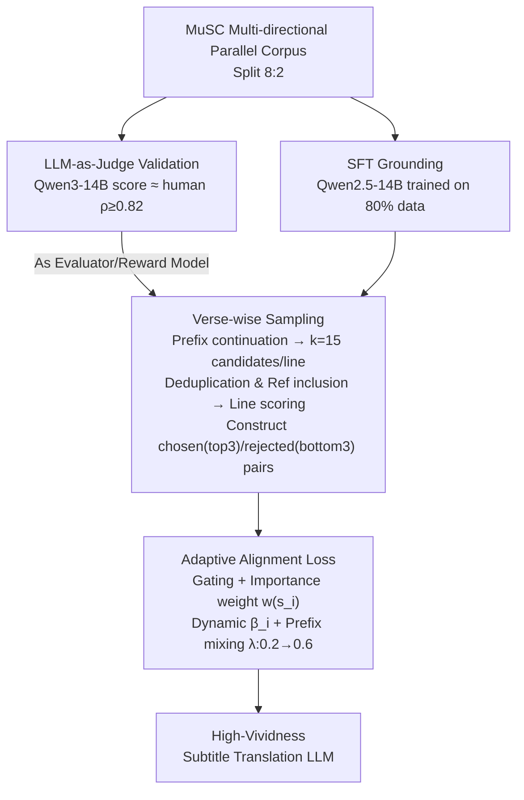

# From Utterance to Vividity: Training Expressive Subtitle Translation LLM via Adaptive Local Preference Optimization

**Conference**: ICLR 2026  
**arXiv**: [2602.01068](https://arxiv.org/abs/2602.01068)  
**Code**: [GitHub](https://github.com/CcQunResearch/ALPO)  
**Area**: LLM Alignment/NLP  
**Keywords**: Subtitle Translation, Preference Optimization, LLM-as-Judge, Free Translation, Process Supervision

## TL;DR
This paper proposes ALPO (Adaptive Local Preference Optimization) for training expressive subtitle translation LLMs. Empirical findings show that subtitle translation favors free translation and that reasoning-based LLMs outperform chat-based LLMs in paraphrasing capability. After verifying that LLMs as translation evaluators are highly consistent with humans, the authors propose a fine-grained process-supervised preference alignment method (adaptive weighting + dynamic beta + prefix mixing). The 14B model exceeds SOTA models like GPT-4o and DeepSeek-R1 in translation vividness across multiple language directions.

## Background & Motivation

**Background**: LLMs have approached human levels in general translation, but significant deficiencies remain in customized translation for vertical domains (legal, medical, subtitles). Subtitle translation requires localized free translation to convey the atmosphere, emotion, and tone of the source text, yet LLMs tend toward literal translation.

**Limitations of Prior Work**: (1) LLMs achieve high accuracy but lack expressiveness/vividness; (2) Subtitle translation requires fine-grained alignment at the verse level, whereas PPO/DPO are outcome-supervised and optimize only the complete output—this granularity is too coarse and suffers from gradient dilution; (3) There is a lack of evaluation systems and training data for subtitle translation.

**Key Challenge**: The input for subtitle translation consists of multiple lines (with context dependencies), but each line requires independent fine-grained preference alignment. This is a "local preference optimization" problem to which existing methods like DPO are not directly applicable.

**Goal**: (a) Verify whether LLMs can reliably evaluate subtitle translation quality (replacing expensive human evaluation); (b) Design a fine-grained preference optimization method for LLMs to learn free translation capabilities; (c) Construct multi-directional subtitle parallel corpora.

**Key Insight**: Three empirical findings drive the design: (1) Subtitle translation has the lowest back-translation consistency, indicating the highest degree of free translation; (2) Reasoning LLMs (R1/GPT-o1) possess superior free translation capabilities compared to chat LLMs (GPT-4o/Qwen-Max); (3) A 14B model as an evaluator achieves Spearman correlation $\geq 0.82$ with humans, serving as a low-cost reward model.

**Core Idea**: Utilize process-supervised DPO with verse-wise sampling, LLM scoring, and adaptive weighting to achieve fine-grained vividness alignment for subtitle translation.

## Method

### Overall Architecture
The core problem ALPO addresses is that while subtitle translation inputs are multi-line segments (with inter-line context dependencies), the alignment of "vividness" must be applied to every single line. This is a "local preference optimization" problem not directly handled by standard DPO. The pipeline is built on a prerequisite: validating that a 14B model's scoring approximates human judgment to serve as a low-cost reward model. With this, the remaining two stages proceed automatically: first, supervised fine-tuning (SFT) is performed on a Qwen2.5-14B base using 80% of the MuSC parallel corpus; then, ALPO preference alignment is conducted on the remaining 20%. The ALPO mechanism involves "sampling multiple candidate translations per line → scoring line-by-line via the evaluator → constructing chosen/rejected preference pairs per line → performing weighted fine-grained DPO," refining the alignment granularity from the full segment down to individual subtitle lines.

### Key Designs

**1. LLM-as-Judge Verification: Proving the 14B model can serve as an evaluator before generating preference data**

The premise of the entire method is that "automatic scoring is reliable." If LLM scores are untrustworthy, the sampled preference pairs would be noise, making alignment impossible. The authors used 500 lines of subtitles × 10 translations, having humans and LLMs score them (0-100), then calculated Spearman correlation. The result showed Qwen3-14B and human evaluators achieve $\rho \geq 0.82$ across all translation directions, with Bland-Altman analysis showing extremely low systematic bias. This conclusion allows a 14B model to replace expensive human evaluation as a low-cost reward model.

**2. Verse-wise Sampling: Decomposing "segment output" into "per-line preference pairs" while maintaining context**

This step addresses the pain point that each line in subtitle translation depends on preceding context. For a segment of $n$ lines, ALPO samples $k=15$ candidate translations line-by-line. Crucially, the previously selected best translations are fed in as prefixes during sampling to ensure coherence. After deduplication and including human references, candidates are scored by Qwen3-14B to obtain candidate sets $\mathcal{T}_i$ and scores $\mathcal{E}_i$ for each line. Preference pairs are constructed by picking one from the top-3 as "chosen" and the third from the bottom as "rejected"—deliberately avoiding "best vs. worst" to force the model to learn finer distinctions. This verse-wise approach transforms traditional outcome-supervised DPO into process-supervised optimization.

**3. Adaptive Alignment Loss: Enabling independent line optimization and focusing gradients on difficult lines**

Standard DPO scores the full output uniformly, resulting in gradients being diluted by "easy lines" that are already translated well. ALPO assigns an adaptive weight $w(s_i) = \mathbf{1}(s_i) \cdot \delta(s_i)$ to each line $s_i$. The gating function $\mathbf{1}(s_i)$ skips low-value lines: it is set to 0 if a line has too few candidates ($\leq 3$) or if the reward gap between chosen/rejected is small ($\leq 5$). The importance score $\delta(s_i) = |\mathcal{T}_i| / \sum_j |\mathcal{T}_j|$ assigns higher weights to lines with more diverse candidates (i.e., larger improvement space). Furthermore, $\beta_i$ for each line is dynamically adjusted based on the reward gap to stabilize training. Finally, a prefix mixing strategy is added to alleviate exposure bias: with probability $\lambda$ (increasing from 0.2 to 0.6), the "chosen" translation is used as the prefix; otherwise, a random sample is used, helping the model adapt to its own generated prefixes.

### Loss & Training
- SFT: Qwen2.5-14B fine-tuned on 80% of MuSC data.
- ALPO loss: Bradley-Terry preference alignment, calculated as a weighted sum over lines (using weight $w(s_i)$ and dynamic temperature $\beta_i$).
- Prefix mixing ratio $\lambda$: Linearly increased from 0.2 to 0.6.

## Key Experimental Results

### Main Results: Multi-dimensional Translation Quality (LLM-as-Judge)

| Model | en->zh Acc | Nat | Viv | zh->en Acc | Nat | Viv |
|------|-----------|-----|-----|-----------|-----|-----|
| Google Translate | 84.2 | 79.7 | 54.4 | 79.8 | 66.3 | 50.2 |
| GPT-4o | 89.3 | 82.3 | 59.8 | 88.5 | 83.0 | 64.6 |
| DeepSeek-R1 | 90.5 | 85.7 | 70.8 | 88.5 | 85.6 | 73.5 |
| Qwen2.5-14B SFT | 86.4 | 82.0 | 59.1 | 85.2 | 80.1 | 54.8 |
| **Qwen2.5-14B ALPO** | **90.6** | **84.3** | **76.6** | **88.3** | **86.8** | **81.7** |

### Ablation Study: Human Evaluation (win rate, en->zh)

| Comparison | Accuracy | Naturalness | Vividness | Comprehensive |
|------|----------|------------|-----------|---------------|
| ALPO vs Gold Reference | 29:49:22 | 28:50:22 | 32:42:26 | 31:46:23 |
| ALPO vs SFT | 26:50:24 | 31:48:21 | **38:41:21** | 37:43:20 |
| ALPO vs GPT-4o | 22:54:24 | 20:57:23 | **29:51:20** | 26:54:23 |
| ALPO vs DeepSeek-R1 | 22:55:23 | 19:57:24 | 22:58:20 | 20:59:21 |

### Key Findings
- **ALPO Significantly Enhances Vividness**: In the zh->en direction, vividness improved from 54.8 (SFT) to 81.7 (+26.9), even surpassing DeepSeek-R1 (73.5).
- **Simultaneous Improvement in Accuracy and Naturalness**: Vividness is not gained at the expense of accuracy; all three metrics improve concurrently.
- **14B Model Surpasses GPT-4o/DeepSeek-R1**: Leads in vividness across all directions, showing that ALPO effectively utilizes domain-specific data.
- **Reasoning LLMs Excel at Paraphrasing**: DeepSeek-R1's vividness is significantly higher than chat models like GPT-4o, verifying that inference-time scaling effectively enhances translation quality.
- **Human Evaluation Consistency**: Human results align with LLM-as-Judge, validating the reliability of the evaluation framework.

## Highlights & Insights
- **Process-Supervised vs. Outcome-Supervised Translation Alignment**: Unlike traditional DPO which scores the full output, ALPO aligns based on independent line scores. This "Local Preference Optimization" paradigm can be migrated to any task requiring segment-level fine-grained alignment (e.g., dialogue generation, code generation).
- **Insights on Reasoning LLMs**: The finding that inference-time scaling (thinking) helps free translation suggests that paraphrasing requires more "thinking" strategies than literal translation.
- **Gating + Importance Weighting**: Prevents simple lines from diluting the gradient, concentrating optimization on difficult lines with room for improvement.
- **Prefix Mixing Strategy**: A simple yet effective way to mitigate exposure bias.

## Limitations & Future Work
- The MuSC dataset is sourced from the Youku platform; the domain might be biased toward film and television entertainment.
- While the evaluator correlates highly with humans, it may have blind spots regarding culture-specific expressions.
- The sampling phase of ALPO (15 candidates per line) involves significant computational overhead.
- Validated only on a 14B model; effects on larger/smaller models are yet to be explored.

## Related Work & Insights
- **vs. DPO/SimPO**: Outcome-supervised methods optimize full outputs, which is too coarse. ALPO implements verse-wise process-supervised alignment.
- **vs. VideoDubber**: Only related work in subtitle translation but focuses on length control rather than expressiveness.
- **vs. RLHF**: ALPO avoids the instability of training reward models and RL, using LLM-as-Judge + a DPO variant.

## Rating
- Novelty: ⭐⭐⭐⭐ The local preference optimization paradigm is novel; empirical findings on reasoning LLMs are valuable.
- Experimental Thoroughness: ⭐⭐⭐⭐⭐ 6 translation directions, combination of LLM and human evaluation, and robust empirical study.
- Writing Quality: ⭐⭐⭐⭐ The logic of the empirical-driven method design is clear.
- Value: ⭐⭐⭐⭐ Significant reference for domain-customized translation LLMs and fine-grained preference alignment.

<!-- RELATED:START -->

## Related Papers

- [\[NeurIPS 2025\] On Extending Direct Preference Optimization to Accommodate Ties](../../NeurIPS2025/multilingual_mt/on_extending_direct_preference_optimization_to_accommodate_ties.md)
- [\[ACL 2026\] CLewR: Curriculum Learning with Restarts for Machine Translation Preference Learning](../../ACL2026/multilingual_mt/clewr_curriculum_learning_with_restarts_for_machine_translation_preference_learn.md)
- [\[ICLR 2026\] ATLAS: Adaptive Transfer Scaling Laws for Multilingual Pretraining, Finetuning, and Decoding the Curse of Multilinguality](atlas_adaptive_transfer_scaling_laws_for_multilingual_pretraining_finetuning_and.md)
- [\[ACL 2026\] Hierarchical Policy Optimization for Simultaneous Translation of Unbounded Speech](../../ACL2026/multilingual_mt/hierarchical_policy_optimization_for_simultaneous_translation_of_unbounded_speec.md)
- [\[ACL 2025\] CulFiT: A Fine-grained Cultural-aware LLM Training Paradigm via Multilingual Critique Data Synthesis](../../ACL2025/multilingual_mt/culfit_a_fine-grained_cultural-aware_llm_training_paradigm_via_multilingual_crit.md)

<!-- RELATED:END -->
