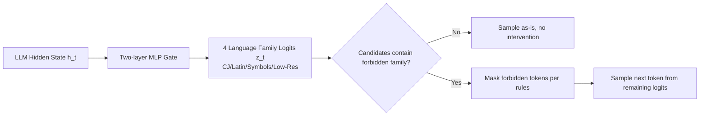

# Language Confusion Gate: Language-Aware Decoding Through Model Self-Distillation

**Conference**: ICLR 2026  
**OpenReview**: [https://openreview.net/forum?id=JjJzbMDGsx](https://openreview.net/forum?id=JjJzbMDGsx)  
**Code**: To be confirmed  
**Area**: Multilingual / Decoding Intervention / Large Language Models  
**Keywords**: Language confusion, language-aware decoding, self-distillation, embedding norm, plug-in intervention  

## TL;DR
This paper proposes the **Language Confusion Gate (LCG)**: a lightweight two-layer MLP that masks tokens from incorrect language families on-demand during decoding without modifying the base LLM. Trained via "norm-calibrated self-distillation," it reduces language confusion rates by approximately an order of magnitude across multiple models without sacrificing task performance.

## Background & Motivation
- **Background**: LLMs such as Qwen3 and GPT-5 support over 100 languages with strong cross-lingual transfer capabilities. However, they still occasionally exhibit **language confusion**—the unintended mixing of characters from different language families (e.g., Chinese characters appearing in a Hebrew sentence). The authors observe that even top-tier commercial models haven't solved this: GPT-5-Chat shows 0.57% CJ / 0.67% Latin confusion, while Qwen3-235B reaches up to 2.27% / 5.07%.
- **Limitations of Prior Work**: Existing mitigation strategies either **require retraining or fine-tuning the model** (e.g., ORPO preference alignment, inhibiting specific neurons) or **fail to distinguish harmful confusion from legitimate code-switching** (which is necessary for code comments, technical terms like ReLU/Python, or cross-lingual teaching). Simply forcing mono-lingual output breaks natural expression, and rule-based detectors struggle to distinguish between these cases.
- **Key Challenge**: Simultaneously achieving two opposing goals—**suppressing anomalous language confusion** vs. **preserving legitimate code-switching capabilities**—while scaling to hundreds of languages.
- **Goal**: Develop a decoding-time intervention that can distinguish between confusion and valid mixing without modifying base weights or requiring heavy retraining.
- **Key Insight**: The authors make three key observations regarding confusion points: **(1) Confusion is rare** (the model generally knows the correct language); **(2) Correct language tokens are almost always in the top-3** (top-3 hit rate of 99.29%, suggesting the correct answer exists in the distribution but with insufficient probability); **(3) Output layer token embedding norm imbalance** causes the model to systematically bias toward high-resource languages. Based on this, they propose a **logits-level masking + norm-debiased gate**: training a small MLP to predict allowed language families for each step and masking only when necessary.

## Method

### Overall Architecture
LCG is a two-layer MLP gate attached to the output of the base LLM. it reads the final hidden state $h_t$ of the current step and outputs logits for 4 language families (CJ for Chinese/Japanese, Latin, Symbols, and Low-Res for low-resource languages): $z_t=\mathrm{MLP}(h_t)\in\mathbb{R}^4$. It predicts which language families are "allowed" in the next step and masks tokens of forbidden families from the sampling logits. The intervention is triggered only when a forbidden language family actually appears among the sampling candidates, resulting in nearly zero impact on normal generation. The base LLM remains frozen throughout training.

### Key Designs

**1. Vocabulary Classification: Consolidating hundreds of languages into 4 predictable families.** To intervene on logits, one must first know the family of each token. The authors use a priority heuristic to partition the entire vocabulary into mutually exclusive CJ, Latin, Symbols, and Low-Res sets. Tokens are BPE-decoded to Unicode: those containing Chinese/Japanese characters are CJ; pure Latin+punctuation are Latin; pure symbols are Symbols; and other valid characters are Low-Res. Fragmented Unicode bytes from BPE are mapped based on Unicode block structures or conservatively assigned to Symbols. For Qwen3, 151,936 tokens are categorized into 27,658 CJ, 94,666 Latin, 10,355 Symbols, and 19,257 Low-Res, compressing "100+ languages" into 4 learnable labels.

**2. Norm-Calibrated Self-Distillation: Using de-biased model predictions as pseudo-labels.** This is the core mechanism. A logit can be decomposed as $\mathrm{logits}_i = h\cdot e_i = \lVert h\rVert\cdot\lVert e_i\rVert\cdot\cos(h,e_i)$. Since $\lVert h\rVert$ is constant for all tokens at the same step, **a larger token embedding norm $\lVert e_i\rVert$ naturally leads to a higher logit**. High-resource language tokens systematically have larger norms (in Qwen3-8B, CJ accounts for 10.74% of the top-5% high-norm tokens, while Low-Res accounts for only 0.14%), which is the root cause of the bias. By dividing the logit by the embedding norm, the authors obtain de-biased logits $\mathrm{logits}_{adj,i}=h\cdot e_i/\lVert e_i\rVert=\lVert h\rVert\cos(h,e_i)$, which rank tokens purely by cosine similarity. In practice, confusion tokens originally at top-1 often drop out of the top-10 after adjustment. Top-k/top-p filtering is applied to these adjusted logits to form a candidate set $S_{k,p}$. **A multi-label pseudo-target is set to 1 for any language family present in this set**: $y^*_{t,i}=\mathbb{1}[S_{k,p}(\mathrm{logits}_{adj})\cap F_i\neq\varnothing]$. The gate is trained using BCE loss: $L=\sum_i \mathrm{BCE}(y^*_{t,i},\sigma(z_{t,i}))$. This process requires no human annotation; it is a self-distillation of what language the model "intends" to speak after de-biasing.

**3. Inference-time Intervention Rules: Minimizing false positives.** To prevent the gated prediction from killing legitimate code-switching, the authors supplement it with three conservative rules: **(a) Never mask Symbols and Low-Res** (symbols don't cause confusion, and high-resource languages rarely mask into low-resource ones); **(b) High-confidence veto**: If the language family predicted by the gate does not appear in either of two high-probability candidate sets (top-k=5, top-p=0.999 and top-k=20, top-p=0.95), the mask is not applied; **(c) Continuity of the last non-symbol token's language**, ensuring the previous token's family is always allowed for coherence. These rules ensure intervention only occurs when there is a genuine risk of confusion.

## Key Experimental Results

### Main Results (No-Think Models, FLORES-NO-LATIN / INCLUDE)

| Model | Metric | No LCG | LCG-unadjusted | LCG-adjusted |
|-------|--------|--------|----------------|--------------|
| Qwen3-30B | CJ% | 1.0 | 0.2 | **0.0** |
| Qwen3-30B | Latin% | 4.4 | 0.7 | **0.4** |
| Qwen3-30B | BLEU | 13.2 | 13.3 | **13.4** |
| Llama3.1-8B | Latin% | 8.4 | 5.7 | **2.9** |
| Qwen3-8B | Latin% | 12.1 | 6.2 | **2.0** |
| Qwen3-8B | CJ% | 4.5 | 0.5 | **0.1** |
| Qwen3-30B (INCLUDE) | CJ% | 2.21 | 0.22 | **0.11** (Acc 71.12→70.83) |

Language confusion generally decreases by about an order of magnitude, while BLEU and accuracy scores remain stable.

### Ablation Study (Effect of Norm Calibration + Intervention Frequency)

| Item | Result |
|------|--------|
| Llama3.1-8B Latin% | unadjusted 5.7 → adjusted **2.9** |
| Qwen3-30B Latin% | unadjusted 0.7 → adjusted **0.4** |
| Intervention Freq (Qwen3-8B) | 0.38% (523 out of 139,354 tokens) |
| Intervention Freq (Llama3.1-8B) | 0.33% (545 out of 162,846 tokens) |

Norm calibration makes the gate more accurate and suppression more precise; the intervention itself is extremely sparse.

### Key Findings
- **Effective for Thinking Models**: On Humaneval-XL, GPT-OSS CJ confusion dropped from 0.38% → 0.06%, and Qwen3-30B from 0.12% → 0.00%, with almost no change in Pass@1/Pass@10 or reasoning length.
- **Preservation of Legitimate Code-Switching**: For samples manually identified as "natural English mixing," LCG still permits 86.7%. On FLORES-WITH-LATIN, the code-switch rate dropped from 46.34% → 25.90%, which remains higher than the Claude Sonnet 4 baseline (23.29%) and closer to the ground-truth answer rate (38.36%), indicating "increased caution" rather than a total ban on mixing.

## Highlights & Insights
- **Mechanism-level Diagnosis**: Attributing language confusion to "output embedding norm imbalance"—a quantifiable and correctable geometric factor—and providing a clean de-biasing formula via logit decomposition offers more interpretability than black-box methods like "neuron suppression."
- **Zero-training Cost and Engineering Friendliness**: Frozen base model, training only a two-layer MLP, and sparse triggering in inference (<0.4% tokens) allow it to be a plug-in for heterogeneous models like Qwen3, Llama, Gemma, and GPT-OSS.
- **Addressing the "Confusion vs. Code-Switch" Dilemma**: By using the FLORES-NO-LATIN / WITH-LATIN split and three intervention rules, the model turns the "masking the bad, keeping the good" problem into an evaluable and tunable behavior rather than a rigid mono-lingual constraint.

## Limitations & Future Work
- **Norm De-biasing is not Exhaustive**: Both English and Chinese are high-norm, and low-resource languages are all low-norm. Norm signals cannot help in these cases, meaning they only cover a specific subset of confusion mechanisms. Thus, they are used as training signals rather than direct intervention criteria.
- **Reduction in Legitimate Code-Switching**: Although 86.7% is preserved, the overall code-switching rate does decrease, indicating a side effect of over-caution. There is no ground truth for the "optimal code-switch rate."
- **Dependency on Vocabulary Partitioning**: Categorizing BPE fragments and mixed scripts relies on heuristics, which may require re-adaptation for tokenizers with significantly different segmentation methods.
- **Limited Latin Confusion Evaluation**: Because Latin characters appear legitimately in code and math, they can only be reliably evaluated on the NO-LATIN subset; real-world scenarios are more complex.

## Related Work & Insights
- **Language Confusion Benchmarks**: Marchisio et al. (2024) formalized language confusion and proposed LCB. This paper uses FLORES+/INCLUDE with targeted filtering because some LCB queries themselves require code-switching, leading to false positives.
- **Mechanistic Interpretability / Neuron Suppression**: Nie et al. (2025) localized language-switching neurons and suppressed them during inference; Ji et al. (2025) used post-processing smoothing for Hanja intrusion in Korean. This paper follows the "no retraining" route but uses norm de-biasing + gating for a unified multilingual approach.
- **Deciding when to Code-switch**: Li et al. (2025) trained a gate to judge if Chinese-English mixing helps or hurts reasoning; Lee et al. (2025) used ORPO to align language consistency preferences. This paper's gate focuses specifically on "masking wrong families" while explicitly preserving legitimate mixing.
- **Insight**: Shifting the perspective of "output embedding norm = source of systematic sampling bias" to other generation biases (e.g., preference for high-frequency tokens, avoiding safety keywords) might be equally applicable—logit norm/direction decomposition is a universal diagnostic tool.

## Rating
- **Novelty**: ⭐⭐⭐⭐ — The combination of mechanistic diagnosis (norm imbalance) and norm-calibrated self-distillation gating is a novel and self-consistent approach; the logits-level plug-in idea is elegant.
- **Experimental Thoroughness**: ⭐⭐⭐⭐ — Covers 4+ heterogeneous models, both think/no-think types, and multiple benchmarks (FLORES/INCLUDE/Humaneval-XL), including multi-dimensional validation of norm ablation, intervention frequency, and code-switch preservation. Commercial model evaluation completes the motivation.
- **Writing Quality**: ⭐⭐⭐⭐ — The chain from observation to mechanism to method to rules is clear; formulas and figures (Top-10 norm comparison) are persuasive.
- **Value**: ⭐⭐⭐⭐ — Practical for multilingual deployment with zero training cost and plug-and-play capability, offering direct value for industrial-grade multilingual LLMs.

<!-- RELATED:START -->

## Related Papers

- [\[ACL 2026\] SERM: Self-Evolving Relevance Model with Agent-Driven Learning from Massive Query Streams](../../ACL2026/multilingual_mt/serm_self-evolving_relevance_model_with_agent-driven_learning_from_massive_query.md)
- [\[ACL 2026\] TLPO: Token-Level Policy Optimization for Mitigating Language Confusion in Large Language Models](../../ACL2026/multilingual_mt/tlpo_token-level_policy_optimization_for_mitigating_language_confusion_in_large_.md)
- [\[NeurIPS 2025\] ParallelPrompt: Extracting Parallelism from Large Language Model Queries](../../NeurIPS2025/multilingual_mt/parallelprompt_extracting_parallelism_from_large_language_model_queries.md)
- [\[ICLR 2026\] ATLAS: Adaptive Transfer Scaling Laws for Multilingual Pretraining, Finetuning, and Decoding the Curse of Multilinguality](atlas_adaptive_transfer_scaling_laws_for_multilingual_pretraining_finetuning_and.md)
- [\[ACL 2025\] LangSAMP: Language-Script Aware Multilingual Pretraining](../../ACL2025/multilingual_mt/langsamp_multilingual_pretraining.md)

<!-- RELATED:END -->
