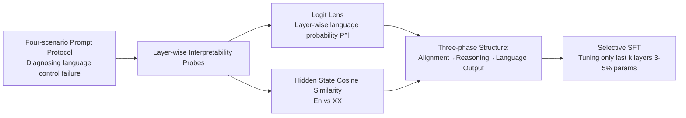

# LinguaMap: Which Layers of LLMs Speak Your Language and How to Tune Them?

**Conference**: ICLR 2026  
**OpenReview**: [https://openreview.net/forum?id=r00UxTl8El](https://openreview.net/forum?id=r00UxTl8El)  
**Code**: To be confirmed  
**Area**: Multilingual / Machine Translation · Interpretability  
**Keywords**: Multilingual LLM, Language Consistency, logit lens, Selective Fine-tuning, Layer Localization  

## TL;DR
By utilizing logit lens and hidden state similarity analysis, this work localizes the final few layers responsible for "language control" in mLLMs. Fine-tuning only these 3-5% of parameters increases language consistency across six languages from <20% to over 98%, achieving performance nearly equivalent to full fine-tuning.

## Background & Motivation
- **Background**: While multilingual LLMs (Qwen, BLOOM, PaLM-2, etc.) cover many languages during pre-training, they frequently fail on non-English tasks. A critical failure is "language control"—the ability to respond in the language specified by the user.
- **Limitations of Prior Work**: The authors identify two types of failure modes: **multilingual transfer bottlenecks** (correct language, incorrect task answer) and **language consistency bottlenecks** (correct task answer, incorrect language). This suggests that "task capability" and "language control" are governed by two distinct internal mechanisms, and traditional full fine-tuning is both expensive and potentially disruptive to existing capabilities.
- **Key Challenge**: Since language control accounts for only a small portion of the model's internal mechanisms, why use full-model fine-tuning to fix it? Can it be precisely localized and repaired?
- **Goal**: Identify "where" inside mLLMs language control is managed and design an efficient (few parameters) and effective (maintains task accuracy) multilingual adaptation method.
- **Core Idea**: **"Three-phase structure + Last-layer selective fine-tuning"**—early layers align different languages into a shared semantic space, middle layers perform task reasoning, and only the final layers determine the output language. Thus, language consistency can be restored by freezing the first two stages and selectively fine-tuning only the final layers.

## Method

### Overall Architecture
LinguaMap follows a three-step process: first, a four-scenario prompt protocol systematically exposes language control failures; second, two interpretability tools (logit lens for probability tracking + cross-lingual hidden state similarity) are used to localize the emergence of language control; finally, masked selective supervised fine-tuning is applied to the identified last layers.

### Key Designs

**1. Four-scenario Prompt Protocol: Decomposing language control into observable failure axes.** The authors decompose a prompt into three input components—Preamble (P), Instruction (I), and Question (Q)—and two output components—Reasoning (R) and Answer (A). Four zero-shot variants are constructed: Monolingual Direct, Code-mixed (English instructions/target language content), English Distractor, and Bilingual Answer. These isolate "baseline fidelity, mixed-context robustness, resistance to English misleading, and language preference." By keeping the semantic answer constant and only changing the language across MMLU/MGSM/XQuAD, language consistency is calculated using LangDetect, cleanly separating "task accuracy" from "language consistency."

**2. Logit Lens Language Probability Tracking: Observing "which language the model is thinking in" per layer.** Hidden states $h^{(l)}_i$ from layer $l$ are projected via the unembedding matrix to the vocabulary to obtain pseudo-logits $z^{(l)}_{i,t}=u_t^\top h^{(l)}_i$. The most probable tokens are decoded and reassembled into words for **word-level** (avoiding subword overlap ambiguity) language detection. The average language quality per layer is computed as $P^{(l)}(\ell)=\frac{1}{M}\sum_{j=1}^{M}p^{(l)}_j(\ell)$ across $M$ generated words. Tracking $P^{(l)}(\ell)$ reveals "language drift trajectories," showing that English dominates early and middle layers, while target language probabilities typically only surpass English in very late layers (e.g., after layer 55 in Qwen-3-32B).

**3. Hidden State Similarity Analysis: Defining three-phase boundaries via cosine similarity.** Given a set of aligned English-target language prompts, hidden states are extracted layer-wise, mean-pooled to $\bar h^{(E,n)}_\ell$ and $\bar h^{(A,n)}_\ell$, and the cross-lingual cosine similarity $s^{(n)}_\ell=\frac{\langle\bar h^{(E)}_\ell,\bar h^{(A)}_\ell\rangle}{\|\bar h^{(E)}_\ell\|\,\|\bar h^{(A)}_\ell\|}$ is calculated and aggregated across samples. Results consistently show three phases: similarity rises sharply in early layers (alignment to shared semantic space), stays high (0.95–0.99) in middle layers (language-agnostic reasoning), and drops in final layers (e.g., layers 24–30 in BLOOM, after layer 55 in Qwen). This drop-off is an actionable signal for the emergence of "language-specific generation," corroborating the logit lens results.

**4. Selective Supervised Fine-tuning (SFT) of Last Layers: Intervening only on language control.** Parameters are partitioned into layers $\theta_\ell$ and the head $\theta_{head}$. Only a subset $S$ of the last $k$ layers is updated while the rest $\theta_{-S}$ are frozen. The gradient of the objective $\mathcal{L}=-\sum_i \log P(y_i\mid x_i;\theta_S)$ is backpropagated only to $\theta_S$. During training, a mask $m_i\in\{0,1\}$ is applied to compute loss only on Q/R/A tokens, treating P/I as frozen context: $\mathcal{L}^{masked}=-\sum_i m_i\log P(y_i\mid Q_i,R_i,A_i;\theta_S)$. Fine-tuning on a subset of MMLU (2500 samples with CoT) shows that tuning the last 1 layer for BLOOM and the last 2 layers for Qwen (5 epochs) is optimal—using only 3–5% of parameters while preventing backward contamination of middle-layer semantic alignment.

## Key Experimental Results

### Main Results (Pre vs. Post Fine-tuning, Average Across Languages)

| Prompting / Dataset | Model | Pre-tuning Consistency% | Pre-tuning Task% | Full SFT Consistency% | Full SFT Task% | Selective SFT Consistency% | Selective SFT Task% | Trainable Params |
|---|---|---|---|---|---|---|---|---|
| Monolingual MGSM | Qwen-3-32B | 65.56 | 66.60 | 99.47 | 90.53 | 99.20 | 86.80 | 1.5B / 32B |
| Monolingual XQuAD | Qwen-3-32B | 81.05 | 55.54 | 100.0 | 57.60 | 99.83 | 55.86 | 1.5B / 32B |
| Code-mixed MMLU | Qwen-3-32B | 8.35 | 60.51 | 99.87 | 78.84 | 99.62 | 74.44 | 1.5B / 32B |
| Code-mixed MGSM | Qwen-3-32B | 6.80 | 57.00 | 95.00 | 87.00 | 98.60 | 84.60 | 1.5B / 32B |
| Monolingual MGSM | BLOOM-7.1B | 34.00 | 0.67 | 100.0 | 1.47 | 100.0 | 3.60 | 0.5B / 7.1B |
| Code-mixed MMLU | BLOOM-7.1B | 29.49 | 22.31 | 99.87 | 33.72 | 98.66 | 21.14 | 0.5B / 7.1B |

### Ablation Study

| Setting | Phenomenon | Conclusion |
|---|---|---|
| Random Layer SFT (Qwen Mono MGSM) | Consistency drops from ~100% to 65.9%, Task drops to 0.13% | Random layer tuning fails catastrophically; localization is key. |
| Last $k$ Layers × Epoch Grid Search | Optimal at 1 layer/5ep (BLOOM), 2 layers/5ep (Qwen) | Language control is concentrated in very few final layers. |
| Post-tuning Probe Re-check | Target language prob. increase restricted to tuned layers | Intervention is successfully localized without polluting reasoning. |

### Key Findings
- **Code-mixing as a diagnostic tool**: In code-mixed scenarios, Qwen's MMLU task accuracy actually increased to 60.5%, but language consistency collapsed from 45% to 8.35%, proving the two mechanisms are decoupled.
- **Selective ≈ Full**: By tuning only 3-5% of parameters, consistency across six languages generally reached 98%+, nearly equal to full fine-tuning with significant computational savings.
- **English distractors remain difficult**: While selective SFT maximizes consistency, task accuracy remains low in misleading scenarios (e.g., 18% on XQuAD), requiring more explicit reasoning-level disambiguation.

## Highlights & Insights
- Decomposing "multilingual failure" from a vague complaint into two independently measurable axes (transfer vs. consistency) provides a clean methodology.
- The convergence of two independent evidence chains (logit lens and hidden state similarity) onto the same "three-phase structure" increases the credibility of the localization.
- "Localization before tuning" transforms interpretability research into a cost-effective engineering method rather than just an analysis.
- Re-checking with probes post-tuning demonstrates the intervention is strictly confined to the final layers, forming a self-consistent "closed-loop" validation.

## Limitations & Future Work
- Task accuracy remains weak under English distraction, suggesting that while language consistency is fixed, "anti-misleading reasoning" is not, necessitating reasoning-level intervention.
- The method was validated only on Qwen-3-32B and BLOOM-7.1B across six languages; generalization to larger scales and more low-resource languages requires further testing.
- "Last-layer localization" relies on empirical inflection points in logit lens/similarity; clarity across different architectures (e.g., different layer normalization, MoE) is not fully discussed.
- Fine-tuning data is limited to the MMLU business subset; robustness across other knowledge domains needs verification.

## Related Work & Insights
- **Implicit English Dominance**: Wendler 2024, Schut 2025, and Lindsey 2025 reveal that mLLMs use English as a default internal representation in intermediate layers; the three-phase structure quantitatively validates this hypothesis layer-by-layer.
- **Language Localization and Neurons**: Tang 2024, Wang 2024, and Zhao 2024 found input/output layers to be language-specific while middle layers are language-agnostic. This work directly translates the "output-layer language specificity" into a tunable parameter subset.
- **Efficient Multilingual Adaptation**: Compared to invertible adapters (Pfeiffer 2020) or deep supervised alignment (Huo 2025), this method introduces no new modules and is lighter by simply "tuning the right layers."
- **Insight**: Treating interpretability as a "scalpel's GPS" for PEFT design is a paradigm worth promoting.

## Rating
- **Novelty**: ⭐⭐⭐⭐ — The combination of "three-phase localization + last-layer selective SFT" for efficient multilingual adaptation is a clear and novel contribution.
- **Experimental Thoroughness**: ⭐⭐⭐ — Comprehensive across four scenarios, three benchmarks, and six languages, but limited to two models and shows gaps in the English distraction scenario.
- **Writing Quality**: ⭐⭐⭐⭐ — Problems are well-decomposed, math and charts are well-integrated, and the analysis-method-validation loop is complete.
- **Value**: ⭐⭐⭐⭐ — Achieving full fine-tuning results with 3–5% of parameters has direct practical value for resource-constrained multilingual deployment.

<!-- RELATED:START -->

## Related Papers

- [\[AAAI 2026\] How Does Alignment Enhance LLMs' Multilingual Capabilities? A Language Neurons Perspective](../../AAAI2026/multilingual_mt/how_does_alignment_enhance_llms_multilingual_capabilities_a_language_neurons_per.md)
- [\[ICLR 2026\] Language Confusion Gate: Language-Aware Decoding Through Model Self-Distillation](language_confusion_gate_language-aware_decoding_through_model_self-distillation.md)
- [\[ICLR 2026\] SASFT: Sparse Autoencoder-guided Supervised Finetuning to Mitigate Unexpected Code-Switching in LLMs](sasft_sparse_autoencoder-guided_supervised_finetuning_to_mitigate_unexpected_cod.md)
- [\[ACL 2026\] Mitigating Catastrophic Forgetting in Target Language Adaptation of LLMs via Source-Shielded Updates](../../ACL2026/multilingual_mt/mitigating_catastrophic_forgetting_in_target_language_adaptation_of_llms_via_sou.md)
- [\[NeurIPS 2025\] How Data Mixing Shapes In-Context Learning: Asymptotic Equivalence for Transformers with MLPs](../../NeurIPS2025/multilingual_mt/how_data_mixing_shapes_in-context_learning_asymptotic_equivalence_for_transforme.md)

<!-- RELATED:END -->
