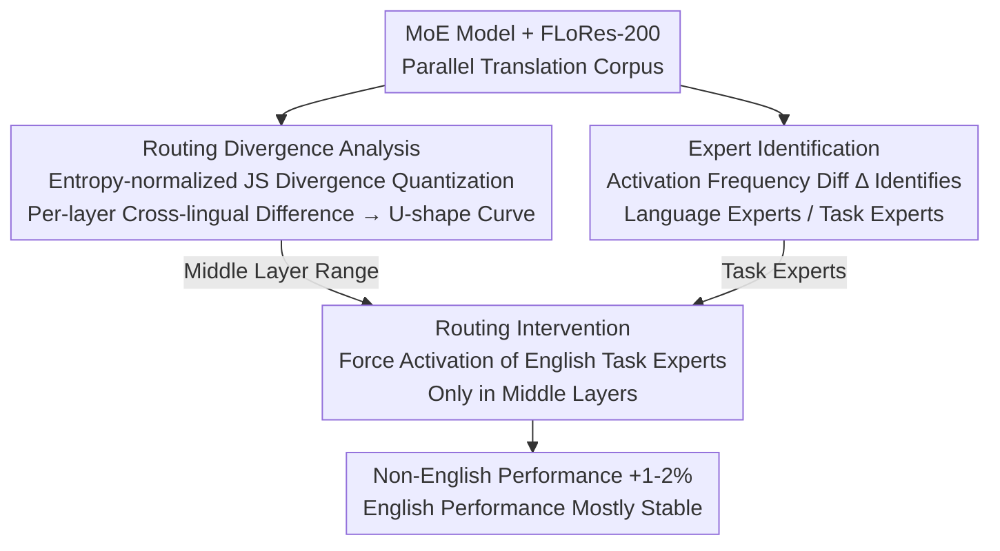

# Multilingual Routing in Mixture-of-Experts

**Conference**: ICLR 2026  
**arXiv**: [2510.04694](https://arxiv.org/abs/2510.04694)  
**Authors**: Lucas Bandarkar, Chenyuan Yang, Mohsen Fayyaz, Junlin Hu, Nanyun Peng (UCLA, Fudan University)  
**Code**: Not open-sourced  
**Area**: Multilingual Translation  
**Keywords**: mixture-of-experts, multilingual routing, cross-lingual transfer, expert steering, interpretability

## TL;DR

This paper systematically analyzes multilingual routing patterns in MoE large language models, discovering that middle layers contain cross-lingually shared experts and that linguistic performance is strongly correlated with alignment to English routing. Based on this, an inference-time routing intervention method is proposed to activate English task-specific experts in middle layers, consistently improving multilingual performance by 1-2% across 3 models, 2 tasks, and 15+ languages.

## Background & Motivation

1.  **MoE as Mainstream yet Multilingual Mechanisms are Unclear**: The Mixture-of-Experts architecture is a core paradigm for scaling LLMs, enabling massive parameter expansion while maintaining reasonable inference costs. However, how its sparse routing dynamics respond to multilingual data has seen little systematic research.
2.  **Findings in Dense LLMs not yet Transferred to MoE**: Numerous studies have revealed that dense LLM middle layers possess language-universal representation spaces, while early/late layers handle language-specific mapping. Whether the sparse activation mechanism of MoE exhibits similar hierarchical patterns remains unexplored.
3.  **English-Centric Pre-training**: Pre-training and post-training data for existing MoE models are highly English-centric. Although scaling brings implicit multilingual capabilities, significant performance gaps persist in most other languages.
4.  **MoE is Naturally Suited for Interpretability Analysis**: The discrete expert activation mechanism of MoE makes it more intuitive to analyze "which model components are responsible for which capabilities," but this advantage has not been fully utilized in multilingual analysis.
5.  **Bottlenecks in Cross-lingual Transfer to be Revealed**: Understanding the mechanism of multilingual routing in MoE can provide guiding insights for improving cross-lingual capability transfer.

## Method

### Overall Architecture

The work first quantizes the expert activation patterns for each layer and language using a set of routing divergence metrics to locate where routing behaviors align or diverge across languages. Next, it identifies language-specialized and task-specialized experts using activation frequency differences. Finally, it performs a minimal inference-time routing intervention in the middle layers to force the activation of English task experts, thereby improving non-English performance. These three stages are serially dependent: divergence analysis dictates "where to act," expert identification dictates "which experts to steer," and both inform the intervention step. The analysis spans Qwen3-30B-A3B (48 layers), Phi-3.5-MoE (32 layers), GPT-OSS-20B (24 layers), and the smaller OLMoE as a control, covering various widths, sparsities, and depths.

### Key Designs

**1. Routing Divergence Analysis: Quantifying Per-layer Cross-lingual Routing Differences**

To study multilingual routing, a scale for cross-layer and cross-lingual comparison is required. The authors use the FLoRes-200 parallel corpus (200+ languages, content-aligned). For each non-English sequence, the routing weights of all tokens in the sequence are averaged to obtain the expert importance distribution $\bm{q}_i^{(\text{lang},l)}$. Then, **entropy-normalized Jensen-Shannon divergence** $D_{\text{H-JS}}$ is used to measure the routing difference between the non-English sequence and its English parallel counterpart at that layer, yielding $\text{Div}^{(\text{lang},l)}$. Entropy normalization is necessary because routing entropy varies significantly with layer depth (lower entropy in deeper layers), and direct JS divergence without normalization would systematically underestimate differences in deeper layers. This metric serves as both the foundation for findings and the visualization basis for selecting intervention layers.

**2. Expert Identification: Selecting Experts via Activation Frequency Difference**

Before intervention, it is necessary to identify expert roles. The authors calculate the **activation frequency difference** $\Delta_k$ for each expert on specific domain or language data relative to a universal baseline (FLoRes English). Discrete activation counts are intentionally used rather than continuous routing weights, as counts more accurately lock onto the "most frequently selected" experts. Given a positive threshold $\tau$, experts with $\Delta_k > \tau$ are classified as specialized experts. Multilingual experts are identified by meeting $\Delta_k > \tau$ for **any** non-English language, while task experts are identified using GSM8K-Instruct (Math) and AlpaCare MedInstruct (Medical) data. The threshold $\tau$ acts as a stringency knob; increasing it isolates highly specialized experts, which defines the "zero-overlap between language and task experts" phenomenon.

**3. Routing Intervention: Activating English Task Experts in Middle Layers**

Once target experts are identified, the intervention is lightweight, modifying only one or two experts in the top-K. Soft intervention adds $\lambda$ times the standard deviation to the target expert's logit before softmax: $z'_k \leftarrow z_k + \lambda \cdot s(\bm{z})$, with $|\lambda| \leq 1.0$ being most stable. Hard intervention pins the target logit to the maximum or minimum value among all experts (forcing activation or inhibition): $z'_k \leftarrow \max(\bm{z}) + \varepsilon,\ \varepsilon \sim \mathcal{N}(0, 10^{-6})$. A crucial constraint is that interventions occur only in **middle layers**, with specific ranges determined by the U-shaped routing divergence curve. Since only middle layers host the language-agnostic semantic space, acting on early/late layers disrupts language-specific mappings. By targeting the bottleneck of cross-lingual transfer rather than general capabilities, the intervention raises non-English performance without degrading English performance.

## Key Findings

### 1. U-shaped Routing Divergence: Middle Layer Sharing

Across all models, routing in early and late layers exhibits **language specificity**, while middle-layer routing is **highly aligned** across different languages, forming a clear U-shaped curve. This suggests that MoE models, like dense models, learn language-universal representation spaces in the middle layers, presented in a more modular and distinct manner.

### 2. Correlation between Language Performance and Routing Alignment

Language understanding ability (Belebele accuracy) shows a **strong negative correlation** with the routing divergence from English in the middle layers:
- OLMoE: $r \in [-0.95, -0.80]$ (extremely strong correlation)
- Qwen3 and Phi-3.5-MoE: moderate to strong correlation
- GPT-OSS: $r \in [-0.40, -0.60]$ (weakest but still significant)

Languages not understood by the model (e.g., Bambara) fail to map inputs to the middle-layer shared space, maintaining high routing divergence throughout.

### 3. Complete Functional Separation of Language and Task

When $\tau \geq 0.3$, **zero experts** are specialized for both task and multilingual roles—the two sets of experts are completely disjoint. This provides strong empirical support for the hypothesis proposed by Mahowald et al. concerning the "functional dissociation of language and thought" in LLMs: processing linguistic form (language experts) and task content (task experts) is handled by different parameter components.

### 4. Language Differences in Routing Entropy and Consistency

- Routing entropy decreases with layer depth, with non-English languages dropping more sharply and showing a significant dip at the final layer, suggesting a few non-English generation experts.
- Inter-token routing consistency (Jaccard similarity) is negatively correlated with language resources: low-resource language tokens exhibit more consistent routing (relying on fewer experts).

## Main Results

### Intervention Results

| Model | Task | Target Layers | τ | Intervention | # Experts | Baseline | Post-Int. | Gain |
|-------|------|---------------|---|--------------|-----------|----------|-----------|------|
| Qwen3-30B-A3B | MGSM | (8,35) | 0.4 | soft, λ=0.5 | 22 | 76.4% | 78.0% | +1.6% |
| Phi-3.5-MoE | MGSM | (8,17) | 0.3 | soft, λ=0.5 | 12 | 57.5% | 58.9% | +1.4% |
| GPT-OSS-20B | MGSM | (4,19) | 0.3 | hard | 9 | 68.9% | 71.5% | +2.6% |
| Qwen3-30B-A3B | MMLU Med | (8,35) | 0.5 | hard | 23 | 68.2% | 69.1% | +0.9% |
| Phi-3.5-MoE | MMLU Med | (8,17) | 0.25 | soft, λ=0.5 | 2 | 57.8% | 58.8% | +1.0% |
| GPT-OSS-20B | MMLU Med | (4,19) | 0.3 | soft, λ=0.5 | 6 | 63.8% | 64.5% | +0.7% |

### Improvements in Low-Resource Languages

- Swahili MGSM: GPT-OSS 52.4% → 62.0% (**+9.6%**)
- Bengali MGSM: Phi-3.5 20.8% → 23.2% (+2.4%)
- Yoruba MMLU Med: Phi-3.5 40.0% → 42.9% (+2.9%)
- Average improvements for low-resource languages were generally higher than for high-resource languages.

### Stable English Performance

Interventions had almost no impact on English performance (change <1%), with occasional slight decreases, demonstrating that the intervention precisely targets the bottleneck of cross-lingual transfer without compromising original capabilities.

### Ablation Study

- **Intervention outside middle layers** → Drumatic performance drop (disrupts language-specific routing in early/late layers).
- **Activating multilingual experts instead of task experts** → Performance drop (validates language-task separation).
- **Random expert intervention** → Performance drop.
- **Deactivation (instead of activation)** → Only harm, no positive gain.
- **Layer range sensitivity** → Deviation from the optimal layer range by even a few layers leads to degradation, verifying the utility of routing divergence visualization.

## Highlights & Insights

- **First systematic revelation of multilingual routing dynamics in MoE LLMs**, discovering a language-agnostic middle-layer space consistent with but clearer than dense models.
- **Functional modularity discovery** (zero-overlap experts when $\tau \geq 0.3$) provides strong empirical evidence for the "functional dissociation of language and thought" hypothesis.
- **Minimal inference-time routing intervention** consistently improves multilingual performance across multiple models and tasks. The method is simple yet robust.
- Intervention only modifies top-K selection for 1-2 experts (where K is typically 4 or 8), leaving most routing behaviors intact.
- Extensive ablation studies (layer choice, expert type, intensity, hard/soft methods) confirm the causal relationship.
- Routing divergence visualization serves as a practical tool for determining intervention layer ranges.

## Limitations & Future Work

1.  **Limited Magnitude of Gains**: While 1-2% gains are statistically significant and consistent, the absolute magnitude is small.
2.  **Model-Specific Tuning Required**: Optimal $\tau, \lambda$, and layer ranges differ by model and require individual adjustment.
3.  **Domain Data Dependency**: Identification depends on specific data (e.g., GSM8K for math), and data choice affects results.
4.  **Inference-only Intervention**: Methods to promote cross-lingual expert sharing during training were not explored and may have higher potential.
5.  **Limited Model Coverage**: Only 4 MoE models were tested; larger models (like DeepSeek-V3) may exhibit different behaviors.
6.  **Task Coverage**: Only tested mathematical reasoning and medical Q&A.

## Related Work & Insights

- **Multilingual Middle Layers in Dense LLMs**: Findings by Kojima/Wendler/Bandarkar (2024-2025) on language-universal spaces in dense models are mirrored in MoE with clearer modularity.
- **Cross-lingual Representation Alignment**: Kargaran/Ravisankar (2025) linked middle-layer alignment to performance; this work extends that relationship from representation space to routing space.
- **Inference-time Intervention**: Following Mahmoud/Lu (2025), who steered dense models toward shared representations, this work achieves similar effects at the MoE routing level.
- **Fayyaz et al. (2026)**: Explored expert activation/deactivation; this work finds that activating task experts specifically is effective in multilingual contexts.
- **Functional Dissociation**: Mahowald et al. (2024) hypothesis is empirically supported by the zero-overlap of task and language experts in MoE.
- **Multilingual MoE Training**: Zheng et al. (2025) expanded capabilities via final-layer MoE upcycling, consistent with this paper's finding of language specialization in late layers.

<!-- RELATED:START -->

## Related Papers

- [\[ACL 2025\] Group then Scale: Dynamic Mixture-of-Experts Multilingual Language Model](../../ACL2025/multilingual_mt/group_then_scale_dynamic_mixture-of-experts_multilingual_language_model.md)
- [\[ACL 2025\] Less, but Better: Efficient Multilingual Expansion for LLMs via Layer-wise Mixture-of-Experts](../../ACL2025/multilingual_mt/less_but_better_efficient_multilingual_expansion.md)
- [\[ICLR 2026\] ATLAS: Adaptive Transfer Scaling Laws for Multilingual Pretraining, Finetuning, and Decoding the Curse of Multilinguality](atlas_adaptive_transfer_scaling_laws_for_multilingual_pretraining_finetuning_and.md)
- [\[ACL 2026\] No One Fits All: From Fixed Prompting to Learned Routing in Multilingual LLMs](../../ACL2026/multilingual_mt/no_one_fits_all_from_fixed_prompting_to_learned_routing_in_multilingual_llms.md)
- [\[ACL 2026\] RouteLMT: Learned Sample Routing for Hybrid LLM Translation Deployment](../../ACL2026/multilingual_mt/routelmt_learned_sample_routing_for_hybrid_llm_translation_deployment.md)

<!-- RELATED:END -->
