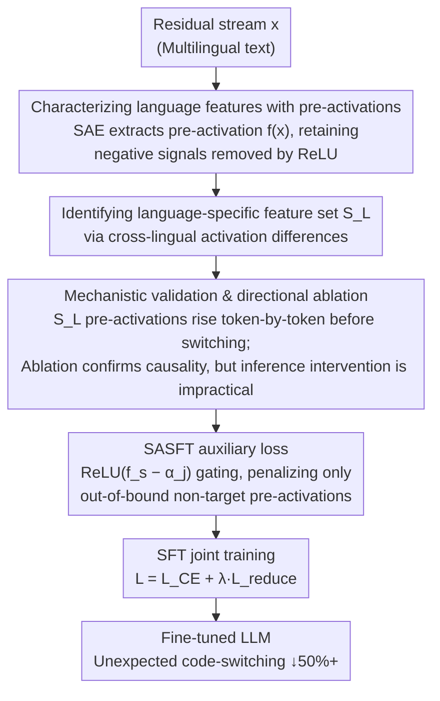

# SASFT: Sparse Autoencoder-guided Supervised Finetuning to Mitigate Unexpected Code-Switching in LLMs

## Basic Information

- **Conference**: ICLR 2026
- **arXiv**: [2507.14894](https://arxiv.org/abs/2507.14894)
- **Code**: [GitHub](https://github.com/Aatrox103/SASFT)
- **Area**: Natural Language Processing / Large Language Models
- **Keywords**: Code-Switching, Sparse Autoencoder, Multilingual LLMs, SFT, Language Features

## TL;DR

Utilizing Sparse Autoencoders (SAEs), it is discovered that unexpected code-switching in LLMs is correlated with abnormally high pre-activation values of target language features. This paper proposes SASFT, a method that constrains target language feature pre-activations during SFT training, reducing unexpected code-switching by more than 50%.

## Background & Motivation

### Background
Multilingual LLMs (e.g., Qwen-3, Llama-4, Gemma-3) often exhibit unexpected code-switching during generation—such as suddenly inserting Chinese or Korean into an English response—which severely degrades user experience.

### Limitations of Prior Work

**Only Known Attempt**: Guo et al. (2025) utilized GRPO + language consistency rewards to address code-switching in DeepSeek-R1, but this approach lacks mechanistic analysis and shows limited effectiveness;

**Lack of Fundamental Understanding**: Prior work has not deeply analyzed the internal mechanisms underlying code-switching.

### Key Findings
Analysis via SAE reveals:
1. **Language-specific features** exist within LLMs—directions in the residual stream that exhibit large projection values only when processing specific language tokens;
2. When unexpected code-switching occurs, the **pre-activation values** of target language features rise abnormally;
3. Ablation experiments confirm that reducing these features reduces code-switching.

## Method

### Overall Architecture

SASFT is a "diagnose-then-treat" pipeline. On the diagnostic side, SAEs are used to locate "language-responsible" specific features in the residual stream, confirming that the pre-activation values of these features climb abnormally before code-switching occurs, with causality established via directional ablation. On the treatment side, this observation is transformed into an auxiliary loss applied during the SFT phase to directly suppress the pre-activations of non-target language features, enabling the model to learn self-constraint and internalizing inference-time interventions into training.

### Key Designs

**1. Characterizing language features with pre-activations instead of activations: Retaining negative signals erased by ReLU**

Given a residual stream $\mathbf{x} \in \mathbb{R}^N$, the SAE first encodes the pre-activation $\mathbf{f(x)} = \mathbf{W}_{\text{enc}} \mathbf{x} + \mathbf{b}_{\text{enc}}$, which then passes through $\mathbf{a(x)} = \text{ReLU}(\mathbf{f(x)})$ to obtain sparse activations (feature dimension $M \gg N$). Conventional methods only examine the activation value $\mathbf{a(x)}$, but ReLU truncates all negative values to zero. This paper specifically monitors the process where a "language feature that should remain negative or low" is gradually pushed higher—information that is completely lost in $\mathbf{a(x)}$. Therefore, SASFT uses the pre-activation $\mathbf{f(x)}$ as the object of analysis and constraint throughout the process to capture the continuous rising precursor before a code-switching equilibrium.

**2. Identifying language-specific features via cross-lingual activation differences: Extracting directions serving only specific languages**

To constrain language features, one must first identify which features belong to which language. Following the metric from Deng et al. (2025), the monolingual score $\nu_s^L = \mu_s^L - \gamma_s^L$ is calculated for feature $s$ and language $L$, where $\mu_s^L$ is the mean activation on language $L$ text and $\gamma_s^L$ is the mean activation on other languages. A larger difference indicates the feature is mainly activated when processing $L$ tokens. The features with the highest $\nu$ values form the language-specific feature set $\mathcal{S}_L$. This step relies on multilingual calibration data to estimate the two means.

**3. Mechanistic validation and limitations of directional ablation: Proving causality and why not to modify at inference time**

After locating $\mathcal{S}_L$, the authors verify it as a "switch" for code-switching: statistics show that before switching to language $L$, the pre-activations of features in $\mathcal{S}_L$ increase token-by-token. Furthermore, directional ablation—subtracting a component along the language direction $\mathbf{d}$ in the residual stream $\mathbf{x}' \leftarrow \mathbf{x} - \lambda \mathbf{d}$—leads to a drop in the code-switching rate, confirming causality. However, inference-time ablation is impractical: first, pre-activations must be suppressed significantly to be effective, which may harm other capabilities; second, generating every token requires external hooks, adding inference overhead. These flaws motivated the authors to move the constraints to the training phase.

**4. SASFT auxiliary loss: Penalizing only out-of-bound pre-activations with thresholded ReLU gating**

During training, a constraint is added alongside cross-entropy to teach the model to keep non-target language features within reasonable bounds:

$$
L_{\text{reduce}} = \mathbb{E}_{\mathcal{D}_j \sim \mathcal{D} \setminus \{\mathcal{D}_L\}}\left[\mathbb{E}_{\mathbf{x} \sim \mathcal{D}_j}\left[\sum_{s \in \mathcal{S}_L} \text{ReLU}(\mathbf{f}_s(\mathbf{x}) - \alpha_j)\right]\right]
$$

The outer expectation deliberately excludes target language data $\mathcal{D}_L$ (it is normal for $L$ features to activate on $L$ text), while the inner sum is over $\mathcal{S}_L$. The critical component is the $\text{ReLU}(\mathbf{f}_s(\mathbf{x}) - \alpha_j)$ gate: the threshold $\alpha_j$ is set to the estimated mean pre-activation rather than zero (since mean pre-activations are often negative, zero would be overly repressive). Gradients are generated only when pre-activations exceed $\alpha_j$, ensuring the loss corrects "abnormal rises" without disturbing normal fluctuations. The total loss is $L_{\text{training}} = L_{\text{cross-entropy}} + \lambda L_{\text{reduce}}$, and constraints can be applied across multiple layers simultaneously for stability.

## Key Experimental Results

### Main Results: Code-Switching Rate Comparison

| Model | Method | CS→Chinese | CS→Russian | CS→Korean |
|------|------|---------|---------|---------|
| Gemma-2-2B | SFT (Baseline) | 0.74% | 0.57% | 3.45% |
| | SFT+GRPO | 0.74 (0%) | 0.49 (-14%) | 3.44 (0%) |
| | SFT+Penalty | 0.67 (-10%) | 0.41 (-27%) | 1.18 (-66%) |
| | **SASFT** | **0.42 (-43%)** | **0.22 (-61%)** | **0.73 (-79%)** |
| Gemma-2-9B | SFT (Baseline) | 0.78% | 0.12% | 0.81% |
| | **SASFT** | **0.41 (-47%)** | **0.01 (-94%)** | **0.13 (-84%)** |
| Llama-3.1-8B | SFT (Baseline) | 1.16% | 0.67% | 0.57% |
| | **SASFT** | — | — | — |

### Ablation Study: Impact of Different Components

| Configuration | CS→Chinese (↓) | MMLU (↑) | HumanEval (↑) |
|------|------------|---------|--------------|
| SFT Baseline | 0.78% | 69.2 | 42.1 |
| SASFT (Single Layer) | 0.52% | 69.5 | 42.8 |
| SASFT (Multi-Layer) | **0.41%** | **69.8** | **43.2** |
| Inference Ablation | 0.45% | 67.3 | 40.5 |

### Key Findings

1. **SASFT reduces code-switching by more than 50% in most cases**, achieving 100% elimination in Korean scenarios;
2. **Significantly outperforms GRPO**: GRPO is nearly ineffective in most settings (0% improvement), while SASFT is consistently effective;
3. **No harm to multilingual capability**: Performance is maintained or even improved across 6 benchmarks including MMLU, HumanEval, and Flores-200;
4. **Multi-layer application is more stable**: Cross-layer SASFT is more robust than single-layer;
5. **Reduction is more effective than enhancement**: Reducing non-target language features is superior to enhancing source language features;
6. **Training-based methods outperform inference intervention**: SASFT changes internal model behavior without additional inference overhead.

## Highlights & Insights

- First in-depth analysis of the internal mechanism of unexpected code-switching in LLMs, revealing a causal relationship with language feature pre-activations.
- Clever transition from inference-time intervention to training-time constraint, solving two major flaws of inference intervention.
- Strong generalization: Validated across five models from three series: Gemma-2, Llama-3.1, and Qwen-3.
- Elegant auxiliary loss design, utilizing ReLU gating to penalize only pre-activations that exceed a specific threshold.

## Limitations & Future Work

- Requires SAEs for the corresponding model (Qwen-3 required self-trained SAEs, the additional cost of which was not quantified).
- Identification of language-specific features relies on multilingual calibration data.
- The paper focus is limited to Chinese, Korean, and Russian; generalization to more languages remains to be verified.
- The definition of code-switching is based on script detection, which may miss fine-grained lexical mixing.

## Related Work & Insights

- **LLM Code-Switching**: Guo et al. (2025) identified and attempted to solve code-switching in DeepSeek-R1 using GRPO.
- **SAE Analysis**: Deng et al. (2025) discovered language-specific features in LLMs.
- **Multilingual LLMs**: Qwen-3 (Yang et al., 2025), Llama-4 (Meta, 2025), Gemma-3 (Team et al., 2025).
- **Mechanistic Interpretability**: Sparse Autoencoders used for understanding internal LLM representations.

## Rating

- Novelty: ⭐⭐⭐⭐⭐ — First to combine SAE interpretability with the code-switching problem, spanning from mechanism to solution.
- Technical Depth: ⭐⭐⭐⭐ — Complete analysis-discovery-solution chain with cleverly designed pre-activation constraints.
- Experimental Thoroughness: ⭐⭐⭐⭐⭐ — Comprehensive coverage across 5 models, 3 languages, and 6 benchmarks.
- Value: ⭐⭐⭐⭐⭐ — Directly addresses a pain point in the deployment of multilingual LLMs.

<!-- RELATED:START -->

## Related Papers

- [\[ACL 2025\] MiLiC-Eval: Benchmarking Multilingual LLMs for China's Minority Languages](../../ACL2025/multilingual_mt/milic-eval_benchmarking_multilingual_llms_for_chinas_minority_languages.md)
- [\[ACL 2025\] Did Translation Models Get More Robust Without Anyone Even Noticing?](../../ACL2025/multilingual_mt/translation_robustness.md)
- [\[ACL 2025\] Code-Switching Curriculum Learning for Multilingual Transfer in LLMs](../../ACL2025/multilingual_mt/code-switching_curriculum_learning_for_multilingual_transfer_in_llms.md)
- [\[ACL 2025\] Code-Switching Red-Teaming: LLM Evaluation for Safety and Multilingual Understanding](../../ACL2025/multilingual_mt/code-switching_red-teaming_llm_evaluation_for_safety_and_multilingual_understand.md)
- [\[ICLR 2026\] ATLAS: Adaptive Transfer Scaling Laws for Multilingual Pretraining, Finetuning, and Decoding the Curse of Multilinguality](atlas_adaptive_transfer_scaling_laws_for_multilingual_pretraining_finetuning_and.md)

<!-- RELATED:END -->
