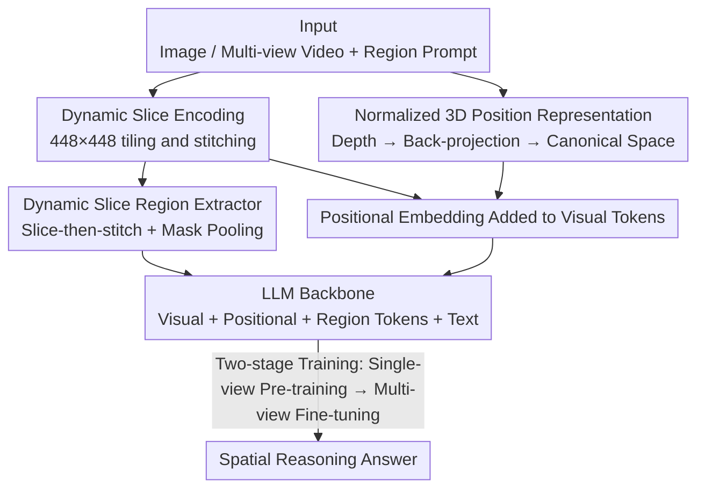

# SR-3D: 3D-Aware Region Prompted Vision Language Model

**Conference**: ICLR2026  
**OpenReview**: [https://openreview.net/forum?id=GTpf2NuwtR](https://openreview.net/forum?id=GTpf2NuwtR)  
**Code**: [Project Page](https://www.anjiecheng.me/sr3d)  
**Area**: Multimodal VLM / 3D Spatial Understanding  
**Keywords**: 3D Positional Encoding, Region Prompting, Multi-view, Spatial Reasoning, Vision Language Model

## TL;DR
SR-3D directly injects 3D positional encodings derived from depth estimation into the visual tokens of a 2D foundation VLM and employs a dynamic slice region extractor. This allows a single model to handle both single-view images and multi-view videos, supporting precise cross-frame 3D spatial reasoning by simply drawing a box or mask on any single frame, achieving SOTA performance across multiple 2D and 3D benchmarks.

## Background & Motivation

**Background**: 2D Vision Language Models (VLMs, such as GPT-4o, LLaVA, Qwen-VL) are already powerful in planar image understanding and linguistic grounding. The community has begun attempting to equip them with 3D spatial reasoning capabilities. There are two mainstream paths: training specialized 3D VLMs using point clouds, or treating multi-view images as 3D representations to feed into existing 2D VLMs.

**Limitations of Prior Work**: The point cloud approach requires massive data collection and model alignment; scarcity of 3D training data limits performance, and the representation space of point clouds differs entirely from 2D VLMs, making it impossible to reuse the priors accumulated by 2D foundation models. While the multi-view approach naturally aligns with the input space of 2D VLMs, two challenges remain: first, how to genuinely inject 3D geometric information (existing works either add positional information only during 3D fine-tuning or use separate sidecar channels without integrating into the foundation model itself); second, how to specify objects in multi-view settings—pure language is clumsy in cluttered scenes (e.g., multiple instances of the same class), while region prompts, though effective in single views, are difficult to scale to multi-view due to varying visibility across frames and the tediousness of frame-by-frame or 3D box annotation.

**Key Challenge**: An ideal VLM should allow a user to **draw a single box on one frame**, enabling the model to accurately reason about cross-frame spatial relationships across the entire multi-view scene. Achieving this requires solving both "how to integrate 3D geometry into 2D priors" and "how to generalize region representations from single to multi-view," both of which are coupled.

**Goal**: Construct a unified visual representation that inherits powerful 2D foundation priors while supporting flexible region prompts across both single-view and multi-view scenarios.

**Key Insight**: The authors discovered that by unifying 3D positions from different perspectives into a **canonical world coordinate space** and aligning region embeddings with this space during the single-view pre-training phase, the spatial priors learned in 1D can zero-shot transfer to 3D. Their pure 2D model demonstrated surprisingly decent spatial reasoning for 3D scenes without ever seeing multi-view data, serving as key evidence for this design.

**Core Idea**: Directly add depth-derived 3D positional encodings to the visual tokens of the foundation VLM (rather than via sidecars or late-stage fine-tuning) and extract region features using a "slice-and-stitch" method, allowing single and multi-view configurations to share the same architecture and canonical coordinate space.

## Method

### Overall Architecture
SR-3D aims to enable a 2D VLM to perform 3D spatial reasoning using cross-frame region prompts. The overall workflow is: input an image or multi-view video (with optional box/mask prompts) $\to$ the vision encoder encodes the image by dividing it into $448 \times 448$ tiles $\to$ simultaneously, an off-the-shelf depth estimator calculates the depth map, back-projects it into a 3D point map, normalizes it to a unified canonical space, and encodes it into positional embeddings added directly to the corresponding visual tokens $\to$ the region extractor uses the same slicing method to extract high-resolution region tokens $\to$ all visual, positional, and region tokens are fed into the LLM with text to produce an answer. Crucially, single-view and multi-view inputs **follow the exact same pipeline**, allowing large-scale single-view priors to carry over seamlessly to multi-view.

### Key Designs

**1. Normalized 3D Position Representation: Linking Single and Multi-view with a Unified Space**

The pain point is that existing methods only add positional information during 3D fine-tuning or via independent sidecars, preventing 2D pre-trained priors from serving 3D reasoning. SR-3D's approach: for a single-view image $I$, use DepthAnythingV2 to estimate the relative depth map $D$, back-project it into a per-pixel 3D position map using camera intrinsics, and then **canonicalize it into a camera-pose-independent normalized world coordinate system**. This 3D position map passes through a sinusoidal encoding and a point-wise MLP to generate positional embeddings, which are resized and **directly added to the corresponding visual tokens**. For multi-view, GT depth is used for back-projection and camera transformation across 32 sampled frames to align each frame's point map to the **same canonical space**. This is critical: because all frame 3D coordinates fall into the same normalized space, coherent cross-frame correspondences are established even if an object does not co-occur. This works because positional information is expressed as "unified spatial coordinates independent of camera pose," allowing the "this coordinate corresponds to this spatial relationship" prior learned in the single-view phase to be reused.

**2. Dynamic Slice Region Extractor: Extracting High-Fidelity Region Features via Slice-then-Stitch**

The pain point is the low resolution of feature maps from vision backbones, which limits the representation of small objects. Existing region VLMs use deconvolutional upsampling after the encoder to "recover details," but the features are already compressed and distorted. SR-3D adopts **tile-then-stitch**: images and point maps are first resized to the nearest predefined aspect ratio (1:1, 1:2, 2:1, etc.) and cut into $448 \times 448$ tiles to be **encoded separately**, then stitched back into a high-resolution feature map. For a Region of Interest (RoI) represented by a binary mask, the same slicing is applied to the mask to perform mask pooling on the high-resolution features. This design offers two benefits: region features are **extracted directly from high-resolution features** with minimal distortion; and it **naturally scales to multi-view video** by treating each frame as a tile, maintaining cross-frame spatial consistency for the same RoI.

**3. Two-stage Unified Training + Early Region Embedding Alignment: Zero-shot Transfer**

The pain point is that if region embeddings are only trained during the multi-view phase, they fail to learn generalizable representations. SR-3D's strategy: initialize from a pre-trained 2D VLM (NVILA-Lite-8B), **freeze the vision encoder**, and fine-tune the 3D positional encoding module, projector, and LLM using ~7 million samples (mixed instruction and region data) for single-view training. Region embeddings are thus aligned with the canonical space at this stage. Subsequently, multi-view fine-tuning is performed on ScanQA, SQA3D, Scan2Cap, and a newly curated EmbodiedScan region/spatial QA dataset, using mask augmentation (converting masks to boxes, random frame dropping) for robustness. The key is that **single and multi-view share the same architecture and data pipeline**; by the time the model reaches multi-view data, the region embeddings are already space-aware.

**4. Inference Flexibility from Canonical Space: Seamless Transition from GT to Estimated Depth**

Although multi-view training uses GT depth, the normalization to a canonical space allows the model to **directly swap GT depth for point maps estimated by off-the-shelf models (MAST3R, CUT3R)** during inference with minimal performance drop. This enables SR-3D to handle "in-the-wild videos without 3D annotations" by reconstructing point maps using geometric foundation models. It supports various annotation densities: 3D boxes projected into multi-frame masks, sparse-frame masks, or even a single-frame mask.

### Loss & Training
Two-stage training: ① Single-view phase initializing from NVILA-Lite-8B, freezing the vision encoder, and fine-tuning 3D PE/projector/LLM on ~7M samples. ② Multi-view phase fine-tuning on 3D QA/caption data + EmbodiedScan spatial QA with mask augmentation. Multi-view inputs are uniformly sampled at 32 frames.

## Key Experimental Results

### Main Results

3D Scene Understanding (Scan2Cap / ScanQA / SQA3D), SR-3D-8B sets new SOTA across all metrics:

| Dataset | Metric | SR-3D-8B | Previous Best | Gain |
|---------|--------|----------|---------------|------|
| Scan2Cap | CIDEr | 97.9 | 83.8 (Video-3D LLM) | +14.1 |
| Scan2Cap | BLEU-4 | 44.7 | 42.4 | +2.3 |
| ScanQA | CIDEr | 109.3 | 102.7 (NaVILA) | +6.6 |
| SQA3D | EM | 62.2 | 58.6 (Video-3D LLM) | +3.6 |

2D General VQA (Table 1), 3D pre-training improves spatial tasks without compromising general/OCR capabilities:

| Category | Baseline NVILA-Lite-8B | SR-3D-8B |
|----------|-----------------------|----------|
| BLINK (Spatial) | 79.7 | 83.9 (+4.2) |
| EmbSpat (Spatial) | 68.9 | 72.5 (+3.6) |
| RealWorldQA (Spatial) | 65.6 | 68.1 (+2.5) |
| GQA / TextVQA (General/OCR) | 65.3 / 78.1 | 64.2 / 77.3 (Comparable) |

Region-level Recognition (COCO-2017, Table 3): SR-3D-8B achieves 78.0 mAP / 88.6% Acc, significantly outperforming SpatialRGPT (72.9 / 82.9), attributed to the higher fidelity from the dynamic slice extractor. On VSI-Bench (Table 6), SR-3D-8B leads all open-source models (Avg 62.9).

### Ablation Study

Impact of 3D Positional Encoding (3D PE) and Single-view Pre-training (PT) (Table 8):

| Configuration | Scan2Cap | ScanQA | 3D Global |
|---------------|----------|--------|-----------|
| W/O Both | 92.9 | 101.3 | 51.1 |
| 3D PE Only | 94.3 | 108.2 | 52.9 |
| PT Only | 92.7 | 102.9 | 51.2 |
| Full Model | 97.9 | 109.3 | 62.0 |

### Key Findings
- **3D PE and single-view pre-training are synergistic**: Enabling either one individually only raises 3D Global from 51.1 to ~52, whereas **enabling both jumps to 62.0**, suggesting positional encodings require pre-aligned representations to be effective.
- **Zero-shot generalization is a core strength** (Table 7): SR-3D-2D (trained only on single-views) achieves reasonable accuracy (71.4/79.7) on 3D metrics, proving 2D and 3D representations are aligned in the same space.
- **Robustness to reconstruction noise** (Table 9): Using CUT3R estimated point maps instead of GT depth results in negligible drops for ScanQA (109.3 to 109.3), whereas Video-3D LLM shows significant degradation.
- **Failure of Region VLM + SoM in multi-frame settings**: GPT-4o with Set-of-Marks performs poorly in multi-view due to the difficulty of tracking marks across frames, highlighting the value of SR-3D's cross-frame consistency.

## Highlights & Insights
- **Direct token injection is a critical architectural choice**: By fusing 3D geometry into the foundation visual tokens rather than sidecars, 2D priors and 3D geometry coexist in the same representation space.
- **Canonical space serves three purposes**: It establishes cross-frame correspondence, enables zero-shot transfer from single-view, and allows seamless depth source replacement (GT to estimated).
- **Tile-then-stitch unifies region extraction and high-res encoding**: This mechanism covers both images (tiles) and videos (frames) with the same logic, providing a clean engineering solution for high-resolution tasks.
- **User value in "single-frame box for cross-frame reasoning"**: It removes the burden of annotating 3D boxes or multiple frames, significantly lowering the barrier for applications in robotics and AR.

## Limitations & Future Work
- **Multi-view training still relies on GT depth**: While inference can use estimated maps, whether pure in-the-wild data can be used for training remains to be verified.
- **Dependent on upstream geometric models**: The spatial capability is built upon DepthAnythingV2 and CUT3R/MAST3R; failures in these (e.g., reflections, textureless surfaces) will propagate to SR-3D.
- **Scaling potential**: Ablations suggest that increasing single-view pre-training data may further improve performance, implying the current model has not reached its ceiling but requires significant compute for replication (~7M samples).

## Related Work & Insights
- **vs. Point Cloud 3D VLMs (3D-LLM, LEO)**: These operate in point cloud space and struggle to reuse 2D priors; SR-3D's multi-view path outperforms them (ScanQA CIDEr 109.3 vs LEO 101.4).
- **vs. LLaVA-3D / Video-3D LLM**: These often use sidecars or add positional info only during fine-tuning. SR-3D's direct integration and unified pipeline result in superior robustness to noisy reconstructions.
- **vs. SpatialRGPT**: While both do region prompts, SpatialRGPT uses deconvolutional upsampling and is biased toward single-view; SR-3D's tile-then-stitch provides higher fidelity and extends natively to multi-view.

## Rating
- Novelty: ⭐⭐⭐⭐⭐ The combination of direct token injection and the canonical space is concise and effective.
- Experimental Thoroughness: ⭐⭐⭐⭐⭐ Covers extensive benchmarks and includes robustness/zero-shot tests.
- Writing Quality: ⭐⭐⭐⭐ Clear motivation and methodology.
- Value: ⭐⭐⭐⭐⭐ High practical utility for embodied AI and AR via single-frame prompting on in-the-wild video.

<!-- RELATED:START -->

## Related Papers

- [\[CVPR 2026\] Grounded 3D-Aware Spatial Vision-Language Modeling](../../CVPR2026/multimodal_vlm/grounded_3d-aware_spatial_vision-language_modeling.md)
- [\[ICLR 2026\] VaseVQA-3D: Benchmarking 3D VLMs on Ancient Greek Pottery](vasevqa-3d_benchmarking_3d_vlms_on_ancient_greek_pottery.md)
- [\[CVPR 2026\] Abstract 3D Perception for Spatial Intelligence in Vision-Language Models](../../CVPR2026/multimodal_vlm/abstract_3d_perception_for_spatial_intelligence_in_vision-language_models.md)
- [\[ICLR 2026\] GPT4Scene: Understand 3D Scenes from Videos with Vision-Language Models](gpt4scene_understand_3d_scenes_from_videos_with_vision-language_models.md)
- [\[CVPR 2026\] Direction-aware 3D Large Multimodal Models](../../CVPR2026/multimodal_vlm/direction-aware_3d_large_multimodal_models.md)

<!-- RELATED:END -->
