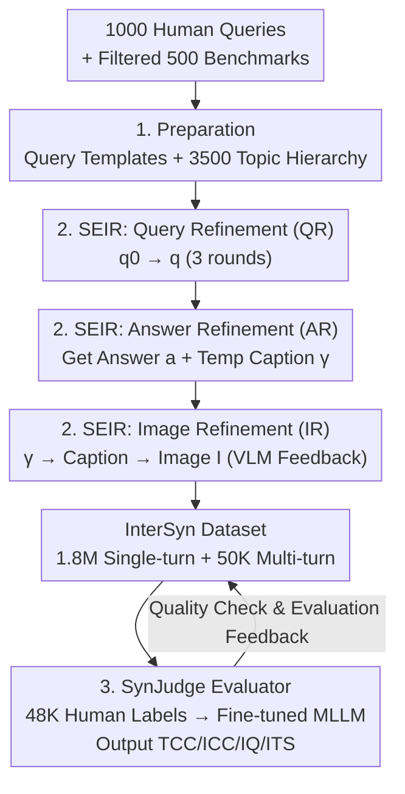

# A High Quality Dataset and Reliable Evaluation for Interleaved Image-Text Generation

**Conference**: ICLR 2026  
**OpenReview**: [https://openreview.net/forum?id=qBORZkk28r](https://openreview.net/forum?id=qBORZkk28r)  
**Code**: TBD  
**Area**: Multimodal VLM / Interleaved Image-Text Generation / Datasets and Evaluation  
**Keywords**: Interleaved image-text generation, InterSyn, SEIR, SynJudge, Image-text synergy

## TL;DR
Addressing the pain points of scarce training data and unreliable evaluation for interleaved image-text generation in unified Large Multimodal Models (LMMs), this paper introduces InterSyn, a large-scale dataset with 1.8 million samples and 3,500 topics featuring automated quality control (SEIR iterative refinement). It also presents SynJudge, an evaluation model providing four-dimensional interpretable scores highly aligned with human judgment (95.4% A@1). Experiments show that fine-tuning with InterSyn significantly improves interleaved generation capabilities with only 25K–50K samples.

## Background & Motivation
**Background**: Unified LMMs (e.g., Janus-Pro, Show-o, BAGEL) integrate autoregressive text generation and diffusion-based or autoregressive image generation into a single model. Theoretically, they are capable of simultaneous image-text output. However, real-world scenarios (e.g., a user asking to "introduce Macarons and draw a picture") require **tightly interleaved image-text outputs**—where text and images are complementary, synergistic, and coherent, rather than disjointed.

**Limitations of Prior Work**: Existing unified models exhibit clear issues in interleaved generation, such as semantic drift, low image–text synergy, and poor image quality. The authors attribute these to **weaknesses in both data and evaluation**. On the data side: existing interleaved datasets (MMC4, OBELICS, CoMM, LeafInstruct, etc.) are either small in scale, scraped from the web with inconsistent quality, lacking standardized quality control, or have low interaction complexity (static documents or single-round prompts). On the evaluation side: current benchmarks (OpenLEAF, InterleavedBench, OpenING, etc.) are narrow in scope, rely on expensive manual evaluation, show significant divergence between automated metrics and human judgment, and often focus on superficial correctness while ignoring synergy and overall quality.

**Key Challenge**: Effectively training interleaved generation requires **large-scale, high-quality, and instruction-rich** training data, coupled with an **affordable, reproducible, and human-aligned** metric to quantify "image-text synergy." Existing works have not provided both simultaneously, and they are interdependent (reliable metrics are needed for automated quality control, while high-quality data is needed to train reliable models).

**Goal**: (1) Automatically construct a large-scale, high-quality interleaved dataset with diverse instructions; (2) Create an automated evaluator that is highly aligned with humans and provides fine-grained, interpretable scores.

**Key Insight**: Rather than "crawling and filtering existing web pages," the authors adopt a **top-down synthesis approach starting from human querying styles**. They collect human queries, extract general templates, and build a topic hierarchy. Then, a "generation-evaluation-refinement" closed-loop cycle is used to polish queries, answers, and images, embedding quality control directly into every step of the generation process.

**Core Idea**: Control quality through a "Self-Evaluation and Iterative Refinement" (SEIR) closed-loop within the synthesis pipeline to create the InterSyn dataset. Simultaneously, distill human-annotated four-dimensional scores into a fine-tuned MLLM (SynJudge) to serve as an automated quality inspector and evaluation metric.

## Method

### Overall Architecture
The output of this work consists of "a dataset construction pipeline + an evaluation model," divided into three components: **① Preparation** (distilling query templates and a 3,500-topic hierarchy from human queries to provide a backbone for synthesis); **② SEIR Data Synthesis** (in each dialogue round, running a cascaded "generation-evaluation-refinement" loop for Query, Answer/Temp-Caption, and Image stages to produce high-quality samples for the 1.8M single-turn and 50K multi-turn InterSyn dataset); **③ SynJudge Evaluator** (fine-tuning an MLLM with 48,000 human four-dimensional annotations to obtain an automated scorer highly aligned with humans for data quality control and model evaluation). The three SEIR stages are cascaded: the final query $q^{(t)}$ feeds into answer refinement, the resulting temporary caption $\gamma^{(t)}$ serves as the initial caption for image refinement, which finally outputs the image $I^{(t)}$.

### Key Designs

**1. Top-Down Preparation: Extracting Templates and Topic Hierarchies from Human Query Styles**

To generate "instruction-rich" data, the authors avoid letting LLMs create queries from scratch, which often leads to homogenization. They use a five-step preparation: first, 25 participants contribute 40 queries each from natural dialogue (1,000 total); then, "LLM filtering + expert review" removes redundancy and ambiguity, keeping 500 benchmarks. General **query templates independent of specific knowledge** are extracted from these queries, decoupling "query style" from "content" for scalability. Finally, an AI-assisted process builds a **topic hierarchy** with human organization, expanding to 3,500 topics across 8 domains. The intersection of "templates × topics" allows for the generation of massive, diverse, and realistic instructions.

**2. SEIR: Embedding the "Generation-Evaluation-Refinement" Loop into Three Stages**

This is the core of high-quality data construction. The authors define a general refinement operator $\Phi$ that polishes initial content $x_0$ into a final version $x$ over $K$ iterations, with the single-step update rule:

$$x_k = M_\text{refine}(x_{k-1}, s_k),\quad s_k = M_\text{eval}(x_{k-1}, C)$$

Where $M_\text{eval}$ acts as the "judge," analyzing the content against context $C$ and providing specific modification suggestions $s_k$; $M_\text{refine}$ produces the improved version. The process terminates when the judge provides no further suggestions or reaches $K$. This operator is run three times in a cascade per dialogue round: ① Query Refinement (QR), $q^{(t)}=\Phi(q^{(t)}_0\mid C=\{z, H^{(t-1)}\})$; ② Answer Refinement (AR), $(a^{(t)},\gamma^{(t)})=\Phi((a^{(t)}_0,\gamma^{(t)}_0)\mid C=\{q^{(t)}, H^{(t-1)}\})$; ③ Image Refinement (IR), where a VLM provides feedback $s^{(k)}_c=V(I^{(t)}_k, q^{(t)}, a^{(t)}, H^{(t-1)})$ on the generated image $I^{(t)}_k$ to refine the caption $c^{(t)}_{k+1}$. Unlike traditional one-shot generation, SEIR internalizes quality control and treats **image-text synergy as an explicit optimization goal**.

**3. SynJudge: Distilling Four-Dimensional Human Preferences into an MLLM as an Interpretable Metric**

Interleaved outputs cannot be measured by unimodal metrics like BLEU or FID, and zero-shot MLLMs diverge from human judgment. The authors define **four complementary dimensions**: Textual Content Completeness (TCC), Image Content Completeness (ICC), Image Quality (IQ), and **Image-Text Synergy (ITS)**. ITS specifically rewards "text and images complementing each other" while penalizing redundancy or irrelevance. They then fine-tune MLLM backbones (QwenVL/InternVL) on 48,000 human-annotated pairs. The QwenVL-based SynJudge achieved the highest alignment (lowest RMSE, highest A@1) and serves as both a quality inspector for SEIR and a fair evaluator for downstream models.

### Loss & Training
SynJudge follows standard MLLM supervised fine-tuning using 48,000 human scores. For downstream validation of InterSyn, generators such as Anole, VILA-U, VARGPT-v1.1, and BAGEL were fine-tuned on random subsets (25K/50K/100K/200K) and evaluated using SynJudge.

## Key Experimental Results

### Main Results: Data Efficiency and Scalability of InterSyn
Fine-tuning four different generators with InterSyn subsets showed that SynJudge scores steadily increased with more data, with significant gains appearing at just 25K–50K samples:

| Generator | Config | TCC | ICC | IQ | ITS |
|-----------|--------|-----|-----|-----|-----|
| VARGPT-v1.1 | baseline | 3.26 | 1.01 | 1.23 | 0.68 |
| VARGPT-v1.1 | + 25k | 3.51 | 2.45 | 2.90 | 2.55 |
| VARGPT-v1.1 | + 50k | 3.68 | 3.12 | 3.67 | 3.00 |
| VARGPT-v1.1 | + 200k | 3.86 | 3.39 | 3.72 | 3.53 |
| BAGEL | baseline | 3.11 | 3.89 | 4.23 | 2.87 |
| BAGEL | + 200k | 4.13 | 4.18 | 4.25 | 4.02 |

The gains in ICC and ITS were particularly sharp, indicating that InterSyn effectively addresses the "correctness of image content" and "image-text synergy." Table 2 further shows that fine-tuning on 50K samples only causes minor fluctuations (mostly within ±2 points) on general understanding benchmarks like MMMU and SEEDBench, meaning interleaved capability is improved **without sacrificing core understanding**.

### SEIR Output vs. 13 Baselines
On a 4,000-question benchmark, SEIR-generated samples (InterSyn itself) ranked first across all four dimensions, outperforming the strongest baseline (GPT-4o+DALL-E) by 0.34–0.66, with the largest gap in ITS:

| Generator (SynJudge Eval) | TCC | ICC | IQ | ITS |
|---------------------------|-----|-----|-----|-----|
| GPT-4o + DALL-E3 | 3.99 | 4.10 | 4.45 | 3.87 |
| Gemini2.5 + FLUX | 3.97 | 4.12 | 4.48 | 3.84 |
| **SEIR (InterSyn)** | **4.39** | **4.49** | **4.44** | **4.53** |

### Ablation Study

| Analysis | Key Metric | Conclusion |
|----------|------------|------------|
| QR Iterations | Quality: 9.53→9.48. | 3 rounds reach 99.5% of peak quality while saving 40% compute. |
| AR/IR Rounds | AR=3, IR=3 optimal. | AR polishes content; IR polishes synergy. Gains marginal after 4–5 rounds. |
| Multi-turn Ratio | Turn 2/3 performance. | Multi-turn data significantly mitigates ITS degradation in long conversations. |
| SynJudge Alignment | A@1 = 95.4%. | Fine-tuning is vastly superior to zero-shot GPT-4o (~86.5%). |

### Key Findings
- **ITS (Synergy) is the hardest dimension and shows the most gain**: Baselines are generally weak here, making it the bottleneck of interleaved generation.
- **High Data Efficiency**: 25K–50K samples provide substantial improvements, making it accessible for compute-constrained researchers.
- **Clear Division of Labor**: AR handles "content completeness" while IR handles "synergy."
- **Value of Multi-turn Data**: It prevents quality decay in subsequent rounds of long dialogues rather than improving the first round.

## Highlights & Insights
- **Internalizing Quality Control**: SEIR replaces "generate-then-filter" with an "in-the-loop" refinement, turning quality control into a proactive process.
- **Clever ITS Design**: By rewarding complement and penalizing redundancy, SynJudge better captures the true utility of interleaved outputs compared to simple consistency metrics.
- **Decoupled Synthesis**: The "Template × Topic" approach is a high-impact, low-cost trick for generating realistic and diverse instructions.

## Limitations & Future Work
- **Dependency on Base Models**: The quality of SEIR is limited by the underlying LLMs/VLMs and image generators used in the pipeline.
- **Human Alignment is Relative**: The high A@1 score is based on a ±1 point tolerance and a specific expert group; generalization to other annotation standards remains to be tested.
- **Image-Text Synergy is Still Open**: Even top models like GPT-4o lag behind SEIR data in ITS, suggesting data alone might not be enough to bridge the gap.
- **Multi-turn Scale**: 50K rounds is relatively small compared to 1.8M single-turn samples.

## Related Work & Insights
- **vs. Web-crawled Datasets (MMC4 / OBELICS)**: InterSyn offers higher instruction density and better alignment compared to noisy, document-level web data.
- **vs. LeafInstruct**: InterSyn is much larger (1.8M) and has broader topic coverage (3500) due to its top-down synthesis approach.
- **vs. IntJudge**: SynJudge provides fine-grained absolute scores rather than just pairwise comparisons, making it more useful for direct training feedback.

## Rating
- Novelty: ⭐⭐⭐⭐ Systematizing the SEIR loop for interleaved synthesis and pairing it with a four-dimensional evaluator is practical and novel.
- Experimental Thoroughness: ⭐⭐⭐⭐⭐ Comprehensive evaluation across 13 generators, data scales, ablation rounds, and general benchmarks.
- Writing Quality: ⭐⭐⭐⭐ Clear logic; formulas and definitions are well-structured.
- Value: ⭐⭐⭐⭐⭐ Provides critical infrastructure (data + evaluator) for a growing field with high data efficiency.

<!-- RELATED:START -->

## Related Papers

- [\[CVPR 2025\] CoMM: A Coherent Interleaved Image-Text Dataset for Multimodal Understanding and Generation](../../CVPR2025/multimodal_vlm/comm_a_coherent_interleaved_image-text_dataset_for_multimodal_understanding_and_.md)
- [\[CVPR 2025\] OpenING: A Comprehensive Benchmark for Judging Open-ended Interleaved Image-Text Generation](../../CVPR2025/multimodal_vlm/opening_a_comprehensive_benchmark_for_judging_open-ended_interleaved_image-text_.md)
- [\[ICLR 2026\] Bee: A High-Quality Corpus and Full-Stack Suite to Unlock Advanced Fully Open MLLMs](bee_a_high-quality_corpus_and_full-stack_suite_to_unlock_advanced_fully_open_mll.md)
- [\[CVPR 2026\] ChartNet: A Million-Scale, High-Quality Multimodal Dataset for Robust Chart Understanding](../../CVPR2026/multimodal_vlm/chartnet_a_million-scale_high-quality_multimodal_dataset_for_robust_chart_unders.md)
- [\[ICLR 2026\] Grounding-IQA: Grounding Multimodal Language Models for Image Quality Assessment](grounding-iqa_grounding_multimodal_language_model_for_image_quality_assessment.md)

<!-- RELATED:END -->
