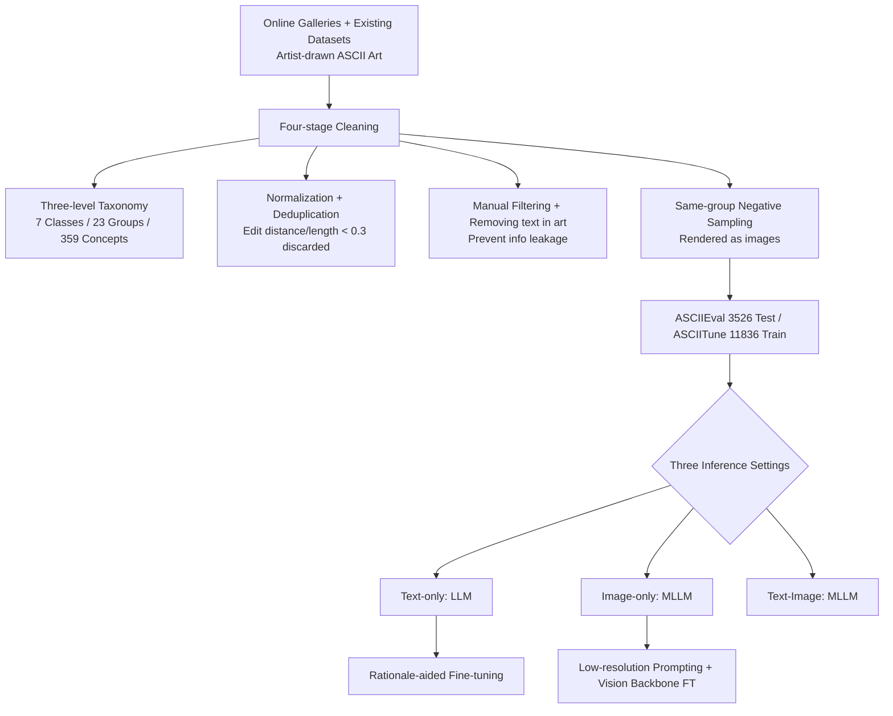

# ASCIIEval: Benchmarking Models' Visual Perception in Text Strings via ASCII Art

**Conference**: ICLR 2026  
**OpenReview**: [https://openreview.net/forum?id=qg7zOTPtg6](https://openreview.net/forum?id=qg7zOTPtg6)  
**Code**: [https://github.com/JiaQiSJTU/VisionInText](https://github.com/JiaQiSJTU/VisionInText)  
**Area**: Multimodal Evaluation / Visual Perception Benchmark  
**Keywords**: ASCII art, visual perception, LLM/MLLM evaluation, cross-modal alignment, OCR trade-off  

## TL;DR
Using human-artist-drawn ASCII art as a carrier, this paper constructs ASCIIEval, a recognition benchmark where content is strictly equivalent in both text and image modalities. It systematically reveals multiple diagnostic findings: LLMs can "see" visual semantics from pure strings, open-source MLLMs face a trade-off between OCR and global visual perception, and current models fail to benefit from "text + image" dual-modality inputs.

## Background & Motivation
**Background**: While OCR (reading text from images) is well-studied, the inverse problem—whether visual information embedded in text strings can be perceived by models—is rarely explored. LLMs pre-trained on massive text are hypothesized to capture 2D structures through newline characters `\n`, yet existing benchmarks (MMLU, FrontierMath) focus on linguistic semantics. MLLM benchmarks (MMMU, MMStar) use natural images and cannot guarantee semantic alignment between modalities in mixed inputs.

**Limitations of Prior Work**: Existing ASCII-related tasks are limited—BigBench only includes basic character recognition; other works use rule-based box diagrams, tone-based images, or small sets (~40 samples) generated by tools like Figlet. Models easily overfit to conversion patterns rather than truly understanding visual content. Classification studies typically use only ~5 categories, insufficient for diagnosing model visual representation capabilities.

**Key Challenge**: ASCII art resides in the middle ground between text and images. Composed of fixed-width printable characters, **the same content can be expressed as a text string or a rendered image with identical semantics**. This "modal-agnostic" property makes it an ideal probe for visual perception: for LLMs, it tests visual perception in pure text; for MLLMs, it tests generalization to unconventional images and serves as a proxy for cross-modal alignment. Building a rigorous benchmark requires addressing data scarcity, limited categories, and lexical leakage.

**Goal**: Construct a verifiable recognition benchmark with rich categories and equivalent text/image content to comprehensively diagnose LLM and MLLM visual perception in text strings and explore enhancement pathways.

**Core Idea**: **(1) Taskification** — Formulate the problem as a multiple-choice recognition task ("What is in this ASCII art?") for objective verification. **(2) Modal Equivalence** — Provide both text strings and rendered images for every sample, creating Text-only, Image-only, and Text-Image reasoning settings. **(3) High-quality Manual Curation** — Organize samples in a three-level taxonomy, manually filter unidentifiable samples, and remove internal text characters to prevent information leakage.

## Method

### Overall Architecture
ASCIIEval provides an evaluation system encompassing "data construction + multimodal diagnosis + targeted enhancement." ASCII art is collected from online galleries and datasets, then processed through four cleaning stages to build the ASCIIEval test set (3,526 samples / 359 concepts) and the ASCIITune training set (11,836 samples). Over 50 LLMs/MLLMs are evaluated across three modal settings to diagnose performance across dimensions like length and cross-benchmark correlation. Targeted enhancements, such as rationale-aided fine-tuning for LLMs and low-resolution prompting for MLLMs, are proposed.

### Key Designs

**1. Modal-agnostic Recognition Task: Isolating "Visual Perception" via MCQs.** Given an ASCII art sample, let $x_{text}$ be the original text and $x_{img}$ be the rendered image. The model selects the correct concept from a candidate set $C=\{c_1,\dots,c_k\}$. The three settings are $\hat{y}_{text}=\mathrm{LLM}(x_{text},C)$, $\hat{y}_{img}=\mathrm{MLLM}(x_{img},C)$, and $\hat{y}_{multi}=\mathrm{MLLM}(x_{img},x_{text},C)$. MCQs allow objective, automated scoring and prevent subjective generative evaluation. Providing identical content in both modalities enables clean cross-modal comparison and definition of an "oracle upper bound" (correct if either modality succeeds).

**2. Three-level Taxonomy + Strict Cleaning: Ensuring Challenge without Shortcuts.** Inspired by iOS emoji categories, a "Concept → Group → Class" tree (7 classes, 23 groups, 359 concepts) was designed. Negative options are sampled from the same group to ensure semantic proximity and difficulty. Cleaning involves three operations: normalization (removing redundant spaces), deduplication (discarding samples with an edit distance ratio < 0.3 or lines > 100), and **manual removal of internal characters** within the art. This forces models to rely on visual structure rather than reading text, closing leakage loopholes. Human performance (97-100% accuracy) confirms the task's simplicity for humans, highlighting model gaps.

**3. Rationale-aided Fine-tuning: Bridging LLM 2D Perception via "Divide and Conquer".** Direct fine-tuning on ASCIITune failed to improve perception. Inspired by GPT-5's performance and Chain-of-Thought (CoT) logic, the authors used GPT-5 (given both $x_{text}$ and $x_{img}$) to synthesize 6,309 rationales interpreting local ASCII features. During fine-tuning, the model receives $x_{text}$ and targets "Rationale + Answer $y$". For Qwen3-8B, zero-shot CoT and standard fine-tuning achieved 27.21% and 26.23% respectively, while rationale-aided fine-tuning reached 35.66% (26.10% gain). The authors note this isn't necessarily a "true" capability boost but rather the rationale helping the model decompose complex art into fragments seen during training. The bottleneck remains tokenization, which disrupts 2D spatial continuity.

**4. Low-resolution Prompting: "Blurring" Images to Force Global Perception.** Diagnosing that open-source MLLMs struggle because "OCR is too strong to see the whole," the authors proposed a test-time strategy: intentionally reducing input resolution to obscure individual characters. In Qwen2.5-VL-7B, setting min pixels to 1 and max pixels to 16 achieved 52.32%, outperforming the default setting by 17.49%. This challenges the "higher resolution is better" paradigm. SFT experiments show that **fine-tuning the vision backbone is critical**: LoRA on the vision backbone reached 75.48% (near full-parameter tuning at 75.83%), while tuning only the text backbone was ineffective (35.99%).

## Key Experimental Results

### Main Results
Macro-Accuracy (%) comparison between Top Proprietary and Open-source models. Human upper bound is 98.33%, random baseline is 25%:

| Modality | Leading Proprietary | Accuracy | Leading Open-source | Accuracy | Gap (Prop.-Open) |
|------|------|------|------|------|------|
| Text-only (LLM) | GPT-5 | 55.90 | DeepSeek-V3 | 35.94 | 19.96% |
| Image-only (MLLM) | GPT-5 | 87.81 | CogVLM2-Llama3-19B | 67.80 | 20.01% |

Dataset scale: ASCIIEval 3,526 samples / 359 concepts / 23 groups / 7 classes; ASCIITune 11,836 samples / 2,307 concepts.

### Ablation Study
Macro-Accuracy (%) of Qwen2.5-VL-7B under different strategies:

| Strategy | Setting | Accuracy |
|------|------|------|
| Low-res prompting | default | 34.83 |
| | (1, 16) | **52.32** |
| | (1, 128) | 38.81 |
| Supervised Fine-tuning | zero-shot | 34.83 |
| | Full FT | **75.83** |
| | LoRA (Vision-only) | 75.48 |
| | LoRA (Text-only) | 35.99 |

LLM Fine-tuning (Qwen3-8B): Zero-shot CoT 27.21% / Standard FT 26.23% / **Rationale-aided FT 35.66%** (+26.10% gain).

### Key Findings
- **LLMs can "see" visual semantics from text**: All models exceed the 25% baseline and show strong correlation with TableEval/SGP-Bench (Pearson 0.78 / 0.85), suggesting a shared underlying capability.
- **"Generational Regression" in Open-source MLLMs**: Newer models sometimes underperform predecessors (e.g., Qwen-VL dropped from 52.32% to 34.83% at the same scale). This is due to a **strong negative correlation** with OCR benchmarks—over-optimizing for OCR harms global visual perception.
- **Scaling Law is series-specific**: Gemma-3-27B outperforms larger models, proving lightweight models can possess strong visual perception.
- **Dual-modality Degradation**: Performance hierarchy is consistently Image-only > Text-Image > Text-only. Adding text can degrade performance by up to 12.23%, revealing MLLMs' inability to fuse consistent cross-modal signals.
- **Length Sensitivity**: Text-only models favor short art (dense local features like `()'`;` are sufficient), while Image-only models favor long art (similar to real images/posters).

## Highlights & Insights
- **The "Modal-agnostic" insight is the core contribution**: ASCII art makes text/image content strictly equivalent, allowing the first clean comparison between LLMs and MLLMs and quantifying the untapped potential of dual-modality fusion via the oracle upper bound.
- **Diagnostic and Counter-intuitive**: Generational regression in MLLMs, the OCR-global perception trade-off, the effectiveness of low-resolution, and dual-modality degradation are powerful counter-examples to the "more is always better" trend.
- **Honesty in LLM Enhancement**: The authors admit rationale tuning is "divide and conquer" for memory fragments and identify tokenization as the fundamental bottleneck for 2D structure.
- **Security Implications**: Recognizing that ASCII art versions of sensitive words (e.g., "bomb") can bypass safety filters, making the understanding of visual perception crucial for active defense.

## Limitations & Future Work
- **Enhancements are post-hoc**: Rationale tuning and low-res prompting are patches rather than inherent architectural balances between fine-grained OCR and global perception.
- **LLM Bottleneck Unsolved**: Tokenization naturally breaks 2D spatial continuity. Exploring alternative input representations is a key future direction not implemented here.
- **Lack of Cross-modal Fusion**: Dual-modality interference exposes the lack of dynamic fusion in MLLM architectures.
- **Class Imbalance**: Samples per concept range from 1 to 170 (average 9.82); ASCIITune is larger but lower quality.

## Related Work & Insights
This work extends the use of unconventional structures as visual/spatial probes (box diagrams, ASCII for spatial reasoning/jailbreaking). It differs by focusing on **human-drawn, abstract art rich in visual information** rather than rule-generated patterns, preventing models from overfitting to conversion logic. For benchmark design, it suggests that **diagnostics should isolate single capabilities**. For model researchers, it warns that blind pursuit of OCR performance may come at the cost of global visual understanding.

## Rating
- **Novelty**: ⭐⭐⭐⭐⭐ Using the modal-agnostic nature of ASCII art to benchmark text/image equivalence is highly original.
- **Experimental Thoroughness**: ⭐⭐⭐⭐⭐ Evaluated 50+ models from 2023–2025 across multiple dimensions and modalities.
- **Writing Quality**: ⭐⭐⭐⭐ Clear structure and concise findings with honest self-assessment.
- **Value**: ⭐⭐⭐⭐⭐ Fills a gap in evaluating visual information in text, with implications for safety, alignment, and model design.

<!-- RELATED:START -->

## Related Papers

- [\[ICLR 2026\] ViPER: Empowering the Self-Evolution of Visual Perception Abilities in Vision-Language Models](viper_empowering_the_self-evolution_of_visual_perception_abilities_in_vision-lan.md)
- [\[ICLR 2026\] IndicVisionBench: Benchmarking Cultural and Multilingual Understanding in VLMs](indicvisionbench_benchmarking_cultural_and_multilingual_understanding_in_vlms.md)
- [\[CVPR 2026\] DEVA: Fine-tuning Multimodal Large Language Models for Visual Perception Tasks](../../CVPR2026/multimodal_vlm/deva_fine-tuning_multimodal_large_language_models_for_visual_perception_tasks.md)
- [\[ICLR 2026\] Omni-Captioner: Data Pipeline, Models, and Benchmark for Omni Detailed Perception](omni-captioner_data_pipeline_models_and_benchmark_for_omni_detailed_perception.md)
- [\[ICLR 2026\] Multimodal Aligned Semantic Knowledge for Unpaired Image-text Matching](multimodal_aligned_semantic_knowledge_for_unpaired_image-text_matching.md)

<!-- RELATED:END -->
