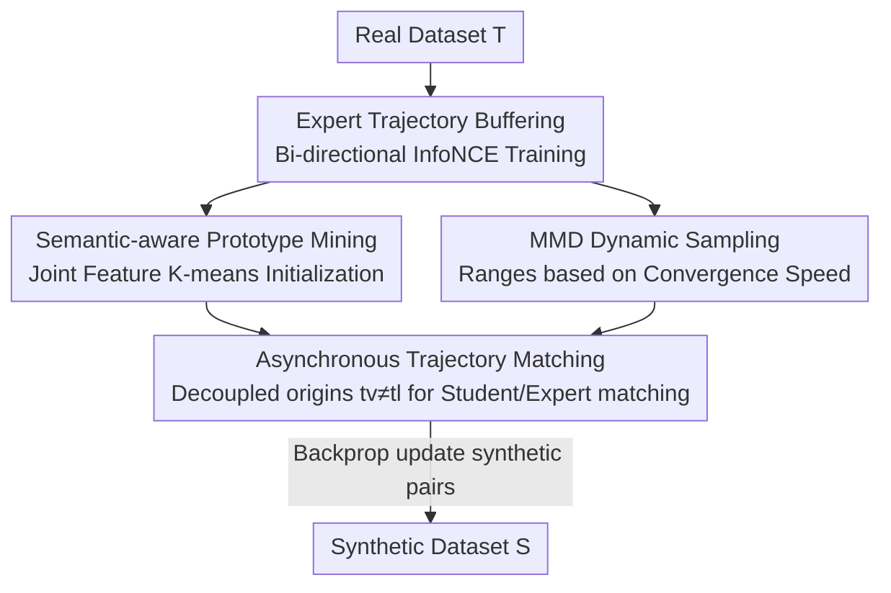

# Asynchronous Matching with Dynamic Sampling for Multimodal Dataset Distillation

**Conference**: ICLR2026  
**OpenReview**: [https://openreview.net/forum?id=7SgSMKM2KF](https://openreview.net/forum?id=7SgSMKM2KF)  
**Code**: To be confirmed  
**Area**: Multimodal VLM / Dataset Distillation  
**Keywords**: Multimodal Dataset Distillation, Trajectory Matching, Asynchronous Sampling, Prototype Mining, Cross-modal Retrieval

## TL;DR
Addressing the "asynchronous optimization rhythms of image and text networks" in image-text dataset distillation, this paper proposes the AMD framework. It decouples the sampling origins of image and text expert trajectories for **asynchronous trajectory matching**, utilizes MMD to measure convergence speed differences to **dynamically determine the sampling range for each modality**, and replaces random initialization with **semantic prototype mining**. On Flickr30k and COCO, it significantly refreshes distilled retrieval performance with almost zero extra overhead (e.g., IR@1/@5/@10 Gained by 4.5%/9.6%/10.9% under the Flickr30k 200-pair setting).

## Background & Motivation

**Background**: Dataset Distillation (DD) aims to compress a large dataset into a tiny set of synthetic samples, ensuring that models trained on the synthetic set approximate the performance of those trained on the original set, thereby saving storage, compute, and accelerating experimentation. Matching Training Trajectories (MTT) is a mainstream approach: first pre-train on real data for several epochs to store "expert trajectories" (network parameters at different steps), then optimize synthetic data to align "student trajectories" with corresponding segments of expert trajectories.

**Limitations of Prior Work**: Most DD works focus on single modalities (image or text classification). With the explosion of image-text pairs and VLMs, Multimodal Dataset Distillation (MDD) has become a necessity. However, it faces two challenges absent in single-modality paradigms: (i) the need to distill joint knowledge from **heterogeneous modalities** where feature spaces are unaligned and optimization dynamics differ; (ii) image-text data **lacks discrete categories** for guidance, and the semantic space is vast and continuous, making random initialization difficult for covering the original distribution and prone to selecting "bad starting points" with blurry descriptions or poor image quality.

**Key Challenge**: Existing MDD methods (MTT-VL, LoRS) default to **synchronous sampling** of image and text trajectories—taking expert parameters at the same training step $t_v=t_l$ for matching. This assumption is borrowed from single-modality VLM training. This paper questions this: image encoders (e.g., NFNet) and text encoders (e.g., frozen BERT + linear layer) have vastly different architectures and parameter update dynamics—text networks converge quickly after initial fluctuations, while image networks maintain high update intensity throughout. The optimization topologies for synthetic images ($3\times224\times224$ pixels) and synthetic text (768-dim embeddings) are also entirely different. Forced synchronization ties two inconsistent rhythms together, hindering synthetic data quality.

**Goal**: Align the distillation process with the unique optimization rhythms of each modality while addressing the lack of coverage in initialization without category guidance.

**Key Insight**: **Decouple** the sampling origins of image and text trajectories (asynchronous matching), automatically determine modality-specific sampling phases using a data-driven approach (MMD ratio), and use clustering prototypes instead of random initialization to improve coverage.

## Method

### Overall Architecture

AMD (Asynchronous Matching with Dynamic sampling) takes a large-scale real image-text dataset $\mathcal{T}=\{(x_i,y_i)\}$ as input and outputs a budget-limited synthetic dataset $\mathcal{S}=\{(\tilde{x}_j,\tilde{y}_j)\}$ ($M\ll N$). The pipeline follows the "buffering + distilling" backbone of MTT but introduces three modifications.

**Step 1: Buffering**: Train the image encoder $\theta_V$ and text encoder $\theta_L$ on real data using bi-directional InfoNCE loss for 10 epochs across 20 repetitions, periodically saving parameters to obtain 20 expert trajectories $\{\theta_V^{(0)},\dots,\theta_V^{(r)}\}$ and $\{\theta_L^{(0)},\dots,\theta_L^{(r)}\}$.

**Step 2: Initialization**: Instead of random selection, **Semantic-aware Prototype Mining (SPM)** is used to perform K-means clustering in the joint image-text feature space, selecting $B$ representative prototypes to initialize the $B$ synthetic samples.

**Step 3: Distilling**: Enter **Asynchronous Trajectory Matching**—sampling origins $(t_v, t_l)$ for image and text expert trajectories are selected independently, no longer requiring $t_v=t_l$. The sampling ranges $(R_V, R_L)$ for these origins are determined by **MMD Dynamic Sampling** based on modality convergence differences. Student trajectories are then run on synthetic data for $N$ steps to match expert trajectories of $M$ steps, minimizing normalized $\ell_2$ matching loss to update synthetic pairs via backpropagation until convergence.

### Key Designs

**1. Semantic-aware Prototype Mining (SPM): Replacing random initialization with clustering prototypes**

Image-text data lacks discrete categories, and random initialization often clusters around a few similar semantics (e.g., multiple "dogs running on grass"), leading to low diversity and high redundancy. SPM treats initialization as "intentionally placing points in the semantic space": first, pre-trained encoders extract visual features $v_i=\theta_V(x_i)$ and text features $l_i=\theta_L(y_i)$ for each pair, concatenated into joint features $f_i=[v_i;l_i]$. K-means is performed on $\{f_i\}$ where the **number of clusters $K$ equals the synthetic budget $B$**, yielding $B$ centroids $\{c_k\}$. For each centroid, the real sample closest to it in joint feature space is chosen as the prototype:

$$
\{c_k\}_{k=1}^{B}=\mathcal{C}(\{f_i\},K=B),\qquad (x_k^*,y_k^*)=\arg\min_{x_i,y_i}\|f_i-c_k\|_2.
$$

This ensures the initial synthetic set naturally covers various semantic clusters (football, motocross, skiing, etc.), mitigating redundancy and providing a high-quality starting point. t-SNE visualizations show SPM prototypes uniformly cover the semantic manifold compared to random ones.

**2. Asynchronous Trajectory Matching: Decoupling sampling origins of image and text expert trajectories**

This is the core of the paper. Conventional methods force image and text expert parameters from the same training step ($t_v=t_l$). Empirical observations (mid-to-late stage decoupling, faster text network convergence, and faster synthetic text optimization) suggest rigid synchronization is sub-optimal. AMD allows $t_v$ and $t_l$ to be **selected independently**, combining richer cross-modal expert parameter pairs. Matching loss aligns the "student parameters after $N$ steps" with "expert parameters after $M$ steps from $t_v$/$t_l$" using normalized $\ell_2$ distance:

$$
\mathcal{L}_{AMD}=\frac{\|\tilde{\theta}_V^{(t_v+N)}-\theta_V^{(t_v+M)}\|_2}{\|\theta_V^{(t_v)}-\theta_V^{(t_v+M)}\|_2}+\frac{\|\tilde{\theta}_L^{(t_l+N)}-\theta_L^{(t_l+M)}\|_2}{\|\theta_L^{(t_l)}-\theta_L^{(t_l+M)}\|_2},\quad t_v\in[0,R_V],\ t_l\in[0,R_L].
$$

Decoupling is effective because it allows text to be matched stably in its best converged stage while allowing images to optimize along more informative gradients without phase constraints. Adding AMD alone improves IR@1 from 8.6% to 12.1%.

**3. MMD Dynamic Sampling: Automatically determining sampling ranges based on convergence speed**

After decoupling, which ranges should $t_v$ and $t_l$ cover? If text is sampled late in its trajectory, it captures redundant parameters that have already converged. AMD uses Maximum Mean Discrepancy (MMD) to quantify parameter update magnitudes between adjacent epochs—under a linear kernel, MMD simplifies to the squared Euclidean distance of average parameter vectors:

$$
\text{MMD}_{V,t}=\Big\|\tfrac{1}{n_V}\sum_i\theta_{V,i}^{(t-1)}-\tfrac{1}{n_V}\sum_i\theta_{V,i}^{(t)}\Big\|_2.
$$

Text side $\text{MMD}_{L,t}$ follows similarly. The median ratio across the trajectory $T_{\text{median}}=\text{Median}\big(\text{MMD}_{V,t}/(\text{MMD}_{L,t}+\epsilon)\big)$ acts as a boundary: once the ratio exceeds the median, text is considered stable relative to images. Thus, **the text sampling range $R_L$ is truncated before the crossover point, while the image range $R_V$ extends beyond it**:

$$
R_V=\min\{t\mid \tfrac{\text{MMD}_{V,t}}{\text{MMD}_{L,t}+\epsilon}>T_{\text{median}}\},\quad R_L=\max\{t\mid \tfrac{\text{MMD}_{V,t}}{\text{MMD}_{L,t}+\epsilon}\le T_{\text{median}}\}.
$$

### Loss & Training
The distillation objective is the asynchronous matching loss $\mathcal{L}_{AMD}$. Synthetic pairs $(\tilde{x},\tilde{y})$ are updated using learning rate $\eta_S$ via $(\tilde{x},\tilde{y})\leftarrow(\tilde{x},\tilde{y})-\eta_S\nabla\mathcal{L}_{AMD}$ until convergence. Expert buffering uses bi-directional InfoNCE. Implementation follows LoRS: NFNet for image encoding and BERT (frozen, linear layer trained) for text encoding. Synthetic data is optimized via SGD (momentum 0.5). Results are the mean ± standard deviation of 15 evaluations (3 synthetic sets × 5 retrains each).

## Key Experimental Results

### Main Results

Datasets: Flickr30k (31,783 images) and COCO (123,287 images). Evaluation: Cross-modal retrieval Recall@K (I2T as IR@K, T2I as TR@K). Below is the I2T main result for Flickr30k (200-pair setting):

| Method | IR@1 | IR@5 | IR@10 | Gain (IR@1) |
|------|------|------|-------|------|
| Random (coreset) | 1.1 | 4.8 | 9.2 | - |
| MTT-VL | 4.6 | 16.0 | 25.5 | - |
| Prev. SOTA (LoRS) | 8.6 | 25.3 | 36.6 | Baseline |
| **Ours (AMD)** | **13.1** | **34.9** | **47.5** | **+4.5** |

AMD remains superior on COCO (200-pair IR@1/@5/@10 gains +1.4/+4.1/+5.9 vs LoRS). Observations: (1) Gains from asynchronous matching increase with distillation budget ($B$); (2) Significant improvements in the I2T direction validate that forced matching of imbalanced trajectories hinders synthetic data optimization.

### Ablation Study (Flickr30k 200 pairs)

| Baseline | AMD | SPM | IR@1 | IR@5 | IR@10 |
|----------|-----|-----|------|------|-------|
| ✓ | | | 8.6 | 25.3 | 36.6 |
| ✓ | ✓ | | 12.1 | 33.9 | 46.7 |
| ✓ | | ✓ | 9.1 | 26.4 | 38.5 |
| ✓ | ✓ | ✓ | **13.1** | **34.9** | **47.5** |

### Key Findings
- **Asynchronous Matching (AMD) is the primary driver**: Adding AMD alone improves IR@1 by 3.5%, significantly more than SPM (+0.5%), proving that modeling cross-modal asynchronous dynamics is central to performance.
- **Cross-architecture Generalization**: Synthetic data distilled with NFNet+BERT maintains superiority when evaluated on ResNet+BERT or RegNet+BERT.
- **High Performance Upper Bound**: Using CLIP encoders, AMD achieves 47.9 IR@1 with only 10% of the synthetic budget, recovering over 96% of the full-dataset upper bound (49.8).

## Highlights & Insights
- **Solid critique of the synchrony assumption**: The authors did not just stack modules; they empirically proved optimization asynchrony using expert trajectories, parameter update magnitudes, and distillation loss curves before designing the solution.
- **Dynamic sampling via MMD is data-driven and parameter-free**: Using the median ratio of parameter changes to set boundaries mitigates manual tuning and is transferable to other multi-teacher or multi-trajectory matching scenarios.
- **Zero additional overhead**: Decoupled sampling and clustering-based initialization do not increase training compute but significantly boost performance, making them highly cost-effective.

## Limitations & Future Work
- **Task Scope**: Validation is limited to cross-modal retrieval on Flickr30k/COCO; performance on more complex VLM tasks like VQA or captioning remains to be seen.
- **Frozen Encoders**: The reliance on frozen text encoders (BERT) may influence the "fast convergence" observation. Whether this holds for end-to-end trainable text encoders or larger VLMs requires further verification.
- **Clustering Scalability**: SPM requires K-means on the full set of joint features, which may face scalability issues on ultra-large-scale datasets.

## Related Work & Insights
- **vs MTT-VL**: MTT-VL introduced trajectory matching to multimodality but used **synchronous** sampling; AMD proves this neglects asynchronous dynamics and yields better results by decoupling.
- **vs LoRS**: LoRS improved MTT-VL with similarity mining and memory-saving techniques (TESLA). AMD outperforms it across all metrics by modifying the trajectory sampling paradigm itself rather than relying on memory tricks.

## Rating
- Novelty: ⭐⭐⭐⭐ Challenging the default synchrony assumption and proposing asynchronous matching is insightful.
- Experimental Thoroughness: ⭐⭐⭐⭐ Comprehensive results and ablations, though task variety is limited to retrieval.
- Writing Quality: ⭐⭐⭐⭐ Clear logic from observation to method; excellent alignment of formulas and diagrams.
- Value: ⭐⭐⭐⭐ A plug-and-play modification with virtually zero cost and significant gains for MDD.

<!-- RELATED:START -->

## Related Papers

- [\[CVPR 2026\] Multimodal Distribution Matching for Vision-Language Dataset Distillation](../../CVPR2026/multimodal_vlm/multimodal_distribution_matching_for_vision-language_dataset_distillation.md)
- [\[ICLR 2026\] Multimodal Dataset Distillation via Phased Teacher Models](multimodal_dataset_distillation_via_phased_teacher_models.md)
- [\[ICLR 2026\] Multimodal Dataset Distillation Made Simple by Prototype-Guided Data Synthesis](multimodal_dataset_distillation_made_simple_by_prototype-guided_data_synthesis.md)
- [\[ICLR 2026\] NExT-OMNI: Towards Any-to-Any Omnimodal Foundation Models with Discrete Flow Matching](next-omni_towards_any-to-any_omnimodal_foundation_models_with_discrete_flow_matc.md)
- [\[ICLR 2026\] Importance Sampling for Multi-Negative Multimodal Direct Preference Optimization](importance_sampling_for_multi-negative_multimodal_direct_preference_optimization.md)

<!-- RELATED:END -->
