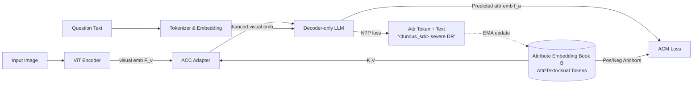

# AttTok: Marrying Attribute Tokens with Generative Pre-trained Vision-Language Models towards Medical Image Understanding

**Conference**: ICLR 2026  
**OpenReview**: [https://openreview.net/forum?id=UjSoF5CM09](https://openreview.net/forum?id=UjSoF5CM09)  
**Code**: To be confirmed  
**Area**: Multimodal Large Models / Medical Image Understanding  
**Keywords**: Medical GPTv, attribute tokens, discriminative representation, cross-modal alignment, instruction tuning  

## TL;DR
Addressing the challenge where generative medical multimodal large models lose discriminative power by encoding clinical attributes like "mild/severe DR" into nearly identical text tokens, this paper proposes **Attribute Tokens (AttTok)**. By assigning a dedicated special token to each clinical concept and implementing a multimodal embedding book, Attribute-centric Cross-attention (ACC) adapter, and Attribute-centric Matching (ACM) loss, the authors explicitly inject discriminative medical knowledge into the generative paradigm. This approach achieves consistent performance gains across 5 classification benchmarks and 3 VQA benchmarks.

## Background & Motivation
- **Background**: Generative pre-trained vision-language models (GPTv) such as GPT-4o and Qwen2.5-VL exhibit excellent general multimodal understanding, inspiring medical GPTv models like LLaVA-Med, HealthGPT, and Lingshu. These models treat medical attributes (e.g., disease names, severity) as text phrases during instruction tuning and learn through next-token prediction.
- **Limitations of Prior Work**: This "attributes-as-text" generative paradigm is a double-edged sword: (1) Semantically distinct clinical concepts (e.g., mild DR and severe DR) are encoded into nearly identical text sequences, causing attribute embeddings to overlap heavily in the token space. (2) Since the causal information flow in GPTv is unidirectional (vision $\rightarrow$ text), weak textual supervision cannot backpropagate to the visual encoder, leading to entangled visual features and misaligned vision-language embeddings.
- **Key Challenge**: Generative paradigms provide expressive flexibility at the cost of token discriminativity; however, precise medical diagnosis requires fine-grained differentiation among numerous clinical attributes.
- **Goal**: To explicitly and precisely inject discriminative medical attributes into GPTv models without abandoning the generative paradigm, while simultaneously enhancing visual representation and cross-modal alignment.
- **Core Idea**: **Anchoring attributes with dedicated tokens**—predefining a special token for each clinical concept (e.g., `<|fundus_sdr|>` for "fundus image + severe DR"). These attribute tokens serve as anchors for a multimodal embedding book spanning vision, text, and attribute modalities, which are then pulled into a unified discriminative space using cross-attention and contrastive matching loss.

## Method

### Overall Architecture
AttTok extends standard GPTv (ViT visual encoder + text tokenizer/embedding + decoder-only LLM) with three components: first, a special token is added for each clinical attribute, maintaining an "embedding book" (containing attribute tokens, keyword text tokens, and visual prototype tokens); second, an Attribute-centric Cross-attention (ACC) adapter injects discriminative knowledge from the embedding book back into the visual encoder, bypassing the vision $\rightarrow$ text unidirectional bottleneck; finally, an Attribute-centric Matching (ACM) loss aligns the three modalities. During training, the ACM loss is jointly optimized with the original NTP loss.

### Key Designs
**1. Attribute tokens and multimodal embedding book: Anchoring clinical concepts.** Every clinical concept is defined as a new predefined token in the format `<|modality_concept|>` (e.g., `<|fundus_sdr|>`). Attributes are derived from labels in classification tasks, while for VQA, keywords are extracted and normalized from QA pairs using open-source GPT models. The embedding layer is expanded from $\{e_i\}_{i=1}^{M}$ to $\{e_i\}_{i=1}^{M}\cup\{a_i\}_{i=1}^{K}$ with $K$ learnable attribute embeddings. Each attribute $k$ is associated with an embedding book $B_k=\{a_k, e_{\text{ind}(k)}, \tilde f^v_k\}$, representing the attribute token, the keyword text token, and the visual prototype obtained by averaging visual tokens for that attribute. The visual prototype is updated via EMA: $\tilde f^v_{k,\text{new}}=\mu\,\tilde f^v_{k,\text{old}}+(1-\mu)\frac{1}{N_v}\sum_{j\in N_v} f^v_j$ ($\mu=0.99$). Attribute and text tokens are jointly optimized as learnable parameters, making each attribute a discriminative anchor across three modalities.

**2. Attribute-centric Cross-attention (ACC) adapter: Creating an "attribute backflow" bypass.** The unidirectional flow of GPTv prevents the visual encoder from receiving textual supervision, while pure text tokens lack discriminative signals. ACC uses the entire set of $K$ attribute embedding books (totaling $3K$ tokens) as keys/values and the visual embeddings $F^v$ as queries: $\text{Att}(F^v,B)=\text{Softmax}\!\left(\frac{(F^v W_Q)(B W_K)^\top}{\sqrt d}\right)(B W_V)$. This is injected via a residual connection: $\hat F^v=F^v+\gamma\,\text{Att}(F^v,B)W_O$ ($\gamma=0.1$). By acting as a "skip route" that feeds attribute knowledge back to the ViT, the ACC enables attribute-aware visual perception.

**3. Attribute-centric Matching (ACM) loss: Cross-modal contrastive alignment.** Beyond augmenting visual tokens, the model must explicitly align visual representations, attribute tokens, and text representations. For an image, the model predicts an embedding $f^a$ corresponding to attribute $k$. Positive samples are drawn from the three representations in its own book $B_k$, while negative samples are taken from all other books $B_j(j\neq k)$. Similarity is computed via a linear projection $\theta(\cdot)$ and cosine similarity: $s(a,b)=\frac{\theta(a)^\top\theta(b)}{\|\theta(a)\|\|\theta(b)\|}$. The matching loss follows the InfoNCE format: $L_{\text{ACM}}(f^a)=-\log\frac{\sum_{p\in B_k}\exp(s(f^a,p)/\tau)}{\sum_{p\in B_k}\exp(s(f^a,p)/\tau)+\sum_{n\in B_j,j\neq k}\exp(s(f^a,n)/\tau)}$. This constraints $f^a$ to a soft classification over all attribute anchors. The final objective is $L_{\text{NTP}}+\lambda L_{\text{ACM}}$.

## Key Experimental Results

### Main Results
Disease diagnosis/classification across five medical imaging modalities (open-end / close-end accuracy, %):

| Model | Derma open/close | Fundus | OCT | X-ray | Path | Avg open/close |
|------|------|------|------|------|------|------|
| CLIP (Discriminative) | – / 68.4 | – / 62.6 | – / 89.8 | – / 93.5 | – / 89.8 | – / 80.8 |
| Qwen2.5-VL-7B (IT) | 65.8 / 71.2 | 55.0 / 61.5 | 59.1 / 73.0 | 76.9 / 87.3 | 72.4 / 81.7 | 65.8 / 74.9 |
| **+ Ours** | **69.6 / 74.6** | **57.6 / 66.0** | **63.1 / 76.7** | **82.7 / 90.5** | **75.2 / 84.4** | **69.6 / 78.4** |
| Lingshu-7B (IT) | 66.3 / 72.8 | 56.3 / 63.7 | 60.8 / 74.7 | 78.9 / 89.1 | 73.5 / 84.3 | 67.2 / 76.9 |
| **+ Ours** | **71.2 / 75.5** | **61.4 / 69.1** | **63.8 / 79.7** | **85.3 / 92.1** | **77.5 / 88.0** | **71.8 / 80.9** |

Medical VQA (Accuracy, %):

| Model | Rad-VQA | SLAKE | PathVQA | Avg |
|------|------|------|------|------|
| Qwen2.5VL-7B | 69.5 | 83.1 | 62.3 | 71.6 |
| **+ Ours** | **70.1** | **84.0** | **63.5** | **72.5** |
| Lingshu-7B | 70.9 | 84.6 | 64.1 | 73.2 |
| **+ Ours** | **71.4** | **85.8** | **64.7** | **74.0** |

### Ablation Study
Component-wise ablation over five modalities:

| Configuration | Trend |
|------|------|
| Baseline | Instruction tuning only, lowest performance |
| + ACC | Breaks the vision-to-text bottleneck; injects attribute info into ViT, stable gains |
| + ACM | Explicitly unifies multimodal representations of clinical attributes, further enhances discriminativity |
| + All | Combines both to achieve the best results across Derma/Fundus/OCT/X-ray/Path |

### Key Findings
- **Instruction Tuning is essential for precise medical diagnosis**: Zero-shot GPTv (e.g., Qwen2.5-VL-7B achieving only 14.2% on Derma close-end) fails at precise diagnosis, highlighting the need for attribute-level supervision.
- **Consistent Gains across backbones**: Both general-purpose (Qwen2.5-VL) and medical-specific (Lingshu) GPTv models see at least a 2% accuracy improvement across five modalities with AttTok.
- **Approaching or exceeding discriminative models**: Within a generative framework, AttTok enables GPTv models to match or exceed CLIP-style discriminative models in tasks like dermatology and DR grading.
- **Gains on strong baselines**: While Lingshu is already pre-trained on large-scale medical data, AttTok still provides a 0.5%–1.2% gain in VQA, showing that attribute-anchored discriminative signals are orthogonal.

## Highlights & Insights
- **Precision in diagnostic pain points**: The study identifies the specific failure of encoding "semantically different but textually similar" medical attributes and provides a token-level solution rather than simply scaling data.
- **Bridging the unidirectional flow**: ACC uses a cross-attention bypass to allow discriminative knowledge to flow back to the visual encoder, skillfully circumventing the standard generative constraints of GPTv.
- **Dual Generative and Discriminative capabilities**: The joint NTP + ACM objective allows the model to retain free-form generation while gaining discriminative representations; t-SNE visualizations show clear separation of attribute token clusters.
- **Design of the Multimodal Embedding Book**: Integrating attribute tokens, text tokens, and visual prototypes into a single book maintained by EMA provides a lightweight yet unified cross-modal alignment hub.

## Limitations & Future Work
- **Attribute Predefinition**: Attributes are naturally available for classification but must be extracted by GPT for VQA, which can be coarse and limits the magnitude of gains in VQA tasks.
- **Scalability of Attribute Count**: ACC processes $3K$ tokens as key/value pairs; the computational overhead of cross-attention and the scale of negative samples may increase with larger clinical attribute systems.
- **Hyperparameter Sensitivity**: Parameters like $\gamma$, $\lambda$, $\tau$, and EMA momentum $\mu$ require manual tuning, and robustness across datasets warrants further discussion.
- **Future Work**: Extending this to automatic/hierarchical attribute discovery (e.g., disease $\rightarrow$ subtype $\rightarrow$ severity) and applying it to open-ended tasks like radiology report generation.

## Related Work & Insights
- **Medical GPTv**: Rather than following the paradigm of LLaVA-Med or Lingshu that treats attributes as plain text, AttTok addresses the shared discriminativity defect in these models.
- **Discriminative VLM**: This work proves that generative models can approach the discriminative power of CLIP or PubMedCLIP.
- **Special Tokens / Soft Prompts**: The idea of encoding concepts with dedicated tokens aligns with concept tokens in visual generation, suggesting a universal paradigm for injecting discriminative structures into generative models via tokens.

## Rating
- Novelty: ⭐⭐⭐⭐ —— The combination of attribute tokens, multimodal embedding books, and reverse cross-attention directly addresses the discriminativity bottleneck in medical GPTv.
- Experimental Thoroughness: ⭐⭐⭐⭐ —— Covers 5 modalities and 3 VQA tasks across two backbones, including comparisons with CLIP and exhaustive ablations.
- Writing Quality: ⭐⭐⭐⭐ —— The motivation (double-edged sword, unidirectional flow) is logically sound, and the diagrams effectively illustrate the solution.
- Value: ⭐⭐⭐⭐ —— Provides a reusable "discriminativity-within-generation" paradigm that is highly relevant for fine-grained clinical diagnosis.

<!-- RELATED:START -->

## Related Papers

- [\[ICLR 2026\] Reading Images Like Texts: Sequential Image Understanding in Vision-Language Models](reading_images_like_texts_sequential_image_understanding_in_vision-language_mode.md)
- [\[AAAI 2026\] SafeR-CLIP: Mitigating NSFW Content in Vision-Language Models While Preserving Pre-Trained Knowledge](../../AAAI2026/multimodal_vlm/safer-clip_mitigating_nsfw_content_in_vision-language_models_while_preserving_pr.md)
- [\[ICLR 2026\] On Discriminative vs. Generative Classifiers: Rethinking MLLMs for Action Understanding](on_discriminative_vs_generative_classifiers_rethinking_mllms_for_action_understa.md)
- [\[CVPR 2025\] Skip Tuning: Pre-trained Vision-Language Models are Effective and Efficient Adapters Themselves](../../CVPR2025/multimodal_vlm/skip_tuning_pre-trained_vision-language_models_are_effective_and_efficient_adapt.md)
- [\[ICLR 2026\] Context Tokens are Anchors: Understanding the Repeat Curse in dMLLMs from an Information Flow Perspective](context_tokens_are_anchors_understanding_the_repeat_curse_in_dmllms_from_an_info.md)

<!-- RELATED:END -->
