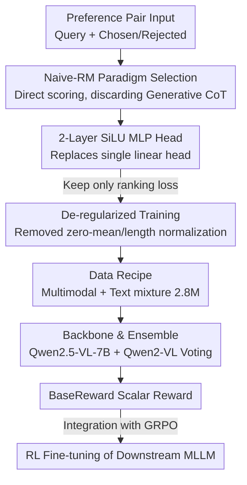

# BaseReward: A Strong Baseline for Multimodal Reward Model

**Conference**: ICLR2026  
**OpenReview**: [https://openreview.net/forum?id=EuN5iszF0a](https://openreview.net/forum?id=EuN5iszF0a)  
**Code**: To be confirmed  
**Area**: Multimodal VLM / Alignment RLHF  
**Keywords**: Multimodal Reward Model, MLLM Alignment, RLHF, Preference Data Recipe, Naive-RM

## TL;DR
Instead of inventing new architectures, this paper deconstructs the process of building a SOTA Multimodal Reward Model (MRM) into six dimensions: paradigm, reward head, regularization, data, backbone/scale, and ensemble. Through systematic ablation, it derives a clear "recipe" and builds BaseReward—a simple yet strong baseline based on Qwen2.5-VL-7B with a two-layer SiLU MLP reward head and selected mixed preference data. It sets new SOTAs on benchmarks like MM-RLHF-Reward Bench and VL-Reward Bench, while offering significantly faster inference than generative reward models.

## Background & Motivation
**Background**: Aligning Multimodal Large Language Models (MLLMs) with human preferences relies on the Reward Model (RM). Given a query and two responses, the RM assigns a higher score to the "better" one, providing a scalar signal for RLHF/GRPO. While text-side RMs have established paradigms, MRM approaches vary widely: Seed-1.5-VL and Keye-VL use generative rewards, Mimo-VL utilizes dual text/multimodal RMs, and GLM-4.1V designs reward strategies by data category.

**Limitations of Prior Work**: The industry lacks a systematic, reproducible guide for building MRMs. Many critical questions remain unanswered: How do different reward paradigms (direct scoring vs. critique-then-score vs. generative) trade off performance, efficiency, and generalization? Should the reward head be more complex? Does common regularization (zero-mean, length normalization) actually help? Which of the dozen available preference datasets are beneficial? Can pure text preference data improve multimodal judgment? What is the most cost-effective backbone and scale?

**Key Challenge**: Researchers often intuitively assume that "generative rewards + long CoT + larger models + more data + regularization" is superior. However, these intuitions lack controlled experimental support. Furthermore, the generative paradigm incurs heavy inference overhead, requiring the model to generate a "think" segment before every judgment during RL, which is costly. Whether a simple Naive-RM is truly weaker has not been rigorously verified.

**Goal**: This paper aims to perform controlled ablations on every key component of the MRM development pipeline to provide an "empirically supported recipe" and use it to construct a fast and powerful baseline.

**Key Insight**: The authors fix a default training set (~200k preference pairs from R1-Reward) and a default backbone (Qwen2.5-VL-7B) as a unified base for individual ablations across dimensions, subsequently combining the optimal choices for full-scale training.

**Core Idea**: By using a "simple Naive-RM + optimized two-layer SiLU reward head + no regularization + selected multimodal/text mixed data" recipe, the authors demonstrate that a plain approach can outperform and outpace complex generative long-CoT reward models. A good reward model depends on making the right choices for each component rather than structural complexity.

## Method

### Overall Architecture
The structure of BaseReward is minimal: it replaces the language model head $h_l$ of a pretrained MLLM backbone $\phi$ with a reward head $l_r$, making the model output a scalar reward $r(y|x)$ for a query $x$ and response $y$. Training utilizes human preference pairs, optimizing the classic Bradley-Terry ranking loss to ensure the preferred response $y_w$ scores higher than the rejected one $y_l$:

$$\mathcal{L}_{\text{Reward}}(\theta) = \mathbb{E}_{x,y_w,y_l}\big[-\log \sigma\big(r(y_w|x) - r(y_l|x)\big)\big]$$

where $\sigma$ is the sigmoid function. The core contribution lies in determining choices for "backbone selection, reward head structure, regularization terms, data mixture, and ensemble strategies" through systematic ablation.

### Key Designs

**1. Naive-RM Paradigm Selection: Returning to direct scoring**
Reward paradigms fall into three categories: Naive-RM (linear head output, e.g., IXC-2.5-Reward), Critic-based RM (generating a critique before scoring, e.g., MM-RLHF), and Generative RM (reframing reward as a generation task, e.g., R1-Reward outputting `<think>...</think><answer>1 or 2</answer>`). While generative RMs seem robust due to reasoning, experiments show their advantages in coding and safety stem from inherent MLLM knowledge rather than the paradigm. Once Naive-RM is supplemented with corresponding data, it matches or exceeds generative models in VQA and hallucination tasks. Given its inference efficiency for RL, Naive-RM is chosen.

**2. Two-layer SiLU MLP Reward Head: Sufficient volume**
While Naive-RM typically uses a single linear head, a multi-layer MLP significantly improves discriminative power. Ablations (Table 2) show that a 2-layer MLP with SiLU activation is optimal (VL-Reward Bench Overall Acc 67.9), whereas Tanh, ReLU, or deeper stacks (3-5 layers) result in performance plateaus or degradation. The 2-layer SiLU setup strikes a balance between non-linear mapping for complex boundaries and generalization.

**3. De-regularized Training: Removing counterproductive terms**
Two common regularizations—zero-mean penalty (encouraging rewards to center around 0) and length normalization (softening the bias toward long responses)—were found to be detrimental. Increasing the zero-mean penalty weight $\lambda$ led to performance drops across metrics. Excluding both regularizations as the default configuration proved superior, simplifying the loss function to only the ranking term.

**4. Data Recipe & Modal Specialization: Pure text data aids multimodal judgment**
Through individual dataset testing, several counter-intuitive findings emerged: not all data is beneficial (e.g., MMIF/SHP were excluded), and different datasets have specific strengths (MMPR for hallucination, R1-Reward for reasoning). Most notably, pure text preference data (e.g., Ultra-Hard) significantly improves multimodal judgment by filling gaps in safety and mathematics. However, the reverse is not true (multimodal data does not help text RM tasks), leading to a strategy of using specialized RMs for different inputs. BaseReward integrates seven selected datasets totaling 2.8 million pairs.

**5. Backbone Selection & Ensemble: 8B is the sweet spot**
Backbone ablations (Table 6) show that Qwen-VL excels in multimodal reward benchmarks, while Intern-VL performs better in text-based benchmarks. Scaling beyond 10B yields diminishing returns. BaseReward utilizes Qwen2.5-VL-7B as the primary model and employs a simple average ensemble with a Qwen2-VL-7B replica, which provides stable gains across both multimodal and text tasks without the overhead of weighted voting.

### Loss & Training
The objective is the pairwise ranking loss without auxiliary terms. Hyperparameters include a learning rate of $3\text{e}{-6}$ (selected via grid search) and a batch size of 128, trained on 64 H100 GPUs. For downstream validation, GRPO is applied to Qwen2.5-VL-3B, comparing rule-based, BaseReward-based, and hybrid reward schemes.

## Key Experimental Results

### Main Results
BaseReward outperforms both open-source and closed-source competitors on MM-RLHF-Reward Bench, particularly in the strict Acc+ metric:

| Model | #Param | Acc | Acc+ |
|------|--------|------|------|
| Claude-3.7-Sonnet | - | 82.35 | 65.22 |
| IXC-2.5-Reward | 7B | 71.18 | 50.00 |
| MM-RLHF-Reward | 7B | 82.00 | 63.00 |
| R1-Reward | 7B | 80.59 | 54.35 |
| BaseReward (Qwen2-VL) | 7B | 90.59 | 78.26 |
| BaseReward (Qwen2.5-VL) | 7B | 91.76 | 80.43 |
| BaseReward (Ensemble) | 7B+7B | **92.94** | 80.43 |

Compared to the previous SOTA, BaseReward improves accuracy by ~11.9% on MM-RLHF-Reward Bench and exceeds Claude-3.7-Sonnet by 23.32% in Acc+.

### Ablation Study

| Dimension | Key Finding | Description |
|------|---------|------|
| Paradigm | Naive-RM ≈ or > Long CoT | Generative gains come from pretrained knowledge; Naive-RM scales better with data. |
| Reward Head | 2-layer + SiLU is optimal | Single linear is worst; >2 layers provide no gain. |
| Regularization | Remove all | Zero-mean and length normalization both decrease performance. |
| Data | Text aids Multimodal | Safety/Math benchmarks improve via text-only preference data. |
| Backbone/Scale | 8B is optimal | Diminishing returns beyond 8B; Qwen-VL specializes in multimodal. |
| Ensemble | Simple Average | Equal to weighted ensemble with zero additional cost. |

### Key Findings
- The reward head change (2-layer SiLU) is the cleanest gain, raising MM-RLHF Acc+ from ~71 to ~80.
- Pure text data compensating for multimodal safety/math is a significant counter-intuitive discovery.
- Naive-RM's efficiency is a major advantage during RL iterations compared to generative models.
- A hybrid "rule-based + BaseReward" approach works best in practical RL, combining objective precision with semantic evaluation.

## Highlights & Insights
- **Defining the simplicity of RM**: By proving Naive-RM is not inferior to long CoT, the paper justifies focusing optimizations on the simpler paradigm.
- **Valuable Negative Results**: Debunking the necessity of zero-mean regularization and length normalization saves research effort.
- **Cross-modal Transfer**: Insights on modal specialization (text aids multimodal but not vice versa) provide architectural guidance for building unified RMs.
- **Strong Baseline Value**: Providing a reproducible "recipe" allows the community to build upon a high-performance, efficient baseline.

## Limitations & Future Work
- **Coding Weakness**: Lack of coding-specific preference data resulted in sub-optimal scores on coding-heavy benchmarks.
- **Scale-specific Conclusions**: Results are primarily derived from models under 8B; the "2-layer SiLU" optimal point might shift at much larger scales.
- **Empirical Focus over Theoretical Innovation**: The paper is a systemic empirical study; deeper theoretical mechanisms for why text aids multimodal judgment remain hypothetical.
- **Ensemble Scoping**: The average ensemble was only tested on two similar-sized backbones.

## Related Work & Insights
- **vs. R1-Reward**: R1-Reward offers explainability via `<think>` but is slow and sensitive to order; BaseReward outperforms it significantly in Acc+ (80.4 vs 54.4) with higher efficiency.
- **vs. MM-RLHF-Reward**: BaseReward removes the critique step, avoiding performance bottlenecks caused by low-quality critiques.
- **vs. IXC-2.5-Reward**: While both use Naive-RM, BaseReward's optimized head and data recipe push the paradigm's ceiling much higher (91.8 vs 71.2 Acc).

## Rating
- **Novelty**: ⭐⭐⭐⭐ No new structure, but systematic ablations and counter-intuitive findings constitute a significant contribution.
- **Experimental Thoroughness**: ⭐⭐⭐⭐⭐ 6-dimension ablations, dozen-dataset comparisons, and RL validation.
- **Writing Quality**: ⭐⭐⭐⭐ Clear "recipe" style with concise insights per section.
- **Value**: ⭐⭐⭐⭐⭐ High practical value via a reproducible SOTA recipe and open-source baseline.

<!-- RELATED:START -->

<!-- Related papers here -->

<!-- RELATED:END -->

## Related Papers

- [\[ACL 2025\] InternLM-XComposer2.5-Reward: A Simple Yet Effective Multi-Modal Reward Model](../../ACL2025/multimodal_vlm/internlm-xcomposer25-reward_a_simple_yet_effective_multi-modal_reward_model.md)
- [\[ICLR 2026\] DeepEyesV2: Toward Agentic Multimodal Model](deepeyesv2_toward_agentic_multimodal_model.md)
- [\[NeurIPS 2025\] A Frustratingly Simple Yet Highly Effective Attack Baseline: Over 90% Success Rate Against the Strong Black-box Models of GPT-4.5/4o/o1](../../NeurIPS2025/multimodal_vlm/a_frustratingly_simple_yet_highly_effective_attack_baseline.md)
- [\[CVPR 2026\] Multimodal RewardBench 2: Evaluating Omni Reward Models for Interleaved Text and Image](../../CVPR2026/multimodal_vlm/multimodal_rewardbench_2_evaluating_omni_reward_models_for_interleaved_text_and_.md)
- [\[CVPR 2026\] WikiCLIP: An Efficient Contrastive Baseline for Open-domain Visual Entity Recognition](../../CVPR2026/multimodal_vlm/wikiclip_an_efficient_contrastive_baseline_for_open-domain_visual_entity_recogni.md)

<!-- RELATED:END -->
