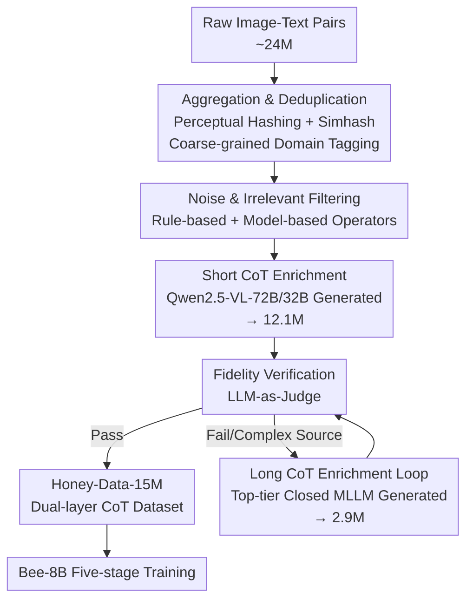

# Bee: A High-Quality Corpus and Full-Stack Suite to Unlock Advanced Fully Open MLLMs

**Conference**: ICLR 2026  
**OpenReview**: [https://openreview.net/forum?id=IVluwK8q9q](https://openreview.net/forum?id=IVluwK8q9q)  
**Code**: https://open-bee.github.io (Available)  
**Area**: Multimodal VLM  
**Keywords**: Fully Open-Source MLLM, SFT Data, Chain-of-Thought, Data Curation Pipeline, Data Quality

## TL;DR
Addressing the pain points of "poor SFT data quality and lack of complex reasoning data" in fully open-source multimodal large models, this paper utilizes an automated data curation pipeline (HoneyPipe) to clean and enrich approximately 24 million raw image-text pairs into Honey-Data-15M, a high-quality dataset of 15 million samples with dual-layer CoT. By training on this dataset, the Bee-8B model achieves new SOTA among fully open-source MLLMs, matching or even surpassing the semi-open InternVL3.5-8B on several reasoning benchmarks.

## Background & Motivation
**Background**: Modern powerful MLLMs generally rely on massive datasets. However, as the field matures, a community consensus has formed: in the Supervised Fine-Tuning (SFT) stage, **data quality is as important as data quantity**. The MLLM ecosystem is divided into three tiers: closed-source top-tier models (GPT-4o, Gemini 1.5), semi-open models that release weights but not data (Qwen2.5-VL, InternVL3.5), and fully open-source models that release data, code, and weights. The fully open-source tier lags significantly behind the former two.

**Limitations of Prior Work**: The root cause of the lag in the fully open-source community lies in data. First is **widespread data noise**—existing open-source SFT datasets suffer from content-level issues (factual errors, image-text mismatches) and structural/format flaws (overly repetitive text, incorrect labels in instructions, abnormal image sizes or aspect ratios). This noise causes models to learn spurious correlations during training, systematically damaging factuality, reasoning, and instruction-following. Second is the **lack of complex reasoning data**—semi-open and closed-source models rely on long Chain-of-Thought (CoT) to handle complex instructions, whereas the fully open-source community lacks large-scale, high-quality long CoT data and struggles to determine "which instructions truly require multi-step deep reasoning."

**Key Challenge**: The problem lies not only in the raw data itself but also in the **lack of transparent, reproducible data curation pipelines**. Previous works released only static final datasets while keeping the cleaning, filtering, and enrichment code, prompts, and logic as black boxes. Meanwhile, closed-source teams continuously iterate on internal data recipes. This asymmetry of "one-time release vs. continuous iteration" prevents the fully open-source community from catching up.

**Goal**: This work focuses on three objectives: (1) creating a large-scale, high-quality SFT dataset with denoising and reasoning enrichment; (2) opening the data curation method itself (rather than just the artifact) to the community for reproducibility and adaptation; and (3) validating the data quality with a model trained from scratch.

**Key Insight**: Instead of competing with semi-open models on data "quantity," it is more effective to win on "quality"—using MLLMs themselves to automate the entire curation process as a scalable and economical alternative to expensive human annotation.

**Core Idea**: Perform **stratified enrichment of reasoning depth** based on instruction complexity (moderate complexity uses short CoT, while the most complex uses long CoT). This cleaning and enrichment process is formalized into a reproducible modular pipeline, HoneyPipe. The Bee-8B model, trained on the resulting Honey-Data-15M, proves that "focusing on data quality" is the critical path for fully open-source models to match semi-open ones.

## Method

### Overall Architecture
The core product of this paper is an automated and reproducible data curation pipeline called **HoneyPipe** (built on the self-developed modular framework DataStudio). It transforms approximately 24 million community raw image-text pairs into Honey-Data-15M, a high-quality SFT dataset of 15 million samples with dual-layer CoT, subsequently used to train Bee-8B. The pipeline consists of four serial stages with a feedback loop in the enrichment phase: it begins with data aggregation and deduplication, followed by noise and irrelevant sample filtering, and then enters **Dual-layer Reasoning Enrichment**. The main path generates large-scale short CoTs, followed by a Fidelity Verification check; samples passing verification enter the final dataset, while **complex samples that fail are routed to the long CoT enrichment loop**, where a stronger model generates detailed long CoTs before passing through the same verification. Finally, the produced dataset is used in a five-stage training process to obtain Bee-8B.

### Key Designs

**1. Dual-layer CoT Enrichment Strategy: Scaling Reasoning Depth with Instruction Complexity**

This is the "backbone" of the dataset, directly addressing the pain point that "the open-source community lacks long CoT and cannot distinguish which instructions require deep reasoning." Traditional approaches either lack reasoning chains or apply the same depth to all samples uniformly. The former fails to learn reasoning, while the latter wastes compute and overcomplicates simple tasks. This work splits enrichment into two layers and uses a verification stage for natural triage: the **main path short CoT** targets moderately complex instructions, using open-source MLLMs (Qwen2.5-VL-72B/32B) to rewrite original short answers into explicit step-by-step reasoning, producing ~12.1 million short CoT samples. The **long CoT loop** specifically serves the most complex instructions requiring multi-step deep solving, using top-tier closed-source MLLMs to generate detailed reasoning with `<think></think>` tags, producing ~2.9 million long CoT samples. Crucially, determining "which instructions go to long CoT" does not rely on pre-tagging but is **naturally screened by fidelity verification**—complex samples failing short CoT verification are those truly needing long CoT and are thus routed to the long loop. This mechanism implicitly leaves the difficult problem of "identifying complex instructions" to the process itself.

**2. Noise and Irrelevant Sample Filtering: Rule-based + Model-based Operators**

To address common noise in open-source datasets, this stage uses two types of operators in synergy. **Rule-based operators** handle structural flaws—removing images with tiny dimensions or extreme aspect ratios, and samples with repetitive text in instructions. **Model-based operators** address content-level image-text consistency: a powerful Qwen2.5-VL-72B is used to judge whether an instruction is reasonable, answerable, and semantically relevant to the visual content (e.g., asking to "solve this function" for an image showing only an orange is flagged as irrelevant and removed). This step clears "bad samples" before entering expensive reasoning enrichment, ensuring a clean foundation and avoiding wasted compute on garbage samples.

**3. Fidelity Verification and Routing: Guarding Correctness with LLM-as-Judge**

The biggest risk of enrichment is the model "hallucinating" a plausible-looking but incorrect reasoning chain. This paper implements a **Fidelity Verification** stage after both short and long enrichment paths. Based on the "LLM-as-a-Judge" paradigm, a verification model (Qwen2.5-VL-72B) performs semantic comparison between the newly generated CoT final conclusion and the original answer. It uses two criteria: **exact match of the final answer** for objective/factual questions, and **thematic relevance/semantic consistency** for descriptive/open-ended questions. Samples that pass enter the final dataset. Short CoT samples that fail are not discarded but **routed to the long CoT loop** for more professional enrichment (as described in Design 1); samples that still fail long CoT are discarded, as they are likely inherently wrong, unsolvable, or too costly to annotate for even top-tier models. This verification-routing mechanism suggests the pipeline can maintain quality while spending compute where it matters most.

**4. Bee-8B Five-stage Training Recipe: Gradual Modeling from Perception to Reasoning**

To validate the dataset effectiveness, the paper provides a reproducible training recipe. The model architecture follows mature designs: Qwen2-8B as the language base, SigLIP2-so400m as the vision encoder, and a two-layer MLP with GELU as the projector, utilizing an Anyres strategy for variable resolution images. Training progresses through five stages: **Stage 1** trains only the projector for MLP warmup to align vision-language feature spaces; **Stage 2** involves full-parameter V-L alignment (14M data) to build a multimodal foundation while preserving LLM knowledge; **Stage 3** is the pivot—large-scale SFT on the full Honey-Data-15M to inject the dual-layer CoT reasoning paradigm; **Stage 4** performs efficient SFT refinement on a more balanced 1M subset (Honey-Data-1M); **Stage 5** applies GRPO for policy optimization to mitigate issues like text repetition and improve response reliability. The success of the final stage depends on the high-quality model from earlier SFT, which in turn validates the data quality.

### Loss & Training
Five-stage configuration (see Table 1 in the original paper): batch sizes of 512/256/256/256/512, learning rates of $1 \times 10^{-3} \rightarrow 4 \times 10^{-5} \rightarrow 5 \times 10^{-5} \rightarrow 3 \times 10^{-5}, 5 \times 10^{-6} \rightarrow 2 \times 10^{-6}$, data volumes of 1M/14M/15M/1M/50K. The first four stages use packed sequence lengths of 8192~16384 for 1 epoch each, and the fifth stage is GRPO reinforcement learning. Evaluation uses a customized VLMEvalKit, with the model in "thinking mode" and a maximum 16384 token reasoning length; LLM judgment uses Qwen2.5-32B in non-thinking mode.

## Key Experimental Results

### Main Results
Bee-8B is compared against fully open-source (`*`) models (LLaVA-OneVision-7B, Molmo-7B-D) and semi-open (`†`) models (Qwen2.5-VL-7B, Keye-VL-8B, InternVL3.5-8B) across General VQA, Document/Chart/OCR, and Mathematical Reasoning benchmarks.

| Task Category | Benchmark | LLaVA-OV-7B* | Qwen2.5-VL-7B† | InternVL3.5-8B† | Bee-8B-RL* |
| :--- | :--- | :--- | :--- | :--- | :--- |
| General | MMMU-Pro | 29.5 | 34.7 | – | **50.7** |
| General | CountBench | – | 74.1 | – | **93.0** |
| General | MMVet | 57.5 | 67.1 | 83.1 | **83.9** |
| General | RealWorldQA | 66.3 | 68.5 | 67.5 | **73.1** |
| Chart/OCR | CharXiv-RQ | – | 42.5 | 44.4 | **57.3** |
| Math & Reason | MathVerse | 26.2 | 25.1 | 61.5 | **67.0** |
| Math & Reason | LogicVista | 33.3 | 44.1 | 57.3 | **61.3** |
| Math & Reason | DynaMath | 9.0 | 21.0 | 37.7 | **41.3** |

Bee-8B leads the second-best Qwen2.5-VL-7B by 3.6% on MMMU-Pro; on CharXiv-RQ, it leads the closest Keye-VL (45.4) by nearly 12%. On MathVerse, the RL version improves over the strong semi-open InternVL3.5-8B by 5.5%. Advantages are most concentrated in factual accuracy and complex multi-step reasoning, directly corresponding to the strengths of CoT-enriched data.

### Ablation Study
To isolate the contribution of each curation step, the authors compare three subsets (based on 1.2M raw samples):

| Configuration | Sample Count | Description | Performance |
| :--- | :--- | :--- | :--- |
| D_raw | 1.2M | Unprocessed raw data | Lowest |
| D_no-CoT | 960K | Full filtering + selection, but CoT answers replaced with original short answers | Middle |
| D_curated | 960K | Full filtering + selection + short CoT enrichment | Highest |

Results show a clear hierarchy $D_{curated} > D_{no\text{-}CoT} > D_{raw}$. The improvement from D_raw to D_no-CoT reflects combined gains from noise filtering and data selection. The leap from D_no-CoT to D_curated proves the value of CoT enrichment itself, with particularly significant gains on reasoning-heavy benchmarks like MathVista and CharXiv-RQ. Another ablation comparing Random-1M and Honey-Data-1M shows that fine-tuning on the 1M curated subset outperforms the randomly sampled version and exceeds the Qwen2.5-VL-7B baseline, validating the 1M data selection strategy.

### Key Findings
- **CoT enrichment is the direct source of reasoning ability**: Removing enrichment (D_no-CoT) causes the most significant performance drops in reasoning-heavy benchmarks, indicating that step-by-step reasoning chains, rather than simple cleaning, are the main drivers of reasoning gains.
- **Data Quality > Data Quantity**: Fine-tuning on only 1M curated samples (Honey-Data-1M) outperforms random 1M subsets and semi-open baselines, confirming that selection is superior to volume.
- **Dual-layer triage implicitly solves complex instruction identification**: By using fidelity verification to route short CoT failures to the long CoT loop, the most difficult instructions are identified for processing by the strongest models without explicit tagging.

## Highlights & Insights
- **Transforming "Identifying Complex Instructions" into "Routing on Verification Failure"**: This is an elegant design—rather than training a separate complexity classifier, the process allows samples that fail short CoT verification to naturally reveal their "need for deep reasoning," achieving triage at zero additional cost.
- **Opening the Method, Not Just the Data**: HoneyPipe and DataStudio make the cleaning/enrichment code, prompts, and filtering logic transparent. This allows the community to iterate continuously rather than relying on a static dataset, which is crucial for competing with closed-source teams who update internal recipes.
- **Model-driven Curation Replacing Human Annotation**: The entire process is automated using MLLMs (open-source for short CoT, closed-source for long CoT, and a model-as-judge for verification). This scalable and economical paradigm is affordable for the open-source community and transferable to other data construction tasks lacking annotation budgets.
- **Engineering Trade-off in Coarse-grained Domain Tagging**: Instead of per-sample classification, the authors assign a general tag to each source by manually inspecting ~5 representative samples. This creates the capability to triage by domain with minimal cost.

## Limitations & Future Work
- **Dependence on stronger teacher models**: Long CoT relies entirely on top-tier closed-source MLLM generation, and verification depends on large model judges. The capacity limits and biases of teacher models translate directly into the dataset, and reproducibility remains constrained by closed-source API access.
- **Potential loss in "Discarding on Verification Failure"**: Samples that fail even long CoT are assumed to be incorrect or too costly to annotate. However, this may include valid samples where the judge model incorrectly identifies a semantic mismatch despite the answer being correct but phrased differently.
- **Unquantified Verification Consistency**: While objective questions require exact matches and subjective ones require semantic consistency, the reliability and false-negative rates of the judge model on subjective tasks have not been independently evaluated.
- **Scale/Compute Threshold**: Constructing the dataset requires processing 24 million raw samples and multiple calls to 72B-class models, which remains heavy for small teams with limited compute.

## Related Work & Insights
- **vs. LLaVA-OneVision / MAmmoTH-VL / PixMo**: These typically release static final datasets while keeping curation pipelines (code/prompts/filtering) as black boxes. This work not only provides the data but also opens the reproducible and adaptable method, significantly filling the gap in complex reasoning data through dual-layer CoT.
- **vs. InternVL3.5-8B / Qwen2.5-VL-7B**: These semi-open models release weights but hide data. Bee-8B is fully open (data + pipeline + recipe + weights + eval) and matches or surpasses them on reasoning benchmarks like MathVerse and CharXiv-RQ, proving that quality data allows open-source models to compete with semi-open ones.
- **vs. General CoT/Reasoning Enhancement (Vision-R1, etc.)**: This work is not about blindly stacking long CoTs; instead, it stratifies depth based on instruction complexity and maintains correctness and automatic triage through fidelity verification, integrating reasoning depth and data reliability into the curation process.

## Rating
- Novelty: ⭐⭐⭐⭐ The dual-layer CoT and verification-driven routing are clever, though individual technical components are mostly combinations of existing methods.
- Experimental Thoroughness: ⭐⭐⭐⭐⭐ Covers dozens of benchmarks across three categories; ablations rigorously isolate the impacts of cleaning, enrichment, and data volume.
- Writing Quality: ⭐⭐⭐⭐⭐ The logic chain from motivation to pipeline to verification is complete and well-visualized.
- Value: ⭐⭐⭐⭐⭐ The full release (15M data + pipeline + recipe + weights) is a major foundational resource for the open-source MLLM community.

<!-- RELATED:START -->

## Related Papers

- [\[ICLR 2026\] A High Quality Dataset and Reliable Evaluation for Interleaved Image-Text Generation](a_high_quality_dataset_and_reliable_evaluation_for_interleaved_image-text_genera.md)
- [\[ICCV 2025\] OpenVision: A Fully-Open, Cost-Effective Family of Advanced Vision Encoders for Multimodal Learning](../../ICCV2025/multimodal_vlm/openvision_a_fully-open_cost-effective_family_of_advanced_vision_encoders_for_mu.md)
- [\[ICLR 2026\] Customizing Visual Emotion Evaluation for MLLMs: An Open-vocabulary, Multifaceted, and Scalable Approach](customizing_visual_emotion_evaluation_for_mllms_an_open-vocabulary_multifaceted_.md)
- [\[ICLR 2026\] FLARE: Fully Integration of Vision-Language Representations for Deep Cross-Modal Understanding](flare_fully_integration_of_vision-language_representations_for_deep_cross-modal_.md)
- [\[ICLR 2026\] ERGO: Efficient High-Resolution Visual Understanding for Vision-Language Models](ergo_efficient_high-resolution_visual_understanding_for_vision-language_models.md)

<!-- RELATED:END -->
