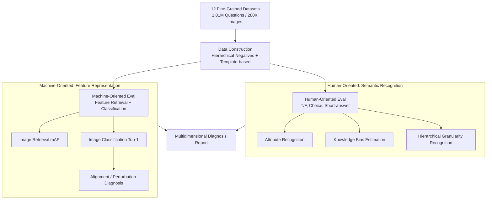

# Benchmarking Large Vision-Language Models on Fine-Grained Image Tasks: A Comprehensive Evaluation

**Conference**: ICLR 2026  
**OpenReview**: [https://openreview.net/forum?id=cVc74MLspe](https://openreview.net/forum?id=cVc74MLspe)  
**Code**: https://github.com/SEU-VIPGroup/FG-BMK  
**Area**: Multimodal VLM  
**Keywords**: Fine-grained Vision, LVLM Evaluation, FG-BMK, Feature Discriminativeness, Modality Alignment

## TL;DR
This paper constructs the first large-scale evaluation benchmark for fine-grained image tasks, FG-BMK (1.01 million questions, 280,000 images). It systematically interrogates 12 mainstream LVLMs/VLMs from two perspectives: "human-oriented dialogue" and "machine-oriented features." The study reveals how contrastive training paradigms, modality alignment, perturbation robustness, and hierarchical category reasoning influence fine-grained performance, discovering that LVLMs still significantly lag behind specialized models in fine-grained tasks.

## Background & Motivation
**Background**: LVLMs (GPT-4o, Qwen, InternVL, LLaVA, etc.) have made rapid progress in multimodal perception and reasoning. Numerous evaluations have emerged around them, including comprehensive benchmarks like LVLM-hub and MMBench, as well as specialized benchmarks like DocVQA, GQA, and MathVista.

**Limitations of Prior Work**: Existing evaluations almost entirely remain at the level of "general perception + common sense reasoning." **Fine-grained image tasks**—which involve distinguishing visual objects at the subordinate category level (e.g., identifying bird species, car models, or aircraft types)—a fundamental capability of computer vision, have rarely been systematically evaluated. A few attempts (e.g., Geigle et al., Zhang et al.) only cover fine-grained classification with a limited number of questions.

**Key Challenge**: Fine-grained tasks require models to capture **subtle discriminative visual patterns** and invoke expert knowledge within the LLM. Mainstream LVLM optimization targets general tasks, and the gap between these two capabilities has never been quantified, leaving the capability boundaries of LVLMs in fine-grained domains unclear.

**Goal**: To clearly quantify this capability boundary—evaluating both whether LVLMs can answer fine-grained visual questions as conversational agents and directly assessing the discriminative power of their visual features while diagnosing which training/alignment choices are detrimental.

**Key Insight**: The authors argue that "question-answering accuracy" only reflects surface-level semantic recognition and masks the quality of visual features. Therefore, they decompose the evaluation into two complementary tracks: **human-oriented** and **machine-oriented**. The former measures semantic recognition, while the latter measures feature representation; the intersection of these tracks reveals the root of the problem.

**Core Idea**: Use a dual-perspective benchmark covering 12 established fine-grained datasets to separately test whether an LVLM "knows how to speak" and whether its "features are high-quality," thereby attributing performance differences to actionable factors such as training paradigms, modality alignment, and data quality.

## Method

### Overall Architecture
FG-BMK is not a new model but a set of evaluation protocols + datasets. Its input is the LVLM/VLM to be evaluated, and its output is a series of diagnostic indicators in the fine-grained dimension. The benchmark collects images from 12 public fine-grained datasets (CUB, Flowers, Dogs, Cars, Aircraft, Food101, iNat2021, etc.), avoiding common quality and mislabeling issues found in web-crawled data. It then proceeds along two parallel evaluation tracks:

- **Human-Oriented Evaluation**: Examines semantic recognition and domain knowledge via dialogue (True/False, Multiple-choice, Short-answer), including attribute recognition, knowledge bias estimation, and hierarchical granularity recognition.
- **Machine-Oriented Evaluation**: Extracts visual features of the model to measure **discriminativeness** and **robustness** directly through basic tasks like image retrieval (mAP) and image classification (Top-1).

These two tracks focus on "what the model says" and "what the model's features are," respectively, allowing for cross-validation of conclusions.

### Key Designs

**1. Human-Oriented Evaluation: Decomposing Semantic Recognition via Three Question Types**

To address the ambiguity of LVLMs' recognition at the subordinate level, the human-oriented track designs questions in a conversational format. It applies pressure using True/False (T/F), Multiple-choice, and Short-answer questions—a response is correct if it contains the ground truth. It is subdivided into: **Attribute Recognition** (T/F and Multiple-choice) for visual attributes like color, size, shape, and texture; **Knowledge Bias Estimation** (T/F) for per-category accuracy statistics; and **Hierarchical Granularity Recognition** for positioning objects across class, genus, and species levels. Constructing negative samples is key: T/F samples use incorrect labels from the same level (e.g., labeling an Aves image as Insecta), while Multiple-choice distractors are sibling categories under the same parent (e.g., Black-footed Albatross vs. Laysan Albatross).

**2. Machine-Oriented Evaluation: Direct Examination of Feature Discriminativeness and Robustness**

QA accuracy can be contaminated by LLM phrasing and randomness. This design bypasses the language output by extracting visual features and quantifying their quality on two basic vision tasks following the DINOv2 protocol: image retrieval (mAP) and classification (Top-1 Acc). It examines **discriminativeness** (the ability to distinguish fine-grained categories via intra-class and cross-class classification) and **robustness** (using Projected Gradient Descent (PGD) to see how much classification accuracy drops under feature perturbation). It also systematically varies visual encoder scales, training data volume, and visual-text alignment to attribute feature quality differences to these variables.

**3. Data Construction: Hierarchy-Based Automatic Question Generation from 12 Datasets**

The 1.01M questions and 280K images are generated using a pipeline based on 12 mature datasets with existing fine-grained labels and hierarchical taxonomies. Using manually designed question templates ensures scale, diversity, and label quality. Sub-tasks use specific sampling strategies: Attribute Recognition uses balanced positive/negative samples; Knowledge Bias Estimation uses images from sibling categories as negative samples; and Hierarchical Granularity Recognition generates questions for each taxonomic level.

## Key Experimental Results

The evaluation covers 9 open-source LVLMs, 2 closed-source models (GPT-4o-1120, Gemini-2.0-flash), and 1 vision-only model (DINOv2), categorized by loss functions such as Contrastive (Con), Generative (Gen), Matching (Mat), Reconstruction (Rec), and Distillation (Dis).

### Main Results

**LVLM performance degrades as granularity becomes finer** (InternVL3 on CUB-200-2011):

| Granularity Level | Multiple-choice Acc | T/F Acc | Note |
|-------------------|---------------------|---------|------|
| Class | 99.76% | 99.77% | Nearly perfect for broad classes (Bird/Insect) |
| Genus | 90.75% | — | Drops by 9.01% for different genera |
| Species | 61.18% | 62.48% | Drops to near random for different species |

**LVLM visual features still lag behind specialized fine-grained models** (Classification Top-1, Table 3):

| Dataset | LVLM-Short Answer (SA) | LVLM-Linear Classification (LC) | Fine-grained Specialized Model |
|---------|--------------|-------------------|----------------|
| CUB-200-2011 | 85.60 | 91.65 | 93.10 |
| Stanford Dog | 86.49 | 90.50 | 97.30 |
| Stanford Car | 90.55 | 94.30 | 97.10 |
| Food-101 | 95.25 | 95.67 | 98.60 |
| FGVC Aircraft | 66.19 | 78.88 | 95.40 |

### Ablation Study

**Modality alignment can harm fine-grained discriminativeness** (LLaVA visual features, Table 4):

| Configuration | CUB | Stanford Dogs | Stanford Cars | Note |
|---------------|-----|---------------|---------------|------|
| Origin (Raw Features) | 79.77 | 81.24 | 87.57 | Raw encoder features are strongest |
| Aligned (Mismatched) | 73.17 | 78.14 | 83.90 | Average drop of 3.39% |
| Aligned-FG (Fine-grained) | 75.06 | 80.69 | 85.63 | Fine-grained text alignment helps recovery |

**Fine-grained tasks are more vulnerable to feature perturbations** (PGD perturbation, Origin → Perturbed):

| Model | CIFAR-100 (General) | CUB-200-2011 (Fine-grained) |
|-------|-------------------|------------------------|
| EVA-CLIP | 93.05 → 50.76 | 88.95 → 24.94 |
| CoCa | 86.94 → 52.23 | 79.89 → 23.40 |
| DINOv2 | 93.38 → 42.39 | 91.64 → 25.94 |
| ViT (CE) | 89.81 → 72.15 | 88.83 → 73.85 |

### Key Findings
- **Contrastive paradigms are best for fine-grained discrimination**: EVA-CLIP, InternVL, and DINOv2 significantly outperform Generative (Qwen) and Reconstruction (BEiT3) models in retrieval/classification. Even a smaller DINOv2-B outperforms a larger BEiT3-L on CUB by 8.08%, suggesting the training paradigm is more critical than encoder scale.
- **Limited gains from scaling model and data size**: DINOv2 gains only 0.6% from B→L and 0.3% from L→G. EVA-CLIP with 2B data did not beat DINOv2 with 142M curated data—data **quality** matters more than quantity.
- **Alignment is a double-edged sword**: Aligning visual features to text can weaken discriminativeness due to feature space distortion and **granularity mismatch** (fine-grained images paired with coarse-grained text). Re-training with granularity-matched data recovered performance in Stanford Dogs (+2.55%).
- **Knowledge bias stems from the LLM**: LLaVA's accuracy across different bird species fluctuated from ~90% to ~30%; fine-tuning on balanced data improved consistency, even for categories not appearing in the training set, suggesting bias is inherited from the base LLM.
- ViT features trained on ImageNet with Cross-Entropy are much more robust to perturbations, hinting that high-quality fine-grained data improves robustness.

## Highlights & Insights
- **Decoupling "Speaking" from "Feature Quality"**: The dual-perspective evaluation cross-validates semantic output and underlying representation, enabling attribution of performance gaps to actionable factors like training paradigm or data quality.
- **Hierarchical negative samples are the soul of fine-grained evaluation**: Distinguishing siblings within the same genus allows the benchmark to pinpoint exactly where the model "collapses" (e.g., 99% accuracy at class level vs. 61% at species level).
- **Counter-intuitive conclusion**: Modality alignment, a core LVLM component, can harm fine-grained discriminativeness due to mismatched text granularity. This provides clear guidance for LVLM data construction: text granularity must match the visual objects.

## Limitations & Future Work
- To isolate the impact of training paradigms, the authors used **earlier versions** of various models; the generalizability to the latest LVLMs requires caution.
- While the dataset is massive, it is generated via templates and existing labels, potentially missing the diversity of real-world user queries.
- The evaluation mainly uses T/F, Multiple-choice, and Short-answer formats; the "contains ground truth" criteria for short answers might overestimate actual understanding.
- The paper provides diagnosis but does not propose a new method; how to enhance fine-grained discrimination without losing general capability remains an open direction.

## Related Work & Insights
- **vs. Comprehensive Benchmarks (LVLM-eHub / MMBench)**: They cover general perception; Ours focuses on the neglected subordinate category level and introduces machine-oriented feature diagnosis.
- **vs. Specialized Benchmarks (DocVQA / GQA / MathVista)**: They focus on documents or reasoning; Ours focuses on fine-grained recognition as a fundamental CV capability with million-scale hierarchical coverage.
- **vs. Existing Fine-grained Eval (Geigle et al. / Zhang et al.)**: Prior work was limited to classification or small question volumes; Ours achieves comprehensiveness through dual paradigms and multidimensional attribution.

## Rating
- Novelty: ⭐⭐⭐⭐ First systematic dual-perspective benchmark for fine-grained LVLMs with insightful attribution.
- Experimental Thoroughness: ⭐⭐⭐⭐⭐ 12 models × 12 datasets × multiple tasks × multi-dimensional diagnosis.
- Writing Quality: ⭐⭐⭐⭐ Clear conclusions and visualizations.
- Value: ⭐⭐⭐⭐ Provides actionable guidance for LVLM data and training design; opens source code and benchmark.

<!-- RELATED:START -->

## Related Papers

- [\[ICLR 2026\] GranViT: A Fine-Grained Vision Model For Autoregressive Multimodal Large Language Models](granvit_a_fine-grained_vision_model_for_autoregressive_multimodal_large_language.md)
- [\[ICCV 2025\] Fine-Grained Evaluation of Large Vision-Language Models in Autonomous Driving](../../ICCV2025/multimodal_vlm/fine-grained_evaluation_of_large_vision-language_models_in_autonomous_driving.md)
- [\[ICLR 2026\] InternSVG: Towards Unified SVG Tasks with Multimodal Large Language Models](internsvg_towards_unified_svg_tasks_with_multimodal_large_language_models.md)
- [\[ICLR 2026\] SpaCE-10: A Comprehensive Benchmark for Multimodal Large Language Models in Compositional Spatial Intelligence](space-10_a_comprehensive_benchmark_for_multimodal_large_language_models_in_compo.md)
- [\[ICLR 2026\] HSSBench: Benchmarking Humanities and Social Sciences Ability for Multimodal Large Language Models](hssbench_benchmarking_humanities_and_social_sciences_ability_for_multimodal_larg.md)

<!-- RELATED:END -->
