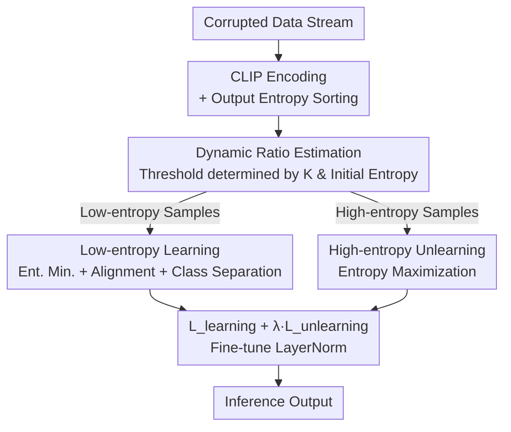

# Bilateral Information-aware Test-time Adaptation for Vision-Language Models

**Conference**: ICLR2026  
**OpenReview**: [https://openreview.net/forum?id=vv8EcCoBfr](https://openreview.net/forum?id=vv8EcCoBfr)  
**Code**: https://github.com/tmlr-group/BITTA  
**Area**: Multimodal VLM / Test-time Adaptation  
**Keywords**: Test-time Adaptation, CLIP, Entropy Minimization, Unlearning, Robustness

## TL;DR
To address the issue of Vision-Language Models (VLMs) like CLIP overfitting to atypical features during Test-time Adaptation (TTA) when using only a "fixed ratio of low-entropy samples," this paper proposes BITTA: it simultaneously "learns" core representations from a **dynamic ratio** of low-entropy samples and "unlearns" atypical features from high-entropy samples. This approach consistently improves the average accuracy of various TTA methods by approximately 1–2 percentage points on corrupted datasets such as CIFAR-10/100-C and ImageNet-C.

## Background & Motivation
**Background**: VLMs like CLIP achieve powerful zero-shot generalization through massive image-text pair pre-training. However, when deployed in real-world scenarios, distribution shifts (covariant shifts) caused by weather changes, digital noise, etc., lead to significant performance degradation. Test-time Adaptation (TTA) is a mainstream countermeasure—fine-tuning the model with unsupervised losses (typically entropy minimization) on unlabeled new data during inference to adapt to the shifted distribution.

**Limitations of Prior Work**: The authors observe that most TTA research focuses on "designing optimization objectives" while largely ignoring "which data to use for adaptation." The standard practice is to sort test samples by output entropy and select a **pre-set fixed ratio** (e.g., top 10%) of low-entropy (high-confidence) samples for entropy minimization, assuming these samples contain "typical features" representative of the target distribution.

**Key Challenge**: This fixed low-entropy selection has two neglected drawbacks. First, **learning on low-entropy samples can exacerbate errors for certain samples**. The authors tracked entropy changes in four categories of samples during TTA (Fig. 2) and found that for samples consistently misclassified or those transitioning from correct to incorrect, the model becomes increasingly confident (lower entropy). This indicates the model memorizes "atypical features / noise," which harms adaptation. Second, **a fixed selection ratio is not universal across distributions**—the optimal ratio varies for different datasets and even different corruption types within the same dataset.

**Key Insight**: Two counter-intuitive observations provide a solution. First, the "indistinguishable" noise in high-entropy samples shares a **common origin** with the misjudged "atypical features" in low-entropy samples (Fig. 3a). Thus, high-entropy samples can serve as a "negative set" to counteract overfitting—actively increasing the predictive entropy of high-entropy samples simultaneously reduces the overconfidence of misjudged low-entropy samples (Fig. 3b). Second, the **entropy values corresponding to different optimal ratios are highly consistent**, and initial entropy exhibits a linear relationship with the number of classes $K$, providing a standardizable signal for "dynamically predicting the optimal ratio."

**Core Idea**: Instead of focusing "unilaterally" on learning from low-entropy samples, the method utilizes **bilateral information**—using a dynamic ratio of low-entropy samples to "learn" core representations and high-entropy samples to "unlearn" atypical features in parallel.

## Method

### Overall Architecture
BITTA (Bilateral Information-aware Test-Time Adaptation) is primarily a framework designed from a "data perspective" that is decoupled from specific adaptation objectives. It does not replace existing TTA learning losses but rather functions at the data selection layer, allowing it to be integrated as a plug-and-play module into methods like TPT, TPS, and BAT.

Given a corrupted data stream, the BITTA workflow is: (1) Use a pre-trained CLIP to extract image features and text embeddings, calculate cosine similarity for prediction, and sort by output entropy; (2) **Dynamically estimate the low-entropy selection threshold** based on the current batch's entropy distribution and class count $K$ to determine the number of low-entropy samples; (3) Perform **unlearning** (entropy maximization) on high-entropy samples to dissolve memorized atypical features; (4) Simultaneously perform **learning** (e.g., entropy minimization) on low-entropy samples to fit core representations. The final objective is $\min\ \mathcal{L}_{\text{learning}} + \lambda \mathcal{L}_{\text{unlearning}}$. Only LayerNorm layers are fine-tuned, with a single update step per batch.

### Key Designs

**1. Bilateral Information-aware Adaptation: Parallel Low-entropy Learning and High-entropy Unlearning**

To address the overfitting phenomenon where learning only on low-entropy samples makes the model increasingly confident in misjudged samples, BITTA incorporates high-entropy samples as a "brake." The total objective is $\mathcal{L}_{\text{learning}} + \lambda \mathcal{L}_{\text{unlearning}}$ (where $\lambda>0$ is a balancing weight, set to 1.2 in experiments). $\mathcal{L}_{\text{learning}}$ follows the learning objectives of existing TTA methods, while $\mathcal{L}_{\text{unlearning}}$ is a newly introduced term acting on high-entropy samples. This design is justified by the observation that "indistinguishable noise" in high-entropy samples is homologous to "misjudged atypical features" in low-entropy samples (Fig. 3a). Theorem 3.1 provides theoretical support: when the target domain shift $h$ exceeds a threshold $\frac{D(c_k,c_{k'})}{2J_u}$ (where $D$ is the minimum inter-class distance and $J_u$ is the upper bound of the Jacobian spectral norm), the sample is theoretically indistinguishable—high-entropy samples belong to this "unlearnable" category, making it wiser to unlearn rather than learn them.

**2. High-entropy Unlearning: Regularization via Entropy Maximization**

The unlearning term takes the form of "reverse entropy"—maximizing the predictive entropy for selected high-entropy samples $X_{\text{high}}$:

$$\mathcal{L}_{\text{unlearning}} = \sum_{i=1}^{K} p(y_i|X_{\text{high}}) \log\big(p(y_i|X_{\text{high}})\big).$$

Note the sign difference from standard entropy minimization—whereas standard $-\sum p\log p$ aims to reduce uncertainty, this term minimizes $\sum p\log p$ (i.e., increases entropy), intentionally boosting model uncertainty on high-entropy samples. The intuition is that since key features in these samples are overwhelmed by noise, forced learning results in atypical feature memorization; actively maintaining "lack of confidence" offsets the hidden atypical memories acquired from low-entropy samples.

For the representative learning term $\mathcal{L}_{\text{learning}}$, the paper uses a combination of three parts based on BAT:

$$\mathcal{L}_{\text{learning}} = -\sum_{i=1}^{K} p(y_i|X_{\text{low}})\log p(y_i|X_{\text{low}}) - \frac{1}{K}\sum_{c=1}^{K}\bar{v}_c\cdot f_c - \sum_{i=1}^{K}\sum_{j=1}^{K}\mathbb{I}[i\neq j]\big(1-\text{sim}(\bar{v}_i,\bar{v}_j)\big),$$

corresponding to reducing prediction uncertainty, enhancing image-text alignment, and improving inter-class discriminability ($\bar{v}_c$ is the mean visual embedding for pseudo-label $c$).

**3. Dynamic Low-entropy Ratio Estimation: Standardizing the "Optimal Ratio" into a Predictable Signal**

Fixed ratios fail across distributions, but the authors found a standardizable pattern: entropy values corresponding to optimal ratios are highly consistent, and initial entropy is approximately linear with $K$. They fitted this relationship using training subsets:

$$\frac{\tau_l^n}{\text{Max}(H(x_i))} = -0.00038\,K + 0.83,$$

obtaining a normalized low-entropy threshold $\tau_l^n$, then converting it to a selection ratio via $\tau_l^p = \frac{1}{M}\sum_{i=1}^{M}\mathbb{I}[H(x_i)<\tau_l^n]$. This **dynamically** provides a reasonable ratio for any dataset. Theorem 3.2 uses conformal prediction to provide marginal coverage guarantees for the predicted interval. Conversely, the high-entropy side uses a **fixed ratio** (0.1 was sufficient), as low-entropy samples require diversity for adaptation while a small amount of high-entropy data provides sufficient regularization.

### Loss & Training
Total loss: $\mathcal{L}_{\text{learning}} + \lambda\mathcal{L}_{\text{unlearning}}$ with $\lambda=1.2$. Optimizer: AdamW. Learning rates: 1e-3 (CIFAR-10-C), 5e-4 (CIFAR-100-C/ImageNet-C). Batch size: 200/200/64. Corruption level: 5. Prompt: "a photo of a \<cls\>". Only 1 update step per batch (multiple steps lead to catastrophic forgetting of priors). Only LayerNorm layers are fine-tuned.

## Key Experimental Results

### Main Results
Integrating BITTA into the strong baseline BAT (ViT-B/16) across three corrupted datasets, the average accuracy (%) Results:

| Dataset | Prev. SOTA (BAT) | BAT+BITTA | Gain |
|--------|------|------|------|
| CIFAR-10-C | 73.34 | 74.78 | +1.44 |
| CIFAR-100-C | 41.15 | 42.56 | +1.41 |
| ImageNet-C | 31.06 | 31.88 | +0.82 |

BITTA consistently outperforms methods like TPT, TDA, BCA, DMN-ZS, DPE, and BAT across different backbones (ViT-B/16, ViT-B/32). t-SNE visualizations show tighter clusters and better inter-class separation.

### Plug-and-play Compatibility
As a "data-perspective" module, BITTA improves various TTA methods (CIFAR-10-C, ViT-B/16, Avg. Acc):

| Configuration | Original Method | +BITTA | Gain |
|------|------|--------|------|
| TPT | 63.84 | 65.37 | +1.53 |
| DiffTPT | 64.24 | 66.03 | +1.79 |
| CTPT | 61.84 | 62.61 | +0.77 |
| TPS | 64.28 | 65.24 | +0.96 |

It also proves effective for MEMO and SAR on ResNet101 / ViT-Base (e.g., SAR+BITTA on ImageNet-C Gaussian improved from 52.83 to 56.27).

### Ablation Study

| Config | Key Finding | Description |
|------|---------|------|
| Update steps 1→4 | Accuracy drops with more steps | Multiple updates lose prior knowledge; 1 step is fixed |
| Low-E ratio 0.1→0.6 | Optimal ratio varies per dataset | Validates that fixed ratios are suboptimal; dynamic module stays near optimal |
| High-E ratio 0.1→0.3 | 0.1 is optimal | Small amount of high-entropy samples provides sufficient regularization |
| $\lambda$ 1.0→1.3 | 1.2 is optimal; difference <0.1% | Robust to $\lambda$ variations |
| vs weight decay | Unlearning is superior | BAT+BITTA (74.78) > weight decay / distribution dissolve (74.37) |

Calibration error (ECE) also decreased significantly (CIFAR-10-C, BAT ViT-B/16 average 15.25→12.93), proving that unlearning mitigates overconfidence.

### Key Findings
- The unlearning module contributes not just to accuracy but to reducing ECE and mitigating overfitting on misjudged samples.
- The asymmetric design (dynamic low-entropy + fixed high-entropy) is crucial: low-entropy needs diversity while high-entropy requires only a consistent regularization signal.
- Multiple update steps are harmful; single-step adaptation is necessary to preserve CLIP's zero-shot priors.

## Highlights & Insights
- **"Unlearning" as a neglected lever**: While previous TTA focused on "what to learn," BITTA demonstrates that "what to actively NOT learn" is equally important—巧妙 (cleverly) turning indistinguishable samples into regularization signals via entropy maximization.
- **Transforming "optimal ratio" from a hyperparameter to a predictable signal**: By observing that optimal ratios correspond to consistent entropy values and $K$ is a linear factor, they standardized a manual tuning process into a linear formula with conformal guarantees.
- **Data-perspective universality**: By operating strictly on "sample selection" rather than the learning loss itself, BITTA achieves orthogonal gains across the "TTA family" (TPT/TPS/BAT/MEMO/SAR).

## Limitations & Future Work
- The "homology assumption" (high-entropy noise ≈ atypical features in misjudged samples) relies on visualization and a single theorem; its validity under complex semantic shifts requires further verification.
- The dynamic ratio coefficients ($-0.00038K+0.83$) were fitted on specific training subsets; extrapolation to extreme class counts or distributions may require re-calibration.
- The fixed 0.1 ratio for the high-entropy side is empirical and lacks the rigorous dynamic mechanism applied to the low-entropy side.

## Related Work & Insights
- **vs BAT (Maharana et al., 2025)**: BAT is used as the "learning part" instance (fine-tuning LayerNorm + three objectives) but only learns on low-entropy data; BITTA adds unlearning and dynamic ratios to surpass pure BAT.
- **vs TPT (Shu et al., 2022)**: TPT uses random augmentation and fixed-ratio low-entropy selection for prompt tuning—the classic "unilateral learning" method criticized here. BITTA improves TPT by ~1.5 points.
- **vs Traditional Entropy TTA (Tent/SAR/EATA, etc.)**: These focus on optimization tricks while using data "vaguely"; BITTA's data-utilization approach is orthogonal and compatible.

## Rating
- Novelty: ⭐⭐⭐⭐ Combining "high-entropy unlearning" with "dynamic standardized ratios" is a fresh perspective in TTA.
- Experimental Thoroughness: ⭐⭐⭐⭐ Solid results across three datasets, multiple backbones, and methods, plus ECE/t-SNE validation.
- Writing Quality: ⭐⭐⭐⭐ Clear motivation derived from empirical observations.
- Value: ⭐⭐⭐⭐ Plug-and-play and orthogonal to objective designs, highly practical for VLM robustness.

<!-- RELATED:START -->

## Related Papers

- [\[ICLR 2026\] Flatness-Guided Test-Time Adaptation for Vision-Language Models](flatness_guided_test-time_adaptation_for_vision-language_models.md)
- [\[CVPR 2025\] Realistic Test-Time Adaptation of Vision-Language Models](../../CVPR2025/multimodal_vlm/realistic_test-time_adaptation_of_vision-language_models.md)
- [\[CVPR 2026\] Dynamic Logits Adjustment and Exploration for Test-Time Adaptation in Vision Language Models](../../CVPR2026/multimodal_vlm/dynamic_logits_adjustment_and_exploration_for_test-time_adaptation_in_vision_lan.md)
- [\[NeurIPS 2025\] DOTA: DistributiOnal Test-time Adaptation of Vision-Language Models](../../NeurIPS2025/multimodal_vlm/dota_distributional_testtime_adaptation_of_visionlanguage_mo.md)
- [\[CVPR 2026\] STAR: Test-Time Adaptation Can Enhance Universal Prompt Learning for Vision-Language Models](../../CVPR2026/multimodal_vlm/star_test-time_adaptation_can_enhance_universal_prompt_learning_for_vision-langu.md)

<!-- RELATED:END -->
