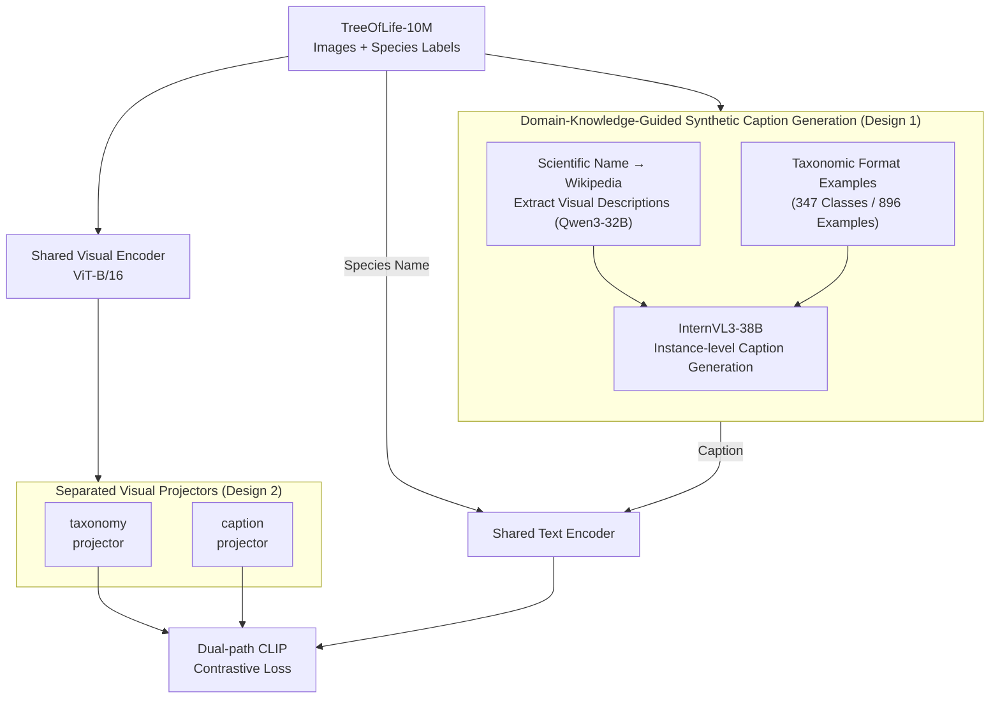

# BioCAP: Exploiting Synthetic Captions Beyond Labels in Biological Foundation Models

**Conference**: ICLR 2026  
**arXiv**: [2510.20095](https://arxiv.org/abs/2510.20095)  
**Code**: [https://imageomics.github.io/biocap](https://imageomics.github.io/biocap)  
**Area**: Multimodal VLM  
**Keywords**: biological foundation model, synthetic captions, contrastive learning, species classification, CLIP

## TL;DR
BioCAP is proposed to train biological multimodal foundation models by generating Wikipedia-guided synthetic descriptive captions using MLLMs instead of relying solely on species labels. It achieves an average improvement of 8.8% across 10 species classification benchmarks and a 21.3% improvement in text-image retrieval tasks compared to BioCLIP.

## Background & Motivation
**Background**: The biological domain possesses massive datasets of images annotated with species names (e.g., TreeOfLife-10M), but lacks instance-level descriptive text. Existing biological foundation models (e.g., BioCLIP) utilize only taxonomic names as text supervision based on CLIP contrastive learning.

**Limitations of Prior Work**: Species names provide coarse-grained text encoding—individuals within the same species exhibit significant appearance variations (color, pose, environment, etc.), and names alone cannot capture fine-grained morphological features. While Wikipedia contains species descriptions, they are not instance-specific. Directly generating captions with MLLMs often leads to hallucinations (e.g., incorrect descriptions of bird plumage colors).

**Key Challenge**: The goal is to obtain instance-level captions, but manual labeling is impossible for millions of images, and automated generation is prone to hallucination. Species identification depends on subtle morphological details, which are precisely where MLLMs are most likely to fail.

**Goal**: How to generate faithful, instance-specific descriptive captions for biological images at scale?

**Key Insight**: Use species-level visual information extracted from Wikipedia combined with format examples customized by taxonomic categories as domain context to guide MLLM caption generation and reduce hallucinations.

**Core Idea**: Provide additional supervision signals beyond labels for biological CLIP using domain-knowledge-guided synthetic captions.

## Method

### Overall Architecture
The problem BioCAP addresses is that biological images have abundant species labels but lack instance-level descriptions; training CLIP solely on species names fails to capture fine-grained morphological features, while direct MLLM-generated captions are often hallucinatory. The approach can be summarized as "BioCLIP + Captions"—it first uses a domain-knowledge-guided pipeline to automatically generate faithful descriptive captions for every image in TreeOfLife-10M, then performs CLIP contrastive training under two text views: "species name" and "caption." Images and text pass through shared encoders, but the image side employs two independent projection heads to interface with the two text views. The system is initialized from a ViT-B/16 CLIP checkpoint.

### Key Designs

**1. Domain-Knowledge-Guided Synthetic Caption Generation: Suppressing MLLM Hallucinations with Wikipedia Priors and Taxonomic Format Examples**

Species differentiation relies on subtle morphology like color, patterns, and wing shapes—features where MLLMs are most prone to errors. Therefore, the challenge of "instance-level captions" lies not in generation, but in faithfulness. BioCAP feeds domain knowledge into the MLLM via a three-step pipeline: First, it uses scientific names to crawl Wikipedia pages and employs Qwen3-32B to extract visual descriptive information (color, patterns, shape, texture, etc.), covering 29.5% of 447K species. Second, it prepares 1-3 format examples for each of the 347 taxonomic classes (896 total via Gemini Deep Research and manual verification) to instruct the model on which features to prioritize—feather color for birds versus wing sections for insects. Third, using InternVL3-38B, it generates a caption for each image using the Wikipedia visual info and the corresponding taxonomic format example as context. Ablations show that generating captions without guidance degrades performance, proving the necessity of these constraints.

**2. Separated Visual Projectors: Independent Heads for Species Names and Captions to Avoid Interference**

Species names are discrete categorical labels, while captions are continuous semantic descriptions; they demand different visual representations. Forcing them into the same projection space causes conflict. BioCAP shares the visual and text encoders but attaches two independent projection heads after the image encoder: the taxonomy projector is updated only when the paired text is a species name, while the caption projector is updated only for captions. This projects image features into two targeted subspaces—one for classification and one for description—allowing the two contrastive objectives to optimize independently. Experiments show separated projectors consistently outperform shared ones.

**3. Theoretical Motivation of Morphological Space: Explaining Why Captions Work via a Causal Generative Perspective**

To explain why an additional caption supervision path improves representation, BioCAP utilizes a representation learning perspective: each species corresponds to a latent vector $\mathbf{z}^*$ in a morphological space, while both images and captions are viewed as noisy projections of $\mathbf{z}^*$. Images contain environmental noise (pose, lighting, background), while captions contain linguistic noise. By performing contrastive learning on these two views with different noise types, the model is forced to recover the shared latent structure ($\mathbf{z}^*$) while suppressing independent noises. This provides a theoretical justification that captions provide orthogonal supervision signals rather than simple data augmentation.

### Loss & Training
The model uses standard CLIP contrastive loss, with the two text views (species name and caption) trained alternately to update their respective projection heads. Based on ViT-B/16 CLIP checkpoint initialization, it is trained for 50 epochs on TreeOfLife-10M.

## Key Experimental Results

### Main Results (Zero-shot Species Classification Accuracy)

| Model | NABirds | Plankton | Insects | Camera Trap | Fungi | Rare Species | **Average** |
|------|---------|----------|---------|-------------|-------|-------------|---------|
| CLIP | 39.0 | 3.3 | 7.4 | 28.1 | 8.6 | 25.7 | 19.4 |
| BioCLIP | 58.8 | 6.1 | 34.9 | 31.7 | 40.9 | 37.1 | 37.6 |
| **BioCAP** | **67.6** | **7.2** | **41.9** | **37.4** | **64.4** | **44.2** | **46.4** |

### Text-Image Retrieval (Recall@10)

| Model | INQUIRE (AP@50) | Cornell Bird I2T | PlantID I2T | **Avg Gain vs BioCLIP** |
|------|----------------|-----------------|-------------|----------------------|
| BioCLIP | ~31 | 15.4 | 48.4 | - |
| **BioCAP** | ~35 | **55.3** | **59.6** | **+21.9%** |

### Key Findings
- Caption quality is paramount: generating captions with unguided MLLMs actually degrades performance; guidance from Wikipedia and format examples leads to significant improvements (e.g., Fungi from 40.9% to 64.4%, a 23.5% gain).
- Separated projectors outperform shared projectors, verifying that species names and captions require different visual representations.
- Wikipedia information covering only 29.5% of species brought an average improvement of 8.8%, suggesting further gains with expanded coverage.
- On the most challenging Rare Species benchmark, it achieved a 7.1% improvement, proving that captions help the model generalize to rare species.

## Highlights & Insights
- **Strong validation of "captions over labels"**: In biology, a domain rich in labels but poor in captions, this work demonstrates the immense value of descriptive text as an additional supervision signal.
- **Methodology for reducing hallucinations via domain knowledge**: The pipeline involving Wikipedia extraction and taxonomic format examples serves as a reusable template for any scenario requiring faithful domain-specific captions from MLLMs.
- **Morphological space framework**: Explains why captions are effective using a causal generative model, moving beyond simple engineering heuristics.

## Limitations & Future Work
- Wikipedia visual information only covers 29.5% of species; many species might still have lower-quality captions due to the lack of domain priors.
- Based on ViT-B/16; results have not been verified on larger models (ViT-L or larger CLIP).
- The use of InternVL3-38B for caption generation may introduce model-specific biases.
- Format examples require manual verification (896 examples), which may become a bottleneck for scaling.

## Related Work & Insights
- **vs BioCLIP**: BioCAP adds caption supervision to BioCLIP, achieving an 8.8% average improvement and highlighting the importance of supervision beyond labels.
- **vs LaCLIP/VeCLIP**: While these methods rewrite existing captions in the general domain using LLMs, BioCAP addresses the lack of captions in the biological domain by generating them from scratch.
- **vs FG-CLIP**: FG-CLIP uses long captions for fine-grained alignment but underperforms compared to BioCLIP on biological tasks due to the lack of domain-specific guidance.

## Rating
- Novelty: ⭐⭐⭐⭐ The domain-knowledge-guided caption generation pipeline is creative.
- Experimental Thoroughness: ⭐⭐⭐⭐⭐ Comprehensive evaluation across 10 classification benchmarks and 3 retrieval tasks with thorough ablations.
- Writing Quality: ⭐⭐⭐⭐⭐ Clear theoretical motivation, detailed methodology, and excellent illustrations.
- Value: ⭐⭐⭐⭐ Provides a valuable methodology for multimodal foundation models in scientific domains.

<!-- RELATED:START -->

## Related Papers

- [\[CVPR 2026\] Beyond What's Shared: Recovering Lost Unique Information from Intermediate Layers to Boost Multimodal Geo-Foundation Models](../../CVPR2026/multimodal_vlm/beyond_whats_shared_recovering_lost_unique_information_from_intermediate_layers_.md)
- [\[ICLR 2026\] NExT-OMNI: Towards Any-to-Any Omnimodal Foundation Models with Discrete Flow Matching](next-omni_towards_any-to-any_omnimodal_foundation_models_with_discrete_flow_matc.md)
- [\[ICLR 2026\] Massively Multimodal Foundation Models: A Framework for Capturing Interactions with Specialized Mixture-of-Experts](massively_multimodal_foundation_models_a_framework_for_capturing_interactions_wi.md)
- [\[CVPR 2026\] Scaling Spatial Intelligence with Multimodal Foundation Models](../../CVPR2026/multimodal_vlm/scaling_spatial_intelligence_with_multimodal_foundation_models.md)
- [\[CVPR 2026\] Towards Multimodal Domain Generalization with Few Labels](../../CVPR2026/multimodal_vlm/towards_multimodal_domain_generalization_with_few_labels.md)

<!-- RELATED:END -->
