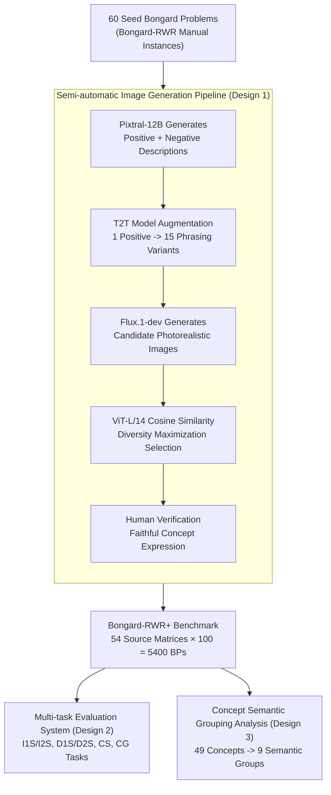

# Bongard-RWR+: Real-World Representations of Fine-Grained Concepts in Bongard Problems

**Conference**: ICLR 2026  
**arXiv**: [2508.12026](https://arxiv.org/abs/2508.12026)  
**Code**: Available  
**Area**: Multimodal VLM  
**Keywords**: Bongard problems, abstract visual reasoning, few-shot learning, VLM benchmark, fine-grained concepts

## TL;DR
The authors construct Bongard-RWR+, a benchmark containing 5400 Bongard problems, using a VLM pipeline (Pixtral-12B + Flux.1-dev) to automatically generate photorealistic images representing abstract concepts. Systematic evaluation reveals that state-of-the-art (SOTA) VLMs struggle to discern fine-grained visual concepts such as contours, rotation, and angles, with accuracy reaching as low as 19%.

## Background & Motivation
**Background**: Bongard Problems (BP) are classic tests of abstract visual reasoning—given 6 images on the left and 6 on the right, the task is to identify the abstract concept that distinguishes the two sets. Existing BP datasets either consist of synthetic black-and-white images (Bongard-LOGO) or use real-world images to represent coarse-grained concepts (e.g., "person driving").

**Limitations of Prior Work**: Although Bongard-RWR uses real-world images for fine-grained abstract concepts, it contains only 60 manually constructed instances, which is too small for robust evaluation. Furthermore, there is a lack of systematic diagnosis of VLM capabilities across different reasoning dimensions.

**Key Challenge**: VLMs perform reasonably well on coarse-grained concept recognition, but their ability to identify fine-grained abstract concepts (e.g., "arrows pointing in the same direction vs. different directions") remains unknown—a sufficiently large benchmark is needed for systematic testing.

**Goal**: How can photorealistic Bongard problems containing fine-grained abstract concepts be constructed at scale? How can the boundaries of VLM visual reasoning capabilities be systematically evaluated?

**Key Insight**: A semi-automatic pipeline of I2T (image description) → T2T (description augmentation) → T2I (image generation) → human verification is employed to expand the 60 Bongard-RWR instances to 5400.

**Core Idea**: Automate the generation of photorealistic images in Bongard problems using a VLM pipeline to test the limits of fine-grained abstract reasoning in VLMs at scale.

## Method

### Overall Architecture
This is a benchmark paper rather than a method paper. The problem addressed is that the original Bongard-RWR has only 60 manual instances, too small for systematic diagnosis of VLM fine-grained abstract reasoning. The authors build a semi-automatic pipeline to "batch replicate" the real images from these 60 seed BPs into a large number of new photorealistic images expressing the same abstract concepts, ultimately generating 100 variants from each of the 54 source matrices = 5400 BPs (covering 49 abstract concepts). The pipeline follows the chain of I2T (image → description) → T2T (description augmentation) → T2I (description → image) → diversity-based selection → human verification. The generated data is then paired with a 6-task evaluation system ranging from binary classification to free-form generation (ordered by difficulty), supplemented by diagnostic analysis of concept semantic grouping.

### Key Designs

**1. Semi-automatic Image Generation Pipeline: Scaling manual construction to replicable concepts**

Manual annotation reaches its limit at 60 BPs, so the core is to automate the scaling process while ensuring "concept fidelity." The pipeline consists of four steps: first, Pixtral-12B generates both a positive description (capturing the concept) and a negative description (explicitly suppressing the opposing concept) for each seed image. Second, a T2T model expands each positive description into 15 varied phrasings to enhance image diversity. Third, Flux.1-dev generates candidate images from these descriptions. Finally, human verification ensures each image faithfully represents the target concept. The paired positive/negative descriptions are crucial—fine-grained concepts often come in opposing pairs (e.g., "same direction" vs. "different direction"); without negative constraints, T2I models easily mix the opposing concepts. After generating candidates, ViT-L/14 embeddings are used to calculate pairwise cosine similarities for diversity maximization, selecting the most distinct images for the BP to avoid redundancy.

**2. Multi-task Evaluation System: Pinpointing VLM capability boundaries via 6 graded tasks**

Using a single task cannot identify which specific stage causes VLM failure. The authors designed 6 tasks covering the spectrum from perception to reasoning and generation. The most basic are I1S/I2S—providing 1 or 2 test images for binary classification into the left or right concept group. D1S/D2S first convert images into text descriptions via I2T before classification, isolating whether "visual perception" or "textual reasoning" is the bottleneck. CS (Concept Selection) requires the model to choose the correct concept from $K$ candidates ($K=2/4/8/16$), measuring the degradation curve as distractors increase. The most difficult, CG (Concept Generation), requires the model to generate correct concept descriptions in free-form text. The increasing difficulty from binary to multiple-choice to open-ended generation allows localization of when specific capabilities fail.

**3. Concept Semantic Grouping Analysis: Locating difficult abstract categories via 9 semantic groups**

Overall accuracy masks specific weaknesses. The authors group 49 abstract concepts into 9 semantic categories—Size, Position, Count, Branching, Similarity, Contour, Shape, Rotation, and Angle—and calculate accuracy per group. This precise localization revealed that groups relying on exact spatial relationships, such as Contour, Rotation, and Angle, achieved less than 50% accuracy, while more holistic concepts like Shape, Size, and Branching reached approximately 75%.

### Loss & Training
N/A (Benchmark paper; evaluates existing models without training).

## Key Experimental Results

### Main Results (Concept Selection Task)

| Model | K=2 | K=4 | K=8 | K=16 |
|------|-----|-----|-----|------|
| InternVL2.5-78B | **91%** | **78%** | **68%** | **57%** |
| Qwen2-VL-72B | 85% | 65% | 48% | 33% |
| LLaVA-Next-110B | 73% | 45% | 30% | 19% |
| MiniCPM-o-8B | 72% | 44% | 28% | 19% |

### Binary Classification Task (I1S/I2S)

| Model | I1S | I2S | D1S | D2S |
|------|-----|-----|-----|-----|
| InternVL2.5-78B | 0.50 | 0.39 | 0.57 | 0.49 |
| Qwen2-VL-72B | 0.49 | 0.44 | 0.58 | 0.42 |
| Random baseline | 0.50 | 0.50 | 0.50 | 0.50 |

### Key Findings
- **Binary Classification Near Random**: Accuracy for all VLMs on I1S/I2S is approximately 50%, equivalent to random guessing. This indicates VLMs can hardly infer fine-grained abstract concepts from few-shot images.
- **Concept Selection is Moderate but Degrades Fast**: InternVL2.5 achieves 91% at K=2 (showing some discriminatory power), but collapses to 57% at K=16 as distractors increase.
- **Significant Semantic Group Differences**: Shape/Size/Branching are easier (~75%), while Contour/Rotation/Angle are harder (<50%)—the latter depend on precise spatial relationships.
- DeepSeek-R1 reaches 0.56 on text-only D2S, suggesting textual reasoning is more effective than visual reasoning—the VLM bottleneck lies in visual perception rather than reasoning.
- No significant difference between color vs. grayscale, confirming concepts are structural and not color-dependent.
- Performance of small models (MiniCPM-8B) is comparable to large models (LLaVA-110B), suggesting model size is not the deciding factor.

## Highlights & Insights
- **Reveals Fundamental VLM Weaknesses**: In few-shot abstract visual reasoning, even the strongest 78B VLMs are near random—this is not a problem that can be solved solely by scaling.
- **Value of Semi-automatic Data Generation Methodology**: The I2T→T2T→T2I→human verification pipeline can be reused for other scenarios requiring large-scale conceptual datasets.
- **Robust Multi-task Evaluation Design**: Moving from binary classification to multiple-choice and generation effectively pinpoints capability boundaries.

## Limitations & Future Work
- Concept fidelity in generated images still requires human verification (not fully automated).
- The number of concepts (49) is limited and does not cover all 394 concepts from the original Bongard problems.
- Evaluation is limited to zero-shot/few-shot VLMs; the impact of fine-tuning remains untested.
- Generated images may contain T2I model artifacts, potentially affecting concept judgment.

## Related Work & Insights
- **vs. Bongard-LOGO**: LOGO has 12K instances but only synthetic black-and-white images; RWR+ has 5.4K photorealistic instances closer to the VLM training distribution.
- **vs. Bongard-HOI/OpenWorld**: These use coarse-grained concepts (e.g., "person driving") which VLMs handle relatively well; RWR+ uses fine-grained abstract concepts, exposing true VLM weaknesses.
- **vs. ARC (Chollet)**: Tests abstract reasoning in the grid domain; RWR+ tests the real-image domain, providing a complementary perspective.

## Rating
- Novelty: ⭐⭐⭐⭐ (Semi-automatic generation + multi-dimensional evaluation)
- Experimental Thoroughness: ⭐⭐⭐⭐⭐ (4 large models, 6 tasks, 9 semantic groups, comprehensive ablations)
- Writing Quality: ⭐⭐⭐⭐ (Clear structure, comprehensive evaluation)
- Value: ⭐⭐⭐⭐ (Defines the upper limits and bottlenecks of fine-grained VLM reasoning)

<!-- RELATED:START -->

## Related Papers

- [\[ICLR 2026\] WorldSense: Evaluating Real-World Omnimodal Understanding for Multimodal LLMs](worldsense_evaluating_real-world_omnimodal_understanding_for_multimodal_llms.md)
- [\[ICLR 2026\] UniF2ace: A Unified Fine-grained Face Understanding and Generation Model](unif2ace_a_underlineunified_underlinefine-grained_underlineface_understanding_an.md)
- [\[ICLR 2026\] P2P: Automated Paper-to-Poster Generation and Fine-Grained Benchmark](p2p_automated_paper-to-poster_generation_and_fine-grained_benchmark.md)
- [\[ICLR 2026\] MotionSight: Boosting Fine-Grained Motion Understanding in Multimodal LLMs](motionsight_boosting_fine-grained_motion_understanding_in_multimodal_llms.md)
- [\[CVPR 2025\] FLAIR: VLM with Fine-grained Language-informed Image Representations](../../CVPR2025/multimodal_vlm/flair_vlm_with_fine-grained_language-informed_image_representations.md)

<!-- RELATED:END -->
