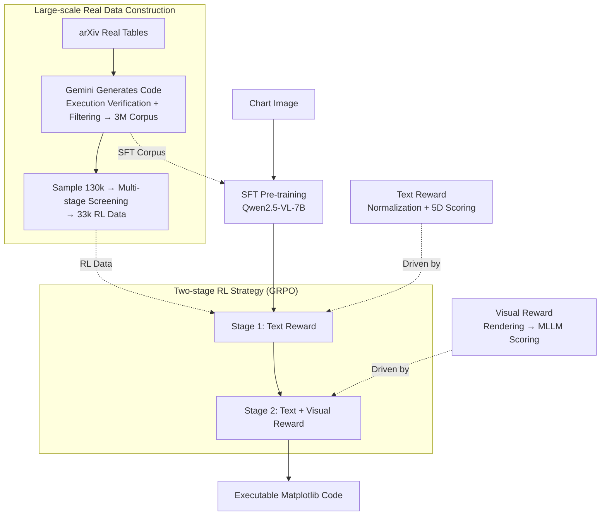

# Breaking the SFT Plateau: Multimodal Structured Reinforcement Learning for Chart-to-Code Generation

**Conference**: ICLR 2026  
**arXiv**: [2508.13587](https://arxiv.org/abs/2508.13587)  
**Code**: [GitHub](https://github.com/DocTron-hub/MSRL)  
**Area**: Multimodal VLM / Code Generation  
**Keywords**: Chart-to-Code, Reinforcement Learning, SFT Plateau, Multi-granularity Reward, GRPO

## TL;DR
To address the performance plateau of SFT in chart-to-code generation, Multimodal Structured Reinforcement Learning (MSRL) is proposed. By utilizing a dual-layer text+visual reward function and a two-stage RL strategy, it achieves a 6.2% and 9.9% improvement in high-level metrics on ChartMimic and ReachQA respectively, reaching open-source SOTA and matching GPT-4o.

## Background & Motivation
**Background**: Multimodal Large Language Models (MLLMs) perform well on tasks like visual question answering but remain limited when processing information-dense images (e.g., charts) and generating structured outputs (e.g., code). The chart-to-code generation task requires models to deeply understand visual charts and generate accurate plotting code, which has significant practical value.

**Limitations of Prior Work**: Existing methods rely on SFT or DPO trained on synthetic data, which features simple patterns (synthetic data lacks real-world complexity) and limited generalization. Furthermore, SFT has inherent flaws—it assigns equal importance to every token in the target sequence, whereas plotting code contains a large amount of boilerplate code (e.g., `plt.plot`), and critical information (data values, style parameters) appears with very low frequency.

**Key Challenge**: Gains from expanding SFT data volume diminish after reaching a certain scale, leading to a **performance plateau effect**. Experiments demonstrate that when scaling from 200k to 2.8M samples, performance ceases to grow beyond 2M. This implies that the ceiling cannot be breached simply by increasing data.

**Goal**: (1) Systematically verify the performance ceiling of SFT; (2) Design an effective RL strategy to break this ceiling; (3) Construct a large-scale real-world training corpus for chart-to-code.

**Key Insight**: The authors observe that the uniform weight distribution mechanism of SFT fails to prioritize critical tokens, while RL can focus on optimizing the accuracy of key content through customized reward functions. Meanwhile, pure text rewards ignore the overall visual structure, necessitating the introduction of visual feedback to form multi-granularity rewards.

**Core Idea**: Driving two-stage GRPO reinforcement learning with a multi-granularity (text + visual) reward function to break the SFT performance plateau in chart-to-code tasks.

## Method

### Overall Architecture
The task is to output Matplotlib code that reproduces a given chart image. The core judgment of MSRL is that relying solely on SFT data scaling will hit a performance ceiling because SFT treats every token equally. Critical data values and style parameters are overwhelmed by frequent boilerplate code like `plt.plot`. MSRL first pushes SFT capability to the ceiling using massive real-world data, then uses RL to specifically enhance "critical but low-frequency" content.

The pipeline is divided into two parts: **Data Side**—automatically generating ~3 million chart-code pairs from real arXiv tables for SFT, and screening 33k high-quality samples for RL; **Training Side**—following SFT pre-training with two-stage GRPO. The first stage uses only text rewards for low-cost refinement of code details, and the second stage adds visual rewards to improve overall visual fidelity. The base model is Qwen2.5-VL-7B, and RL uses GRPO (optimizing with relative advantages within a group, eliminating the critic model).

### Key Designs

**1. Large-scale Real Data Construction: Real tables replace synthetic data, with a separate refined set for RL**

Existing datasets have two major issues: purely synthetic data has monotonic trends and lacks diversity, and the scale is insufficient to expose the true SFT ceiling. MSRL crawls real tables from arXiv papers up to 2023, uses Gemini-2.5-Flash combined with tables and example code to generate plotting code, and performs execution verification and filtering to obtain ~3 million pairs—currently the largest chart-to-code dataset, covering 24 chart types and 1555 Matplotlib APIs. This supports the quantitative verification of the SFT plateau. The RL stage cannot directly reuse SFT data as the model might overfit SFT output formats and lose exploration space. Thus, 130k candidates are sampled and refined through multi-stage filtering (code content screening by chart type/data format, complexity recognition via tree parsing, and visual quality assessment) to select 33k clean samples specifically for RL. Small in scale but separate from SFT data, this forces the model to explore rather than memorize formats.

**2. Text Reward: Normalization to eliminate syntax variants, followed by five-dimensional fine-grained accuracy**

Plotting code styles vary extremely; the same semantics can be written in many ways. Directly extracting key information for rewards would be overwhelmed by syntax noise. The key adaptation of MSRL is a **format normalization** step to map outputs to a canonical representation, making rewards insensitive to syntax variants. Accuracy is then scored across five dimensions: data values via soft matching (tolerating $\pm 5\%$ relative error), chart types via hard string matching, layout via hard value matching, and text elements like titles/labels via edit distance, resulting in a weighted fine-grained accuracy score. Execution rewards are calculated separately as binary signals indicating whether code runs successfully. Normalization is the core trick for applying RLVR to structured code generation—without it, rewards are nearly unusable due to syntax noise.

**3. Visual Reward: Rendering code to charts and using MLLM to judge similarity**

Text rewards focus on fine-grained code details but miss overall visual structure and style, whereas chart-to-code requires replicating the overall look and feel. Visual rewards fill this gap: generating images from code and using Qwen2.5-VL-72B as an evaluation model to score and normalize based on six dimensions: chart type, layout, text content, data, style, and clarity. Code that fails to render receives 0. This converts "code correctness" into a more intuitive "image similarity" dimension, complementing text rewards that only see code details.

**4. Two-stage RL Strategy: Low-cost text reward for coverage, followed by high-cost visual reward for refinement**

Visual rewards require image rendering and large model scoring, which is computationally expensive. MSRL splits training into a two-stage curriculum. The total reward is defined as:

$$R = w_t R_\text{text} + w_v R_\text{vis} + w_e R_\text{exec}$$

In the first stage, $w_v=0$, training with only text rewards to achieve most of the gains (~5%) at low cost. The second stage introduces mixed rewards for fine-tuning, adding ~1.5% in visual fidelity. GRPO is used throughout for optimization based on relative advantages. This preserves performance while focusing visual reward compute where it matters most—the two-stage strategy achieves results close to full visual RL (1344 GPU hours) using only 576 GPU hours.

### Loss & Training
- SFT Phase: Standard autoregressive negative log-likelihood loss.
- RL Phase: GRPO, sampling multiple responses within a group to calculate relative advantages without an additional critic model.
- Two-stage Curriculum Training: Text reward first (~240 GPU hours) $\rightarrow$ followed by mixed reward (~336 GPU hours).

## Key Experimental Results

### Main Results

| Model | Size | ChartMimic Exec. | ChartMimic High | ReachQA Exec. | ReachQA High |
|------|--------|-------------------|-----------------|---------------|--------------|
| GPT-4o | - | 93.2 | 83.5 | 92.8 | 84.0 |
| Qwen2.5-VL-7B | 7B | 73.2 | 41.6 | 62.2 | 37.6 |
| ChartCoder | 7B | 91.4 | 74.0 | 83.8 | 69.4 |
| MSRL-SFT | 7B | 93.2 | 77.6 | 92.2 | 80.0 |
| **MSRL** | **7B** | **96.5** | **83.8** | **98.2** | **89.9** |

MSRL surpasses all open-source models with 7B parameters. Its ChartMimic high-level metric (83.8) exceeds GPT-4o (83.5), and its ReachQA high-level metric (89.9) significantly outperforms GPT-4o (84.0).

### Ablation Study

| Configuration | ChartMimic Exec. | Low-Level | High-Level | Description |
|------|-------------------|-----------|------------|------|
| Baseline (No SFT/RL) | 73.2 | 44.6 | 41.6 | Original Qwen2.5-VL-7B |
| SFT only | 93.2 | 73.0 | 77.6 | Ceiling reached by SFT |
| RL only (No SFT) | 93.8 | 65.6 | 62.3 | RL alone is inferior to SFT |
| SFT + RL (Text Reward) | 97.0 | 78.1 | 82.7 | Breaking the SFT plateau |
| SFT + RL (Two-stage) | 96.5 | 78.6 | 83.8 | Final version with visual rewards |

Reward strategy comparison: Pure visual RL performs best but requires 1344 GPU hours; the two-stage strategy achieves similar performance with 576 GPU hours.

### Key Findings
- **SFT Plateau Confirmed**: Performance stops growing after 2M samples when scaling data from 200k to 2.8M, proving an inherent ceiling for SFT.
- **Significant RL Gains**: RL still brings improvements of +6.2% on ChartMimic high-level metrics and +9.9% on ReachQA on top of a saturated SFT model.
- **Efficient Two-stage Strategy**: The first stage (text reward) contributes ~5% improvement, while the second stage (visual reward) adds an extra 1.5% with significantly lower computational overhead.
- **Cross-library Generalization**: MSRL demonstrates generalization on Seaborn and Plotly test sets (even though trained only on Matplotlib). Execution rates on Plotly improved from 62.7% to 90.0%.

## Highlights & Insights
- **Systematic SFT Plateau Analysis**: Through controlled experiments across six data scales (200k-2.8M), the study provides the first quantitative evidence of the SFT ceiling in the chart-to-code domain. This methodology can be transferred to other structured generation tasks.
- **Code Format Normalization as a Key Adaptation for RLVR**: Syntax diversity in plotting code (different ways to express the same semantics) would overwhelm the reward function without normalization. This trick is valuable for all RLVR tasks involving code generation.
- **Visual Reward as Global Validation for Structured Output**: Rendering code into images for evaluation elegantly maps "code correctness" to "image similarity," a more intuitive dimension suitable for any scenario where code output is visualizable (e.g., LaTeX generation, web code generation).
- **Curriculum Design (Text before Visual)**: Establishing foundational capabilities with low-cost rewards before introducing high-cost rewards for refinement is a practical resource-performance tradeoff.

## Limitations & Future Work
- Training is limited to Matplotlib; although generalization to Seaborn/Plotly was shown, high-level gains on Plotly were restricted (35.9). Multi-library joint training is worth exploring.
- Visual rewards rely on Qwen2.5-VL-72B scoring, which is expensive and may introduce MLLM bias; exploring lighter metrics (e.g., SSIM, LPIPS) as alternatives.
- Data construction uses papers before 2023, which might not cover new visualization styles.
- RL data is limited to 33k; would larger RL data scale further break the ceiling? Papers show RL also plateaus around 22k.

## Related Work & Insights
- **vs ChartCoder**: ChartCoder also performs chart-to-code but only uses SFT+DPO on synthetic data. MSRL significantly outperforms it using real data + RLVR (high-level metric 74.0 $\rightarrow$ 83.8).
- **vs Chart-R1/BigCharts-R1**: These use RLVR to improve chart reasoning QA but do not involve code generation. MSRL is the first to apply RLVR to structured chart-to-code generation.
- **vs DeepSeek-R1/Vision-R1**: The R1 series focuses on RL for general reasoning. MSRL proposes specific multi-granularity reward designs for structured output generation, demonstrating how to adapt RLVR across different task paradigms.

## Rating
- Novelty: ⭐⭐⭐⭐ Systematic verification of SFT plateau and multi-granularity reward design are innovative, though the overall framework follows standard GRPO + custom rewards.
- Experimental Thoroughness: ⭐⭐⭐⭐⭐ Comprehensive experiments across data scales, multi-dimensional ablations, cross-library generalization, and comparison with GPT-4o.
- Writing Quality: ⭐⭐⭐⭐ Clear logic, informative figures, and convincing motivation.
- Value: ⭐⭐⭐⭐ Establishes a strong SOTA in the chart-to-code niche; the methodology is reference-worthy for other structured code generation tasks.

<!-- RELATED:START -->

## Related Papers

- [\[CVPR 2026\] MM-ReCoder: Advancing Chart-to-Code Generation with Reinforcement Learning and Self-Correction](../../CVPR2026/multimodal_vlm/mm-recoder_advancing_chart-to-code_generation_with_reinforcement_learning_and_se.md)
- [\[ICLR 2026\] Enhancing Geometric Perception in VLMs via Translator-Guided Reinforcement Learning](enhancing_geometric_perception_in_vlms_via_translator-guided_reinforcement_learn.md)
- [\[ICLR 2026\] GuirlVG: Incentivize GUI Visual Grounding via Empirical Exploration on Reinforcement Learning](guirlvg_incentivize_gui_visual_grounding_via_empirical_exploration_on_reinforcem.md)
- [\[ICLR 2026\] VisCodex: Unified Multimodal Code Generation via Merging Vision and Coding Models](viscodex_unified_multimodal_code_generation_via_merging_vision_and_coding_models.md)
- [\[ICLR 2026\] MMDuet2: Enhancing Proactive Interaction of Video MLLMs with Multi-Turn Reinforcement Learning](mmduet2_enhancing_proactive_interaction_of_video_mllms_with_multi-turn_reinforce.md)

<!-- RELATED:END -->
