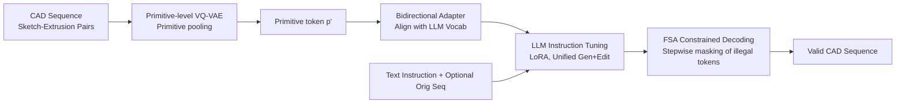

# CAD-Tokenizer: Towards Text-Based CAD Prototyping via Modality-Specific Tokenization

**Conference**: ICLR 2026  
**OpenReview**: [https://openreview.net/forum?id=UKIsnwd1Oz](https://openreview.net/forum?id=UKIsnwd1Oz)  
**Code**: To be confirmed  
**Area**: Multimodal / LLM for CAD  
**Keywords**: Text-to-CAD, CAD Editing, VQ-VAE Tokenizer, Primitive-level tokens, Finite State Automata Decoding, LLM  

## TL;DR
A "primitive-level VQ-VAE tokenizer" is designed for CAD sequences to replace default LLM subword tokenization. It compresses sketch-extrusion pairs into discrete tokens aligned with the LLM vocabulary and employs Finite State Automata (FSA) constrained decoding. This approach unifies Text-to-CAD generation and text-driven CAD editing within a single model for the first time.

## Background & Motivation
**Background**: CAD models are not defined by raw coordinates but by sequences of construction operations such as "sketch → extrusion." These sequences naturally record design history, making them suitable for both zero-shot prototyping and subsequent modifications. Recent works have utilized LLMs for CAD sequences in two independent tracks: Text-to-CAD generation (e.g., CADFusion) and CAD editing (e.g., CAD-Editor).

**Limitations of Prior Work**: Real-world engineering design involves iterative "generation-modification" cycles, yet no prior work has unified these two subtasks into a single model. A more fundamental issue lies in tokenization: standard LLM tokenizers (BPE) split CAD programs into natural language subwords (e.g., splitting `extrusion` into `[extru][-sion]` or numerical parameters into arbitrary substrings). Consequently, attention layers focus on punctuation and partial tokens, failing to capture "primitives" as meaningful geometric units or model structural and geometric dependencies.

**Key Challenge**: Text-to-CAD requires strong generative capacity for zero-shot creation, while CAD editing demands precise understanding and alignment of existing geometry. Coordinating these complementary but non-overlapping capabilities on a single backbone places high demands on representation. Misaligned tokenization prevents LLMs from effectively reading CAD as structured sequences.

**Goal**: Propose a unified **text-based CAD prototyping** task (unifying generation and editing) and provide a representation scheme that enables LLMs to perform reasoning at the primitive level.

**Core Idea**: **Modality-specific tokenization**. CAD should have its own "vocabulary." A modified sequential VQ-VAE is used to compress CAD into primitive-level discrete tokens. Adapters are then trained to bi-directionally align these tokens with the LLM embedding space, allowing the LLM to predict the "next operation" rather than the "next character." During inference, an FSA enforces grammatical validity.

## Method

### Overall Architecture
CAD-Tokenizer follows a four-stage pipeline: first, CAD sequences are compressed into discrete tokens using a primitive-level VQ-VAE; second, adapters align these tokens with the frozen LLM vocabulary; third, the LLM undergoes instruction fine-tuning on unified data; finally, an FSA constrains sampling during inference to ensure grammatical correctness. The first two steps address how CAD becomes recognizable to the LLM, the third unifies the tasks, and the fourth ensures generated sequences are valid.

### Key Designs

**1. Primitive-level VQ-VAE Tokenizer: Mapping a sketch-extrusion pair to multiple tokens.** Standard VQ-VAE pools the entire sequence into a single latent vector, losing information. Ours decomposes the input CAD sequence $C$ into sketch-extrusion pairs $SE=\{t_1,\dots,t_n\}$, encodes them using a Transformer encoder, and introduces a **primitive-specific pooling layer**. This produces $k$ discrete representations (latent vectors) for each primitive, retaining local details while absorbing context. Training uses a sequence reconstruction objective plus a cumulative VQ loss:

$$L_{VQ\text{-}Prim}=\sum_{i\in n}\mathrm{EMD}\big(\mathrm{Decoder}(\{p'\},t_{1,i-1}),\mathbb{1}_i\big)+\sum_{j\in k}VQ(T^E_j,p'_j),$$

where EMD is the squared Earth Mover's Distance, $\{p'\}$ denotes all primitive latent vectors produced by the encoder and pooling layer, $\mathbb{1}_i$ is the input one-hot attribute, and $T^E_j$ is the pooled vector of tokens forming the $j$-th primitive. The "single" variant in the ablation study (one vector per pair without primitive pooling) shows a sharp drop in quality, proving that "multi-token/primitive-level" representation is critical.

**2. Bidirectional Adapter Alignment: Inserting VQ tokens into the LLM vocabulary without freezing the backbone.** The primitive vectors $p'_j$ have dimension $d_{vq}$, while the LLM embedding space is $d_{tok}$. Instead of expensive co-training, Ours reuses the **frozen** LLM embedding and logit layers, training only two adapters. A vector reconstruction loss pulls the mapped token $p_j=\arg\max(L_{logit}(W^{d_{tok}}_{d_{vq}}(p'_j)))$ back to its original representation:

$$L_{recon}=\sum_{j\in k}\lVert \hat{p}'_j-p'_j\rVert_2^2+\lVert L_{embed}(p_j)-W^{d_{vq}}_{d_{tok}}(p'_j)\rVert_2^2,$$

where the first term ($\hat p'_j=W^{d_{tok}}_{d_{vq}}(L_{embed}(p_j))$) ensures reconstruction from the embedding layer, and the second ensures training of the logit side. This results in primitive IDs natively recognizable by the LLM. Ablations show that BPE, which lacks LLM vocabulary alignment, suffers an Invalidity Ratio (IR) of 88.5 during fine-tuning.

**3. Unified Instruction Tuning: Feeding compressed sequences to the LLM.** With aligned tokens, generation and editing tasks use the same format. Given prompt $x=(I,C_{orig})$ (instruction $I$ + optional original sequence; $C_{orig}=\varnothing$ for Text-to-CAD), let $x'=(I,\text{CAD-Encoder}(C_{orig}))$ and $y'=\text{CAD-Encoder}(C_{gen})$. Standard cross-entropy fine-tuning $L_{SFT}=-\mathbb{E}_{(x',y')}[\frac{1}{T}\sum_t \log p(\hat y=y'_t\mid x')]$ is applied. LLaMA-3-8b serves as the backbone with LoRA (rank=32) for 20 epochs, using a 1:5 balance of Text-to-CAD and CAD-Editing data.

**4. FSA Constrained Decoding: Preventing syntax errors via formal language properties.** Autoregressive sampling (top-p, beam search) remains oblivious to CAD syntax. However, CAD is a formal language fully describable by states and transitions. The designed FSA provides a mask at each step, allowing only grammatically compliant tokens ($choice=\arg\max(m\otimes logits)$). The FSA state transitions based on the selected token (see Algorithm 1). This significantly reduces errors: FSA reduces IR from 17.2 (top-p) and 45.2 (beam search) to 4.94.

## Key Experimental Results

Data is sourced from SkexGen and converted to CADFusion/CAD-Editor formats (approx. 100k training pairs, 1k test pairs). The VQ-VAE uses only half of the training data to ensure the LLM encounters samples unseen by the tokenizer. Metrics include F1 (Sketch/Extrusion), Chamfer Distance (CD), Coverage (COV), MMD, JSD, Invalidity Ratio (IR), VLM scoring, and Human Evaluation (HE) ranking (lower is better). Distribution and CD values are scaled by ×10².

### Main Results

CAD Editing (task-specific baseline: CAD-Editor):

| Method | F1-Skt↑ | F1-Ext↑ | CD↓ | COV↑ | IR↓ | VLM↑ | HE↓ |
|---|---|---|---|---|---|---|---|
| CAD-Editor* | 73.3 | 82.6 | 40.7 | 51.1 | 1.50 | 4.28 | 1.63 |
| GPT-4o | 80.0 | 78.1 | 42.9 | 51.8 | 47.9 | 1.94 | - |
| Vanilla-LLaMA | 78.8 | 84.9 | 42.4 | 48.6 | 48.6 | 4.31 | 2.64 |
| **Ours** | **88.6** | **94.8** | **13.5** | **52.4** | 8.38 | **5.09** | **1.72** |

Text-to-CAD (task-specific baseline: CADFusion):

| Method | F1-Skt↑ | F1-Ext↑ | CD↓ | COV↑ | IR↓ | VLM↑ | HE↓ |
|---|---|---|---|---|---|---|---|
| CADFusion† | 68.8 | 80.1 | 38.5 | 54.4 | 22.5 | **5.41** | 1.91 |
| GPT-4o | 66.7 | 66.8 | 79.8 | 52.6 | 90.5 | 1.47 | - |
| Vanilla-LLaMA | 66.4 | 80.9 | 48.4 | 53.8 | 80.5 | 3.45 | 2.58 |
| **Ours** | **77.9** | **84.7** | **26.7** | **54.5** | **1.50** | 3.82 | **1.62** |

Ours improves F1 by ~10 points and significantly reduces CD across both tasks. While CADFusion leads in VLM score for Text-to-CAD (5.41 vs 3.82), Ours is preferred in human rankings. Notably, **Vanilla-LLaMA collapses on most metrics**, confirming that default tokenizers cannot handle unified CAD prototyping.

### Ablation Study

Tokenizer reconstruction quality (Sketch F1 only, as Extrusion is encoded perfectly):

| Method | F1-Skt↑ | COV↑ | JSD↓ |
|---|---|---|---|
| HNC-CAD | 85.5 | 57.5 | 29.8 |
| Ours (curve, default) | **94.1** | **64.5** | **8.19** |
| Ours (loop) | 91.5 | 59.5 | 18.4 |
| Ours (single) | 76.5 | 54.0 | 35.9 |

Tokenizer performance in LLM fine-tuning (F1-Avg / IR): curve 86.5 / 4.94, loop 86.3 / 4.91, single 78.3 / 70.7, BPE 76.2 / 88.5. The "single" and BPE variants suffer from high IR and weak metrics due to lack of primitive pooling or vocab alignment.

Sampling strategy: FSA (86.5 / IR 4.94) outperforms top-p (80.4 / IR 17.2) and beam search (82.8 / IR 45.2) across all metrics.

### Key Findings
- Primitive-level pooling is critical: removing it (single variant) leads to collapse in both reconstruction and fine-tuning.
- Both "curve" and "loop" pooling are effective; "loop" offers higher compression with slightly lower reconstruction accuracy.
- A clear trade-off exists: higher compression ratios correlate with lower reconstruction quality.
- Treating CAD as a formal language and using FSA decoding is the most direct method for minimizing invalidity rates.

## Highlights & Insights
- **Modality-specific tokenization is a fundamental entry point**: While most multimodal LLM implementations force existing tokenizers on new data, this work identifies the bottleneck of attention focusing on "junk tokens" and uses CAD as a clean formal language demonstration.
- **Bidirectional Adapters + Frozen Backbone** is an efficient design: Aligns vocabularies without expensive LLM co-training, reducing "alignment" to training two lightweight adapter layers.
- **Leveraging formal language properties**: The observation that CAD can be fully characterized by automata makes FSA masked decoding a logical, low-cost solution for slashing invalidity rates.
- **Value of unified tasks**: Combining generation and editing aligns with the actual iterative "generate-modify" workflow of engineers.

## Limitations & Future Work
- **Data constraints**: The gap between open-source CAD data and industrial private data limits training on more complex shapes.
- **Metric deficiencies in editing**: Distribution metrics often fail to capture the "intent to preserve original shape." Models that genuinely modify objects may be penalized by distribution metrics despite better performance.
- **Reasoning ceiling of the backbone**: Failure cases indicate insufficient spatial/common-sense reasoning, which requires stronger pre-trained backbones. The FSA also cannot capture context-dependent geometric constraints.
- Future work aims for better datasets and metrics aligned with "editing intent."

## Related Work & Insights
- **Classical CAD Generation** (SkexGen, HNC-CAD) uses multi-encoder pipelines for prefixes/point clouds but lacks text alignment or LLM integration.
- **Text-driven CAD**: Previously bifurcated into Text-to-CAD (CADFusion) and Editing (CAD-Editor). This work merges them into unified prototyping.
- **Multimodal LLM Tokenization**: Vision uses VAE/VQ-VAE or CLIP; robotics often uses stringified actions. This is the first CAD encoder-decoder tokenizer specifically designed for LLM interfacing.
- **Insight**: The "Modality-specific VQ tokenization + Vocab alignment + Formal language constraints" framework is transferable to any structured formal language (e.g., circuit netlists, SMILES, ASTs).

## Rating
- **Novelty**: ⭐⭐⭐⭐ First to unify text-based CAD prototyping; the combination of primitive-level VQ, bidirectional adapters, and FSA decoding directly addresses the tokenization bottleneck.
- **Experimental Thoroughness**: ⭐⭐⭐⭐ Comprehensive three-stage ablation and two-task main experiments; however, the test set (200 labeled pairs) and overall data scale remain relatively small.
- **Writing Quality**: ⭐⭐⭐⭐ Clear motivation, informative diagrams (Fig 1-3), and thorough mathematical notations.
- **Value**: ⭐⭐⭐⭐ Provides a portable paradigm for structured formal language integration with LLMs; unified generation and editing has clear industrial significance.

<!-- RELATED:START -->

## Related Papers

- [\[CVPR 2026\] CAD-Refiner: A Unified Framework for CAD Generation and Iterative Editing](../../CVPR2026/multimodal_vlm/cad-refiner_a_unified_framework_for_cad_generation_and_iterative_editing.md)
- [\[ICLR 2026\] Error Notebook-Guided, Training-Free Part Retrieval in 3D CAD Assemblies via Vision-Language Models](error_notebook-guided_training-free_part_retrieval_in_3d_cad_assemblies_via_visi.md)
- [\[ICCV 2025\] CAD-Assistant: Tool-Augmented VLLMs as Generic CAD Task Solvers](../../ICCV2025/multimodal_vlm/cad-assistant_tool-augmented_vllms_as_generic_cad_task_solvers.md)
- [\[CVPR 2026\] DeepAlign: Mitigating Modality Conflict through Modality-Specific Alignment](../../CVPR2026/multimodal_vlm/deepalign_mitigating_modality_conflict_through_modality-specific_alignment.md)
- [\[AAAI 2026\] ReCAD: Reinforcement Learning Enhanced Parametric CAD Model Generation with Vision-Language Models](../../AAAI2026/multimodal_vlm/recad_reinforcement_learning_enhanced_parametric_cad_model_generation_with_visio.md)

<!-- RELATED:END -->
