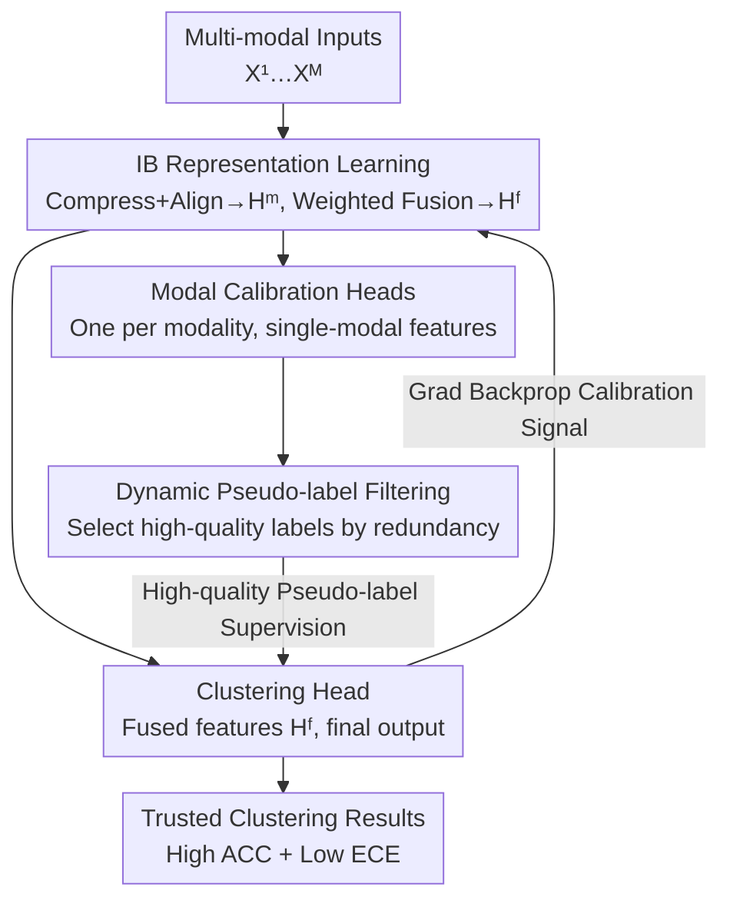

# Calibrated Information Bottleneck for Trusted Multi-modal Clustering

**Conference**: ICLR2026  
**OpenReview**: [https://openreview.net/forum?id=iedlZOdI0d](https://openreview.net/forum?id=iedlZOdI0d)  
**Code**: https://shizhehu.github.io/  
**Area**: Self-supervised / Multi-modal Clustering / Representation Learning  
**Keywords**: Information Bottleneck, Multi-modal Clustering, Confidence Calibration, Pseudo-label Filtering, Trusted Clustering

## TL;DR
Addressing the heavy reliance of Information Bottleneck (IB) multi-modal clustering on "accurate mutual information estimation" and "clean pseudo-labels," this paper proposes CLIB. By using a parallel multi-head structure with "one main clustering head + multiple modal calibration heads," the model enables mutual error correction between modalities. Combined with a dynamic pseudo-label filtering mechanism based on information redundancy, it simultaneously improves clustering accuracy (77.8% ACC on Caltech-3V) and suppresses over-confidence (halving ECE on multiple datasets).

## Background & Motivation
**Background**: Information Bottleneck theory characterizes representation learning as a tradeoff between "compression vs. fidelity"—learning a compressed representation $T$ for input $X$ with the objective $L_{\min} = I(X;T) - \beta I(T;Y)$. The goal is to compress irrelevant information (minimize $I(X;T)$) while preserving discriminative information for the target $Y$ (maximize $I(T;Y)$). Due to its inherent ability to "purify" features, IB has recently been widely adopted in multi-modal clustering to eliminate redundancy/noise and preserve shared semantics.

**Limitations of Prior Work**: Directly applying IB to multi-modal clustering faces two major bottlenecks. First, IB effectiveness depends entirely on a "reliable target variable $Y$," but unsupervised clustering lacks ground truth labels, forcing reliance on self-generated pseudo-labels. In early training, these labels are noisy, creating a vicious cycle: poor pseudo-labels → poor representations → worse pseudo-labels, leading to amplified errors and over-confident incorrect predictions. Second, MI estimation for high-dimensional data like images/text is notoriously difficult. Existing estimators (MINE, variational bounds, contrastive) suffer from systematic bias and are often only validated on simple distributions, leading to uncontrollable errors on real-world data.

**Key Challenge**: Existing IB clustering methods assume "MI can be accurately estimated" and "pseudo-labels are usable," both of which fail in high-dimensional unsupervised scenarios. Worse, the "trustworthiness" of clustering results is often ignored; models exhibit confidence far exceeding actual accuracy, which is fatal in safety-critical scenarios like medical diagnosis or autonomous driving. Classic calibration methods (temperature scaling requiring labeled validation sets, label smoothing over-penalizing confident samples) rely on supervised signals and are inapplicable here.

**Goal**: Without ground truth labels, simultaneously solve: (1) IB instability caused by MI estimation bias; (2) construction of reliable target variables from multi-modal data for IB; (3) generation of accurate and "honest" (not over-confident) clustering results.

**Key Insight**: The authors observe that while single-modal MI estimation may be biased, one should not expect "perfect estimation" but rather use **cross-modal mutual calibration** to offset bias: errors in one modality can be corrected by others. Furthermore, pseudo-labels should be "selected" rather than accepted wholesale, using information redundancy (distribution sharpness) to judge reliability.

**Core Idea**: Employs a parallel multi-head structure ("main clustering head + modal calibration heads") for mutual calibration, paired with dynamic pseudo-label filtering based on information redundancy. Calibration signals are backpropagated to the IB module, implicitly constructing high-quality target variables in an unsupervised manner to achieve accurate and trusted clustering.

## Method

### Overall Architecture
CLIB addresses the lack of reliable target variables and MI estimation inaccuracies in unsupervised multi-modal clustering. The workflow: first, IB extracts compact features $H^m$ from each modality $X^m$, which are adaptively fused into a unified representation $H^f$. Two paths then branch out: **each modality connects to its own calibration head** (viewing single-modal features), and the **fused representation connects to a clustering head** (producing final results). Calibration heads provide single-modal clustering probabilities, and high-quality pseudo-labels are selected via an information redundancy mechanism to supervise the clustering head. The clustering head's gradient is not blocked, allowing "calibration signals" to backpropagate to the IB module, serving as implicit target variables. Training follows a two-stage process: 100-epoch IB warmup (learning features), followed by 100-epoch calibration to avoid early noise contamination. The total loss is:

$$L_{total} = L_{IB} + \alpha L_{Cal}$$

where $\alpha$ balances feature extraction and calibration intensity.

### Key Designs

**1. IB Representation Learning: Single-modal Compression, Cross-modal Alignment, and Information Preservation Fusion**

This stage handles extracting compact and discriminative features. Each modality undergoes compression and alignment:

$$L_C = \sum_{i=1}^{M} I(X^i, H^i) - \sum_{i=1}^{M}\sum_{j=i+1}^{M} I(H^i, H^j)$$

The first term $I(X^i,H^i)$ is the compression term, forcing the network to discard irrelevant information. The second term $-I(H^i,H^j)$ is the alignment term, maximizing MI between modalities to learn a shared semantic space. Fusion utilizes adaptive weighted averaging $H^f = \sum_m w^m H^m$ ($\sum_m w^m = 1$, learnable weights). To prevent fusion from losing modal-private information, an information fidelity term maximizes the MI between each modality and the fusion: $L_P = \sum_m I(H^m; H^f)$. Together, $L_{IB} = L_C - \beta L_P$.

**2. Parallel Multi-head Calibration: Modalities as "Experts" for Mutual Correction**

This is the core design to counter MI estimation bias. Each calibration head acts as an "expert" observing only single-modal features, learning clustering probability distributions and perceiving modality learning quality (sharper distributions indicate more discriminative features). When training calibration heads, the authors run K-Means in the fused feature space to obtain $C$ pseudo-clusters $Q_c$. For samples in each cluster, the mean output of the clustering head $\hat{q}_c = \frac{1}{|Q_c|}\sum_{x_i\in Q_c} p_i^{clu}$ serves as the soft target. This "intra-cluster mean" leverages neighborhood structure to smooth out single-sample noise. The calibration loss is:

$$L_{caliH} = -\frac{1}{B}\sum_C \sum_{x_i\in Q_c}\sum_{m=1}^{M} \hat{q}_c \log(p_{i,m}^{cal})$$

An entropy regularization term $L_{re} = \frac{1}{M}\sum_m \bar{p}_m^{cal}\log(\bar{p}_m^{cal})$ is added to prevent trivial solutions or model collapse.

A crucial engineering decision: **Gradients from calibration heads to the bottleneck are cut (stop-gradient)**. Since single-modal heads might be noisy or conflicting, backpropagating their gradients could disrupt feature learning. The clustering head handles backpropagation instead.

**3. Dynamic Pseudo-label Filtering: Curriculum Learning from Reliable Samples**

To prevent "dirty" pseudo-labels from degrading IB, information redundancy measures probability vector "sharpness": $R(P) = 1 - \frac{H(P)}{H_{max}}$. A variant is used as a sample quality score:

$$S(P) = 1 - \frac{H(P)}{2 \times H_{max}}$$

Samples are ranked by score, and the top $K_m^{sel} = \lfloor \sum_{i=1}^N S(p_{i,m})\rfloor$ samples from modality $m$ are selected for the pseudo-label set $\mathcal{S}$. The value of $K$ is **dynamic and adaptive**: in early stages, low confidence leads to fewer selected samples (learning from simple structures); as training progresses, confidence and $K$ increase, gradually introducing harder data.

**4. Calibration Signal Feedback + KL Consistency: Implicit Target Construction and Over-confidence Suppression**

After filtering, the clustering head (without gradient cut) is optimized: $L_{cluH} = -\frac{1}{|\mathcal{S}|}\sum_{x_i,m\in\mathcal{S}} y_{i,m}\log(p_i^{clu})$. Allowing its gradient backpropagation incentivizes the backbone to learn representations most beneficial for fusion, implicitly constructing high-quality target variables for IB. Finally, a consistency loss $L_{con} = \sum_m D_{KL}(p_{:,m}^{cal} \| p^{clu})$ is added: when modalities conflict, it forces a "flatter" distribution, honestly expressing uncertainty and significantly reducing ECE. Total calibration loss: $L_{Cal} = L_{caliH} + L_{re} + L_{cluH} + L_{con}$.

### Loss & Training
- **Two-stage Training**: Stage 1 (100 epochs) IB warmup; Stage 2 (100 epochs) introduces the calibration module.
- **MI Optimization**: Compression term $I(X^i,H^i)$ uses a variational upper bound; alignment term $I(H^i,H^j)$ uses the NT-Xent contrastive loss lower bound; $L_P$ is approximated using a MINE-style neural estimator.
- Total Objective: $L_{total} = L_{IB} + \alpha L_{Cal}$, where $\alpha, \beta \in (0,1)$.

## Key Experimental Results

### Main Results
Validated on five benchmarks (Caltech-2V/3V, ESP-Game, MIRFlickr, IAPR) with an MLP backbone, compared against 4 traditional and 11 SOTA multi-modal clustering methods. Metrics: ACC, NMI (higher is better) and ECE (lower is better). CLIB achieves the best performance on all metrics across all datasets.

| Dataset | Metric | CLIB | Prev. SOTA | Gain |
|--------|------|------|------|------|
| Caltech-3V | ACC | 77.8% | 71.6% (DIVIDE) | +6.2% |
| Caltech-3V | NMI | 69.3% | 62.6% (MVCAN) | +6.7% |
| ESP-Game | ACC | 56.3% | 52.1% (MFLVC) | +4.2% |
| MIRFlickr | ACC | 55.4% | 53.8% (MFLVC) | +1.6% |
| IAPR | ACC | 51.6% | 47.2% (COPER) | +4.4% |
| IAPR | ECE | 7.8% | 22.4% (MVCAN) | ~1/3 Error |

The ECE advantage is particularly striking: ECE on ESP-Game and MIRFlickr is more than halved compared to previous SOTA, and on IAPR, it is nearly 1/3 of the runner-up, indicating CLIB is both accurate and "honest."

### Ablation Study

| Configuration | Caltech-3V ACC / ECE | Description |
|------|----------------------|------|
| $L_{IB}+L_{cluH}$ | 60.6 / 25.5 | Baseline (IB + clustering head) |
| $+\,L_{re}$ | 64.6 / 19.5 | Added entropy regularization, lower ECE |
| $+\,L_{caliH}$ | 67.8 / 11.6 | Added calibration head + filtering; win-win for ACC/ECE |
| $+\,L_{con}$ | 71.1 / 12.4 | Consistency constraint, mainly lowers ECE |
| I. Remove IB Warmup | 61.7 / 15.1 | Early noise degrades performance but doesn't collapse |
| II. Calibration backprop to IB | 65.9 / 13.5 | Modal-private redundancy pollutes bottleneck |
| **CLIB (Full)** | **77.8 / 10.9** | Synergy across all components |

### Key Findings
- **$L_{caliH}$ (Calibration + Filtering) is the primary driver**: It simultaneously raises ACC and lowers ECE.
- **Stop-gradient is necessary**: Settings with calibration backprop (II) allow modal-private redundancy to pollute the bottleneck, validating the gradient cut.
- **IB Warmup is essential**: Removing warmup (I) allows noise to flood calibration, though the filtering mechanism prevents total collapse.
- **$L_{con}$ as a Trade-off Knob**: Primarily reduces ECE; in safety-critical scenarios, it can be increased to trade minor accuracy for high trustworthiness.

## Highlights & Insights
- **Paradigm Shift from "Estimation Accuracy" to "Mutual Correction"**: While others try to estimate MI more accurately, CLIB accepts estimation bias and uses multi-modal mutual calibration to offset it.
- **Explicit Calibration in Unsupervised Learning**: Fills the gap where temperature scaling/label smoothing fail by using KL consistency triggered by modal conflict to output "flatter" distributions for uncertain samples.
- **Curriculum Learning via Information Redundancy**: The parameter-free $S(P)$ score paired with dynamic $K$ selection naturally implements a "simple-to-complex" training strategy.
- **Stop-Gradient Engineering**: The specific use of gradient cuts for single-modal heads vs. backprop for fused heads provides a useful template for multi-head training.

## Limitations & Future Work
- **Constraint to Complete, Single-label Data**: CLIB currently cannot handle missing modalities or multi-label scenarios.
- **Reliance on Predefined $C$**: Like most clustering methods, it requires a fixed number of clusters.
- **Backbone Dependency**: It corrects "biased" estimation but cannot recover if the estimator fails completely to extract any meaningful features.
- **Scale and Robustness**: Experiments focus on datasets in the 1k–12k range; performance on large-scale heterogeneous data (e.g., video-audio-text) remains to be verified.

## Related Work & Insights
- **vs. MSDIB / SDCIB / DDMC**: These assume MI can be accurately estimated. CLIB acknowledges bias and corrects it via cross-modal information.
- **vs. PTIB**: PTIB uses "peer review" for fusion weights; CLIB focuses on "calibration heads + filtering + consistency" to explicitly handle over-confidence.
- **vs. Fixed-threshold Filtering (SCAN)**: Fixed thresholds often select noisy labels; CLIB's dynamic $K$ based on redundancy provides a more robust curriculum.

## Rating
- Novelty: ⭐⭐⭐⭐⭐ Explicitly introduces "trustworthiness" into IB multi-modal clustering with a novel mutual-calibration paradigm.
- Experimental Thoroughness: ⭐⭐⭐⭐ SOTA across five datasets with full ablation, though scale is relatively moderate.
- Writing Quality: ⭐⭐⭐⭐ Clear motivation and logical progression of designs.
- Value: ⭐⭐⭐⭐ Significant practical value for safety-critical unsupervised applications.

<!-- RELATED:START -->

## Related Papers

- [\[ICML 2025\] Learning Optimal Multimodal Information Bottleneck Representations](../../ICML2025/multimodal_vlm/learning_optimal_multimodal_information_bottleneck_representations.md)
- [\[ACL 2026\] From Verbatim to Gist: Distilling Pyramidal Multimodal Memory via Semantic Information Bottleneck](../../ACL2026/multimodal_vlm/from_verbatim_to_gist_distilling_pyramidal_multimodal_memory_via_semantic_inform.md)
- [\[AAAI 2026\] Conditional Information Bottleneck for Multimodal Fusion: Overcoming Shortcut Learning in Sarcasm Detection](../../AAAI2026/multimodal_vlm/conditional_information_bottleneck_for_multimodal_fusion_overcoming_shortcut_lea.md)
- [\[CVPR 2026\] Reliable Clustering Number Estimation for Contrastive Multi-View Clustering](../../CVPR2026/multimodal_vlm/reliable_clustering_number_estimation_for_contrastive_multi-view_clustering.md)
- [\[CVPR 2026\] SeD-UD: An Influence-Driven and Hierarchically-Decoupled Information Bottleneck for Multimodal Intent Recognition](../../CVPR2026/multimodal_vlm/sed-ud_an_influence-driven_and_hierarchically-decoupled_information_bottleneck_f.md)

<!-- RELATED:END -->
