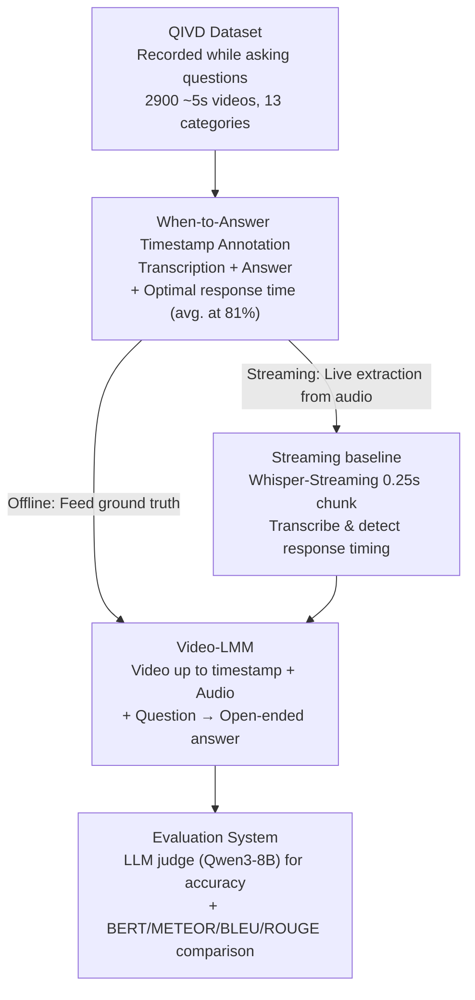

# Can Vision-Language Models Answer Face to Face Questions in the Real-World?

**Conference**: ICLR2026  
**arXiv**: [2503.19356](https://arxiv.org/abs/2503.19356)  
**Code**: [https://www.qualcomm.com/developer/software/qualcomm-interactive-video-dataset-qivd](https://www.qualcomm.com/developer/software/qualcomm-interactive-video-dataset-qivd)  
**Area**: Multimodal VLM  
**Keywords**: situated understanding, real-time interaction, video QA, multimodal benchmark, streaming VLM

## TL;DR
The authors propose QIVD (Qualcomm Interactive Video Dataset), a face-to-face real-time QA benchmark containing 2,900 videos with audio and timestamp annotations. The study reveals that existing VLMs significantly lag behind humans in real-time situated understanding (Best model 60% vs. Human 87%). The main bottlenecks are identified as referential disambiguation, timing judgment for responses, and situational common sense, though fine-tuning can significantly narrow this gap.

## Background & Motivation

**Background**: Large Multimodal Models (LMMs) have made significant progress in image description and VQA, and have begun to support real-time audio-visual dialogue. However, existing capabilities are largely limited to "offline inference"—receiving full visual input and a complete question before generating a response.

**Limitations of Prior Work**: (a) Existing video understanding benchmarks follow an offline paradigm where the model sees the entire video and the complete question in advance; (b) There is a lack of benchmarks testing "face-to-face" dialogue capabilities—where a model is connected to a camera and microphone to answer questions in real-time; (c) Models lack the ability to determine "when to answer"—the timing of responses (when-to-speak) in dialogue has been severely neglected.

**Key Challenge**: Real-world AI assistants and humanoid robots require real-time scene understanding, comprehension of verbal questions, and judgment of response timing. However, training data and benchmarks are offline, resulting in models lacking these capabilities.

**Goal**: (a) Construct the first face-to-face real-time QA dataset; (b) Systematically evaluate the capability boundaries of existing models; (c) Demonstrate that fine-tuning on such data can enhance real-time interaction capabilities.

**Key Insight**: A simple online QA paradigm is designed—users record videos via mobile phones while performing actions and asking questions verbally; the model must understand the scene in real-time from video and audio inputs and answer at the correct moment.

**Core Idea**: By constructing a real-time interactive QA dataset with audio, video, and response timestamps, this work systematically measures the face-to-face interaction capabilities of VLMs for the first time and identifies three major failure modes.

## Method

### Overall Architecture
This work investigates whether VLMs can function effectively when connected to a camera and microphone, requiring them to observe, listen, and speak at appropriate moments like a human. To this end, the authors package the dataset, evaluation benchmark, and streaming baseline into the QIVD ecosystem. The pipeline starts with a ~5-second short video recorded by crowdsourced workers on mobile phones: the recorder demonstrates a scene while asking questions verbally (e.g., "What color is this?" "How many apples are in my hand?"). The system transcribes the audio in real-time, judges when the question is finished, feeds the current video frames along with the question into a Video-LMM to generate an answer, and finally uses an LLM judge to score it against the ground truth. Crucially, each video is annotated with three elements: the question transcription, the answer, and the "optimal response timestamp," the latter of which allows evaluation across both "correctness" and "timing accuracy." Evaluation is conducted under two settings: streaming (questions and timing extracted live via ASR) and offline (direct ground truth input).

### Key Designs

**1. QIVD Dataset: Embedding questions within video audio instead of post-hoc queries**

Existing video understanding benchmarks are almost exclusively offline—the model receives a complete video followed by a text question, ensuring full information accessibility. QIVD reverses this: crowdsourced workers record short videos and ask questions verbally during the process. Consequently, the answer is often not available the moment the question ends—the model may need to wait for the user to finish demonstrating the scene. The final collection includes 2,900 videos across 13 semantic categories: object attribute/counting/detection/referencing, action attribute/counting/detection/understanding, scene understanding, audio-visual fusion, OCR, and subjective judgment. This "synchronous question and vision" format naturally introduces difficulties such as referential disambiguation, temporal dependency, and real-time comprehension without artificial design.

**2. When-to-Answer Timestamp Annotation: Quantifying "When to Speak"**

In real-time dialogue, knowing "when to speak" is as critical as "what to say," yet the former has seen little research. QIVD labels an optimal response timestamp for each video—the first moment sufficient information exists to answer. This is not necessarily when the question ends: if a recorder asks "What action is this?" before starting the motion, the optimal timing is after the action concludes. Statistically, the average response timestamp occurs at 81.47% of the video duration, with action counting being the latest (92.22%) and object detection being the earliest (76.95%). This allows "response timing" to be evaluated independently of answer accuracy.

**3. Streaming baseline: A modular real-time pipeline using off-the-shelf ASR + VLM**

Since most current LMMs do not support synchronized audio-visual streaming, the authors built a simple cascaded framework as a baseline. Whisper-Streaming ASR processes audio in 0.25s chunks to transcribe and detect question completion. Once a question is deemed finished, the video frames up to that point and the transcribed text are sent to a Video-LMM. Additionally, Qwen2.5-Omni was fine-tuned (Stream-Qwen-Omni) to detect the optimal response timing directly from the streaming input. This pipeline serves as a conclusion itself: even combining the strongest current ASR and VLM, real-time face-to-face interaction remains difficult, suggesting the need for end-to-end streaming modeling rather than modular parts.

**4. Evaluation System: Scoring free-form answers via LLM judge with dual settings**

Since QIVD answers are open-ended text, exact matching is insufficient. Thus, the primary metric is LLM judge (Qwen3-8B) for correctness, supplemented by BERT, METEOR, BLEU, and ROUGE-L. Evaluation is intentionally split into two settings: the streaming setting (questions and timing extracted live) and the offline setting (ground truth questions and timing). This comparison isolates errors stemming from ASR/timing detection from those of visual understanding itself—the offline setting reflects the model's upper bound, while the streaming setting represents real-world deployment difficulty.

### Loss & Training
Fine-tuning experiments were conducted on VideoLLaMA2.1-7B-AV using 5-fold cross-validation. The visual encoder was frozen, while the LLM backbone and audio pathway were fine-tuned for 2 epochs per fold. For timing detection, Qwen2.5-Omni was fine-tuned to create Stream-Qwen-Omni, enabling it to handle streaming input and learn to emit a specialized token to signal the "time to answer."

## Key Experimental Results

### Main Results (Offline setting, ground truth questions + timestamps)

| Model | Accuracy (Corr.) | BERT | METEOR | BLEU | ROUGE-L |
|------|--------------|------|--------|------|---------|
| **Human** | **87.33** | 93.01 | 53.21 | 17.40 | 49.76 |
| Qwen3-VL-8B | 60.07 | 87.58 | 36.72 | 6.64 | 35.89 |
| GPT-4o | 58.76 | 89.36 | 51.18 | 15.72 | 42.55 |
| Gemini-2.5-Flash | 58.07 | 90.43 | 43.07 | 8.33 | 36.05 |
| VideoLLaMA3-7B | 56.38 | 91.63 | 48.56 | 12.72 | 43.84 |
| VideoLLaMA2-72B | 50.83 | 92.29 | 51.13 | 16.12 | 45.76 |
| Qwen2.5-VL-7B | 50.62 | 87.58 | 37.37 | 4.66 | 29.44 |

### Ablation Study (Audio impact + Fine-tuning effect)

| Configuration | Overall Accuracy | Action Count | Audio-Visual | Subjective |
|------|----------|---------|----------|---------|
| VideoLLaMA2.1-7B (Video Only) | ~43% | ~13% | ~27% | ~23% |
| VideoLLaMA2.1-7B (Video+Audio) | ~40% | ~10% | ~23% | ~16% |
| Fine-tuned (Video+Audio) | **~52%** | **~30% (+17%)** | **~45% (+17%)** | **~47% (+23%)** |
| Fine-tuned (Video Only) | ~47% | ~22% | ~27% | ~37% |

### Key Findings
- **Human vs. Best Model Gap 27%**: Humans achieved 87.33% vs. Qwen3-VL's 60.07%; even with ground truth inputs, models lag significantly.
- **Audio is not inherently helpful**: Without fine-tuning, adding audio decreased performance (likely due to insufficient audio-visual fusion during pre-training), but audio became a key contributor after fine-tuning, especially for audio-visual and subjective tasks.
- **Response timing impact is significant**: Stream-Qwen-Omni achieved a timing MAE of 0.52s (vs. 0.83s for Whisper-Streaming); more precise timing directly improved answer accuracy.
- **Action counting remains the hardest**: Even after fine-tuning, accuracy is only ~30%, suggesting temporal reasoning needs stronger architectural inductive biases.
- **Referential disambiguation is a core challenge**: Object referencing is the largest category (24.34%), and models struggle with deictic expressions like "this" or "that."

## Highlights & Insights
- **First true face-to-face interaction benchmark**: Embedding questions within synchronized audio/video rather than post-hoc captures real-world challenges like referential disambiguation and timing judgment more faithfully.
- **Independent research value of When-to-Answer**: Timing is fundamental to dialogue but rarely studied. Response timestamp annotations allow this problem to be evaluated and optimized independently.
- **Non-uniform gains of fine-tuning**: Fine-tuning yielded massive gains in action counting (+17%) and audio-visual (+17%) tasks but minimal gains in object attributes or scene understanding, indicating that different situational capabilities require distinct training strategies.
- **Modular streaming design**: The cascaded ASR-to-VLM architecture is simple but effective, serving as a viable starting point for real-time interactive systems.

## Limitations & Future Work
- **Short Video Length**: Average duration is only 5s, preventing testing of long-term interaction or multi-turn dialogue.
- **Single-turn QA**: Only tests single question-answer pairs; real interaction requires context maintenance.
- **English Language Limit**: English-only audio; lacks cross-linguistic and accent diversity coverage.
- **Unbalanced Category Distribution**: Samples for Audio-Visual Fusion (0.76%) and OCR (0.79%) are very limited, making evaluation potentially unstable.
- **Reliance on LLM judge**: Free-form evaluation is subjective and may vary between different judge models.

## Related Work & Insights
- **vs. AVSD/SocialIQ**: These are based on pre-recorded videos with post-hoc questions. QIVD's questions are synchronous, naturally incorporating referential expressions.
- **vs. VideoLLM-online/FlashVStream**: These attempt real-time processing but lack audio and are limited to specific domains. QIVD provides a more general platform.
- **vs. Ego4D Social**: Also involves face-to-face interaction, but Ego4D uses task-specific labels rather than free-form QA. QIVD's open-ended format is closer to real dialogue.

## Rating
- Novelty: ⭐⭐⭐⭐ First real face-to-face interactive QA benchmark; the "when-to-answer" annotation is a highlight.
- Experimental Thoroughness: ⭐⭐⭐⭐⭐ Comprehensive evaluation of 20+ models with streaming/offline/audio/fine-tuning/timing analyses.
- Writing Quality: ⭐⭐⭐⭐ Clear problem definition with in-depth experimental analysis.
- Value: ⭐⭐⭐⭐⭐ Directly addresses the capability gap in real-time AI assistants/robotics, guiding the field's development.

<!-- RELATED:START -->

## Related Papers

- [\[CVPR 2025\] Rethinking Vision-Language Model in Face Forensics: Multi-Modal Interpretable Forged Face Detector](../../CVPR2025/multimodal_vlm/rethinking_vision-language_model_in_face_forensics_multi-modal_interpretable_for.md)
- [\[ICLR 2026\] UniF2ace: A Unified Fine-grained Face Understanding and Generation Model](unif2ace_a_underlineunified_underlinefine-grained_underlineface_understanding_an.md)
- [\[NeurIPS 2025\] Face-Human-Bench: A Comprehensive Benchmark of Face and Human Understanding for Multi-modal Assistants](../../NeurIPS2025/multimodal_vlm/face-human-bench_a_comprehensive_benchmark_of_face_and_human_understanding_for_m.md)
- [\[CVPR 2026\] VinQA: Visual Elements Interleaved Long-form Answer Generation for Real-World Multimodal Document QA](../../CVPR2026/multimodal_vlm/vinqa_visual_elements_interleaved_long-form_answer_generation_for_real-world_mul.md)
- [\[ICLR 2026\] WorldSense: Evaluating Real-World Omnimodal Understanding for Multimodal LLMs](worldsense_evaluating_real-world_omnimodal_understanding_for_multimodal_llms.md)

<!-- RELATED:END -->
