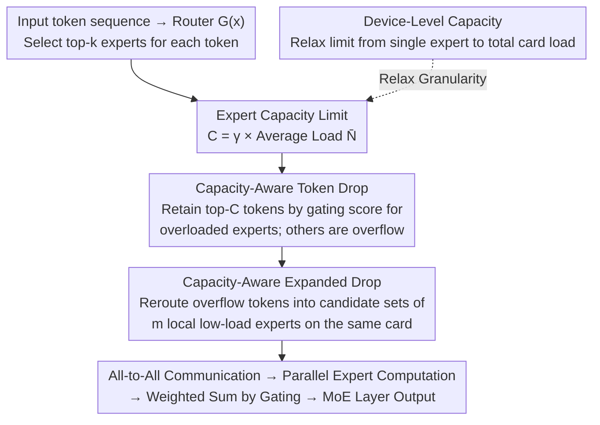

# Capacity-Aware Inference: Mitigating the Straggler Effect in Mixture of Experts

**Conference**: ICLR2026  
**arXiv**: [2503.05066](https://arxiv.org/abs/2503.05066)  
**Code**: [https://github.com/CASE-Lab-UMD/Capacity-Aware-MoE](https://github.com/CASE-Lab-UMD/Capacity-Aware-MoE)  
**Area**: Multimodal VLM  
**Keywords**: Mixture of Experts, reasoning efficiency, straggler effect, token drop, expert parallelism

## TL;DR
To address the Straggler Effect during MoE inference caused by uneven token distribution (where the expert with the heaviest load determines overall latency), this paper proposes Capacity-Aware Token Drop (discarding lower-scoring tokens from overloaded experts) and Expanded Drop (rerouting overflow tokens to local low-load experts), achieving a 1.85× speedup and a 0.2% performance improvement on Mixtral-8×7B.

## Background & Motivation

**Background**: MoE is a crucial architecture for scaling LLMs, balancing performance and efficiency by sparsely activating multiple experts. Under expert parallelism, experts are distributed across multiple GPUs for parallel computation.

**Limitations of Prior Work**: The auxiliary balance loss used during training cannot guarantee load balance during inference. Empirical evidence shows that the heaviest-loaded expert during inference can handle more than 7 times the average number of tokens—forcing low-load experts to wait for the high-load expert to synchronize, causing significant latency.

**Key Challenge**: This is the **Straggler Effect**—the latency of the MoE layer is determined by the expert with the heaviest load ($L \propto \max(\{N_i\})$) rather than the average load. Existing solutions (such as duplicating high-load experts in DeepSeek-V3) require additional GPU resources.

**Goal**: Mitigate the Straggler Effect through intelligent token scheduling without increasing GPU resources during inference, thereby improving inference speed.

**Key Insight**: Two complementary strategies—setting capacity limits for high-load experts to discard low-importance tokens, and expanding the candidate set for low-load experts to receive overflow tokens.

**Core Idea**: Use the gating score as an importance metric to limit the number of tokens for high-load experts, while rerouting overflow tokens to low-load experts on the same GPU to achieve load balancing and speedup.

## Method

### Overall Architecture
During MoE inference, the router selects top-k experts for each token. Capacity-Aware Inference does not modify model weights but inserts a capacity scheduling phase after the router and before the All-to-All communication: first, it sets a capacity limit $C = \gamma \bar{N}$ for each expert. **Token Drop** retains the top-$C$ tokens for overloaded experts based on gating scores, labeling the rest as overflow tokens. **Expanded Drop** reroutes these overflow tokens to low-load experts on the same GPU instead of simply discarding them. When multiple experts share a card, **Device-Level Capacity** relaxes the limit from "per expert" to "total load per card," allowing experts on the same card to share load capacity. All three steps occur before communication, resulting in zero additional cross-device overhead. After scheduling, tokens proceed through standard All-to-All → Expert Computation → Weighted Summation.

### Key Designs

**1. Capacity-Aware Token Drop: Setting caps for overloaded experts and discarding the least important tokens**

The root of the straggler effect is that some experts receive tokens far exceeding the average. A capacity ceiling is set for each expert: a maximum of $C = \gamma \bar{N}$ tokens, where $\bar{N} = tk/n$ is the expected average load and $\gamma$ is a tunable capacity factor. When the actual load $N_j$ of expert $j$ exceeds $C$, a scoring function $\mathcal{S}$ is used to rank its tokens, retaining the top-$C$ tokens and discarding the overflow. The key is "whom to drop"—the paper compares four selection methods: Order, Reverse Order, Random, and Score. It finds that using the router's gating score (Score) is significantly better, as the gating score reflects the match between the token and the expert. Discarding tokens with low scores minimizes performance loss. While dropping tokens might seem detrimental, most tokens in overloaded experts are redundant: on Mixtral, dropping only 12% of overflow tokens yields an 85% speedup.

**2. Capacity-Aware Expanded Drop: Rerouting dropped tokens to idle experts on the same card to utilize idle compute**

Token Drop only addresses "peak shaving," but shaved tokens disappear while low-load experts sit idle waiting for synchronization. Expanded Drop connects these processes: for each token, besides the original top-k experts, $m$ local experts on the same GPU are added to the candidate set ($k+m$ candidates total). Tokens rejected by their original expert due to capacity constraints can then be accepted by low-load experts on the same card. Restricting expansion to the same card ensures this step occurs before All-to-All communication, avoiding cross-device overhead. This is effective because gating scores decay slowly after the top-k (Figure 8)—tokens rerouted to slightly lower-ranked experts still maintain a decent match. Consequently, Expanded Drop on Mixtral even outperforms the unconstrained baseline by 0.2%.

**3. Device-Level Capacity: Relaxing constraints to the device level to allow load sharing among local experts**

Enforcing capacity per expert is sometimes too strict: an expert might exceed its limit while other experts on the same card are idle, leading to unnecessary token drops. Device-Level Capacity shifts the constraint to the device granularity—when a GPU hosts $n_l$ experts, it only requires their total load to not exceed the threshold:

$$N_1 + N_2 + \cdots + N_{n_l} \leq n_l \cdot \gamma \bar{N}$$

This allows load to transfer between experts on the same card, mitigating the unnecessary drops caused by rigid expert-level caps.

### Loss & Training
This method is a pure inference-time technique and **requires no retraining**. It is applied directly to pre-trained MoE models with zero training cost.

## Key Experimental Results

### Main Results (Expanded Drop vs Token Drop vs Expert Drop vs Baseline)

| Model | Method | Avg. Performance | vs Baseline |
|------|------|---------|-------------|
| **Mixtral-8×7B-Instruct** | Baseline | 74.3 | - |
| | Token Drop ($\gamma$=1.5) | 73.8 | -0.5% |
| | Expanded Drop ($\gamma$=1.5) | **74.5** | **+0.2%** |
| | Expert Drop | 72.2 | -2.1% |
| **OLMoE-Instruct** | Baseline | 63.5 | - |
| | Token Drop ($\gamma$=2.0) | 62.3 | -1.2% |
| | Expanded Drop ($\gamma$=2.0) | **63.2** | -0.3% |
| | Expert Drop | 60.5 | -3.0% |
| **DeepSeek-V2-Lite-Chat** | Baseline | 69.3 | - |
| | Token Drop ($\gamma$=2.0) | 68.2 | -1.1% |
| | Expanded Drop ($\gamma$=2.0) | **68.9** | -0.4% |

### Ablation Study (Scoring function comparison for Token Drop, OLMoE, $\gamma$=1.0)

| Scoring Function | OBQA | PIQA | MMLU | Avg. |
|---------|------|------|------|------|
| Order | 36.0 | 60.2 | 36.9 | 51.8 |
| Reverse Order | 36.2 | 59.5 | 38.7 | 52.0 |
| Random | 34.0 | 63.1 | 35.7 | 53.1 |
| **Score** | **41.6** | **76.0** | **47.8** | **61.1** |

### Key Findings
- **Score-based ranking is superior**: At $\gamma$=1.0, the average performance is 61.1 vs. 53.1 for Random (+8%), confirming that gating score is an effective indicator of token importance.
- **Low-load experts are critical**: Expert Drop (skipping the 10% lightest experts) removes only 2% of tokens but causes a 3% performance drop, whereas Token Drop removes 12% of tokens with only a 0.9% drop. This indicates that even low-load experts carry unique knowledge.
- **Expanded Drop can exceed baseline performance**: On Mixtral, Expanded Drop is 0.2% higher than the unconstrained baseline, suggesting that rerouting tokens to more experts might actually enhance representation quality.
- **Acceleration depends on GPU-to-expert ratio**: Speedup is maximized with 1-2 experts per GPU (1.85× for Mixtral) and diminishes with 8 experts per GPU (as aggregated load dilutes the bottleneck effect of individual experts).
- **Aggressive compression of image tokens in multimodal models**: For vision MoE models, $\gamma$=0.5 can be used while maintaining performance, suggesting high redundancy of image tokens across experts.

## Highlights & Insights
- **Training-free load balancing for inference**: Load balancing is achieved during inference via capacity constraints and rerouting without retraining, offering direct utility for deployed MoE models like Mixtral and DeepSeek.
- **Locality-aware design of Expanded Drop**: By expanding candidate experts only on the same GPU, cross-device communication overhead is completely avoided. This critical engineering insight utilizes idle time during synchronization for useful computation.
- **Flat tail of gating scores**: Figure 8 shows that gating scores for experts beyond the top-k decay slowly, providing theoretical support for rerouting—tokens routed to "sub-optimal" experts still maintain high compatibility.
- **Massive speedup from minor token drops**: Discarding 12% of overflow tokens on Mixtral yields an 85% speedup, demonstrating that minor interventions can provide huge gains due to the long-tail distribution of the Straggler Effect.

## Limitations & Future Work
- **Impact on generation quality**: Evaluation was limited to classification/multiple-choice benchmarks; tests on whether dropping tokens affects coherence in open-ended text generation are needed.
- **Static capacity factor**: $\gamma$ is globally fixed. Different layers or inputs might require different capacity strategies—adaptive $\gamma$ could be more effective.
- **Inference-only testing**: The difference between Token Drop during training and inference was not explored in depth, nor was the interaction with auxiliary losses during training.
- **KV cache impact**: More analysis is needed on how subsequent layers handle missing information (residual connections) if a token is dropped at a certain layer.

## Related Work & Insights
- **vs. DeepSeek-V3 Expert Duplication**: DeepSeek-V3 mitigates imbalance by duplicating high-load experts across devices, requiring extra GPU resources. The proposed method is more practical with zero additional hardware overhead.
- **vs. Switch-Transformer Token Drop**: Switch-Transformer uses an Order strategy for Token Drop during training. This paper proves the Score strategy is far superior (+9%) and is the first to systematically apply Token Drop to inference.
- **vs. Expert Pruning**: While expert pruning (skipping low-load experts) reduces computation, it leads to severe performance degradation. This study clearly shows that low-load experts should not be removed.

## Rating
- Novelty: ⭐⭐⭐⭐ The explicit definition and systematic analysis of the Straggler Effect are contributions; the idea of using idle capacity via Expanded Drop is clever.
- Experimental Thoroughness: ⭐⭐⭐⭐⭐ Covers 4 MoE models + multimodal experiments + scoring function ablations + efficiency analysis + device-level variants.
- Writing Quality: ⭐⭐⭐⭐ Problem definition is clear, formulas are complete, and diagrams are informative.
- Value: ⭐⭐⭐⭐⭐ Highly practical for optimizing the inference of deployed MoE models; code is open-sourced.

<!-- RELATED:START -->

## Related Papers

- [\[ICLR 2026\] Massively Multimodal Foundation Models: A Framework for Capturing Interactions with Specialized Mixture-of-Experts](massively_multimodal_foundation_models_a_framework_for_capturing_interactions_wi.md)
- [\[ICML 2026\] Toward Structural Multimodal Representations: Specialization, Selection, and Sparsification via Mixture-of-Experts](../../ICML2026/multimodal_vlm/toward_structural_multimodal_representations_specialization_selection_and_sparsi.md)
- [\[ICML 2026\] SAME: Stabilized Mixture-of-Experts for Multimodal Continual Instruction Tuning](../../ICML2026/multimodal_vlm/same_stabilized_mixture-of-experts_for_multimodal_continual_instruction_tuning.md)
- [\[ICLR 2026\] Procedural Mistake Detection via Action Effect Modeling](procedural_mistake_detection_via_action_effect_modeling.md)
- [\[AAAI 2026\] MCMoE: Completing Missing Modalities with Mixture of Experts for Incomplete Multimodal Action Quality Assessment](../../AAAI2026/multimodal_vlm/mcmoe_completing_missing_modalities_with_mixture_of_experts_for_incomplete_multi.md)

<!-- RELATED:END -->
