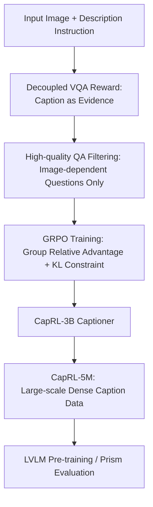

# CapRL: Stimulating Dense Image Capabilities via Reinforcement Learning

**Conference**: ICLR2026  
**OpenReview**: [https://openreview.net/forum?id=JLelnhqXaC](https://openreview.net/forum?id=JLelnhqXaC)  
**Code**: https://github.com/xxx (CapRL Github Repository provided by authors; refer to the OpenReview page for the specific address)  
**Area**: Multimodal VLM / Image Captioning / Reinforcement Learning  
**Keywords**: Dense Image Captioning, RLVR, GRPO, Verifiable Reward, Multimodal Pre-training

## TL;DR
CapRL reformulates subjective image caption quality into a verifiable reward defined as "whether a text-only LLM can correctly answer image-related multiple-choice questions based solely on the caption." Using GRPO, Qwen2.5-VL-3B is trained to generate denser and more accurate captions, further yielding the CapRL-5M dataset. This approach significantly outperforms SFT-based caption data in both multimodal pre-training and Prism caption evaluations.

## Background & Motivation
**Background**: Image captioning is a foundational task connecting vision and language, and a critical data source in many LVLM pre-training pipelines. Early caption data was typically short. Subsequently, works such as ShareGPT4V, ALLaVA, and DenseFusion began using strong LVLMs, expert models, or manual processes to generate longer and more detailed descriptions to provide richer visual supervision during subsequent multimodal alignment stages.

**Limitations of Prior Work**: Most mainstream captioners are trained via supervised fine-tuning (SFT), which requires large-scale image-text data annotated by humans or closed-source models. This paradigm faces two issues: first, high annotation costs and poor scalability; second, image captioning is not a single-answer task. SFT forces the model toward a single reference answer, making it prone to memorizing specific phrasings rather than learning "how to organize visual information from an image into text."

**Key Challenge**: RLVR is effective in tasks like mathematics and coding because answer correctness can be objectively verified. However, captions are open-ended text, and there is no unique standard for a "good caption." Directly using an LVLM-as-a-judge or a reward model exposes the reward model's own preferences to the policy model: some rewards favor brevity, causing the model to collapse into extremely short descriptions; others favor length, leading the model to output verbose but irrelevant content. This type of reward hacking steers reinforcement learning toward incorrect optimization.

**Goal**: The authors aim to identify a caption reward that is both objective and covers dense image information, allowing the model to generate accurate, comprehensive, and structured image descriptions through exploration rather than imitating a single annotation. Simultaneously, this trained captioner must be able to annotate millions of images at a low cost to serve subsequent LVLM pre-training.

**Key Insight**: The paper defines caption quality as "utility": if a description is detailed and accurate enough, a text-only LLM that cannot see the image should be able to answer multiple-choice questions about the image based solely on that description. This perspective transforms subjective aesthetic judgment into verifiable QA accuracy, naturally encouraging captions to cover information useful for answering questions, such as objects, attributes, quantities, positions, and chart text.

**Core Idea**: Use "vision-language decoupled VQA" as an objective reward for captions: the LVLM first writes a caption, and then a text-only LLM answers multiple-choice questions reading only the caption. The accuracy rate serves as the reinforcement learning reward.

## Method

### Overall Architecture
The overall CapRL process consists of two layers: during training, it uses a filtered batch of image multiple-choice questions as the reward environment, allowing the policy LVLM to sample multiple captions for the same image and perform GRPO updates based on the text-only LLM's accuracy. During data construction, the trained CapRL-3B captioner is used to annotate 5M images, resulting in CapRL-5M for subsequent LVLM pre-training. The key is that the reward model no longer directly "evaluates whether a caption looks like a good caption" but checks if the caption carries the information necessary to answer visual questions.

In the training samples, each image is paired with several multiple-choice questions. After the policy model receives the image and the instruction to "describe the image in detail," it generates a set of candidate captions. Each caption is paired with the questions for the same image, but the respondent is a Qwen2.5-3B-Instruct that cannot see the image. It can only select answers based on the caption; therefore, the correctness of the answers measures whether the caption contains relevant visual facts.

### Key Designs
**1. Decoupled VQA Reward: Converting Subjective Captions to Verifiable Accuracy**

Image descriptions are difficult to score directly because "detailed," "accurate," and "useful" often become subjective preferences. The key transformation in CapRL is: do not ask the reward model "is this caption good?" but ask the text-only LLM "can you answer image-related questions based only on this caption?" Given the $i$-th caption $c_i$ generated by the policy model and the $m$-th question $q_m$, the text LLM outputs $a_m=M_L(c_i,q_m)$. The reward for a single question is an exact match: if $a_m=GT_m$, $r(a_m)=1$; otherwise, $0$.

The advantage of this design is that the reward semantics are hard: if the caption misses numbers in a chart, actions of people, object colors, or spatial relationships, the LLM is more likely to answer incorrectly. If the caption hallucinates content, it might also induce the LLM to choose the wrong answer. Compared to the holistic scoring of an LVLM-as-a-judge, it is harder to deceive via self-praising text like "this description is very comprehensive," and it is less likely to collapse due to reward model preferences for sentence length.

**2. Option Shuffling and Multiple Sampling: Aligning Reward with Caption Quality over Option Bias**

Multiple-choice questions seem easy to verify, but LLMs may have biases toward the positions of A/B/C/D options. If asked only once, the reward might be noisy. CapRL therefore randomly shuffles options each time a question is presented and samples $N$ times from the $M$ questions of the current image, allowing the text LLM to answer independently. The final caption reward is the average accuracy: $R_{c_i}=\frac{1}{N}\sum_{k=1}^{N} r(M_L(c_i, Shuffle(q_{m_k})))$, where $m_k\sim\{1,\ldots,M\}$.

This averaging mechanism stabilizes the reward and forces the captioner to cover information across more aspects. A single question might focus on only one object or number, which the model might hit by chance; after multiple sampling rounds covering different questions, only comprehensive descriptions can consistently achieve high scores.

**3. High-quality QA Filtering: Preventing Answer Leakage and Image-independence**

If a question can be answered without seeing the image, the reward becomes distorted: the text LLM might guess the answer using commonsense or question phrasing despite a poor caption. CapRL constructs a QA curation pipeline, first collecting images from sources like natural images, charts, documents, and webpages, then using Qwen2.5-VL-72B to automatically generate multiple-choice questions, and finally using a filtering model to check if questions truly rely on visual content.

The filtering condition can be summarized as $Q=\{(q,a)\in D\mid M_{Vf}(q,I)=a \land M_{Vf}(q)\ne a\}$: the same LVLM should answer correctly when seeing the image and question, but fail when seeing only the question. This condition removes QA pairs where the question contains the answer, can be guessed via world knowledge, or has obvious text leakage, leaving approximately 75k images and their QA pairs for GRPO.

**4. CapRL-3B to CapRL-5M: Scaling Reinforcement Learning Gains to Pre-training Data**

CapRL does not just train a model better at describing images; it uses this model as a low-cost annotator. The authors initialize the policy model with Qwen2.5-VL-3B, train it via CapRL to get CapRL-3B, and then use it to annotate 5M images to form CapRL-5M. Image sources include ShareGPT4V-1M, DenseFusion-1M, and 3M web images filtered for deduplication, safety, and quality, covering natural images, documents, charts, and UIs.

This step extends the advantage of RLVR from "individual captioner capability improvement" to "downstream pre-training data quality improvement." If the descriptions from CapRL-3B are more accurate and detailed, the LVLM using these captions for further pre-training will achieve better vision-language alignment.

### Mechanism
Suppose the training sample is a wedding photo. The QA set includes questions like "What is the person in the white dress doing?", "Is the person in the gray suit on the left side of the frame wearing glasses?", and "What is the bride holding?". A standard Qwen2.5-VL-3B might only write "A few people are talking at a wedding." This caption might be marginally useful for the first question but is not specific enough regarding the glasses, bouquet, or actions, causing the text LLM to likely fail.

In CapRL, the policy model samples multiple captions for the same image. If a caption specifies "The bride is in a white dress, smiling and holding a bouquet; a man in a gray suit wearing glasses on the left is handing her a document or envelope," the text LLM's accuracy for the aforementioned questions will be higher, and this caption will gain a group relative advantage. Captions that are verbose but contain irrelevant inferences or miss key details receive lower rewards. Through GRPO, the model learns to organize visual details into structured text usable for QA.

### Loss & Training
Training utilizes GRPO. For the same image, the policy model $M_V$ samples a group of captions $\{c_1,c_2,\ldots,c_G\}$. CapRL calculates the reward for each caption based on the average accuracy across multiple questions, then computes the group mean and variance to transform each caption's reward into a relative advantage for policy gradient updates. The paper follows the KL penalty of GRPO to constrain the current policy to the reference model.

Regarding training data, the GRPO reward uses Qwen2.5-3B-Instruct as the text-only respondent, and the policy model is initialized from Qwen2.5-VL-3B. The authors emphasize that, unlike DeepSeek-R1, there is no requirement for `<think>` tokens or fixed formats because the reward is calculated directly from the caption itself. This avoids forcing additional format rewards onto open-ended captions.

## Key Experimental Results

### Main Results
The first set of main experiments looks at whether CapRL-5M is more useful as pre-training caption data. The table shows the average score and metrics reflecting dense visual understanding across 12 benchmarks.

| Architecture | Further Pre-training Data | InfoVQA | DocVQA | ChartQA | MMVet | Avg |
|--------------|---------------------------|---------|--------|---------|-------|-----|
| Qwen2.5-3B + Qwen2.5-ViT | Vanilla | 43.9 | 81.0 | 72.7 | 41.0 | 55.5 |
| Qwen2.5-3B + Qwen2.5-ViT | DenseFusion-1M | 49.4 | 84.6 | 74.4 | 40.2 | 57.1 |
| Qwen2.5-3B + Qwen2.5-ViT | CapRL-1M | 56.2 | 87.3 | 78.0 | 50.0 | 59.7 |
| Qwen2.5-3B + Qwen2.5-ViT | CapRL-5M | 61.5 | 90.0 | 80.5 | 52.6 | 62.0 |
| Qwen2.5-7B + Qwen2.5-ViT | DenseFusion-1M | 53.5 | 87.8 | 76.7 | 49.7 | 60.2 |
| Qwen2.5-7B + Qwen2.5-ViT | CapRL-5M | 63.4 | 91.4 | 81.5 | 52.6 | 63.8 |
| InternLM2.5-7B + CLIP-ViT-L | DenseFusion-1M | 39.3 | 76.4 | 70.8 | 44.0 | 57.4 |
| InternLM2.5-7B + CLIP-ViT-L | CapRL-5M | 47.0 | 83.5 | 77.7 | 54.3 | 62.2 |

The second set directly evaluates the information density of captioners under the Prism Framework.

| Caption Model | GRPO | ChartQA | ChartQAPro | InfoVQA | MMStar | SEED | Avg |
|---------------|------|---------|------------|---------|--------|------|-----|
| Qwen2.5-VL-3B | No | 65.6 | 27.1 | 40.2 | 46.4 | 64.1 | 39.9 |
| Qwen2.5-VL-7B | No | 74.9 | 35.4 | 56.4 | 50.7 | 67.1 | 44.9 |
| Qwen2.5-VL-72B| No | 80.2 | 38.0 | 60.8 | 55.0 | 69.3 | 48.3 |
| UnifiedRW-as-Judge-3B | Yes | 54.9 | 25.1 | 33.6 | 45.4 | 61.2 | 38.4 |
| Qwen2.5VL-as-Judge-3B | Yes | 71.4 | 34.2 | 49.3 | 47.7 | 64.5 | 42.5 |
| CapRL-3B | Yes | 80.5 | 39.9 | 64.8 | 55.0 | 70.6 | 48.3 |

### Ablation Study
| Configuration | Key Metrics | Description |
|---------------|-------------|-------------|
| ShareGPT4V-1M | Avg 56.7 | Original ShareGPT4V captions under Qwen2.5-3B |
| CapRL-ShareGPT4V-1M | Avg 58.7 | ShareGPT4V images with CapRL-3B captions (+2.0) |
| DenseFusion-1M | Avg 57.1 | Original DenseFusion caption data |
| CapRL-DenseFusion-1M | Avg 59.9 | DenseFusion images with CapRL-3B captions (+2.8) |
| CapRL-1QA-20k | Avg 48.0 | Prism subset with 1 QA per image |
| Sampling $N=1$ | Avg 47.3 | Higher reward noise and option bias |
| Sampling $N=4$ | Avg 48.4 | Stabilized rewards after multiple sampling |
| Refined20k | Avg 48.5 | High-quality filtered QA data (+1.1 over Leaking20k) |

### Key Findings
- CapRL-5M improves performance across three architectures, indicating it is not just overfitted to Qwen2.5-VL-3B but serves as high-quality caption data for general multimodal alignment.
- Gains are concentrated in document, chart, and infographic scenarios, aligning with the expectation that dense captions benefit structured visual information.
- Ablations on fixed image sets show that the primary gain comes from description quality rather than image source differences.
- Prism results show that CapRL-3B's caption information density is comparable to Qwen2.5-VL-72B. Conversely, using standard reward models results in brevity biases or reward hacking issues.

## Highlights & Insights
- **Utility over Aesthetics**: The paper bypasses the difficulty of defining a perfect caption rubric by asking if the caption can support downstream QA. This utility-based reward is ideal for open-ended generation as it rewards information transmission.
- **Decoupled Design Reduces Reward Hacking**: In CapRL, the text-only LLM only reads the caption. This makes it harder for the policy model to "cheat" using language patterns or self-praising text that might have fooled an LVLM-as-a-judge.
- **QA Filtering as the Hidden Core**: If questions leak answers, training rewards invalid captions. The rule "answerable with the image, unanswerable without it" is a robust filter for the reinforcement learning environment.
- **Small Model Captioners can match Large Models**: CapRL-3B achieves a Prism average score of 48.3, equivalent to Qwen2.5-VL-72B, suggesting that captioning capabilities are often limited by reward design rather than parameter count.

## Limitations & Future Work
- Reward upper bounds are limited by QA coverage. If QA only covers local facts like color or count, the model may ignore broader visual semantics or narratives.
- Text LLM extraction capability still affects the reward. A weak verifier (e.g., 0.5B model) cannot stably distinguish caption quality.
- The paper primarily validates static image captioning. Video, multi-page PDFs, and interactive UIs involve temporal/structural information that may require more complex verification.
- QA generation still relies on strong models (Qwen2.5-VL-72B). While the final captioner is small, the initial reward data construction incurs high model costs.

## Related Work & Insights
- **Vs. SFT Caption Construction**: Methods like ShareGPT4V rely on strong models to generate reference captions for imitation. CapRL uses verifiable QA rewards to let the model learn through exploration.
- **Vs. RLVR in Math/Code**: Unlike math or code, captions have no natural verifier. CapRL's innovation is constructing an "indirect verifier" where results must support a secondary objective task.
- **Vs. Prism Framework**: CapRL advances the Prism concept from an evaluation framework to a training objective, turning decoupled evaluation signals into GRPO rewards.

## Rating
- Novelty: ⭐⭐⭐⭐⭐ Introduces RLVR to subjective image captioning with a decoupled VQA reward, addressing the root cause of reward hacking.
- Experimental Thoroughness: ⭐⭐⭐⭐⭐ Covers pre-training, direct evaluation, fixed-image ablations, and various reward configurations.
- Writing Quality: ⭐⭐⭐⭐☆ The logic is very clear, and diagrams effectively explain the method; some tables are quite dense.
- Value: ⭐⭐⭐⭐⭐ Significant for dense captioning, LVLM pre-training, and open-ended RLVR research.

<!-- RELATED:START -->

## Related Papers

- [\[ICLR 2026\] GuirlVG: Incentivize GUI Visual Grounding via Empirical Exploration on Reinforcement Learning](guirlvg_incentivize_gui_visual_grounding_via_empirical_exploration_on_reinforcem.md)
- [\[ICCV 2025\] SC-Captioner: Improving Image Captioning with Self-Correction by Reinforcement Learning](../../ICCV2025/multimodal_vlm/sc-captioner_improving_image_captioning_with_self-correction_by_reinforcement_le.md)
- [\[ICLR 2026\] Breaking the SFT Plateau: Multimodal Structured Reinforcement Learning for Chart-to-Code Generation](breaking_the_sft_plateau_multimodal_structured_reinforcement_learning_for_chart-.md)
- [\[ICLR 2026\] MMDuet2: Enhancing Proactive Interaction of Video MLLMs with Multi-Turn Reinforcement Learning](mmduet2_enhancing_proactive_interaction_of_video_mllms_with_multi-turn_reinforce.md)
- [\[ICLR 2026\] Enhancing Geometric Perception in VLMs via Translator-Guided Reinforcement Learning](enhancing_geometric_perception_in_vlms_via_translator-guided_reinforcement_learn.md)

<!-- RELATED:END -->
