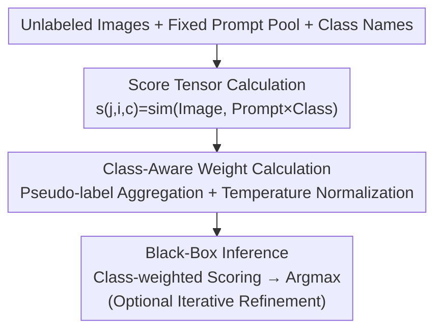

# CARPRT: Class-Aware Zero-Shot Prompt Reweighting for Vision-Language Model

**Conference**: ICLR2026  
**OpenReview**: [https://openreview.net/forum?id=AScQDQqVXY](https://openreview.net/forum?id=AScQDQqVXY)  
**Code**: https://github.com/tmlr-group/CARPRT  
**Area**: Multimodal VLM  
**Keywords**: Vision-Language Models, Prompt Ensembling, Zero-Shot Classification, Black-Box Inference, Prompt Reweighting

## TL;DR
CARPRT points out that existing VLM prompt ensembling methods assign weights to each prompt template that are "shared across all classes," which contradicts the fact that "different prompts have different affinities for different classes." It employs a training-free, purely black-box (score-only) two-stage pipeline to estimate a set of prompt weights for each class individually, consistently outperforming MPE / WPE and even human-selected prompts across 11 zero-shot classification benchmarks.

## Background & Motivation
**Background**: The standard approach for zero-shot classification with Vision-Language Models (VLMs) like CLIP is "prompt ensembling"—filling class names into multiple templates (e.g., "a photo of a [label]", "a satellite photo of [label]"), calculating the similarity between the image and each text description, and then aggregating these into a final score for the class. The most naive aggregation, MPE (Mean Prompt Ensembling), uses an equal average for all templates. WPE (Weighted Prompt Ensembling, originally ZPE) goes further by using unlabeled test images to estimate data-driven weights for each template, downweighting templates that are "generally unsuitable for the downstream task."

**Limitations of Prior Work**: The weights $w_i$ estimated by WPE for a prompt $p_i$ are **shared across all classes**—meaning a template like `a satellite photo of` is either considered important for all classes or for none. However, in reality, `a satellite photo of` is fitting for `airport` but absurd for `apple`. A suffix like `a type of fruit` is a bonus for `strawberry` but misleading for `lamb`. The authors conducted a controlled experiment on Flower102 (simulating "perfect class-wise knowledge" using ground-truth labels) and found that applying WPE per class significantly improves accuracy, confirming that optimal prompt weights indeed vary by class (Figure 1).

**Key Challenge**: MPE / WPE implicitly assume that "prompt weights are independent of the class condition"—given an image, the weight assigned to a prompt is independent of the class it describes. This independence assumption directly limits the expressiveness of the weighting scheme; it cannot represent relationships such as "the same prompt is beneficial for class A but harmful for class B."

**Goal**: Under the most practical setting—a fixed set of preset templates + a batch of unlabeled images + only black-box access to the VLM (similarity scores only)—estimate **class-aware** prompt weights without any gradients, training, or ground-truth labels.

**Key Insight**: The authors first formulated zero-shot classification as an estimation of $\Pr(y^*\mid x^*, P, D)$ using a probabilistic framework, proving that class-independent weights are equivalent to imposing a conditional independence constraint that loses expressiveness (Proposition 2: the set of image-text relationships representable by class-aware weights **strictly contains** that of class-independent weights). Since class-aware weights are theoretically superior, the remaining task is to estimate them without labels.

**Core Idea**: Replace "ground-truth supervision" with "pseudo-labels + score aggregation"—first assign a pseudo-label of the most similar class to each (image, prompt) pair, then count "how high a similarity score a prompt can achieve on images it identifies as a certain class" to use as the relevance weight for that prompt regarding that class.

## Method

### Overall Architecture
The goal of CARPRT is to find a weight matrix $W^*\in\mathbb{R}^{n\times C}$ ($n$ prompts, $C$ classes), where the $c$-th column $W^*_c$ is a set of prompt weights specifically for class $y_c$, replacing the "one-column-for-all-classes" approach of WPE. The pipeline consists of two stages and only requires forward similarity queries from the VLM: **First**, the image and text encoders calculate a three-dimensional score tensor $s_{j,i,c}=\text{sim}(z^I_j, z^T_{i,c})$ (for the $j$-th image, $i$-th prompt, and $c$-th class). **Second**, pseudo-labels are extracted from this tensor and aggregated into the class-aware weight matrix. After obtaining $W^*$, during inference, the final score for each class is the sum of prompt similarities weighted by their class-specific weights, and the class with the highest score is predicted.

The rationality of this process is grounded in a probabilistic derivation: writing zero-shot prediction as a marginal integral over the weight space $\Pr(y^*\mid x^*,P,D)=\int_W \Pr(y^*\mid x^*,P,D,W)\,\Pr(W\mid P,D)\,dW$, where the estimation of the weight posterior $\Pr(W\mid P,D)$ depends on "class priors" and "class-conditional likelihoods." The former is approximated by the empirical distribution of pseudo-labels (Proposition 1: converges to the true distribution at an exponential rate as the sample size increases), and the latter is modeled using an energy-based model treating similarity as negative energy. Lemma 1 further clarifies that the class-aware weights $w_{i,c}$ are what determine the likelihood contribution of each prompt per class; CARPRT's two stages are effectively a "computational realization" of this probabilistic analysis.

### Key Designs

**1. Class-Aware Prompt Weights: Prompt quality depends on the class described**

The fundamental motivation of CARPRT is to remove the implicit assumption in WPE that "weights are shared across classes." The authors provide formal justification via a probabilistic framework: from an energy-based perspective, the relative likelihood of image $x_j$ under class $y_c$ is proportional to $\exp\big(\sum_i (w_{i,c} z^T_{i,c})^\top z^I_j\big)$ (Lemma 1), where the weight $w_{i,c}$ **carries a class index $c$**. This indicates that the most general form of prompt ensembling inherently allows for class-aware weights. Methods like WPE force $w_{i,1}=w_{i,2}=\dots=w_{i,C}$, effectively suppressing a magnitude that should vary by class. Proposition 2 solidifies this: the set of image-text likelihood functions $\mathcal{F}_{CI}$ representable by class-independent weights is a **strict subset** of the class-aware set $\mathcal{F}_{CS}$. Thus, there are image-text relationships that class-independent schemes simply cannot capture. Conclusion: To maximize the potential of prompt ensembling, weights must be class-aware—this is not just an engineering preference but a constraint on expressiveness.

**2. Score Tensor: One forward pass for all "Image × Prompt × Class" correlations**

To estimate class-aware weights, "relevance raw materials" are needed. CARPRT calculates the similarity $s_{j,i,c}=\text{sim}(z^I_j, z^T_{i,c})$ for every image $x_j$ in the unlabeled set $D$, every template $p_i$, and every class $y_c$, where $z^T_{i,c}=g(p_i(y_c))$ is the text embedding after filling class $y_c$ into template $p_i$. These numbers form an $m\times n\times C$ score tensor, where each element is an unnormalized estimate of $\Pr(x_j\mid y_c,W,P)$. Crucially, although written as an embedding dot product, **only the similarity scalar output by the VLM is required**; the embedding vectors themselves are not necessary. This allows CARPRT to run on black-box CLIP models that only expose a "scoring interface." This tensor is the sole source of information for all subsequent aggregations.

**3. Pseudo-Label Aggregation + Temperature Normalization: Compressing the score tensor into a class-aware weight matrix**

Given the tensor, how do we determine "how relevant prompt $p_i$ is to class $y_c$" without labels? CARPRT's answer is to "let prompts vote for themselves." First, for each (image, prompt) pair, the most likely class is determined as a pseudo-label $\hat{y}_{j,i}=\arg\max_{y_c} s_{j,i,c}$. Then, for each (prompt, class) pair, similarities are averaged across **all images pseudo-labeled as $y_c$ by that prompt**, resulting in an intermediate weight:

$$w'_{i,c}=\frac{\sum_{j=1}^m s_{j,i,c}\,\mathbb{1}_{\hat{y}_{j,i}=y_c}}{\sum_{j=1}^m \mathbb{1}_{\hat{y}_{j,i}=y_c}}.$$

Intuitively, $w'_{i,c}$ measures "when prompt $p_i$ identifies an image as $y_c$, how strong its similarity is"—reflecting both relevance intensity and, through the count, implicitly encoding class priors (echoing Proposition 1’s use of pseudo-labels to estimate class distributions). Finally, a temperature-scaled softmax normalization is applied across all prompts for each class:

$$w^*_{i,c}=\frac{\exp(w'_{i,c}/\tau)}{\sum_{j=1}^n \exp(w'_{j,c}/\tau)}.$$

The temperature $\tau$ controls the sharpness: $\tau < 1$ concentrates weight on strong prompts at the cost of diversity, while large $\tau$ tends toward uniformity; $\tau=1.0$ proved to be the most balanced in experiments. Normalization ensures the weights for each class sum to 1, maintaining probabilistic validity. No parameters are updated in this second stage.

**4. Black-Box Inference and Optional Iterative Refinement**

After obtaining $W^*$, the prediction for a test image $x^*$ involves aggregating the similarities of each prompt weighted by the class-specific weights: $\hat{y}(x^*)=\arg\max_c \sum_{i=1}^n w^*_{i,c}\, s_{*,i,c}$, where $s_{*,i,c}=\text{sim}(z^I_*, z^T_{i,c})$. This step also only requires similarity scores, without touching parameters, gradients, or internal embeddings, making it a completely score-only black-box inference. The authors also provide an optional iterative refinement: using the current weights to fuse prompt predictions into more accurate pseudo-labels, then updating the weights—all without gradients or ground-truth. Higher pseudo-label quality leads to more accurate weight estimation, providing stable gains in experiments.

## Key Experimental Results

### Main Results
On 11 fine-grained/large-scale benchmarks using three configurations (CLIP-ViT-B/16, CLIP-ResNet50, DeCLIP-ViT-B/32) and Allingham et al.'s 247 templates. The table below shows Average Accuracy (%) on CLIP-ViT-B/16:

| Method | Flower102 | Pets | EuroSAT | ImageNet | 11-dataset Avg |
|------|-----------|------|---------|----------|-----------|
| MPE | 64.21 | 79.46 | 51.86 | 67.59 | 64.26 |
| Majority Vote | 67.20 | 81.27 | 52.07 | 67.98 | 65.08 |
| WPE | 66.60 | 82.38 | 49.60 | 68.28 | 65.13 |
| **CARPRT** | **71.36** | **89.13** | **55.56** | **68.59** | **67.45** |
| Human Selection* | 71.23 | 88.91 | 47.60 | 68.31 | 65.34 |

\* Human Selection uses prompts manually curated by CLIP authors, incorporating external knowledge; CARPRT still outperforms it. Datasets with clear semantic boundaries see the largest gains (Flower102 +4.76, Pets +6.75 vs. WPE), while highly specialized domains like Aircraft, where pseudo-labels are difficult, show smaller gains.

### Ablation Study

| Configuration | 11-dataset Avg | Description |
|------|-----------|------|
| CARPRT (Full) | 67.45 | Class-aware weights |
| CARPRT-Uniform | ↓ 2.39 avg | Calculates class-aware weights then averages across classes into a global weight |

Robustness to distribution shifts (CLIP-ViT-B/16, weights estimated only once on in-distribution ImageNet and then transferred): CARPRT averages 61.73 on five ImageNet variants, outperforming WPE (61.08) and MPE (60.51).

### Key Findings
- **Class-level adaptation is the main source of Gain**: Removing class-aware adaptation (CARPRT-Uniform) leads to a 2.39% drop; it still outperforms WPE, suggesting both the scoring mechanism and class adaptation contribute, with the latter being critical.
- **Temperature Insensitivity**: $\tau=1.0$ is stable across tasks, requiring no per-task tuning.
- **Pseudo-label quality determines the performance ceiling**: Explicitly filtering low-confidence pseudo-labels yields marginal and unstable gains; however, iterative refinement consistently improves results as pseudo-labels become more accurate.
- **Better prompts amplify benefits**: When replacing general templates with LLM-generated domain-specific prompts, CARPRT becomes even stronger, showing it works with the prompt quality rather than being limited to the general pool.

## Highlights & Insights
- **Elevates "class-aware weights" from intuition to a provable expressivity proposition**: Proposition 2 uses "strict subset" relations to establish the weakness of class-independent weights as a mathematical fact rather than just another trick.
- **Pseudo-label + score aggregation instead of supervision**: Estimating class-aware weights under a purely black-box constraint with zero gradients/training allows it to be a plug-and-play replacement for existing CLIP zero-shot pipelines.
- **The "let prompts vote for themselves" aggregation design is clever**: It simultaneously encodes relevance intensity and class priors, naturally assigning near-zero weights to prompts that never identify a specific class.

## Limitations & Future Work
- **Dependency on initial pseudo-label quality**: In specialized domains like Aircraft, where the base VLM's pseudo-labels are poor, CARPRT's gains are limited.
- **Requirement for a batch of unlabeled images**: In pure one-shot or instant scenarios without $D$, class-aware weights cannot be estimated.
- **Simplified assumptions in theory**: The energy-based model and conditional independence derivations rely on normalized embeddings and inner-product similarity, which actual VLMs may not strictly follow.
- **Future Directions**: Tighter coupling of iterative refinement with LLM-generated domain prompts or more structured weighting of low-quality pseudo-labels instead of simple filtering.

## Related Work & Insights
- **vs. MPE (Mean Prompt Ensembling)**: MPE uses equal weights (all-ones matrix $W$); CARPRT learns individual weights per class and prompt, avoiding the drag from misleading templates.
- **vs. WPE / ZPE (Allingham et al. 2023)**: WPE is the direct competitor, estimating weights **shared across all classes**. CARPRT proves this loses expressiveness and extends the weights to be class-aware.
- **vs. Majority Vote**: Majority Vote uses hard predictions; CARPRT preserves and aggregates continuous similarity information, leading to better information utilization.
- **vs. LLM-generated class descriptions**: Those methods rely on LLM compute for content; CARPRT modifies only the weights without changing the content, and can be combined with LLM prompts for additive gains.

## Rating
- Novelty: ⭐⭐⭐⭐ The "class-aware vs. class-independent" perspective is clear, and the formalization of intuition into a theorem makes it a high-quality "small but beautiful" work.
- Experimental Thoroughness: ⭐⭐⭐⭐ Covering 11 benchmarks × 3 architectures + distribution shifts + comprehensive ablations.
- Writing Quality: ⭐⭐⭐⭐ The probabilistic framework and two-stage implementation are well-integrated.
- Value: ⭐⭐⭐⭐ Training-free, black-box, and plug-and-play with low barriers to deployment.

<!-- RELATED:START -->

## Related Papers

- [\[ICML 2026\] Density-Aware Translation of Spurious Correlations in Zero-Shot VLMs](../../ICML2026/multimodal_vlm/density-aware_translation_of_spurious_correlations_in_zero-shot_vlms.md)
- [\[ICLR 2026\] Naming to Learn: Class Incremental Learning for Vision-Language Model with Unlabeled Data](naming_to_learn_class_incremental_learning_for_vision-language_model_with_unlabe.md)
- [\[CVPR 2026\] Explaining CLIP Zero-shot Predictions Through Concepts](../../CVPR2026/multimodal_vlm/explaining_clip_zero-shot_predictions_through_concepts.md)
- [\[ICLR 2026\] SR-3D: 3D-Aware Region Prompted Vision Language Model](3d_aware_region_prompted_vision_language_model.md)
- [\[CVPR 2025\] Locality-Aware Zero-Shot Human-Object Interaction Detection](../../CVPR2025/multimodal_vlm/locality-aware_zero-shot_human-object_interaction_detection.md)

<!-- RELATED:END -->
