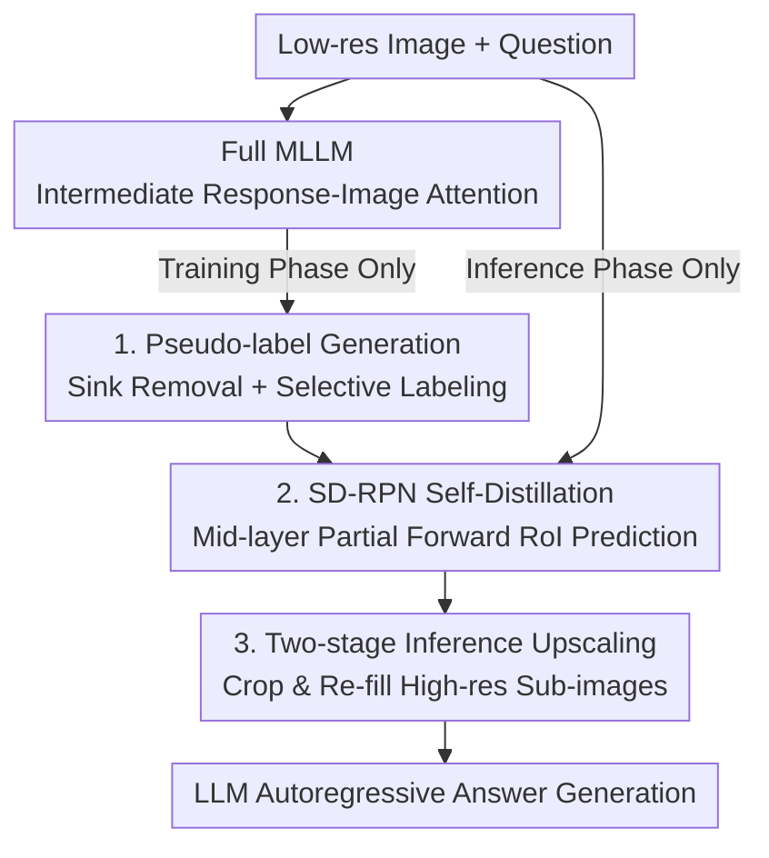

# Catching the Details: Self-Distilled RoI Predictors for Fine-Grained MLLM Perception

**Conference**: ICLR 2026  
**OpenReview**: [https://openreview.net/forum?id=Cox6AaRyan](https://openreview.net/forum?id=Cox6AaRyan)  
**Code**: https://github.com/YuHengsss/SD-RPN  
**Area**: Multimodal VLM  
**Keywords**: Fine-grained perception, RoI localization, Self-distillation, Attention denoising, High resolution

## TL;DR
This paper proposes SD-RPN (Self-Distilled Region Proposal Network), which transforms noisy and blurred intermediate-layer attention maps in MLLMs into high-quality pseudo-labels via denoising and selective labeling. These labels are used to train a small RPN attached to a frozen backbone, allowing the model to predict Regions of Interest (RoI) in a single partial forward pass. Trained on only 10K QA pairs, it achieves over 10% absolute accuracy gains on unseen benchmarks such as TextVQA, DocVQA, and V-Star.

## Background & Motivation
**Background**: MLLMs require high-resolution visual inputs for fine-grained perception (reading small text, analyzing charts, locating small objects). Feeding full high-resolution images is computationally expensive. Recent trends favor the **RoI paradigm**: identifying a "region worth zooming in on" from a low-resolution image and sending only that crop for high-resolution encoding, offering superior cost-effectiveness.

**Limitations of Prior Work**: Identifying this RoI remains challenging. **Training-based** methods (e.g., VILA-HD) rely on large-scale box-annotated pre-training, which is expensive in terms of data and compute, and often requires a full prefill of the low-resolution image. **Training-free** methods (e.g., ViCrop) use internal cross-modal attention as localization signals but either require multiple prefills or depend on slow, sequential autoregressive decoding, leading to low inference efficiency and insufficient accuracy.

**Key Challenge**: There is a trade-off between localization accuracy, efficiency, and annotation cost. Accurate methods require heavy annotation or repeated forward passes, while efficient methods using raw attention are hindered by noise. **The root cause is that although internal MLLM attention contains strong RoI signals, it is highly noisy**: "attention sink" tokens capture excessive attention, and foreground activations are incomplete. Using these directly as dense supervision leads to suboptimal learning.

**Goal**: To train an RoI predictor that is both accurate and fast, without relying on external annotations, full model fine-tuning, or slow autoregressive decoding.

**Key Insight**: Since attention signals are "correct in direction but blurred," they should not be used as direct supervision. Instead, they should be **purified into sparse, reliable pseudo-labels** for a lightweight network to distill. Furthermore, RoI prediction is **moved to the intermediate layers**. Research shows these layers already possess sufficient localization capabilities, allowing RoI extraction via a partial forward pass, decoupled from the subsequent autoregressive generation.

**Core Idea**: Use "self-distillation" to denoise and label intermediate-layer response-image attention maps as pseudo-labels. Train a small RPN attached to the frozen backbone to predict RoIs in a single partial forward pass, replacing expensive annotations and multiple forward passes.

## Method

### Overall Architecture
SD-RPN addresses how to find RoIs accurately and quickly. The pipeline spans training and inference: **During training**, given an image and QA pair, the full MLLM generates intermediate response-image attention maps, which are denoised and labeled as $\bar M_{RoI}$ via a pseudo-label generation pipeline. Simultaneously, an RPN composed of several transformer blocks (initialized from MLLM layers $B$ to $B+R$) predicts a dense RoI map $\hat M_{RoI}$, aligned to pseudo-labels using BCE loss. This is a classic **self-distillation** where the teacher and student share the same architecture and weight source. **During inference**, the full MLLM no longer calculates attention; the RPN performs only a partial forward pass up to layer $B$ to output $\hat M_{RoI}$. This is post-processed into a binary foreground mask to crop high-resolution sub-images, which are then re-inserted into the visual sequence for the LLM to generate the answer. The entire process is trained end-to-end without modifying the original MLLM weights.

### Key Designs

**1. Pseudo-label Generation: Purifying noisy attention into sparse, reliable supervision**

Directly using the raw RoI map $M_{RoI}$ as supervision is hindered by two types of noise: **sink tokens**—semantically irrelevant tokens that dominate attention due to large L2 norms of their feature vectors; and blurred foreground-background boundaries with incomplete foreground activation. This design purifies the map in two steps. First, **sink removal**: attention for tokens exceeding a norm threshold $\tau_{norm}$ is zeroed to obtain a cleaner $M'_{RoI}$:

$$(M'_{RoI})_j = \begin{cases} 0 & \text{if } \|(H_v)_j\|_2 > \tau_{norm} \\ (M_{RoI})_j & \text{otherwise} \end{cases}$$

Second, **selective label assignment**: Analysis on the TextVQA subset shows that tokens with high relative attention ($a/a_{max} > 0.2$) fall within ground-truth boxes ~40% of the time, while low-score tokens (< 0.1) do so ~10%. However, the **vast middle-ground "blur zone" lacks clear localization patterns**. Dense regression would cause the model to be misled by these zones. Thus, **three-state labeling** is used instead of regression: only high-confidence tokens are labeled as foreground/background, while blurred ones are assigned -1 and ignored. Formally, let the foreground set be $S_{fg}=\{j\mid a_j\ge\tau_{fg}a_{max}\}$ and background set be $S_{bg}=\{j\mid j\notin B_{fg} \text{ and } a_j\le\tau_{bg}a_{max}\}$, where $B_{fg}$ is the axis-aligned bounding box enclosing all foreground tokens. Tokens inside the box not labeled as foreground are ignored to avoid treating unactivated parts of real objects as background:

$$(\bar M_{RoI})_j = \begin{cases} 1 & j\in S_{fg} \\ 0 & j\in S_{bg} \\ -1 & \text{otherwise (ignored)} \end{cases}$$

This bypasses the misleading blur zones and mitigates incomplete activation using the bounding box, compressing a blurred map into sparse labels where only certain predictions are penalized.

**2. SD-RPN Architecture and Self-Distillation: Predicting RoI in a single partial forward pass**

For efficiency, the RPN is designed as $R$ transformer blocks placed on top of the first $B$ layers of the frozen MLLM backbone, **initialized with weights from MLLM layers $B$ to $B+R$** to inherit pre-learned representations. It predicts a dense RoI map $\hat M_{RoI}$ rather than sparse boxes. Specifically, for an $n$-turn conversation, the hidden state of the **last token** of each user query is extracted from the penultimate RPN layer to form a query tensor $H_{RoI}\in\mathbb{R}^{n\times d}$. This is projected alongside visual tokens into query/key vectors via the last RPN block's linear layers, followed by a matrix multiplication: $\hat M_{RoI}=Q_{RoI}K_v^T$. This requires only a partial forward pass, making it significantly faster than ViCrop (1.5× faster during the RoI prediction phase on LLaVA-1.5-7B).

Training uses pure **BCE self-distillation** to align with pseudo-labels $\bar M_{RoI}$. A counter-intuitive but key finding is that **using the MLLM's own predicted responses for pseudo-labeling is superior to using stronger external teachers (e.g., GPT-4) or manual annotations** (Tab. 4b shows 152K† drops to 60.7 with GT responses vs 62.6 with self-generated). This is attributed to "representation consistency"—external responses, though more accurate, induce attention maps that are out-of-distribution for the student RPN. Self-generated responses, even if imperfect, align naturally with the model's own visual localization mechanism, providing a more consistent and reachable distillation target, especially under data scarcity. This allows the framework to be entirely free from external models and labels.

**3. Two-stage Inference: Upscaling from dense maps to high-resolution refills**

During inference, $\hat M_{RoI}$ is post-processed into a binary mask $B$ via 2D reshaping, Gaussian filtering for smoothing, and thresholding at $\tau$ to solidify activation regions. Two upscaling strategies follow: **Box Upscaling** calculates a minimal bounding box for each connected component and encodes them independently, providing higher effective resolution for small targets. **Masked Upscaling** uses a single bounding box enclosing the union of all foreground components, better preserving global spatial relationships for structured data (charts, documents). High-resolution tokens are inserted after the original ones, and the LLM generates the final answer. Ablations show Masked Upscaling performs better and achieves higher throughput on OCRBench/TextVQA (0.62× vs 0.55×), making it the default.

### Loss & Training
The objective is solely $L_{BCE}(\hat M_{RoI}, \bar M_{RoI})$, ignoring tokens labeled -1. The backbone MLLM remains frozen, while only the $R$ blocks of the RPN (default $R=3$) are updated. Weights are initialized from the original model, so no new box annotations are needed. Pseudo-labels are derived from a mix of GQA + OCR-VQA data. Relative thresholds are set to $\tau_{fg}=0.2$ and $\tau_{bg}=0.1$. High-resolution benchmarks use a maximum of 4096 visual tokens.

## Key Experimental Results

### Main Results
SD-RPN consistently improves performance across LLaVA-1.5, DeepSeek-VL, and Qwen2.5-VL families on 5 document/OCR benchmarks (Throughput relative to baseline on a single A6000):

| Model | DocVQA | TextVQA | OCRBench | Average | Throughput |
|------|--------|---------|----------|------|------|
| LLaVA-1.5-7B | 21.5 | 46.1 | 31.4 | 27.5 | 1.0× |
| +S2 | 27.1 | 52.6 | 32.6 | 30.7 | 0.70× |
| +ViCrop | 27.0 | 57.2 | 33.2 | 31.8 | 0.42× |
| **+SD-RPN** | **34.2** | **58.8** | **37.3** | **34.6** | 0.62× |
| LLaVA-1.5-13B | 23.5 | 48.7 | 33.7 | 29.5 | 1.0× |
| **+SD-RPN** | **39.4** | **63.4** | **39.6** | **37.7** | 0.51× |
| DeepSeek-VL-7B | 50.7 | 63.0 | 42.4 | 49.6 | 1.0× |
| **+SD-RPN** | **67.2** | **71.5** | **47.9** | **57.5** | 0.40× |
| Qwen2.5-VL-7B | 92.0 | 81.1 | 81.5 | 81.5 | 1.0× |
| **+SD-RPN** | **93.6** | **83.5** | **82.9** | **84.5** | 0.57× |

On vision-centric high-resolution benchmarks, V-Star improves by 10%+ and HR-Bench by 6%+. SD-RPN with Qwen2.5-VL-7B (89.5) is comparable to DeepEyes (90.1), which relies on expensive visual CoT:

| Model | V* Score | HR-4K | HR-8K |
|------|---------|-------|-------|
| LLaVA-1.5-7B | 50.3 | 37.5 | 33.8 |
| +ViCrop | 52.4 | 47.8 | 36.1 |
| **+SD-RPN** | **70.7** (↑20.4) | **47.3** (↑9.8) | **41.6** (↑7.8) |
| Qwen2.5-VL-7B | 78.0 | 72.5 | 63.6 |
| +DeepEyes† | 90.1 | 75.1 | 72.6 |
| **+SD-RPN** | **89.5** (↑11.5) | **78.5** (↑6.0) | **73.5** (↑9.9) |

### Ablation Study
Stepwise component addition (LLaVA-1.5-7B, Average across OCRBench/TextVQA/POPE/V*):

| Configuration | Average | Description |
|------|------|------|
| (0) Baseline | 53.4 | LLaVA-1.5-7B |
| (1) Raw Attention | 56.9 (↑3.8) | Localization via noisy signals |
| (2) RPN Regressing Attention (MSE) | 59.0 (↑5.3) | Distillation with blurred maps |
| (3) +Selective Label Assignment | 61.4 (↑7.9) | Three-state labeling, ignore blur |
| (4) +Sink Token Removal | 62.4 (↑9.0) | Further denoising gain |
| (5) +Masked Upscaling | 62.6 (↑9.2) | Default upscaling, higher throughput |

Regarding backbone depth, $B15R3$ (15 frozen layers + 3 RPN blocks) peaks at 62.6, with deeper configurations yielding diminishing returns. Only 10K samples achieve 60.6 (↑7.2), demonstrating exceptional data efficiency.

### Key Findings
- **Denoising is critical**: The jump from "regressing raw attention" (59.0) to "selective labeling" (61.4) is the largest single gain, validating the core idea of avoiding dense blurred supervision.
- **Self-generation > Strong Teacher**: Using the model's own answers for pseudo-labels (62.6) outperforms using GT responses from LLaVA SFT (60.7), suggesting distribution consistency is more important than absolute target accuracy.
- **High Data Efficiency**: 10K samples perform near 152K, and the frozen backbone ensures low training cost.
- **Improved RoI Speed**: Total throughput is 0.4–0.62× the baseline, but the RoI prediction step is 1.5× faster than ViCrop, allocating computational budget to the high-resolution refill where it matters most.

## Highlights & Insights
- **"Purify, then Distill"**: Treating internal attention as a "correct but noisy weak label," purifying it via sink removal and three-state labeling, and then distilling it into a small network is a paradigm applicable to any scenario extracting internal model signals.
- **Three-state "Ignore" Label**: Avoiding a binary black-and-white choice by ignoring blurred tokens prevents misleading the model, while the bounding box compensates for incomplete activation—a practical trick for weak supervision.
- **Localization at Intermediate Layers**: Decoupling RoI prediction from autoregressive decoding via mid-layer partial forward passes is a structural efficiency gain that could be applied to other MLLM early-exit tasks.
- **Consistency vs. Accuracy**: The counter-intuitive success of self-distillation over stronger teachers suggests that in low-data regimes, target distribution alignment with the student may be more vital than the accuracy of the target itself.

## Limitations & Future Work
- Overall inference throughput is 0.4–0.62× the baseline; while RoI prediction is optimized, high-resolution refilling and increased token counts remain significant bottlenecks.
- Pseudo-label quality depends on several empirical thresholds ($\tau_{norm}, \tau_{fg}, \tau_{bg}, \tau$), and their generalizability across model families needs further verification.
- The method assumes intermediate layers possess localization capabilities; for models where internal attention is fundamentally weak or misaligned, denoising will not suffice.
- Upscaling strategies currently use fixed defaults rather than per-sample adaptive selection between Box and Masked modes.

## Related Work & Insights
- **vs. ViCrop (Training-free cropping)**: ViCrop uses raw attention and requires multiple passes or slow decoding. This work denoises and labels attention to train an RPN, achieving higher accuracy (V* 70.7 vs 52.4) and 1.5× faster RoI extraction.
- **vs. S2 / VILA-HD (Training-based high-res)**: These rely on full fine-tuning or large box-annotated datasets. Ours uses a frozen backbone, zero box annotations, and only 10K QA pairs.
- **vs. DeepEyes / Thyme (RL + Visual CoT)**: These use RL and complex reasoning chains for high-res inference; SD-RPN reaches comparable performance at much lower cost on Qwen2.5-VL-7B.
- **vs. Classic Self-distillation**: While typically used for alignment or representation learning, this work applies self-distillation to extract fine-grained localization cues, highlighting that self-generated targets can outperform external teachers in consistency.

## Rating
- Novelty: ⭐⭐⭐⭐ The combination of attention denoising, three-state pseudo-labels, and mid-layer RPN distillation is innovative.
- Experimental Thoroughness: ⭐⭐⭐⭐⭐ Comprehensive coverage across three model families and 8+ benchmarks with extensive ablations.
- Writing Quality: ⭐⭐⭐⭐ Clear motivation and well-explained methodology.
- Value: ⭐⭐⭐⭐⭐ Practical, scalable solution for fine-grained perception with zero annotations and minimal data.

<!-- RELATED:START -->

## Related Papers

- [\[ICLR 2026\] SPECS: Decoupling Multimodal Learning via Self-distilled Preference-based Cold Start](specs_decoupling_multimodal_learning_via_self-distilled_preference-based_cold_st.md)
- [\[ICLR 2026\] GranViT: A Fine-Grained Vision Model For Autoregressive Multimodal Large Language Models](granvit_a_fine-grained_vision_model_for_autoregressive_multimodal_large_language.md)
- [\[CVPR 2026\] DiG: Differential Grounding for Enhancing Fine-Grained Perception in Multimodal Large Language Models](../../CVPR2026/multimodal_vlm/dig_differential_grounding_for_enhancing_fine-grained_perception_in_multimodal_l.md)
- [\[ICLR 2026\] P2P: Automated Paper-to-Poster Generation and Fine-Grained Benchmark](p2p_automated_paper-to-poster_generation_and_fine-grained_benchmark.md)
- [\[ICLR 2026\] UniF2ace: A Unified Fine-grained Face Understanding and Generation Model](unif2ace_a_underlineunified_underlinefine-grained_underlineface_understanding_an.md)

<!-- RELATED:END -->
