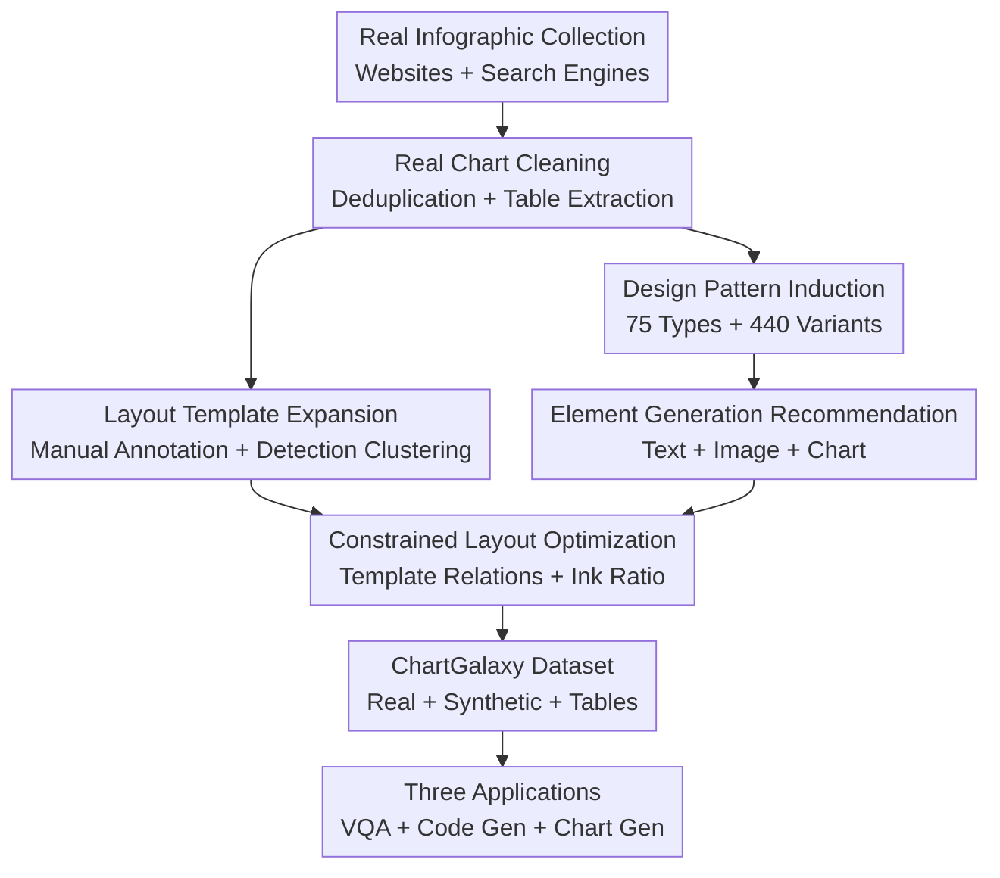

# ChartGalaxy: A Dataset for Infographic Chart Understanding and Generation

**Conference**: ICLR2026  
**OpenReview**: [https://openreview.net/forum?id=P4lFbvZ4HH](https://openreview.net/forum?id=P4lFbvZ4HH)  
**Code**: https://github.com/ChartGalaxy/ChartGalaxy  
**Area**: Multimodal VLM / Chart Understanding / Data Visualization  
**Keywords**: Infographic chart understanding, chart generation, multimodal dataset, LVLM, D3.js

## TL;DR
ChartGalaxy constructs a million-scale infographic dataset by inducing chart types, visual variants, and layout templates from real-world designs, then programmatically synthesizing high-quality infographics with table supervision. It significantly enhances LVLM capabilities in infographic Q&A, code generation, and example-driven chart generation.

## Background & Motivation
**Background**: Chart understanding datasets have previously focused on common statistical charts, such as bar, line, and scatter plots with relatively regular structures. These datasets are suitable for training models to read axes, legends, values, and trends, supporting tasks like ChartQA, Chart-to-code, and chart summarization. However, data visualization in real communication scenarios is not always these "clean charts": news, business reports, science pages, and social media more frequently use infographic charts, which blend charts, icons, illustrations, text blocks, color metaphors, and complex layouts to tell data stories.

**Limitations of Prior Work**: While LVLMs can perform visual Q&A on common charts to some extent, they struggle significantly with infographics. The reason is not just "messier images," but that data encoding in infographics often appears across modalities: an icon might represent a category, a heading might imply a data fact, and color or size may serve both visual style and numerical encoding, with layouts intertwining text, images, and chart areas. Existing datasets like InfographicVQA and ChartQAPro have begun to cover infographics but are small in scale, making it difficult to simultaneously satisfy training, evaluation, and generation tasks.

**Key Challenge**: An infographic dataset must satisfy two goals that are difficult to achieve concurrently. On one hand, data must be large and structured enough for fine-tuning LVLMs or building reproducible benchmarks; on the other hand, charts must retain the diversity and aesthetics of real designs, or the model will only learn templated common charts that fail to transfer to real infographics. Pure web crawling preserves authenticity but is limited in scale and annotation; pure programmatic synthesis scales well but often lacks stylistic variety.

**Goal**: The authors aim to build a dataset that originates from real designs, allows for large-scale synthesis, and binds every image to a source table. This goal is decomposed into three sub-problems: extracting reusable design patterns from real infographics; combining tables, text, images, and charts into visually cohesive synthetic infographics; and proving that the dataset genuinely improves understanding, code generation, and chart generation capabilities.

**Key Insight**: ChartGalaxy's key observation is that while real infographics are visually diverse, many designs can be induced into a finite set of chart types, chart variants, and layout templates. As long as these structural patterns come from real designs, combining them with large-scale tabular data via programmatic synthesis achieves a practical balance between scale, controllability, and design complexity.

**Core Idea**: Use a "structural template induced from real design + programmatic synthesis" approach to expand small-scale but high-quality real infographics into a million-scale data resource with table supervision for LVLM understanding and generation training.

## Method

### Overall Architecture
ChartGalaxy does not simply crawl images; it treats real infographics as sources of design patterns and transforms these patterns into a controllable synthesis engine. The inputs include real infographics, open tabular data, icon/image assets, and a chart design taxonomy; the outputs consist of 61,833 real infographics with their tables and 1,701,356 programmatically synthesized infographics with their tables. The pipeline can be understood as "inducing a design language first, then using that language to generate training samples in batches."

The first stage is real-world data collection. The authors collect infographics from 18 chart-rich websites and search engines with license filtering, deduplicate using Perceptual Hashing and CLIP similarity, and extract data tables for each image using a multi-step human-in-the-loop process. The resulting real portion is a set of "image-table" pairs.

The second stage is synthetic data creation. The authors summarize 75 chart types, 440 visual variants, and 68 layout templates from real charts, then generate titles, subtitles, images, specific chart variations, and layouts based on tabular data. Final synthesized charts are rendered by D3.js, preserving executable and parseable structures, which facilitates building code generation benchmarks.

The third stage is application validation. The paper evaluates ChartGalaxy across three tasks: fine-tuning LVLMs for infographic VQA; building a Direct Mimic code generation benchmark (generating D3.js from images); and performing example-driven infographic generation (converting user tables into infographics following a reference style).

### Key Designs
**1. Inducing Design Patterns from Real Infographics: Converting "Beautiful but Uncontrollable" Designs into Reusable Structures**

The primary challenge of infographics is the lack of a single visual grammar. While common bar charts only require decisions on axes, bar width, color, and labels, infographics also require decisions on title placement, icon substitution for bars, image-chart overlap, and the arrangement of text blocks. ChartGalaxy decomposes real designs into three layers: chart types describing how data is visualized, chart variants describing visual styles within the same type, and layout templates describing spatial relationships between text, images, and chart areas.

This induction ensures that synthetic data is not randomly generated from a blank canvas. The paper summarizes 75 chart types and 440 variants, implemented via D3.js. The choice of D3.js is crucial as infographics often require non-standard element shapes, icon fills, complex colors, and custom layouts, which are closer to what designers actually produce compared to standard plotting libraries.

**2. Human-in-the-loop Layout Template Expansion: Expanding Real Layout Coverage with Detection Models**

Relying solely on manual layout annotation limits scale, while fully automatic extraction risks treating detection errors as new layouts. ChartGalaxy adopts a compromise: authors manually annotate 1,500 high-quality real charts from Statista and Visual Capitalist to obtain 55 initial layout templates; these are used to generate 120,000 synthetic images with bounding box annotations to train an InternImage + DINO detection model for analyzing more unlabeled real charts.

The detection model identifies chart and image areas, while text is extracted by PP-OCRv4. The system then measures the similarity between new detected layouts and existing templates using LTSim. Low-similarity layouts are considered potential new templates, which are finalized into 13 additional templates through k-means clustering and manual inspection of centroid samples, totaling 68 templates.

**3. Table-to-Infographic Element Generation: Semantic Alignment of Data, Text, Images, and Charts**

Synthesizing infographics requires more than just drawing a chart from a table; it necessitates titles, descriptions, icons, and colors that match the data theme. ChartGalaxy builds a table library: real tables from VizNet, UN data, Our World in Data, and Papers with Code, while synthetic tables are generated by Gemini-2.0-Flash. Each table is supplemented with topics and data facts.

Text generation uses retrieval-augmented prompting: Sentence-BERT retrieves three similar real infographics based on topic and data facts, followed by Gemini-2.0-Flash generating titles and subtitles. Images are retrieved from 681,459 filtered and captioned icon/image assets based on semantic similarity between image keywords and generated titles. For the chart portion, candidate chart types are determined by data column types and time patterns, with Gemini selecting the most suitable type and using adaptive sampling to select under-covered variants to avoid style concentration.

**4. Constrained Layout Optimization: Improving Readability and Visual Density while Maintaining Template Relations**

Placing elements into templates is insufficient; infographics must be compact without overlapping text and visual elements. The paper formulates layout as a packing optimization with hard constraints: a template $t$ provides spatial relationships between elements, and the element set $E$ must satisfy these while maximizing the ink ratio within tight bounding boxes.

The objective is to maximize $|\cup_i e_i| / |f(\cup_i e_i)|$, where $e_i$ is the pixel set of an element and $f(\cdot)$ is the compact bounding area. Constraints include $g(E,t)=1$ (layout satisfies template relations) and a minimum distance $d(\partial e_i, \partial e_j) \ge p$ between element boundaries. The system uses rejection sampling to find valid initial positions, then grid search to adjust positions and sizes, reducing whitespace while avoiding collisions.

### Loss & Training
ChartGalaxy is a dataset paper and does not propose an end-to-end training loss; the core "training strategy" is reflected in how the data is used for downstream models. For infographic understanding, the authors construct 443,455 Q&A pairs from 70,248 images, covering text reasoning, visual element reasoning, and visual understanding, then fine-tune InternVL3-8B and Qwen2.5-VL-7B. Evaluation uses relaxed accuracy with a 5% margin for numerical answers, ANLS for text, and exact matching for multiple-choice.

For the code generation benchmark, the authors render the generated D3.js into SVG and PNG for comparison rather than comparing code text. Low-level metrics calculate similarity across six categories: area, text, image, color, position, and size using SVG elements. High-level metrics use GPT-4o to judge overall visual similarity from PNGs; the overall score is the average of both. If the code fails to render, both scores are set to 0.

## Key Experimental Results

### Main Results
The first experiment verifies if ChartGalaxy improves LVLM infographic understanding. Instruction datasets were constructed to fine-tune InternVL3-8B and Qwen2.5-VL-7B, tested on InfographicVQA, ChartQAPro, and an independent human-verified test set. Results show stable improvements on public benchmarks and significant gains on the independent set.

| Model | Evaluation Set | Original Model | + ChartGalaxy | Gain |
|------|--------|----------|---------------|------|
| InternVL3-8B | InfographicVQA | 76.19 | 79.99 | +3.80 |
| InternVL3-8B | ChartQAPro | 38.15 | 44.13 | +5.98 |
| Qwen2.5-VL-7B | InfographicVQA | 78.59 | 83.03 | +4.44 |
| Qwen2.5-VL-7B | ChartQAPro | 37.97 | 41.56 | +3.59 |
| InternVL3-8B | Independent Set Overall | 53.20 | 80.07 | +26.87 |
| Qwen2.5-VL-7B | Independent Set Overall | 56.50 | 80.35 | +23.85 |

The second experiment uses ChartGalaxy as a code generation benchmark. 500 synthetic infographics cover all chart types, variants, and templates. Results show that proprietary models still lead, but Llama-4-Maverick-17B has surpassed GPT-4.1-nano among open-source models.

| Model | Type | Success Rate | Low-Level Avg. | High-Level | Overall |
|------|------|------------|----------------|------------|---------|
| Gemini-2.5-Pro | Proprietary | 100.00 | 86.45 | 83.97 | 85.21 |
| GPT-4.1 | Proprietary | 100.00 | 83.16 | 76.84 | 80.00 |
| Claude-3.7-Sonnet | Proprietary | 100.00 | 83.15 | 76.66 | 79.91 |
| Llama-4-Maverick-17B | Open-Source | 99.60 | 64.51 | 58.06 | 61.29 |
| Qwen2.5-VL-72B | Open-Source | 92.60 | 61.96 | 52.21 | 57.09 |

### Ablation Study
The "ablations" focus on data and application contributions. The most informative is the improvement across question types and the comparison between example-driven generation and general image models.

| Configuration | Key Metric | Description |
|------|----------|------|
| InternVL3-8B + ChartGalaxy | Style Detection +60.49 | Largest gain in visual style recognition, filling a signal gap in original models |
| InternVL3-8B + ChartGalaxy | Visual Encoding Analysis +40.78 | Enhanced recognition of color, icons, and shapes as data dimensions |
| Qwen2.5-VL-7B + ChartGalaxy | Style Detection +58.95 | Consistent large-scale improvement across different open-source LVLMs |
| Qwen2.5-VL-7B + ChartGalaxy | Visual-Element DEC +26.38 | Significant gains in extracting conditions from visual elements |
| Ours vs GPT-Image-1 | Fidelity 4.63 vs 2.10 | Structured generation accurately expresses tabular data, avoiding label/scale errors |
| Ours vs GPT-Image-1 | Aesthetics 4.14 vs 2.90 | Reuse of real layout templates yields visual quality superior to pure image generation |

### Key Findings
- ChartGalaxy shows moderate gains on public benchmarks but improves specialty infographic sets by over 23 points, indicating it addresses visual complexity not fully covered by existing benchmarks.
- The largest improvements are in style detection and visual encoding analysis, rather than simple data identification.
- In code generation, while success rates for strong models are high, differences in low-level details (size, position) persist.
- Example-driven generation experiments show that general image models produce attractive images but frequently destroy data fidelity.

## Highlights & Insights
- The primary highlight is decomposing the "aesthetics-driven" infographic into a trainable, synthetic, and evaluable structure.
- The dataset serves both understanding and generation. Since synthesized charts are generated by D3.js and paired with tables, they naturally support multiple downstream tasks.
- Evaluation design is comprehensive: public benchmarks check transferability, independent sets check specialized capability, and code benchmarks check structural reproduction.
- Multi-modal research insight: complex visual understanding can be addressed by data more closely aligned with real visual languages rather than just larger model scale.

## Limitations & Future Work
- Focus is currently on single-chart infographics; multi-chart narratives like long scrolls or dashboards are not yet covered.
- Real chart components are released as URLs due to copyright, which may lead to data drift or reproducibility issues if web resources fail.
- Synthesis still relies on rules and LLM-generated elements; some samples may be less natural than human designs in terms of cultural metaphors.
- Code generation evaluation uses GPT-4o as a judge, which may introduce bias.

## Related Work & Insights
- **vs InfographicVQA**: ChartGalaxy is larger and focuses specifically on infographic charts with explicit table supervision.
- **vs ChartQAPro**: ChartGalaxy serves as a foundational resource for training and generation beyond just difficult VQA benchmarks.
- **vs Plain Synthetic Datasets**: Conventional synthetic datasets are often too "clean"; ChartGalaxy includes icons, complex layouts, and variants making it more realistic.
- **vs Text-to-Image**: Structured generation paths in ChartGalaxy sacrifice some freedom but ensure numerical and data faithfulness.

## Rating
- Novelty: ⭐⭐⭐⭐⭐ Inducing templates from real designs to synthesize data effectively solves infographic data scarcity.
- Experimental Thoroughness: ⭐⭐⭐⭐⭐ Covers understanding, code generation, and user studies across multiple scenarios.
- Writing Quality: ⭐⭐⭐⭐ Clear main line and high information density; however, some synthesis control details are deferred to the appendix.
- Value: ⭐⭐⭐⭐⭐ Highly reusable for multimodal chart understanding, document intelligence, and trusted graphics generation.

<!-- RELATED:START -->

## Related Papers

- [\[CVPR 2026\] ChartNet: A Million-Scale, High-Quality Multimodal Dataset for Robust Chart Understanding](../../CVPR2026/multimodal_vlm/chartnet_a_million-scale_high-quality_multimodal_dataset_for_robust_chart_unders.md)
- [\[ICLR 2026\] Breaking the SFT Plateau: Multimodal Structured Reinforcement Learning for Chart-to-Code Generation](breaking_the_sft_plateau_multimodal_structured_reinforcement_learning_for_chart-.md)
- [\[ICLR 2026\] Understanding vs. Generation: Navigating Optimization Dilemma in Multimodal Models](understanding_vs_generation_navigating_optimization_dilemma_in_multimodal_models.md)
- [\[ICLR 2026\] A High Quality Dataset and Reliable Evaluation for Interleaved Image-Text Generation](a_high_quality_dataset_and_reliable_evaluation_for_interleaved_image-text_genera.md)
- [\[ICLR 2026\] TABLET: A Large-Scale Dataset for Robust Visual Table Understanding](tablet_a_large-scale_dataset_for_robust_visual_table_understanding.md)

<!-- RELATED:END -->
