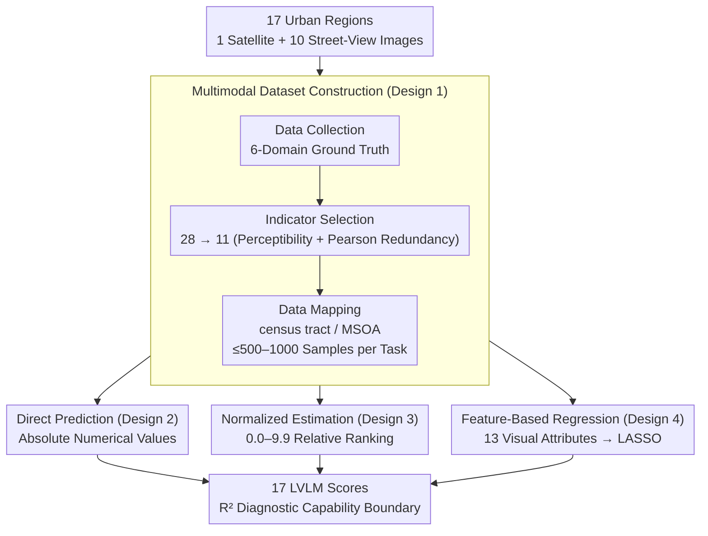

# CityLens: Evaluating Large Vision-Language Models for Urban Socioeconomic Sensing

**Conference**: ICLR2026  
**arXiv**: [2506.00530](https://arxiv.org/abs/2506.00530)  
**Code**: [https://github.com/tsinghua-fib-lab/CityLens](https://github.com/tsinghua-fib-lab/CityLens)  
**Area**: Multimodal VLMs  
**Keywords**: urban computing, socioeconomic sensing, benchmark, vision-language model, street view

## TL;DR
The authors construct CityLens, the largest urban socioeconomic sensing benchmark to date (covering 17 cities, 6 domains, and 11 prediction tasks). It evaluates 17 LVLMs across three paradigms—direct prediction, normalized estimation, and feature-based regression—to infer socioeconomic indicators from satellite and street-view images. The results reveal that general LVLMs still lag behind domain-specific contrastive learning methods in most tasks.

## Background & Motivation

**Background**: Inferring socioeconomic indicators (e.g., GDP, crime rates, education levels) from urban imagery is a core task in urban computing. Traditional methods utilize contrastive learning (e.g., UrbanCLIP, UrbanVLP) to extract visual features from street-view or satellite images for regression, but they face limitations such as poor cross-country generalization, inability to handle unstructured multimodal data, and a lack of cultural-semantic understanding.

**Limitations of Prior Work**: (a) While LVLMs possess multimodal understanding and global knowledge potentially suitable for these tasks, systematic evaluation is lacking—existing works have limited spatial coverage, simple metrics, and small model scales. (b) There is no unified benchmark to measure the urban sensing capabilities of LVLMs across different tasks, regions, and modalities.

**Key Challenge**: While LVLMs have powerful visual understanding and reasoning capabilities, whether they can effectively extract socioeconomic signals from urban images remains an open question that requires a large-scale systematic evaluation.

**Goal**: Construct the most comprehensive urban socioeconomic benchmark to systematically evaluate the capability boundaries of LVLMs.

**Key Insight**: A unified benchmark across multiple cities, domains, and modalities combined with three complementary evaluation paradigms.

**Core Idea**: Through large-scale experiments involving 17 cities, 11 indicators, 3 evaluation paradigms, and 17 models, the study comprehensively measures the strengths and weaknesses of LVLMs in urban socioeconomic sensing.

## Method

### Overall Architecture
CityLens aims to answer whether LVLMs can interpret socioeconomic signals from urban images. Rather than proposing a new model, it establishes a dataset and evaluation protocol as a standardized metric. On the data side, it covers 17 global cities across 6 continents, pairing 1 satellite image and 10 street-view images per region with ground truth labels for 11 socioeconomic indicators. On the evaluation side, three complementary prompting paradigms—Direct Metric Prediction, Normalized Metric Estimation, and Feature-Based Regression—are designed to probe whether models provide precise values, possess coarse-grained spatial intuition, or capture information within extracted visual features. The performance of 17 models on this framework helps locate their respective capability boundaries. The process follows a pipeline of "Dataset Construction $\rightarrow$ Triple-Paradigm Parallel Evaluation $\rightarrow$ 17-Model Scoring."

### Key Designs

**1. Multimodal Dataset Construction: Filtering "Visually Perceivable Indicators"**

Socioeconomic indicators are varied, but not all can be reasonably inferred from images. Indicators like "daily commute distance" are visually irrelevant; including them would evaluate guessing rather than visual sensing. Starting from 28 initial indicators, the authors selected 11 based on "visual perceptibility" and "Pearson correlation redundancy." These cover six domains: Economy (GDP, Housing Price, Gini), Education (Bachelor’s Proportion), Crime (Violent/Non-violent), Transportation (Public Transit/Driving Ratio), Health (Mental Health, Healthcare Access, Life Expectancy), and Environment (Carbon Emissions, Building Height). Spatial granularity is aligned to Census Tracts (US), MSOAs (UK), or satellite coverage (rest of the world), with samples capped at 1000 per task.

**2. Direct Metric Prediction: Assessing Precise Quantitative Capability**

The most rigorous test involves feeding regional images to the model and asking it to act as an urban academic to report specific numerical values (e.g., "What is the public transit ratio in this area?"). This paradigm requires models to transform visual cues into precise absolute numbers without any buffer, testing their ability to map "seen street-views" to "accurate metrics" rather than just making qualitative judgments.

**3. Normalized Metric Estimation: Assessing Coarse-grained Spatial Intuition**

As absolute numerical prediction is difficult, the authors adapt the approach from GeoLLM by normalizing each indicator to a scale of 0.0–9.9. The model estimates a relative level rather than an absolute value. This downgrades "precise quantification" to "relative ranking," verifying if an LVLM possesses coarse-grained spatial knowledge (e.g., recognizing that an area has "relatively high" GDP) even if it cannot produce exact figures.

**4. Feature-Based Regression: Assessing Information Upper Bounds**

Instead of predicting indicators directly, this paradigm uses LVLMs as feature extractors following the visual taxonomy from Fan et al. (2023). Models score each street-view image across 13 predefined visual attributes (e.g., greenery, vehicles, building facades). Attribute means across 10 images form a feature vector for a LASSO regression (5-fold cross-validation) to fit target indicators. This measures whether visual features extracted by LVLMs contain socioeconomic information at all, providing an "capability upper bound" for the model.

## Key Experimental Results

### Main Results (Feature-Based Regression, $R^2$ Scores)

| Model | GDP | Population | Housing Price | Crime | Transit | Build. Height | Mental Health | Bachelor % | Mean |
|------|-----|------|------|------|------|---------|---------|---------|------|
| UrbanVLP | 0.717 | 0.132 | 0.559 | 0.149 | 0.551 | 0.807 | 0.403 | 0.422 | **0.417** |
| GPT-4o | 0.500 | 0.330 | 0.140 | 0.083 | 0.470 | 0.620 | 0.138 | 0.300 | 0.310 |
| Gemma3-27B | 0.463 | 0.324 | 0.141 | 0.077 | 0.567 | 0.590 | 0.211 | 0.297 | 0.338 |
| Qwen2.5VL-72B | ~0.52 | ~0.35 | ~0.10 | ~0.08 | ~0.53 | ~0.65 | ~0.22 | ~0.30 | ~0.35 |

### Ablation Study (Impact of Street-View Image Count)

| Number of Images | GDP $R^2$ | Housing $R^2$ | Bachelor % $R^2$ | Description |
|-----------|--------|---------|------------|------|
| 1 | Low | Low | Low | Insufficient information in a single image |
| 5 | Medium | Medium | Medium | Rapid performance improvement |
| 10 | Highest | Highest | Highest | Approaching saturation |

### Key Findings
- **General LVLMs lag behind domain-specific methods**: UrbanVLP (contrastive learning baseline) significantly outperforms all LVLMs in tasks like GDP, housing prices, transportation, and building height, suggesting that general visual features are less effective than domain-specific representations for urban sensing.
- **Mental health and education are the hardest tasks**: These metrics show weak corellation with visual cues ($R^2$ near 0), indicating LVLMs cannot yet infer deep social characteristics from imagery.
- **Limited scaling law effects**: Increasing model size from 3B to 72B yielded marginal $R^2$ gains (~0.05-0.10), suggesting the bottleneck lies in the methodology of urban visual understanding rather than model scale.
- **Normalized estimation outperforms direct prediction**: Coarse-grained relative judgments are easier for LVLMs, indicating they possess some spatial intuition but lack precise quantitative skills.
- **Building height is easiest**: $R^2$ consistently exceeded 0.5 as it is a direct visually observable metric.

## Highlights & Insights
- **Most Comprehensive Urban Socioeconomic Benchmark**: With 17 cities, 11 indicators, 3 paradigms, and 17 models, its scale far exceeds previous works like GeoLLM, providing a unified infrastructure for the community.
- **Complementary Triple-Paradigm Design**: By testing precision (direct), coarse perception (normalized), and representation quality (feature-based), the study provides a diagnostic overview of LVLM capability boundaries.
- **Perceptibility-Based Selection**: By selecting indicators that humans can also reasonably infer from images, the benchmark avoids irrational evaluation settings.
- **Systemic Deficiencies Identified**: The results highlight a need for domain-specific visual pre-training for urban computing rather than simply scaling up general-purpose models.

## Limitations & Future Work
- **Benchmark Focus**: The core contribution is an evaluation framework rather than a new methodology for improving sensing capabilities.
- **Label Timeliness**: Potential temporal misalignment between socioeconomic data and street-view image collection (e.g., 2019 crime data vs. 2024 imagery) may affect results.
- **Cultural Bias**: LVLM training data is skewed towards developed nations, potentially leading to lower sensing accuracy in African or South American cities, which requires further analysis.
- **Future Directions**: (a) Urban-specific visual instruction tuning; (b) Multi-source fusion of street-view, satellite, and POI data; (c) Time-series analysis of urban changes.

## Related Work & Insights
- **vs. GeoLLM**: GeoLLM relies on text prompts without images and focuses on global coarse-grained tasks. CityLens is multimodal (satellite + street-view) and fine-grained (census tract level).
- **vs. UrbanVLP/UrbanCLIP**: These are specialized contrastive learning methods that perform better but have poorer generalization. CityLens highlights the gap between general LVLMs and domain methods.
- **vs. PlacePulse/StreetScore**: Earlier works focused on subjective perception (safety, beauty); CityLens extends this to quantifiable socioeconomic indicators.

## Rating
- Novelty: ⭐⭐⭐⭐ Most comprehensive benchmark; novel triple-paradigm design.
- Experimental Thoroughness: ⭐⭐⭐⭐⭐ Extensive analysis across models, tasks, modalities, and scales.
- Writing Quality: ⭐⭐⭐⭐ Clear construction logic and deep analysis.
- Value: ⭐⭐⭐⭐ Provides essential infrastructure for LVLM applications in urban computing.

<!-- RELATED:START -->

## Related Papers

- [\[ICLR 2026\] PhysLLM: Harnessing Large Language Models for Cross-Modal Remote Physiological Sensing](physllm_harnessing_large_language_models_for_cross-modal_remote_physiological_se.md)
- [\[NeurIPS 2025\] CHOICE: Benchmarking the Remote Sensing Capabilities of Large Vision-Language Models](../../NeurIPS2025/multimodal_vlm/choice_benchmarking_the_remote_sensing_capabilities_of_large_vision-language_mod.md)
- [\[ICML 2026\] Benchmarks for Vision-Language Models in Urban Perception Should Be Reliability-Aware and Negotiated](../../ICML2026/multimodal_vlm/benchmarks_for_vision-language_models_in_urban_perception_should_be_reliability-.md)
- [\[ICLR 2026\] Detecting Misbehaviors of Large Vision-Language Models by Evidential Uncertainty Quantification](detecting_misbehaviors_of_large_vision-language_models_by_evidential_uncertainty.md)
- [\[ICLR 2026\] CitySeeker: How Do VLMs Explore Embodied Urban Navigation with Implicit Human Needs?](cityseeker_how_do_vlms_explore_embodied_urban_navigation_with_implicit_human_nee.md)

<!-- RELATED:END -->
