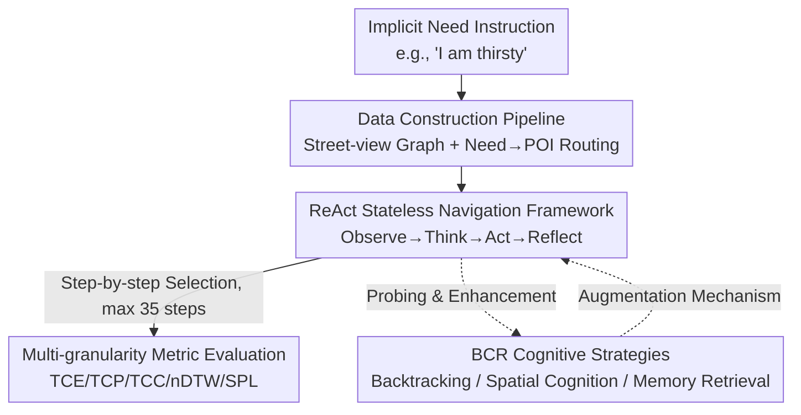

# CitySeeker: How Do VLMs Explore Embodied Urban Navigation with Implicit Human Needs?

**Conference**: ICLR2026  
**OpenReview**: [https://openreview.net/forum?id=hzf23XSDcs](https://openreview.net/forum?id=hzf23XSDcs)  
**Code**: TBD  
**Area**: Multimodal VLM / Vision-Language Navigation / Benchmark  
**Keywords**: Embodied Urban Navigation, Implicit Needs, Spatial Reasoning, VLM Evaluation, Cognitive Maps

## TL;DR
CitySeeker constructs the first embodied urban navigation benchmark for "implicit human needs" (8 cities, 6,440 real street-view trajectories, 7 categories of needs). Utilizing a unified ReAct-style navigation framework to evaluate 27 VLMs, it is found that even the strongest model achieves a task completion rate of only 21.1%, significantly lagging behind humans. Three types of human-cognition-inspired strategies—Backtracking, Spatial Cognition Enrichment, and Memory-Based Retrieval (BCR)—are proposed, pushing performance to 26.9%.

## Background & Motivation
**Background**: Vision-Language Navigation (VLN) has recently leveraged VLMs extensively. However, mainstream works (Touchdown, Talk2Nav, map2seq, etc.) almost exclusively focus on **explicit instruction** navigation—providing step-by-step route descriptions (e.g., "walk straight to the fountain, turn right, stop at McDonald's"), where the agent only needs to perform direct matching between text and street-view.

**Limitations of Prior Work**: Commands given by real humans to robots, drones, or AR assistants are often **abstract goals** rather than route descriptions, such as "I'm thirsty" or "I need a place to work with Wi-Fi." Such needs are not labeled on maps and are multi-layered implicit: functional (inferring a toilet exists inside a McDonald's), spatial (inferring a Starbucks/cinema is likely inside a mall), and semantic (subjective attributes like "romantic" or "high-end" restaurants). Explicit instruction methods fail directly in these dynamic, open urban scenarios.

**Key Challenge**: Solving implicit needs requires the agent to simultaneously perform **semantic inference** (mapping abstract needs to possible POI categories) and **visual grounding** (confirming "this is it" using real-time cues in continuous street-view streams), while coupling the two for multi-hop reasoning over long distances (5–25 steps, up to 35 steps). Humans rely on **cognitive maps** to update spatial understanding and generate actionable plans from abstract goals; however, this intrinsic spatial intelligence in VLMs for outdoor navigation remains unverified.

**Goal**: (1) Create a benchmark to systematically measure the "implicit-need-driven visual grounding" capability of VLMs; (2) Diagnose where VLMs struggle in this task; (3) Explore which human cognitive mechanisms can bridge the gap.

**Key Insight**: Build a cross-city "Need → POI" navigation benchmark using real street-view images, designing implicit needs as 7 categories of tasks with increasing difficulty. Then, use Backtracking, Spatial Cognition, and Memory strategies (BCR) inspired by human cognitive maps to probe and enhance the spatial reasoning of VLMs.

## Method

### Overall Architecture
CitySeeker consists of three components: a **benchmark dataset** (constructing "implicit need → target POI" navigation tasks from real street-view), a **unified navigation evaluation framework** (wrapping any VLM into a step-by-step street-view agent), and a set of **BCR exploratory strategies** (adding backtracking, spatial cognition, and memory to the framework for diagnosis and enhancement).

The task is formalized as sequential decision-making on a navigation graph $G=(V,E)$, where $V$ represents street-view nodes with geographic coordinates and $E$ represents traversable edges. At each step $t$, the agent at node $v_t$ receives a natural language instruction $W$ and multi-view panoramic observations $O_t=\{o_{t,1},\dots,o_{t,n}\}$. A policy $\pi_\Theta$ outputs a reasoning thought, an action (choosing a viewpoint direction), and a confidence score: $(\Phi_t, a_t, c_t)=\pi_\Theta(W, s_t)$. The environment transitions to the next node according to $T(v_t,a_t)$ until the agent decides it has reached the target or exceeds the 35-step limit. The navigation follows a ReAct-style Observe→Think→Act→Reflect loop. Crucially, the base framework **deliberately remains stateless and maintains no persistent memory** to isolate the model's intrinsic spatial reasoning capability, with BCR mechanisms added on top for enhancement.

### Key Designs

**1. Implicit-Need-Driven Visual Grounding: Decomposing Abstract Commands into 7 Task Categories**

This is the core of the benchmark, addressing the pain point that real-world commands are abstract goals rather than path descriptions. Implicit-Need-Driven Visual Grounding refers to the agent first mapping an implicit need to a set of candidate targets via semantic inference, then grounding it to a specific location within a continuous observation stream. The authors design 7 categories of daily needs, ranging from direct recognition to high abstraction: Basic POI (direct facilities/brands), Brand-Specific (locating specified brands like Starbucks, identifying strong lexical/visual anchors), Transit Hub (requiring urban common sense), Latent POI (indirectly visible targets, e.g., "toilets are in McDonald's"), Abstract Demand (broad needs), Inclusive Infra. (accessible facilities), and Semantic Preference (subjective semantics like "restaurants suitable for team building"). The distribution covers POIs (~19.2%), Abstract Demands (20.4%), Brand-Specific (23.4%), and Latent POIs (23.0%). Design criteria include semantic complexity, spatial reasoning requirements, and real-world applicability to cover the spectrum from "recognizing" to "inferring."

**2. Need-Driven Real Street-View Data Construction Pipeline: From Panoramas to Verifiable Routes**

To address the lack of labeled implicit targets on maps, the authors design a demand-driven pipeline to transform real street-views from 8 multinational metropolitan areas (Beijing, Shanghai, Shenzhen, Chengdu, Hong Kong, London, New York, etc.) into navigable graphs. Panoramas from 2024 onwards are collected via Google/Baidu Street View, and the road network is discretized into nodes at **20-meter intervals**. Metadata (latitude/longitude, heading, traversable directions) is stored in Neo4j. Each POI is associated with visible nodes within a **50-meter radius**, forming (Node)–has–>(VisiblePOI) triplets. For query generation, high-frequency POI categories are selected, and human annotators map each need category to one or more POIs. Routing uses A* to find the shortest path between start and end nodes, with constraints ensuring the shortest path falls within a controllable radius (no competing POIs nearby) and produces valid routes of 5–25 steps. Finally, human verification ensures the target POI is indeed (indirectly) visible at the destination. To validate the "Need → POI" mapping, a cross-cultural consensus survey ($N=120$) showed a 83.39% consistency rate with the ground truth. The full dataset contains 6,440 trajectories and over 41,128 street-view panoramas, with 1,257 samples used for the final test set.

**3. Stateless ReAct Navigation Framework + Multi-Granularity Evaluation: Isolating Spatial Reasoning**

To evaluate the model's intrinsic capability rather than engineering tricks, the framework crops the current panorama into multiple perspective views corresponding to feasible directions. The VLM proceeds via an Observe (examine current viewpoints) → Think (infer navigation intent) → Act (select a direction to move) → Reflect (output confidence) loop for each step. **Historical states and persistent memory are intentionally excluded** to isolate the core spatial reasoning. Evaluation uses multi-granularity metrics: Task success is measured via TCE (strict end-node match), TCP (geographical distance $\le 50\text{m}$, allowing for spatial ambiguity where targets are visible from multiple nearby viewpoints), and TCC (destination belongs to the correct target category, reflecting real-world flexibility). Path quality is assessed via nDTW (trajectory alignment), SPL (success rate weighted by path length), and AS (average steps), alongside SPD (straight-line distance to goal).

**4. BCR: Three Classes of Exploratory Strategies Inspired by Human Cognitive Maps**

Following the diagnosis of three bottlenecks—error accumulation in long-range reasoning, lack of spatial cognition, and absence of experiential recall—the authors propose BCR strategies (tested on a 650-sample subset): **Backtracking (B)** corrects navigation drift: B1 returns to the previous trusted node when average confidence within a sliding window drops below $\theta$; B2 uses an objective progress metric—topological distance $d_t$ to the goal—backtracking when $\bigvee_{i=0}^{k-1}(d_{t-i}>d_{t-(i+1)})$; B3 provides direction hints after backtracking to guide the agent toward $a^*=\arg\min_{a\in A_t}\mathbb{E}[d_{t+1}\mid a_t=a]$. **Spatial Cognition Enrichment (C)** supplements environmental awareness using GPT-4o to synthesize successful/failed trajectories from multiple VLMs into spatial cues: C1 provides a structured topological cognitive map (nodes/edges), while C2 provides a relative position map using intuitive descriptions like "left" or "slightly right" with estimated distances. **Memory-Based Retrieval (R)** overcomes fragmented decision-making: R1 aggregates multi-round node/edge metadata via topological retrieval ($h$-hop neighborhood subgraph); R2 uses spatial retrieval within a fixed Euclidean radius; R3 (Historical Trajectory Review) prepends recent navigation history into the context, providing a lightweight solution for stable reasoning within a single episode.

## Key Experimental Results

### Main Results
Zero-shot evaluation was conducted on 27 multi-image VLMs (GPT-4o series, Gemini, Qwen2-VL / Qwen2.5-VL, InternVL2.5 / 3, Llama-3.2 / 4, LLaVA, MiniCPM, Phi, MiniMax-01, etc.) against Human, Random Choice, and Forward Direction baselines (values in %).

| Model | TCE | TCP | TCC | SPL |
|------|-----|-----|-----|-----|
| Qwen2.5-VL-32B (Best VLM) | 2.6 | **21.1** | 6.2 | 12.7 |
| GPT-4o | 2.4 | 18.3 | 6.8 | 13.3 |
| InternVL3-38B | 2.5 | 19.3 | 6.7 | 10.6 |
| Gemini-2.5-Pro | 1.8 | 17.3 | 5.0 | 12.1 |
| Human | **5.7** | **30.1** | **13.5** | 21.2 |
| Random Choice | 0.7 | 13.9 | 3.2 | 3.8 |
| Forward Direction | 0.2 | 7.2 | 0.4 | 1.8 |

The strongest model achieved a TCP of only 21.1% and a TCE of 2.6%, far below the human performance of 30.1% / 5.7%. Notably, **some models failed to outperform the random baseline**. Larger models generally performed better, but gains were marginal. Open-source models like Qwen2.5-VL and InternVL3 remained competitive. Humans showed the greatest advantage in tasks requiring urban common sense (Transit Hub: Human 34.9% vs. Best VLM 10.7%).

### Ablation Study (BCR Strategies)

| Strategy | Mechanism | Representative Result (TCP) |
|------|------|------|
| Baseline | Stateless ReAct | Qwen2.5-VL-32B 19.9 |
| B3 Human-Guided Backtrack | Backtrack + Dir Hint | GPT-4o-Mini 18.2, nDTW 337.1→258.3 |
| C1 Topological Cog-Map | Connective Structure | GPT-4o-Mini 12.5→17.2 |
| R3 History Review | Short-term Memory | GPT-4o-Mini Highest overall 19.4 |
| R1 Topological Retrieval | Multi-turn Graph Memory | Qwen2.5-VL-32B pushed to **26.9** |

The R-series (Memory) is the most effective overall, improving both completion and path efficiency. B2/B3 (External progress signals) are more universal than B1 (Confidence-based). C1 benefits success rates, while C2 favors path efficiency at the occasional cost of completion.

### Key Findings
- **Implicit inference is significantly harder than direct recognition**: Brand-Specific tasks are easiest, while Latent POI tasks (inferring a toilet is inside a McDonald's) are hardest, exposing the "recognize but cannot infer common sense" bottleneck in VLMs.
- **Long-range breakdowns**: Path alignment (nDTW) is better for steps <20 but diverges sharply near 35 steps, where errors fail to be integrated into a coherent spatial memory. Typical errors include trajectory drift and oscillatory pathing (looping).
- **Global 2D maps hinder performance**: Ablations show that injecting global maps decreases task completion, suggesting that fusion of map information with visual grounding is inherently difficult for current models.
- **Urban variance**: GPT-4o performed best in New York and worst in Beijing, likely due to training data bias or the grid-like street layout of US cities.

## Highlights & Insights
- **Targeting "Implicit Needs" is precise**: Upgrading VLN from "following a route" to "understanding abstract intent and grounding it" brings the task closer to real-world last-mile navigation and provides granular diagnostic capability.
- **The Diagnosis → Solution BCR loop is effective**: By isolating three bottlenecks with a stateless framework and addressing them with BCR (Backtracking for error accumulation, Spatial Cognition for awareness, Memory for recall), the work provides a clear roadmap for building embodied agents.
- **Reproducible and compliant data strategy**: Distributing trajectory metadata (Panorama IDs + coordinates) instead of copyrighted images ensures both legal compliance and scientific reproducibility.
- **Multi-granularity metrics are valuable**: The TCE/TCP/TCC tiering avoids binary pass/fail limitations and accounts for spatial ambiguity, making it suitable for any spatial retrieval task.

## Limitations & Future Work
- **Low absolute performance**: Human baselines are also relatively low (30.1% TCP), and model performance is close to noise levels or random baselines in some cases, limiting the discriminative power.
- **BCR validation on sub-datasets**: While insightful, the stability and combinatorial gains of BCR strategies require more systematic verification across the full dataset.
- **Stateless framework is a double-edged sword**: While it isolates intrinsic capabilities, it deviates from real-world deployment where agents utilize SLAM and memory.
- **Reliance on online Street View APIs**: Policy changes or street-view updates might affect long-term reproducibility and temporal consistency.
- **Future Directions**: Training BCR mechanisms end-to-end rather than via prompt injection, and exploring why global maps harm performance to design better graph-vision fusion.

## Related Work & Insights
- **vs. Explicit VLN (Touchdown / Talk2Nav)**: While prior work focuses on "text-vision direct matching" for step-by-step routes, this work explores semantic inference + visual grounding for abstract goals.
- **vs. Indoor/Simulated Demand Understanding**: Unlike prior indoor or 3D game-based studies, this work moves to open-world urban environments, introducing dynamic visual complexity and long-range challenges.
- **vs. LLM Spatial Mental Models**: This work aligns with research on "world models" in LLMs but shifts focus from probing internal representations to systematically evaluating emergent spatial cognition via complex navigation tasks.

## Rating
- Novelty: ⭐⭐⭐⭐⭐ First benchmark for implicit-need-driven open-world embodied urban navigation; original diagnosis framework.
- Experimental Thoroughness: ⭐⭐⭐⭐ Extensive VLM list + human/random baselines + multi-city analysis; BCR subset validation is a minor limitation.
- Writing Quality: ⭐⭐⭐⭐ Clear logic from motivation to diagnosis to solution; rich visualization.
- Value: ⭐⭐⭐⭐⭐ Addresses real pain points of last-mile navigation with a compliant data strategy and BCR roadmap.

<!-- RELATED:START -->

## Related Papers

- [\[AAAI 2026\] Explore How to Inject Beneficial Noise in MLLMs](../../AAAI2026/multimodal_vlm/explore_how_to_inject_beneficial_noise_in_mllms.md)
- [\[ACL 2026\] How Do LLMs and VLMs Understand Viewpoint Rotation Without Vision? An Interpretability Study](../../ACL2026/multimodal_vlm/how_do_llms_and_vlms_understand_viewpoint_rotation_without_vision_an_interpretab.md)
- [\[ICLR 2026\] How Do Medical MLLMs Fail? A Study on Visual Grounding in Medical Images](how_do_medical_mllms_fail_a_study_on_visual_grounding_in_medical_images.md)
- [\[CVPR 2026\] Explore with Long-term Memory: A Benchmark and Multimodal LLM-based Reinforcement Learning Framework for Embodied Exploration](../../CVPR2026/multimodal_vlm/explore_with_long-term_memory_a_benchmark_and_multimodal_llm-based_reinforcement.md)
- [\[NeurIPS 2025\] FlySearch: Exploring how vision-language models explore](../../NeurIPS2025/multimodal_vlm/flysearch_exploring_how_vision-language_models_explore.md)

<!-- RELATED:END -->
