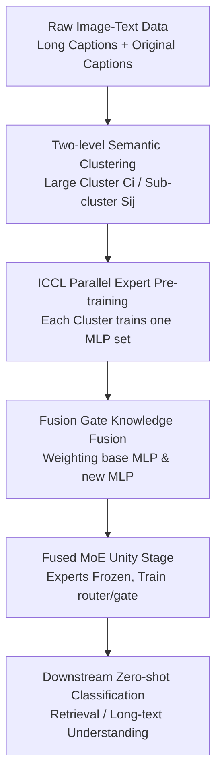

# CLIP-FMoE: Scalable CLIP via Fused Mixture-of-Experts with Enforced Specialization

**Conference**: ICLR 2026  
**OpenReview**: [https://openreview.net/forum?id=RErUA45pI9](https://openreview.net/forum?id=RErUA45pI9)  
**Code**: To be released  
**Area**: Multimodal VLM / CLIP Expansion / MoE  
**Keywords**: CLIP, Mixture-of-Experts, Vision-Language Pre-training, Expert Specialization, Long-text Retrieval

## TL;DR
CLIP-FMoE scales CLIP using a "Fused MoE" pipeline where specialized experts are pre-trained via two-level semantic clustering and subsequently frozen while training the router. By employing a Fusion Gate to fuse the pre-trained MLP with domain-specific experts per-token, the model enhances image-text retrieval and long-text understanding while preserving the original CLIP's zero-shot classification capabilities.

## Background & Motivation
**Background**: CLIP-style vision-language models have become foundational components in zero-shot classification, image-text retrieval, and multimodal generation. Improving CLIP typically follows several paths: scaling model size (e.g., EVA-CLIP), fine-tuning with fine-grained/longer captions, or introducing MoE to increase parameter capacity while keeping per-sample activation sparse.

**Limitations of Prior Work**: Directly scaling dense CLIP requires extensive training schedules, large batches, and massive GPU clusters. Long-caption fine-tuning improves fine-grained understanding but often degrades the original CLIP's coarse-grained zero-shot classification learned from massive web data. While MoE appears suitable for expansion, simple "sparse upcycling" (replicating the original MLP) often results in homogeneous experts. Existing CLIP-MoE approaches create expert differentiation through multi-stage sequential training, but suffer from cumulative clustering errors and long training durations.

**Key Challenge**: This paper addresses the dual contradiction between "capacity expansion" and "knowledge retention." CLIP requires more composable experts for fine-grained knowledge, yet continuous training must not wash out the stabilized "Internet keyword labeling" capability of the pre-trained model. If experts are replicated and trained together, routers may simply distribute tokens among identical experts; if experts are trained sequentially for long periods, scalability is sacrificed.

**Goal**: The authors aim to construct a resource-friendly CLIP MoE training method where experts learn complementary knowledge, while the unified model dynamically selects experts and retains pre-trained knowledge. Specifically, it seeks to solve: how to ensure experts face different semantic regions from the start, how to avoid washing out specialization during unified training, and how to adjustably fuse new and original knowledge per token.

**Key Insight**: The paper observes that while original CLIP is insufficient for fine-grained captions, its image features can partition data into semantically similar clusters. These clusters serve as "task boundaries" for expert training. Instead of making all experts compete on all data, two-level clustering is used to train experts within specific clusters, which are then integrated into a unified MoE.

**Core Idea**: CLIP-FMoE utilizes Isolated Constrained Contrastive Learning (ICCL) to train semantic experts in parallel, followed by a Fusion Gate to blend the original CLIP MLP with MoE expert outputs, achieving expert specialization, training scalability, and knowledge retention.

## Method
### Overall Architecture
CLIP-FMoE does not train a model from scratch but replaces part of the Transformer MLP layers in the existing OpenAI CLIP ViT-L/14 with Fused MoE. The workflow consists of two stages: Stage 1 partitions data into $N$ large clusters and $M$ sub-clusters based on CLIP image features to train $N$ sets of MLP series in parallel. Stage 2 integrates these MLPs as MoE experts into the unified model, training only the router and Fusion Gate on the full dataset.

At the architectural level, the standard MLP is replaced with a structure fusing "base MLP + new expert output." In Stage 1, each cluster corresponds to one trainable MLP series and gate, while other parameters are frozen. In Stage 2, MLP series from different clusters become MoE experts (weights frozen), and the router learns token assignment while the Fusion Gate determines the balance between the base MLP and MoE outputs.

### Key Designs
**1. Two-level Semantic Clustering & ICCL: Solidifying Expert Boundaries**

Typical sparse upcycling fails because experts are copied from the same dense MLP and encounter mixed gradients, leading to functional similarity. CLIP-FMoE first extracts embeddings for the entire dataset using the original CLIP image encoder, partitioning them into $N$ semantic large clusters $\{C_i\}_{i=1}^{N}$ via K-means. Within each large cluster, data is further divided into $M$ fine sub-clusters $\{S_j^{(i)}\}_{j=1}^{M}$. Large clusters assign experts to coarse domains, while sub-clusters ensure that negative samples within a batch are semantically closer and harder.

The core is isolated training with constrained sampling: the $i$-th expert is trained solely on $C_i$, and mini-batches are sampled from the same sub-cluster $S_j^{(i)}$. This converts sequential expert inheritance into parallel semantic specialization. Experts do not compete for the same samples, and harder negatives within batches facilitate learning fine-grained features.

**2. Fusion Gate: Supplementing CLIP instead of Overwriting**

Fine-tuning on long captions often leads to catastrophic forgetting of stable knowledge (e.g., ImageNet, Cars, Pets). CLIP-FMoE retains the base MLP in replaced layers and introduces a per-token, per-dimension gate $G(x) \in [0,1]^D$ to fuse old and new knowledge:

$$
E_{agg}(x)=G(x)E_{base}(x)+(1-G(x))E_{new}(x), \quad G(x)=\sigma(Linear(x)).
$$

Where $E_{base}$ is the frozen pre-trained MLP output and $E_{new}$ is the trained expert. The gate favors $E_{base}$ for robust semantic tokens and increases the weight for $E_{new}$ for detailed descriptions or specific visual attributes. Ablations show that using the Fusion Gate in both stages is essential for balancing retention and supplementation.

**3. Fused MoE Unity: Frozen Experts, Learned Routing and Fusion**

After Stage 1, the model has $N$ sets of specialized MLPs. Instead of full fine-tuning, these are placed into the MoE layer as experts with frozen weights. In Stage 2, only the router (newly initialized) and Fusion Gate are trained. The router uses TopK selection: $E_{moe}=\sum_i R(x)_i E_k^{(i)}(x)$, where $R(x)=Softmax(TopK(xW))$.

Freezing experts prevents the loss of specialization during unified training. The router only needs to learn "which combination of experts to use for this token." A token balance regularization term is added to prevent over-utilization of specific experts. This ensures low Stage 2 training costs while organizing specialized experts into a unified model.

### Loss & Training
The training follows CLIP-style contrastive learning but uses a multi-positive version. If one image has $L$ positive captions with weights $\gamma_c$ ($\sum_c \gamma_c=1$), Stage 1 uses weighted InfoNCE:

$$
L_{multi-pos}=\frac{1}{2}\left(\sum_{c=1}^{L}\gamma_c InfoNCE(I,T^c)+\sum_{c=1}^{L}\gamma_c InfoNCE(T^c,I)\right).
$$

Stage 2 trains on the full data with MoE load balancing:

$$
L_{moe}=L_{multi-pos}+\alpha L_{balance}, \quad \alpha=0.01.
$$

Experiments use OpenAI CLIP ViT-L/14 fine-tuned on CC3M (LLaVA-ReCap version). Long captions are split into segments to fit the 77-token context. Standard settings use $N=4$ experts, TopK=2, and $M=64$ sub-clusters. Long-context experiments extend to 248 tokens using ShareGPT4V.

## Key Experimental Results

### Main Results
The primary focus is zero-shot classification and retrieval. CLIP-FMoE significantly reduces catastrophic forgetting compared to standard fine-tuning and MoE baselines.

| Method | Cars | FGVC | Food | EuroSAT | ImageNet-1K | ImageNet-v2 | Avg |
|------|------|------|------|---------|-------------|-------------|------|
| OpenAI CLIP | 77.93 | 31.77 | 93.07 | 62.59 | 75.54 | 69.84 | 69.62 |
| Fine-tuning | 69.12 | 25.83 | 91.34 | 65.20 | 72.89 | 66.39 | 66.08 |
| Up-cycling | 68.98 | 27.66 | 90.78 | 69.98 | 72.92 | 66.27 | 66.69 |
| CLIP-MoE | 71.20 | 27.81 | 91.27 | 65.13 | 73.19 | 66.86 | 66.47 |
| CLIP-FMoE | 74.62 | 29.58 | 92.32 | 68.31 | 74.87 | 68.66 | 68.65 |

In image-text retrieval (MS COCO, Flickr), CLIP-FMoE achieves 82.68, outperforming CLIP-MoE (82.29) and original CLIP (73.96).

| Task Setting | Repr. Dataset | OpenAI CLIP | Strong Baseline | CLIP-FMoE |
|----------|------------|-------------|-------------|-----------|
| Std Retrieval | COCO/Flickr | 73.96 | CLIP-MoE 82.29 | 82.68 |
| Long-text Retr. | DOCCI/IIW | 63.3 | TULIP 75.9 | 77.2 |
| Ext. Zero-shot | 17 datasets | 69.86 | LongCLIP 68.91 | 69.51 |

### Ablation Study
Ablations confirm that ICCL produces complementary experts rather than redundant ones. Removing the Fusion Gate causes severe drop in zero-shot classification, while applying it only in Stage 2 weakens retrieval performance. Two-level image clustering is found to be superior to text-based or random clustering for defining expert task boundaries.

### Key Findings
- CLIP-FMoE improves the "degradation curve" after continued training, significantly mitigating zero-shot classification loss.
- Fusion Gate is critical for anti-forgetting, providing an explicit path for base CLIP knowledge.
- Parallel expert pre-training via ICCL is $\sim 72.5\%$ more training-time efficient than the sequential approach of CLIP-MoE.
- The method remains effective when expanding context length to 248, maintaining stability across both long and short descriptions.

## Highlights & Insights
- Moving "expert specialization" from a routing problem to a data-partitioning problem is a practical engineering decision that ensures diversity from the start.
- The Fusion Gate explicitly treats pre-trained knowledge as an asset to be retained rather than just an initialization to be overwritten.
- Parallel training is inherently more scalable for increasing the number of experts compared to sequential inheritance.
- Constrained Sampler effectively increases batch difficulty, forcing experts to learn discriminative intra-cluster features.

## Limitations & Future Work
- The sensitivity of final performance to semantic cluster choices requires more systematic investigation.
- Inference FLOPs are higher than Sparse Upcycling or CLIP-MoE due to the dual-path Fusion Gate.
- Experiments focused on ViT-L/14; scaling to larger models and exploring different layer replacement strategies remains for future work.

## Related Work & Insights
- **vs Sparse Upcycling**: CLIP-FMoE avoids homogeneous experts by using semantic clustering before merging.
- **vs CLIP-MoE**: CLIP-FMoE replaces slow sequential training with parallel ICCL and only trains the router on frozen experts, reducing training time by 72.5%.
- **vs LongCLIP / TULIP**: While those focus on context expansion, CLIP-FMoE achieves better balance between classification retention and long-text retrieval.

## Rating
- Novelty: ⭐⭐⭐⭐☆
- Experimental Thoroughness: ⭐⭐⭐⭐☆
- Writing Quality: ⭐⭐⭐⭐☆
- Value: ⭐⭐⭐⭐☆

<!-- RELATED:START -->

## Related Papers

- [\[ICML 2026\] Toward Structural Multimodal Representations: Specialization, Selection, and Sparsification via Mixture-of-Experts](../../ICML2026/multimodal_vlm/toward_structural_multimodal_representations_specialization_selection_and_sparsi.md)
- [\[ICLR 2026\] Massively Multimodal Foundation Models: A Framework for Capturing Interactions with Specialized Mixture-of-Experts](massively_multimodal_foundation_models_a_framework_for_capturing_interactions_wi.md)
- [\[ICLR 2026\] UniLIP: Revamping CLIP to Unify Multimodal Understanding, Generation, and Editing](unilip_adapting_clip_for_unified_multimodal_understanding_generation_and_editing.md)
- [\[ICLR 2026\] Unlocking the Power of Co-Occurrence in CLIP: A DualPrompt-Driven Method for Training-Free Zero-Shot Multi-Label Classification](unlocking_the_power_of_co-occurrence_in_clip_a_dualprompt-driven_method_for_trai.md)
- [\[ICML 2025\] LADA: Scalable Label-Specific CLIP Adapter for Continual Learning](../../ICML2025/multimodal_vlm/lada_scalable_label-specific_clip_adapter_for_continual_learning.md)

<!-- RELATED:END -->
