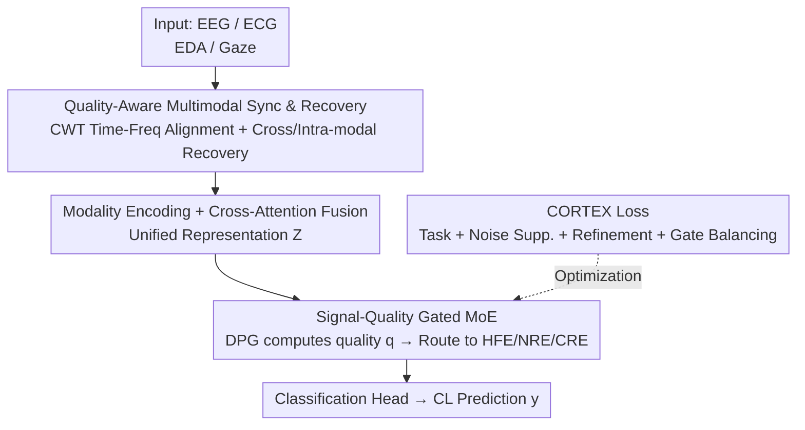

# CogMoE: Signal-Quality–Guided Multimodal MoE for Cognitive Load Prediction

**Conference**: ICLR2026  
**OpenReview**: [https://openreview.net/forum?id=UtbSWdWv0F](https://openreview.net/forum?id=UtbSWdWv0F)  
**Code**: https://github.com/shahaamirbader/CogMoE  
**Area**: Multimodal Time-Series / Physiological Signals / Mixture of Experts / Cognitive Load Prediction  
**Keywords**: Cognitive Load, Signal Quality, Mixture of Experts, EEG/ECG/EDA/Gaze, Quality-Aware Gating

## TL;DR
CogMoE reframes cognitive load prediction from multimodal physiological signals (EEG/ECG/EDA/Gaze) from "modality-based fusion" to "quality-based fusion." It first cleans noise, missing segments, and misalignments using wavelet synchronization and cross-modal recovery. Then, it utilizes three experts specialized in clean, noisy, and recovered signals, respectively, with adaptive routing via a quality-aware gate. Combined with the CORTEX multi-objective loss, it improves performance on CL-Drive and ADABase by up to 13 percentage points over strong baselines.

## Background & Motivation
**Background**: Cognitive load (CL) prediction is critical in safety-critical scenarios such as driving, aviation, and healthcare, where excessive mental workload slows response times and impairs decision-making. Recent advances in multimodal physiological sensing (EEG, ECG, EDA, Gaze) have made large-scale CL prediction feasible. Prevailing methods typically employ unimodal modeling, naive fusion (feature/early fusion), or recent Transformer-based cross-modal integration.

**Limitations of Prior Work**: In real-world deployment, the bottleneck is not the lack of sensors or model capacity, but the **poor and unstable quality of physiological signals**. Motion artifacts, electrode drift, and sensor disconnection lead to noisy signals, temporal misalignments, and data gaps. Existing methods fail in two ways: data-wise, most assume clean inputs without adequate artifact/loss preprocessing; model-wise, they typically **assign experts by modality**, lacking adaptive mechanisms for real-time quality fluctuations. Consequently, performance drops sharply in noisy environments, with typical accuracy stagnating between 70–80%.

**Key Challenge**: In traditional multimodal settings, different modalities provide **complementary** information. However, in CL prediction, EEG/ECG/EDA/Gaze are largely **redundant perspectives of the same cognitive process** once aligned. Given this redundancy, the factor determining prediction quality is not "which modality is present," but "which signal is clean and which is contaminated at this moment." Thus, assigning experts by modality identity is fundamentally misaligned with the problem.

**Goal**: (1) Align heterogeneous signals and recover missing segments before entering experts; (2) Enable the model to schedule experts based on **real-time signal quality** rather than modality identity during inference; (3) Ensure stable training under noise/loss and prevent expert collapse.

**Key Insight**: Since signal quality is the limiting factor, the basis of multimodal modeling should shift from modality identity to estimated signal quality. Clean signals, noisy signals, and masked/recovered signals should each be handled by a specialized expert, routed by a real-time quality score.

**Core Idea**: Replace "modality-guided MoE" with "signal-quality-guided MoE"—changing the routing criterion from modality identity to estimated signal quality, supported by a synchronization-recovery preprocessing pipeline and a quality-aware loss.

## Method

### Overall Architecture
CogMoE is an end-to-end, two-stage quality-aware pipeline. Input consists of four physiological signals (EEG, ECG, EDA, Gaze) with varying sampling rates, noise, and potential gaps; the output is a binary cognitive load label. **Stage one** is "Quality-Aware Multimodal Synchronization and Recovery," a pre-reconstruction step that aligns signals with different sampling rates in the time-frequency domain and employs a two-step cross-modal/intra-modal recovery to fill contaminated or missing segments. **Stage two** is "Signal-Quality-Specialized Expert Modeling": modality-specific encoders embed and fuse signals into a unified representation $Z_m$. After cross-attention, these are sent to the Dynamic Pathway Gating (DPG), which routes features to three experts (specializing in clean, noisy, and recovered signals) based on real-time quality scores. The network is optimized via the CORTEX loss to balance task accuracy, noise suppression, representation refinement, and expert load balancing. The core philosophy throughout is: routing depends on "how clean the signal is," not "which modality it is."

### Key Designs

**1. From Modality Identity to Signal Quality: Reconstructing Routing Criteria**

This is the foundation of the work. Traditional MoEs (SwitchTransformer, FlexMoE, etc.) assign experts based on modality or semantic content, assuming reliable inputs. However, aligned physiological signals are often overlapping views of the same state; the real difference lies in "how clean the signal is." CogMoE redefines expert specialization by quality: three experts correspond to high-fidelity, noisy, and masked/recovered quality ranges, selected by a dynamic gate based on estimated real-time quality. This allows redundant multimodal data to be used "on-demand"—using lightweight experts for clean data and robust experts for contaminated data.

**2. Quality-Aware Multimodal Synchronization and Recovery: Clean Before Modeling**

Addressing misalignment and missing data, this stage involves two steps. **Time-Frequency Synchronization**: Since time-domain alignment (like DTW) is sensitive to spikes and yields unstable results, the authors use Continuous Wavelet Transform (CWT, complex Morlet wavelet) to map each signal $S_m$ to a 2D time-frequency representation $W_m$, capturing both transients and slow trends. Alignment is executed through 2D cross-correlation in the time-frequency domain, selecting the shift with maximum correlation and minimal offset:

$$\Delta t^*, \Delta f^* = \arg\min_{t',f'}\Big(\arg\max_{t',f'}(W_i * W_j)(t',f')\Big)$$

**Multimodal Recovery**: Missing masks $M_m$ are generated based on whether aggregated energy $H_m(t,f)$ from other modalities exceeds a threshold. Recovery includes cross-modal interpolation using weighted sum $W^c_m(t,f)=\sum_{m'\neq m}\alpha_{m'}\beta_{m'}W_{m'}(t,f)$ (where $\alpha$ reflects similarity and $\beta$ normalizes amplitude), followed by intra-modal completion treated as a low-rank matrix problem solved via nuclear norm minimization: $W^{final}_m=\arg\min_{W_m}\|W_m\|_*$ s.t. observed positions remain fixed.

**3. Signal-Quality Gated MoE: Three Experts + DPG Dynamic Routing**

The core of the second stage. Three experts handle different quality ranges: **High-Fidelity Expert (HFE)** targets clean signals (SNR > 15 dB) using a lightweight 2-layer FFN; **Noise-Robust Expert (NRE)** targets noisy inputs using an expanded FFN with residual connections and noise-aware normalization; **Contextual Refinement Expert (CRE)** targets recovered segments, using cross-attention at the embedding layer to leverage cross-modal dependencies. Routing is managed by **Dynamic Pathway Gating (DPG)**, which calculates a quality score $q_m$ for each modality based on SNR, the non-missing ratio $(1-p_{missing,m})$, and temporal consistency (autocorrelation $r_{auto,m}$):

$$q_m = \mathrm{SNR}_m \times (1-p_{missing,m}) \times r_{auto,m}$$

The normalized quality vector $q$ is concatenated with fused features $z$ and passed through a softmax to get routing weights $g_k(z,q)=\frac{\exp(W_{g,k}[z;q])}{\sum_j \exp(W_{g,j}[z;q])}$.

**4. CORTEX Loss: Adaptive Multi-Objective Training**

The CORTEX (Cognitive Routing and Temporal EXpertise) loss combines four objectives:

$$L_{CORTEX} = L_{task} + \gamma L_{noise} + \lambda L_{refinement} + \beta R_{gate}$$

$L_{task}$ ensures prediction accuracy. $L_{noise}$ (MSE) forces NRE outputs to match clean reference representations (generated by injecting Gaussian noise/masking during training and using the pre-perturbed version as a reference). $L_{refinement}$ guides CRE to improve low-quality representations. $R_{gate}=\sum_k(\frac{1}{N}\sum_i g_k(z_i,q_i)-\frac{1}{K})^2$ prevents expert collapse by penalizing utilization variance. Weights are adaptive, with $\beta$ decaying over time to allow the task objective to dominate in later stages.

## Key Experimental Results

### Main Results
Evaluated on two public datasets: CL-Drive (21 subjects, EEG/ECG/EDA/Gaze) and ADABase (30 subjects, ECG/EDA).

| Dataset | Modality Combination | Metric | BIOT | CogMoE |
|--------|---------|------|------|--------|
| CL-Drive | EEG | Acc | 77.75 | **90.94** |
| CL-Drive | ECG | Acc | 86.18 | **92.11** |
| CL-Drive | EEG+EDA | Acc | – | **94.05** |
| CL-Drive | ECG+EDA+Gaze | Acc | – | **95.37** |
| CL-Drive | All 4 Modalities | Acc | – | 94.52 |
| ADABase | ECG+EDA | Acc | – | **~92.5** |

CogMoE consistently outperforms baselines across all combinations. Notably, using three modalities (ECG+EDA+Gaze) performed slightly better than using all four, likely due to EEG noise/redundancy, validating the strategy of flexible subset selection over brute-force inclusion.

### Ablation Study

| Configuration | Key Results | Description |
|------|---------|------|
| Raw input | Baseline | No synchronization or recovery |
| CWT Alignment only | Intermediate | Sync without recovery |
| Full Preprocessing | Acc +10.3% / F1 +11.47% | Gain over raw input |
| FFN (No MoE) | Baseline | Single FFN replaces experts |
| MoE without CORTEX | Significant improvement | Expert usage with standard loss |
| Full (MoE+CORTEX) | >11% Gain over FFN | Full model performance |

### Key Findings
- **Both preprocessing and MoE contribute significantly**: Full synchronization and recovery provide ~10% gain; transitioning from FFN to MoE with CORTEX adds another >11% in accuracy.
- **Quality-aware gating is effective**: Replacing specialized experts with a standard FFN (CogBasic) drops performance by 6–8%.
- **Routing aligns with quality**: Experts HFE, NRE, and CRE receive balanced loads (~33% each); noise-heavy inputs are correctly routed to NRE and masked ones to CRE.
- **Temporal Robustness**: When sequence length increases from 10s to 40s, CogMoE's performance drop is <5%, whereas other models drop by an average of 12.05%.

## Highlights & Insights
- **Rethinking Multimodality**: The authors challenge the assumption of complementarity, noting that physiological signals for CL are redundant. Thus, modeling quality is more effective than modeling modality identity.
- **Measurable Quality Score**: The product-based quality score $q_m$ effectively captures noise, data loss, and consistency.
- **Self-Reference for Denoising**: Using perturbed training samples to provide "clean" targets for the NRE allows for learning denoising without ground-truth clean signals.
- **Stable Gating Regularization**: Using Mean Squared Error for gate balancing instead of KL divergence proves more stable for sparse routing.

## Limitations & Future Work
- The current model relies on **supervised labels**; future work aims to integrate self-supervised objectives to reduce labeling dependency.
- Evaluation is currently limited to driving datasets; while the authors argue the method is signal-quality-centric and generalizable, cross-domain validation is still needed.
- Gating is currently adaptive to signal quality but could be extended to be adaptive to **time scales** (dynamic window lengths).

## Related Work & Insights
- **vs. BIOT**: While BIOT integrates modalities, it assumes reliable inputs. CogMoE's synchronization-recovery and quality-gating outperform it significantly (e.g., EEG Acc from 77.75% to 90.94%).
- **vs. Traditional MoEs**: Standard MoEs route by modality or content. CogMoE reconfigures the routing variable to real-time signal quality $q$, a fundamental shift for noisy sensor data.
- **vs. Naive Fusion**: Traditional fusion treats all modalities equally; CogMoE is much more robust to noise and data gaps, maintaining stability over long sequences.

## Rating
- **Novelty**: ⭐⭐⭐⭐ Reframing MoE routing from modality to signal quality is a clean and powerful insight.
- **Experimental Thoroughness**: ⭐⭐⭐⭐ Two datasets, multiple modality combinations, and detailed ablation studies/visualizations are provided.
- **Writing Quality**: ⭐⭐⭐⭐ Clear logic chain from motivation to method; well-structured equations and figures.
- **Value**: ⭐⭐⭐⭐ Addresses the real-world bottleneck of physiological signal quality; the approach is applicable to other noisy multi-sensor time-series tasks.

<!-- RELATED:START -->

## Related Papers

- [\[CVPR 2026\] SMoES: Soft Modality-Guided Expert Specialization in MoE-VLMs](../../CVPR2026/multimodal_vlm/smoes_soft_modality-guided_expert_specialization_in_moe-vlms.md)
- [\[ICML 2026\] DenseMLLM: Standard Multimodal LLMs for Dense Prediction](../../ICML2026/multimodal_vlm/densemllm_standard_multimodal_llms_for_dense_prediction.md)
- [\[ICCV 2025\] A Quality-Guided Mixture of Score-Fusion Experts Framework for Human Recognition](../../ICCV2025/multimodal_vlm/a_qualityguided_mixture_of_scorefusion_experts_framework_for.md)
- [\[ICLR 2026\] VisJudge-Bench: Aesthetics and Quality Assessment of Visualizations](visjudge-bench_aesthetics_and_quality_assessment_of_visualizations.md)
- [\[ICLR 2026\] Grounding-IQA: Grounding Multimodal Language Models for Image Quality Assessment](grounding-iqa_grounding_multimodal_language_model_for_image_quality_assessment.md)

<!-- RELATED:END -->
