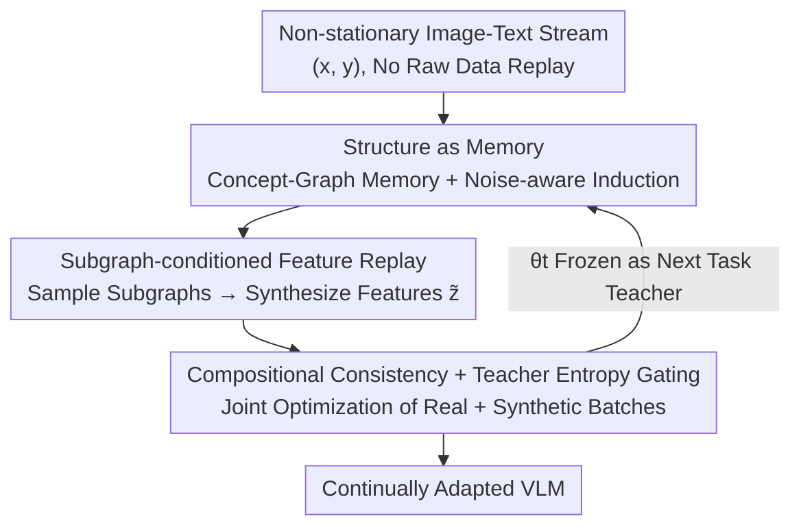

# CoMem: Compositional Concept-Graph Memory for Vision-Language Adaptation

**Conference**: ICLR 2026  
**OpenReview**: [https://openreview.net/forum?id=xp7wDU9JBW](https://openreview.net/forum?id=xp7wDU9JBW)  
**Code**: None  
**Area**: Multimodal VLM / Continual Learning  
**Keywords**: Continual Learning, Concept-Graph Memory, Feature-space Replay, Compositional Consistency, Catastrophic Forgetting

## TL;DR
CoMem treats "compositional structures" (graphs of concepts + relations) as the unit for memory and rehearsal in continual learning. Rather than storing raw images, it synthesizes replay samples in the feature space conditioned on subgraphs. Combined with compositional consistency constraints and teacher entropy-gated distillation to suppress drift, it achieves higher retention and lower forgetting across cross-domain retrieval, structured concept learning, and continual VQA.

## Background & Motivation
**Background**: Vision-Language Models (VLMs) like CLIP have become standard backbones for retrieval, VQA, and grounded reasoning. However, real-world deployment faces non-stationary, domain-shifting data streams, often under privacy and memory constraints that prohibit saving historical samples. Direct fine-tuning on new tasks leads to catastrophic forgetting, erasing both past task knowledge and zero-shot transfer capabilities.

**Limitations of Prior Work**: Existing continual learning solutions roughly follow three paths, each with drawbacks. ① Geometric/Regularization methods (ZSCL, Mod-X, CTP) maintain alignment by constraining representation geometry or parameter drift but rarely model "reusable concepts and typed relations," leading to weak compositional transfer. ② Non-raw data replay methods (IncCLIP, ConStruct-VL, GIFT) use symbolic or pixel-level synthesis as proxies for real samples, but these proxies encode relations poorly and offer little control in the "feature space where learning actually happens," often inheriting biases from teacher models. ③ Parameter-efficient fine-tuning (adapter / prompt / MoE) saves parameters but often results in task-specific adjustments where learned structures are difficult to reuse.

**Key Challenge**: In non-stationary multi-domain streams, the model must be both stable (not forgetting the old) and plastic (learning the new while reusing compositional structures). Geometric alignment only ensures "alignment" without promoting "generalization," and symbolic replay fails to govern the feature space—there is a lack of a mechanism that unifies "semanticized rehearsal signals" with "cross-domain transferability."

**Goal**: To maintain stable and plastic compositional abilities under restricted memory and parameter budgets without storing raw samples, allowing concepts and relations to be reused and recombined across domains and tasks.

**Key Insight**: The authors observe that since the goal is to reuse "compositions," the unit of memory and rehearsal should be the compositional structure itself rather than individual raw images. Furthermore, rehearsal should occur "where learning actually happens"—in the feature space, rather than the pixel or symbolic space.

**Core Idea**: Reformulate continual VLM learning as "maintaining a compact concept-relation graph." Replay signals are synthesized in the feature space conditioned on subgraphs, balanced with compositional consistency targets and teacher/uncertainty filtering to achieve plasticity and stability.

## Method

### Overall Architecture
CoMem processes a sequence of multimodal tasks $\{D_t\}_{t=1}^T$, where each task provides image-text pair supervision, but **no raw samples are saved**. The model snapshot $\theta_{t-1}$ after task $t-1$ is frozen as a teacher. The new task relies on a concept-graph memory $M_t$ with a fixed budget $B$. The training loop for a single task $t$ consists of three stages forming a closed loop: first, **inducing concept triplets** from image-text pairs and updating the graph memory (Stage 1); second, **sampling subgraphs to synthesize replay samples** in the feature space (Stage 2); and finally, **joint optimization** on real and synthetic batches with multi-objective regularization (Stage 3). After training, the updated graph memory is stored for reuse in the next task.

### Key Designs

**1. Structure as Memory: Using Concept Graphs as Rehearsal Units Instead of Storing Images**

To address the issue that storing raw images violates privacy/memory budgets and that single images are not reusable units, CoMem maintains a typed concept graph $G=(V,E)$. Nodes $V=\mathcal{C}=\mathcal{A}\cup\mathcal{E}$ represent an attribute and entity vocabulary, while edges $E\subseteq V\times R\times V$ represent typed relations. Each node stores a prototype $\mu_c\in\mathbb{R}^d$, a count $n_c$, and an anchor reservoir $A_c$ of up to $B_c$ token features (**storing token features, not images**). Each edge stores an interaction embedding $\psi_e$ and a count $n_e$.

The graph update is key: scored triplets $\mathcal{T}(x,y)=\{(a,e,r,w)\}$ are extracted from each $(x,y)$. Candidate $(a,e,r)$ are provided by a lightweight text parser (prompted IE), then passed to a **visual verifier frozen on the teacher $\bar\theta$** to avoid confirmation bias. Verification uses a shared low-rank projection $W=AB^\top$ ($r\ll d$), calculating alignment scores $s_\text{align}(c\mid Z)=\sigma(\frac1\tau\,\text{LSE}_{p}\langle WZ_p,t_c\rangle)$ for concept $c$, where $t_c$ is the teacher's text embedding. Triplet confidence $w(a,e,r)$ is the geometric mean of three alignment scores weighted by calibrated temperatures. Only dual-threshold triplets ($w\ge\gamma$ and teacher prediction entropy $H\le\xi$) are kept; others are queued for re-inspection. Prototypes are updated via token-level EMA, and anchors are maintained online using a budgeted k-center with time decay $\lambda^{\Delta t}$, periodically merging synonymous nodes based on text/prototype similarity. This makes the graph an extensible, privacy-friendly, and time-robust unit for reuse.

**2. Subgraph-conditioned Feature-space Replay: Rehearsing Where Learning Actually Happens**

To address the weak relation encoding of symbolic/pixel proxies, CoMem performs replay in the feature space, conditioned on "likely and diverse" subgraphs. The subgraph sampling objective $q(S)\propto\Phi(V_S,E_S)\cdot\Delta(V_S)$ consists of two terms: plausibility $\Phi$ uses Normalized Pointwise Mutual Information (NPMI) and log edge counts $\lambda_1\sum_c\text{NPMI}(c)+\lambda_2\sum_e\log(1+n_e)$ to encourage sampling realistic co-occurring compositions; diversity $\Delta(V_S)=\sqrt{\det(K_{V_S})}$ uses a DPP determinant (kernel based on prototype distance $\exp(-\|\mu_i-\mu_j\|^2/\rho)$ and quality $q_i\propto\sqrt{n_{c_i}}$) to avoid repeated clusters. The sampler approximates this in two steps: first, selecting nodes via k-DPP greedy MAP, then connecting nodes via a Minimum Cost Steiner Tree (edge cost $1/(1+n_e)$), expanding via BFS if necessary, and finally using a Metropolis–Hastings step to correct greedy approximation biases.

Given a connected subgraph $S$, a graph aggregator $h_S=\text{GAT}_\psi(S)$ pools text-conditioned tokens of nodes and relations into a vector, which is fed into a **teacher-guided conditional Gaussian generator** $p_\vartheta(\tilde z\mid S)=\mathcal{N}(\mu_\vartheta(h_S),\text{diag}(\sigma_\vartheta^2))$ to synthesize replay features. To ensure samples encode "relations" rather than just a union of node anchors, the generator is trained with relation-aware MMD $L_\text{gen}=\text{MMD}^2_{\kappa_\text{rel}}(\{\tilde z_k\},Z_S)$, where the anchor pool $Z_S$ aggregates both node and edge anchors $\Xi_e$. A support hull regularization $L_\text{sup hull}=\max\{0,\text{dist}(\tilde z,\text{conv}(Z_S))-\delta\}$ constrains samples near the anchor convex hull. Crucially, **gradients from the replay loss $L_{replay}$ are not backpropagated into the generator $\vartheta$** to avoid mismatch from the teacher on off-manifold samples.

**3. Compositional Consistency and Teacher Entropy Gating: Suppressing Off-Manifold Drift and Forcing Part-Whole Compatibility**

To address the limitation that geometric alignment does not promote compositional generalization, Stage 3 adds two types of constraints to the joint loss. The first is compositional consistency $L_\text{comp}=L_\text{poe}+L_\text{subgraph}$: Product-of-Experts (PoE) consistency requires aligning marginal concept distributions of subgraphs between the union and the "graph-wise product normalized" version ($\text{KL}(p_\theta(\cdot\mid S_\cup)\,\|\,\text{norm}(p_\theta(\cdot\mid S_1)\odot p_\theta(\cdot\mid S_2)))$), forcing self-consistent predictions across "parts" and "wholes." Relation satisfaction is enforced via InfoNCE $L_\text{subgraph}$ with typed hard negatives; a trilinear score $s_\theta(a,r,e\mid S)$ pulls together positive pairs for each $(a\xrightarrow{r}e)$ and pushes away shared $(a,r)$ or $(r,e)$ negatives not present in $E_S$ (filtering out unreasonable negatives via NPMI and teacher consistency).

The second is teacher-filtered replay distillation $L_\text{replay}=\mathbb{E}\,\omega_{S,\tilde z}\big[\text{KL}(\pi_{\bar\theta}\|\pi_\theta)+\beta\|g_{\bar\theta}-g_\theta\|^2\big]$, where **entropy gating** $\omega_{S,\tilde z}=\mathbb{I}[H(\pi_{\bar\theta}(\cdot\mid\tilde z))\le\xi]$ allows the teacher to guide the student only when it is confident about the synthetic sample, thereby suppressing drift from uncertain samples. The total loss linearly weights task supervision, multimodal InfoNCE alignment, replay distillation, compositional consistency, generative MMD, and support hull regularization (Eq. 12). A two-stage schedule is used: warming up for $E_w$ epochs (with $\lambda_\text{comp}=0$ and small $\lambda_\text{re}$) before enabling consistency and ramping up replay weights to stabilize optimization.

### Loss & Training
The total objective is $L=L_\text{sup}+\lambda_\text{mm}L_\text{mm}+\lambda_\text{re}L_\text{replay}+\lambda_\text{comp}L_\text{comp}+\lambda_\text{gen}L_\text{gen}+\lambda_\text{hull}L_\text{sup hull}$. Student parameters $\theta=(\phi,\varphi,\omega)$ and the aggregator $\psi$ are optimized via AdamW on the full loss. The generator $\vartheta$ is updated only by $\nabla(\lambda_\text{gen}L_\text{gen}+\lambda_\text{hull}L_\text{sup hull})$ (not receiving replay gradients). The two-stage warmup schedule first disables consistency and uses small replay weights to stabilize representations before gradually opening them up.

## Key Experimental Results

### Main Results
On cross-domain retrieval (COCO / Flickr30K / IAPR TC-12 / RSICD / ECommerce), CoMem achieves the highest average mR and lowest forgetting (AF) given matching memory and trainable parameter budgets:

| Dataset/Metric | Ours (CoMem) | Prev. SOTA (GIFT/C-CLIP) | Gain |
|--------|------|----------|------|
| Avg mR ↑ | 76.6 | 73.3 / 73.2 | +3.3 |
| AF ↓ | 1.9 | 2.5 / 2.7 | −0.6 (abs) |
| COCO mR | 83.2 | 79.6 | +3.6 |
| Flickr30K mR | 86.5 | 82.3 | +4.2 |
| ECommerce mR | 68.9 | 65.8 | +3.1 |

It also leads in structured concepts (SVLC / ConStruct-VL) and continual VQA (VQACL / CLOVE):

| Stream/Metric | Ours (CoMem) | Prev. SOTA | Gain |
|--------|------|----------|------|
| SVLC Acc ↑ | 82.5 | 80.3 (ZAF) | +2.2 |
| SVLC AUROC ↑ | 88.8 | 87.1 | +1.7 |
| VQACL Acc ↑ | 55.8 | 54.1 (CL-MoE) | +1.7 |
| CLOVE Acc ↑ | 63.7 | 62.3 (CL-MoE) | +1.4 |

Notably, CL-MoE is a strong baseline based on MLLMs, yet CoMem outperforms it while being more efficient in parameters and memory through feature-level replay.

### Ablation Study
Single-factor ablation (Avg mR / AF for retrieval, SVLC Acc, VQACL Acc, averaged over 3 seeds):

| Configuration | Avg mR ↑ | AF ↓ | Description |
|------|---------|------|------|
| CoMem (full) | 76.6 | 1.9 | Full Model |
| w/o Relation-aware MMD (degrades to RBF) | 75.7 | 2.3 | Weakened relation structure encoding |
| w/o Edge Anchors $\Xi_e$ (nodes only) | 75.9 | 2.4 | Impaired structural replay |
| w/o Entropy Gating | 75.3 | 2.8 | Uncontrolled drift, spikes in forgetting |
| Generator receives $L_\text{replay}$ gradients | 75.8 | 2.6 | Off-manifold mismatch |
| w/o Compositional Consistency $L_\text{comp}$ | 74.9 | 2.9 | SVLC dropped to 80.3 (−2.2) |
| Uniform Sampling (no k-DPP/Steiner/MH) | 75.2 | 2.7 | Subgraphs neither plausible nor diverse |
| Remove MH acceptance step only | 76.2 | 2.1 | Minimal impact (−0.4 mR) |
| Student as Verifier (no frozen teacher) | 75.6 | 2.5 | Confirmation bias increases forgetting |

### Key Findings
- **Stability mechanisms are most sensitive to forgetting**: Removing entropy gating raised AF from 1.9 to 2.8, the largest individual drop, indicating that "allowing teacher guidance only on confident samples" is the critical switch for suppressing drift.
- **Compositional consistency contributes most to accuracy**: Removing $L_\text{comp}$ dropped Avg mR to 74.9 (−1.7) and SVLC by 2.2. PoE-only or relation-only can only partially recover the loss, showing they are complementary.
- **Structural replay components are indispensable**: Removing relation-aware MMD or edge anchors simultaneously damaged both accuracy and retention, validating the value of "rehearsing relations rather than just node unions in feature space."
- **Hyperparameter robustness**: Performance plateaus after anchor budget $B$ reaches 8K→64K (mR 75.8→76.7, AF 2.4→1.8). A subgraph size of $K_\text{max}=6$ is the optimal zone. On 18-task long sequences, Last@t quickly stabilizes at ~76.6%, with AF only slowly increasing to 2.2 by $T=18$, while maintaining the least negative BWT (−0.11) and highest FWT (0.60).

## Highlights & Insights
- **"Structure as Memory" changes rehearsal granularity**: Shifting the memory unit from "raw samples" to "concept-relation subgraphs" bypasses privacy/memory constraints and naturally supports compositional reuse across tasks—a key step in moving compositionality from an evaluation metric to a memory mechanism.
- **Feature-space replay where learning happens**: Using relation-aware MMD + support hull regularization to pin synthetic features near anchor convex hulls fits the actual geometry optimized by CLIP better than pixel/symbolic proxies.
- **Stop-grad + entropy gating as a "drift-prevention combo"**: Preventing replay loss from polluting the generator and only trusting confident teacher samples provides a transferable strategy for blocking "off-manifold mismatch" in any teacher-synthesis CL framework.
- **Sophisticated subgraph sampler**: Using NPMI for plausibility, DPP for diversity, Steiner for connectivity, and MH for bias correction provides a formalized paradigm for sampling credible substructures from graphs.

## Limitations & Future Work
- The pipeline is heavy: Concept induction (parsing + verifier), graph maintenance (prototypes/anchors/merging), subgraph sampling (k-DPP/Steiner/MH), and multi-objective loss stacking lead to high engineering complexity and hyperparameter counts, raising the barrier for reproduction (and code is not yet released).
- Concept triplets rely on the quality of the text parser (prompted IE). Noisy extraction or low vocabulary coverage could limit the reliability of the graph memory; although the teacher verifier filters noise, it cannot correct systematic omissions by the parser.
- Validation is primarily on dual-tower backbones like CLIP. Scalability to generative MLLMs or even longer task streams (>18 tasks) remains an open question.
- Some details regarding calibrated temperatures and specific loss weight values rely on the original text and were not fully expanded in the main body.

## Related Work & Insights
- **vs ZSCL / Mod-X / CTP (Geometric Regularization)**: These methods protect zero-shot alignment by constraining representation geometry but do not model reusable concepts. CoMem complements them with typed concept graphs and relation-aware replay.
- **vs IncCLIP / ConStruct-VL / GIFT (Non-raw Replay)**: These use symbolic or diffusion-synthesized proxies which encode relations weakly. CoMem performs structured, on-manifold rehearsal directly in the feature space.
- **vs C-CLIP / TRIPLET / CL-MoE (Parameter-efficient Adaptation)**: These save parameters via adapters/MoE but risk task-specific tuning. CoMem is orthogonal to PEFT and can be combined with LoRA/adapters within the same parameter/memory budget.

## Rating
- Novelty: ⭐⭐⭐⭐⭐ "Structure as memory + feature-space subgraph replay" redefines memory granularity in continual VLM learning.
- Experimental Thoroughness: ⭐⭐⭐⭐ Coverage of retrieval/SVLC/VQA streams + detailed single-factor ablations + long sequences. Solid results, but lacks code.
- Writing Quality: ⭐⭐⭐⭐ Clear framework and complete formulas, though the density of symbols and sub-modules results in a high barrier to entry.
- Value: ⭐⭐⭐⭐ Practical value for real-world continual learning under privacy-friendly and budget-constrained scenarios.

<!-- RELATED:START -->

## Related Papers

- [\[ICLR 2026\] Memory-Free Continual Learning with Null Space Adaptation for Zero-Shot Vision-Language Models](memory-free_continual_learning_with_null_space_adaptation_for_zero-shot_vision-l.md)
- [\[CVPR 2026\] CASPA: Graph-Structured Concept Anchors for Modality-Agnostic Adaptation in Vision-Language Models](../../CVPR2026/multimodal_vlm/caspa_graph-structured_concept_anchors_for_modality-agnostic_adaptation_in_visio.md)
- [\[ICLR 2026\] Unified Vision-Language Modeling via Concept Space Alignment](unified_vision-language_modeling_via_concept_space_alignment.md)
- [\[ICLR 2026\] Enhanced Continual Learning of Vision-Language Models with Model Fusion](enhanced_continual_learning_of_vision-language_models_with_model_fusion.md)
- [\[ICLR 2026\] KeepLoRA: Continual Learning with Residual Gradient Adaptation](keeplora_continual_learning_with_residual_gradient_adaptation.md)

<!-- RELATED:END -->
