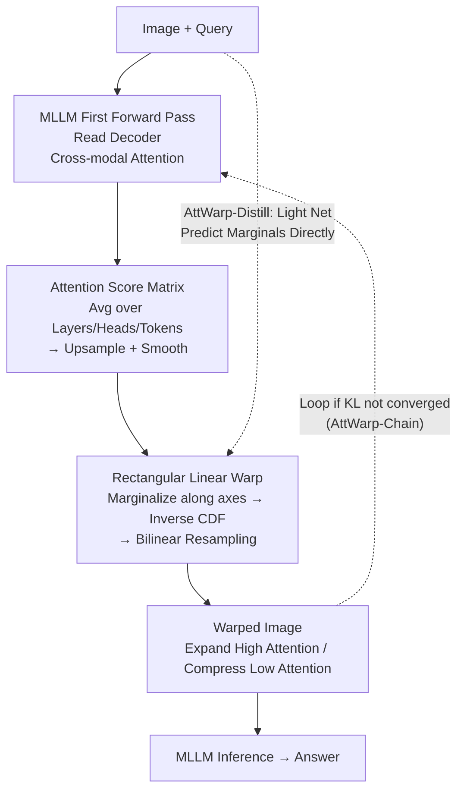

# Constructive Distortion: Improving MLLMs with Attention-Guided Image Warping

**Conference**: ICLR 2026  
**arXiv**: [2510.09741](https://arxiv.org/abs/2510.09741)  
**Code**: [Project Page](https://dwipddalal.github.io/Attwarp/)  
**Area**: Multimodal VLM  
**Keywords**: MLLM, image warping, attention-guided, fine-grained perception, test-time intervention

## TL;DR
AttWarp is proposed as a plug-and-play test-time image warping method that utilizes the cross-modal attention maps of an MLLM to perform rectangular grid resampling. By expanding high-attention regions and compressing low-attention ones, it consistently improves accuracy, enhances compositional reasoning, and reduces hallucinations across 5 benchmarks and 4 MLLMs.

## Background & Motivation
**Background**: Multimodal Large Language Models (MLLMs), such as LLaVA and Qwen-VL, have made significant progress in image dialogue and reasoning. However, they still exhibit notable deficiencies in fine-grained perception—missing small objects, confusing similar entities, and misunderstanding spatial relationships.

**Limitations of Prior Work**: Existing improvement methods either require external detectors (bounding boxes/masks), necessitate multi-step reasoning chains, or involve cropping/masking that leads to the loss of global context.

**Key Challenge**: Spatial details of small objects are often lost during the feature extraction stage, which subsequent attention improvements cannot recover; however, simple zooming or cropping results in the loss of global layout.

**Goal**: To enhance the resolution of query-relevant regions through spatial transformations at the input level without modifying model weights or architecture.

**Key Insight**: Analogous to human foveal vision—densely sampling the area of focus while sparsely sampling the periphery, all while preserving global information.

**Core Idea**: Utilize the model's own attention to guide a single rectangular linear deformation, enabling the same model to "see more clearly."

## Method

### Overall Architecture
AttWarp serves as a test-time image preprocessing wrapper for MLLMs: the model first performs an initial forward pass on the "image + query" to extract cross-modal attention from the language decoder, which is aggregated into an **attention score matrix**. Based on this, a **rectangular linear warping** is applied to resample the image—expanding high-attention regions and compressing low-attention ones. The warped image is then fed back into the same model for the final answer. The entire process does not modify weights or architecture, relying instead on converting attention distribution into a spatial mapping that maintains a regular grid. Two extensions are provided: **AttWarp-Chain** iterates the "extract attention → warp" process for positive feedback, and **AttWarp-Distill** employs a lightweight network to directly predict the marginal distributions required for warping, reducing two forward passes into one.

### Key Designs

**1. Attention Score Matrix: Translating "Where the Model Wants to Look" into a Heatmap**

To ensure effective warping, the first step is generating a clean attention map aligned with image pixels. AttWarp extracts cross-modal attention from specified decoder layers $\mathcal{L}$, averaging across all output tokens, attention heads, and selected layers to obtain an aggregated score $\tilde{A}_{i,j} = \frac{1}{n_{\text{out}} \cdot n_{\text{heads}} \cdot |\mathcal{L}|} \sum_{\ell \in \mathcal{L}} \sum_m \sum_h a^{(\ell,h)}_{m,t}$. Since the raw attention resolution is low (corresponding to visual token grids), it is upsampled to the image size and smoothed to remove artifacts. This step is essentially free, as attention is a byproduct of the forward pass and requires no external detectors.

**2. Rectangular Linear Warp: Redistributing Pixel Density via Inverse CDF without Breaking Grid Structure**

Given a 2D attention map, the challenge is to expand "points of interest" without making the image unrecognizable to the visual encoder. Free-form deformation (per-pixel flow) would distort the grid, causing a mismatch with standard ViT patch partitioning and introducing significant distribution shift. AttWarp constrains the transformation to a separable rectangular linear mapping. It marginalizes the 2D attention along both axes to obtain 1D distributions $m_x(j)$ and $m_y(i)$. For each distribution, it calculates the cumulative distribution function (CDF) and takes its inverse as the coordinate remapping: $f_X^{\text{Warp}}(j) = W \cdot M_x^{-1}(j/W)$ and $f_Y^{\text{Warp}}(i) = H \cdot M_y^{-1}(i/H)$. Finally, bilinear resampling is applied according to these mappings. The geometric intuition of the inverse CDF is that intervals with high attention density have higher slopes on the CDF, thus occupying more pixels after the inverse transformation. Because the mapping is monotonic and separable on each axis, the regular grid is preserved, and all pixels remain in the image—distinguishing this from cropping/masking which discards information. This is crucial: the KID of rectangular warping relative to the training distribution is only 31.5, compared to 174.9 for non-rectangular free-form warping.

**3. AttWarp-Chain: Positive Feedback via "Warp Improves Attention, Attention Refines Warp"**

After one warping iteration, the model provides more focused attention on the clearer regions of interest, which in turn drives more accurate warping. This iterative process continues until the attention distributions of adjacent rounds stabilize, measured by KL divergence $\mathcal{D}_{KL}(P^{(d)} \| P^{(d-1)}) < \epsilon_{KL}$. This approach avoids fixed iterations and prevents extreme distortion.

**4. AttWarp-Distill: Distilling Two Forward Passes into One for Low-Latency Deployment**

Vanilla AttWarp doubles latency. The distillation version replaces the first stage with a lightweight prediction network: a CLIP ViT-L/14 encodes the image, FiLM performs conditional modulation based on the text query, and a Conv1D directly outputs the predicted marginal distributions $(\hat{m}_x, \hat{m}_y)$. It is trained using the ground truth marginal distributions calculated by the teacher MLLM on datasets like TextVQA/GQA/DocVQA. At inference, it requires only one lightweight pass plus one MLLM pass (approx. 8.7 TFLOPs), nearly matching the Base MLLM's 8.5 TFLOPs and significantly faster than ViCrop’s 24.2 TFLOPs.

## Key Experimental Results

### Main Results
Results on LLaVA-v1.5-7B (Accuracy %):

| Method | TextVQA | GQA | MMMU | POPE | DocVQA |
|--------|---------|-----|------|------|--------|
| Base MLLM | 49.3 | 60.5 | 36.9 | 85.3 | 18.1 |
| ViCrop | 56.3 | 60.9 | 37.2 | 87.0 | 22.5 |
| Ours (AttWarp) | 58.1 | 63.7 | 40.4 | 87.5 | 25.5 |
| AttWarp-Chain | **60.3** | **64.4** | **41.6** | **88.2** | **27.6** |
| Gain vs Best Baseline | +4.0 | +3.5 | +4.4 | +1.2 | +5.1 |

Consistent improvements were also observed on Qwen2.5-VL (+2.1~3.6%).

### Ablation Study
Validation of Attention Distribution Improvement (TextVQA):

| Metric | No Warp | With AttWarp |
|--------|---------|--------------|
| Pointing Game Accuracy | 37.4% | 42.4% (+5%) |
| Proportion (Attention in bbox) | 0.117 | 0.155 (+3.8%) |

Distribution Shift Analysis: AttWarp KID=31.5 vs. Non-Rectilinear Warp KID=174.9 (distance to training distribution), proving that rectangular linear warping introduces minimal distribution shift.

### Key Findings
- Warping effectively concentrates attention on correct regions, improving Pointing Game accuracy by 5%.
- Rectangular linear design is critical—non-rectangular warping leads to severe distribution shift (KID increases from 31.5 to 174.9).
- AttWarp-Distill achieves 8.7 TFLOPs, close to the Base MLLM (8.5 TFLOPs) and far superior to ViCrop (24.2 TFLOPs).
- Error analysis indicates that AttWarp primarily reduces errors related to fine-grained details and compositional reasoning.

## Highlights & Insights
- **Philosophy of "Constructive Distortion"**: Inspired by human foveal vision, active distortion of input is a rational and effective strategy.
- **Plug-and-Play**: Effective across 4 different MLLM architectures (LLaVA, Qwen-VL, InternVL, InstructBLIP) without model modification.
- **Information Preservation**: Unlike cropping/masking, warping retains all pixel information and only redistributes density.
- **Inverse CDF Framework**: The mathematical framework for converting attention into a warping map is elegant and concise, requiring only a single forward pass of the CDF.
- **AttWarp-Chain Feedback**: Iterative enhancement where warping improves attention and vice versa, with automatic termination via KL divergence.
- **Distribution Maintenance**: Rigorous validation that rectangular warping does not introduce distribution shift (KID/FID/Mahalanobis).

## Limitations & Future Work
- Requires two MLLM forward passes (one for attention extraction, one for inference), doubling latency.
- Warping might suppress peripheral context necessary for global reasoning, especially for holistic scene understanding.
- Absolute scale information is lost after warping, potentially affecting size-related tasks.
- AttWarp-Chain iteration count depends on the KL threshold hyperparameter.
- Success relies on initial attention quality—if the initial attention is completely off-target, warping will be counterproductive.
- No theoretical upper bound on warping magnitude; extreme warping may cause severe compression of non-target areas.
- Application to video understanding models (temporal consistency in warping) remains unexplored.

## Related Work & Insights
- Comparison with test-time intervention methods like FGVP, SoM, and ViCrop: AttWarp is unique in preserving complete image information.
- Comparison with APIPrompting: The latter overlays attention heatmaps, introducing non-original information; AttWarp maintains pure image inputs.
- A modern revival of classic methods like seam carving and saliency-aware warping, but traditional approaches are often optimization-based (taking minutes per image), whereas AttWarp is based on a single-pass inverse CDF.
- Insight: Intervention at the input level (rather than intermediate representations) is an overlooked but effective strategy for improving perception models.
- Insight for Embodied AI / AR devices: AttWarp-Distill’s single-pass inference is suitable for low-latency scenarios.

## Rating
- Novelty: ⭐⭐⭐⭐ The idea of attention-guided warping is novel, the inverse CDF framework is elegant, and it is well-inspired by foveal vision.
- Experimental Thoroughness: ⭐⭐⭐⭐⭐ Extremely thorough with 5 benchmarks, 4 models, distribution analysis, attention validation, and error analysis.
- Writing Quality: ⭐⭐⭐⭐⭐ Logical flow from motivation to method and experiment, with clear diagrams and thorough analysis.
- Value: ⭐⭐⭐⭐ High practical value as a plug-and-play solution, though essentially a test-time trick with finite theoretical depth.

<!-- RELATED:START -->

## Related Papers

- [\[ICLR 2026\] When MLLMs Meet Compression Distortion: A Coding Paradigm Tailored to MLLMs](when_mllms_meet_compression_distortion_a_coding_paradigm_tailored_to_mllms.md)
- [\[CVPR 2026\] Token Warping Helps MLLMs Look from Nearby Viewpoints](../../CVPR2026/multimodal_vlm/token_warping_helps_mllms_look_from_nearby_viewpoints.md)
- [\[ICLR 2026\] RAR: Reversing Visual Attention Re-Sinking for Unlocking Potential in Multimodal Large Language Models](rar_reversing_visual_attention_re-sinking_for_unlocking_potential_in_multimodal_.md)
- [\[ICML 2026\] Seeing is Understanding: Unlocking Causal Attention into Modality-Mutual Attention for Multimodal LLMs](../../ICML2026/multimodal_vlm/seeing_is_understanding_unlocking_causal_attention_into_modality-mutual_attentio.md)
- [\[CVPR 2026\] Personalized Image Descriptions from Attention Sequences](../../CVPR2026/multimodal_vlm/personalized_image_descriptions_from_attention_sequences.md)

<!-- RELATED:END -->
