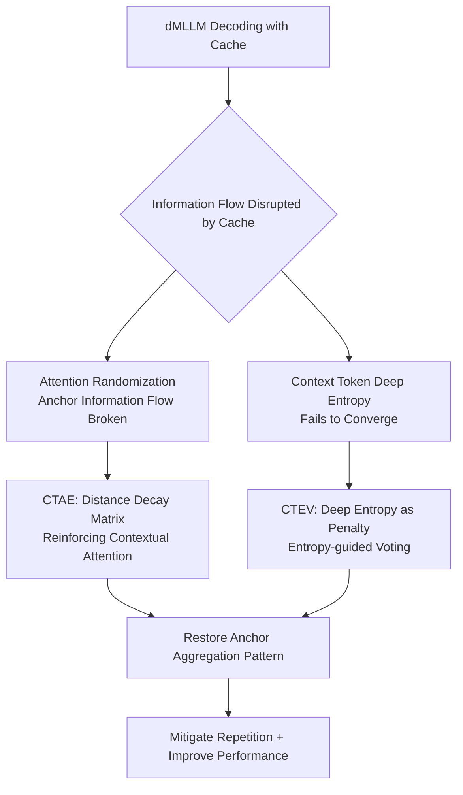

# Context Tokens are Anchors: Understanding the Repeat Curse in dMLLMs from an Information Flow Perspective

**Conference**: ICLR 2026  
**OpenReview**: [https://openreview.net/forum?id=mOz9jVYxsD](https://openreview.net/forum?id=mOz9jVYxsD)  
**Code**: [https://github.com/ErikZ719/CoTA](https://github.com/ErikZ719/CoTA)  
**Area**: Multimodal Large Language Models / Diffusion Language Models / Interpretability  
**Keywords**: dMLLM, Repeat Curse, Cache Acceleration, Information Flow, Attention Anchors, Information Entropy, Training-free  

## TL;DR
This paper discovers that diffusion-based Multimodal Large Language Models (dMLLMs) suffer from severe text repetition (Repeat Curse) when using cache acceleration. From an information flow perspective, the root cause is identified as the disruption of "context anchor token" information flow and the failure of deep-layer information entropy to converge. Based on this, the training-free CoTA (Contextual Attention Enhancement + Entropy-guided Voting) is proposed to eliminate repetition.

## Background & Motivation
**Background**: Diffusion-based Language Models (dLLMs) replace autoregressive token-by-token prediction with parallel denoising. When combined with visual encoders, they evolve into dMLLMs (e.g., LLaDA-V, MMaDA), serving as powerful alternatives to autoregressive MLLMs. However, dMLLMs employ bidirectional attention and multi-step denoising, leading to high inference latency. Consequently, they generally rely on caching techniques (dLLM-Cache, SlowFast, Fast-dLLM, etc.) to accelerate by reusing highly similar token states between adjacent denoising steps.

**Limitations of Prior Work**: The authors find that these caching methods introduce a serious side effect—the generated text contains excessive redundancy and repetition ("the the", "of of the the"), termed the **Repeat Curse**. Statistics show this phenomenon is prevalent across various dMLLM and cache combinations, significantly damaging output performance and readability.

**Key Challenge**: Caching is essential for acceleration but triggers repetition. Due to the black-box nature of dMLLMs, it is difficult to explain the origin of these repetitions—making it impossible to achieve both speed and quality under current caching mechanisms.

**Goal**: Troubleshoot the internal mechanisms of dMLLMs from the interpretable perspective of information flow, locate the root cause of the Repeat Curse, and design a training-free mitigation method that is plug-and-play with any dMLLM/caching strategy.

**Key Insight (Context Tokens are Anchors)**: Through attention visualization, the authors discover that **neighboring context tokens act as "anchors," aggregating semantic information layer-by-layer and absorbing disproportionate attention to guide final predictions**. In normal decoding, the cross-layer information entropy of these anchors converges in deep layers (increasing certainty), whereas caching disrupts the attention distribution, preventing anchor entropy from converging and thus inducing repetition. CoTA is designed to repair these two specific issues.

## Method

### Overall Architecture
CoTA is a training-free method built upon three information flow discoveries, consisting of two complementary components: **CTAE** repairs the "attention distribution" side by using a distance-decay matrix to reinforce attention on context tokens, restoring the native "anchor aggregation" information flow pattern; **CTEV** repairs the "decoding voting" side by incorporating the accumulated information entropy of context tokens in deep layers as a penalty term in confidence scoring, preventing the model from selecting tokens with high uncertainty. Both are plug-and-play and can be superimposed on any dMLLM and caching strategy with minimal overhead.

### Key Designs

**1. Three Discoveries in Information Flow: A Diagnostic Chain from Phenomenon to Root Cause.** This forms the theoretical foundation. By visualizing the attention matrix for each output token, three progressive conclusions are reached: **Discovery 1**—In dMLLM, neighboring context tokens near the query act as anchors (similar to "attention sinks" in autoregressive models), stably absorbing high attention across layers to aggregate semantics and guide predictions; **Discovery 2**—In normal decoding, cross-layer information entropy of these anchors gradually converges (dropping sharply around layers 26–30), indicating increasing prediction certainty; **Discovery 3**—Once caching is applied, attention distribution becomes highly random, the native information flow of anchors is interrupted, and context tokens involved in repetition maintain abnormally high entropy in deep layers without converging. Ablation studies precisely point to "output token caching": when the similarity threshold is fixed, caching only prompt tokens (Prefix KV) triggers almost no repetition (SRR=0), while increasing the recomputation interval for output tokens causes SRR to soar to 89.7.

**2. CTAE (Contextual Attention Enhancement): Pulling Attention Back to Anchors via Distance Decay.** Since caching scatters attention, CTAE explicitly biases attention back to neighboring tokens to restore local semantic coherence. For each query–key pair $(i,j)$, it calculates a Gaussian distance decay term:

$$g_{i,j} = \exp\!\left(-\left(\tfrac{|i-j|}{\tau}\right)^{2}\right), \qquad G_{i,j} = \gamma_{\min} + (1-\gamma_{\min})\,g_{i,j}, \quad \gamma_{\min}\in(0,1].$$

Here, $\tau$ is the temperature (fixed at 5). The closer the tokens, the closer the decay value is to 1, preserving attention. $\gamma_{\min}$ is a lower bound constant to prevent instability from decaying distant tokens to zero. The original attention is element-wise multiplied by the decay matrix $\text{Attn}_{i,j}\!\ast\! G_{i,j}$, re-encoding the "context tokens as anchors" pattern into the attention map. Visualization (Fig. 9) shows that randomized attention after caching is recaptured by context tokens via CTAE.

**3. CTEV (Entropy-guided Voting): Using Deep Entropy as a Penalty to Block Uncertain Tokens.** Baseline dMLLMs only use confidence $c(i)=p_\theta(S^0_{(i)}=\hat S^t_{(i)}\mid S^t)$ to vote for candidate tokens, ignoring the "non-convergent deep entropy = high uncertainty" signal. CTEV first calculates normalized entropy for each candidate token and accumulates it layer-by-layer in deep layers (layers 26–30):

$$E_{\text{sum}} = \sum_{l=26}^{30} E^{(l)}, \qquad E^{(l)} = -\frac{\sum_{v=1}^{V} p_v^{(l)}\log p_v^{(l)}}{\log V}.$$

The deep accumulated entropy of the candidate token itself and its two nearest neighbors (the context set $C(i)$) is summarized as $E^{\text{ctx}}_{\text{sum}}(i)=\sum_{j\in C(i)}E_{\text{sum}}(j)$. Finally, this is added to the original confidence as a penalty with coefficient $\alpha$ to obtain the new voting score:

$$\text{Score}(i) = c(i) + \alpha\,E^{\text{ctx}}_{\text{sum}}(i).$$

As higher entropy leads to a larger penalty, tokens that "appear confident but have high deep entropy in their context anchors" are downranked and not selected, preventing repetitive output driven by uncertain anchors at the source.

## Key Experimental Results

### Main Results
Repetition Curse Mitigation (COCO VQA, 500 images; 512/64 are max generation lengths, lower ARR/SRR is better):

| Method | ARR↓ (512) | SRR↓ (512) | ARR↓ (64) | SRR↓ (64) |
|---|---|---|---|---|
| LLaDA-V | 0.2 | 6.9 | 0.1 | 3.3 |
| + dLLM-Cache | 14.3 | 82.3 | 7.1 | 65.6 |
| + dLLM-Cache + CTAE | 3.2 | 10.6 | 2.5 | 5.6 |
| + dLLM-Cache + CTEV | 2.9 | 8.0 | 1.8 | 4.6 |
| **+ dLLM-Cache + CoTA** | **1.2** | **6.3** | **1.0** | **3.0** |

In long-text settings, CoTA reduces cache-induced ARR/SRR by **96% / 92%** respectively; in short-text settings, the reduction is **85% / 95%**, nearly returning to the no-cache baseline level.

### Ablation Study
Locating the root cause of repetition via cache components (SRR↓):

| Component | Setting → SRR |
|---|---|
| Prompt Recomputation Interval | 1/5/15/25 → All 0 |
| Output Recomputation Interval | 1→0, 3→79.9, 7→89.7 |
| Similarity Threshold | 0→89.7, 0.25→75.0, 0.75→29.7 |
| Reuse Strategy | Prefix→0, dLLM-Cache→75.0 |

Conclusion: **Repetition is almost entirely driven by the "caching of output tokens"**; caching prompt tokens has no impact.

Hyperparameter Ablation (MathVerse, optimal with 3 context tokens): $\alpha=0.75$, $\gamma_{\min}=0.5$ achieved the best combination of ARR=1.2% and ACC=23.1.

### Key Findings
- **Generalization and Efficiency**: On LLaVAw / MathVista, CoTA improves the Score of the cached baseline by 11% / 9% and reduces ARR by 80% / 81%, while only causing a 2.8 decrease in TPS and a 1.9 increase in FLOPs, which is acceptable overhead.
- **Cross-Model / Cross-Cache**: ARR/SRR improved by 86%/45% on MMaDA and remained consistently effective on SlowFast caching.
- **Reverse Verification of Root Cause**: Methods like Prefix-KV, D3ToM, and Fast-dLLM, which "hardly cache output tokens," do not trigger the Repeat Curse, verifying the diagnosis that "output token caching = source of repetition."

## Highlights & Insights
- **Seamless Naming and Explanation**: Not only identifies and names the "Repeat Curse" in dMLLMs for the first time but also provides a verifiable causal chain using information flow (output caching → attention randomization → non-convergent deep anchor entropy → repetition), rather than just providing a superficial decoding trick.
- **"Context Tokens are Anchors" as a Unified Perspective**: Adapts the attention sink concept from autoregressive models to bidirectional attention dMLLMs. The two components (CTAE for attention, CTEV for voting) correspond perfectly to the two sides of "disrupted anchor information flow," making the method highly self-consistent with the diagnosis.
- **Training-free and Plug-and-play**: Can be superimposed on any dMLLM and caching strategy with extremely low engineering cost, preserving the speed benefits of caching.

## Limitations & Future Work
- **Hand-crafted Deep Layer Definition**: Fixing layers 26–30 as "deep" and using the nearest 2 tokens as context are empirical settings based on specific models (LLaDA-V/MMaDA). It is unclear if layer ranges need recalibration across architectures.
- **Hyperparameter Dependency**: $\alpha$, $\gamma_{\min}$, $\tau$, and the number of context tokens all require tuning; the paper provides optimal points but does not discuss adaptive selection.
- **Efficiency Trade-offs**: CTEV requires reading deep-layer logits to calculate entropy, resulting in a slight drop in TPS and an increase in FLOPs, representing a trade-off in extreme acceleration scenarios.
- **Scope Limited to Long Captions**: The Repeat Curse is most evident in long responses and VQA description tasks; its universality in short Q&A or structured output remains to be further verified.

## Related Work & Insights
- **dMLLM and Caching**: dLLM-Cache, SlowFast, Fast-dLLM, and Prefix-KV migrate caching paradigms to bidirectional attention diffusion models; this paper reveals their shared hidden danger.
- **Information Flow Interpretability**: Saliency, attention maps, Grad-CAM, information entropy, and massive values are common tools for probing black-box mechanisms; this is the first work to systematically explain dMLLM repetition via information flow.
- **Token Repetition Research**: Early mitigation relied on n-gram penalties, contrastive decoding, and training optimization. DUC and model editing explain repetition in AR LLMs from features and neurons; this paper extends "explanation + mitigation" to dMLLMs.
- **Inspiration**: The diagnostic paradigm linking "which tokens are cached" to "disruption of internal information flow" can be generalized to analyze side effects of other acceleration techniques (pruning, quantization). Using "deep entropy convergence as a generation quality signal" can also be migrated to detect and suppress abnormal behaviors like hallucinations and degradation.

## Rating
- **Novelty**: ⭐⭐⭐⭐ — First to identify/name the dMLLM "Repeat Curse" and provide a verifiable causal mechanism from an information flow perspective.
- **Experimental Thoroughness**: ⭐⭐⭐⭐ — Verified across 2 dMLLMs, multiple caches, and multimodal benchmarks. Ablations precisely locate the root cause with reverse verification, though tasks are centered on long-text captioning/VQA.
- **Writing Quality**: ⭐⭐⭐⭐ — Clear narrative (Phenomenon → Visualization → 3 Discoveries → 2 Components) with strong support from figures (attention maps, entropy curves).
- **Value**: ⭐⭐⭐⭐ — Addresses a real pain point in dMLLM deployment. It is training-free, plug-and-play, and maintains controllable overhead, offering both engineering value and mechanistic insight.

<!-- RELATED:START -->

## Related Papers

- [\[CVPR 2026\] Aligning What Vision-Language Models See and Perceive with Adaptive Information Flow](../../CVPR2026/multimodal_vlm/aif_adaptive_information_flow_vlm.md)
- [\[ICLR 2026\] AttTok: Marrying Attribute Tokens with Generative Pre-trained Vision-Language Models towards Medical Image Understanding](atttok_marrying_attribute_tokens_with_generative_pre-trained_vision-language_mod.md)
- [\[CVPR 2025\] Cross-modal Information Flow in Multimodal Large Language Models](../../CVPR2025/multimodal_vlm/cross-modal_information_flow_in_multimodal_large_language_models.md)
- [\[CVPR 2026\] PosterIQ: A Design Perspective Benchmark for Poster Understanding and Generation](../../CVPR2026/multimodal_vlm/posteriq_a_design_perspective_benchmark_for_poster_understanding_and_generation.md)
- [\[ICLR 2026\] UrbanFeel: A Comprehensive Benchmark for Temporal and Perceptual Understanding of City Scenes through Human Perspective](urbanfeela_comprehensive_benchmark_for_temporal_and_perceptual_understanding_of_.md)

<!-- RELATED:END -->
