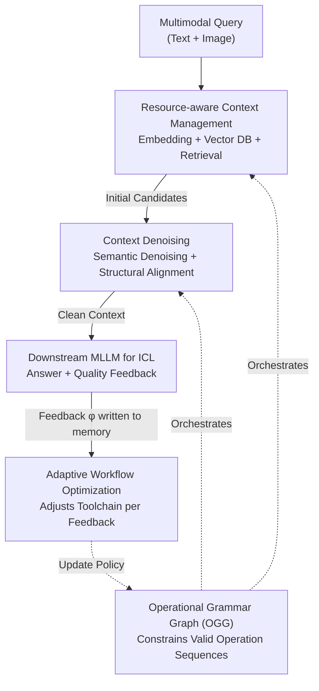

# ContextNav: Towards Agentic Multimodal In-Context Learning

**Conference**: ICLR2026  
**OpenReview**: [https://openreview.net/forum?id=k3DZzBl2EZ](https://openreview.net/forum?id=k3DZzBl2EZ)  
**Code**: To be confirmed (Project page: https://contextnavpage.github.io/)  
**Area**: Multimodal VLM / Multimodal In-Context Learning / Agent  
**Keywords**: Multimodal ICL, agentic workflow, context denoising, retrieval, operational grammar graph

## TL;DR
ContextNav transforms the task of "selecting and cleaning examples for multimodal in-context learning" into an MLLM-driven closed-loop agentic workflow. It first performs resource-aware embedding and candidate retrieval, followed by agent-based reasoning to eliminate semantic and structural noise. Finally, an Operational Grammar Graph (OGG) constrains the tool-calling sequence, while downstream ICL feedback continuously optimizes the strategy. Across 8 datasets, it improves the average ICL gain from the Prev. SOTA of 7.6% to 16.8%.

## Background & Motivation
**Background**: Multimodal Large Language Models (MLLMs) have demonstrated strong in-context learning (ICL) capabilities—adapting to new vision-language tasks by providing a few image-text demonstrations without updating parameters. Currently, there are two main paths for providing demonstrations: **Manual ICL**, where humans select and organize examples resulting in clean and well-structured contexts, and **Retrieval-based ICL**, which uses feature similarity to automatically retrieve examples from a candidate pool.

**Limitations of Prior Work**: Manual ICL is high-quality but labor-intensive and task-specific, failing to generalize to large-scale multimodal corpora. While retrieval-based ICL saves labor, it introduces two types of "noise" into the context: **semantic noise** (retrieved samples are off-topic or contradict the query intent) and **structural noise** (the grammatical structure of candidates—interrogative, imperative, or declarative—is inconsistent with the query). These types of noise significantly degrade downstream ICL performance. Figure 1 in the paper provides an example of remote sensing Q&A where a noisy context leads the model away from the correct answer.

**Key Challenge**: A deeper issue is that retrieval itself is a one-time, rule-based static process—it does not "adjust the sampling strategy based on effectiveness" like humans do. Thus, the challenge is that the **scalability of automatic retrieval** and the **quality/adaptability of human curation** are difficult to achieve simultaneously.

**Goal**: Develop a context construction method that possesses the scalability of retrieval alongside the denoising capabilities and "learning-while-doing" adaptability of human curation. This is decomposed into three tasks: how to manage/embed multimodal corpora, how to clean noisy candidates, and how to evolve the sampling workflow based on feedback.

**Key Insight**: The authors observe that the entire sequence of "selecting examples + cleaning examples + reranking examples + adjusting strategies based on downstream effects" is essentially a **tool-driven workflow that can be orchestrated by an agent**, where the MLLM itself serves as the strategic brain with its multimodal reasoning capabilities.

**Core Idea**: Formalize multimodal context construction as an **agentic workflow** driven by MLLM policies, constrained by graph structures, and incorporating a downstream feedback loop. This is ContextNav, claimed to be the first agentic framework for multimodal ICL context construction.

## Method

### Overall Architecture
ContextNav takes a multimodal query (textual query $q_t$ paired with an image $q_v$) and outputs a set of "clean, query-relevant, and structurally aligned" contexts, which are prepended to the query for the downstream MLLM $\Phi$ to perform ICL. The pipeline is driven by an MLLM policy $\pi_\theta$ (defaulting to Gemini-2.0-flash) as the agent, comprising three collaborative modules and a feedback loop:

1. **Agentic Context Management (Entry)**: The agent performs resource-aware multimodal embedding to build and continuously update a vector database, from which a batch of initial candidates $R^{init}_\tau$ is retrieved given a query.
2. **Context Denoising (Cleaning)**: The agent sequentially performs agentic retrieval (to remove semantic noise) and structural alignment (to remove structural noise) on initial candidates, resulting in noise-minimized contexts $R^{alin}_\tau$.
3. **Graph-driven Workflow Orchestration (Orchestration)**: An Operational Grammar Graph (OGG) constrains these operations to ensure they are executed in a valid dependency order. It adaptively plans and optimizes operation sequences based on the association between "historical workflows ↔ downstream ICL feedback" stored in memory.

Finally, the cleaned context and the query are fed into the downstream MLLM. The model yields not only the answer $y_\tau$ but also a textual feedback $\phi_\tau$ regarding the context quality. This feedback is written into memory to guide the selection of the toolchain in the next iteration. The entire setup is a self-optimizing closed-loop system.

### Key Designs

**1. Resource-aware Agentic Context Management: Transforming "Embedding + Indexing + Retrieval" into an Agent-driven Dynamic Process**

This step addresses the pain point that large-scale multimodal embedding is expensive and storage-intensive, and different embedding models involve trade-offs between accuracy and efficiency. ContextNav makes embedding an agent decision: the embedding specification prompt $P_{emb}$ encodes user resource preferences, current hardware status, and available embedding models. The MLLM policy performs "hardware-model matching" to select a pair of text/vision embedding models $(E_T, E_V) = \pi_\theta(P_{emb})$. For a corpus $C=\{(T_i, I_i)\}_{i=1}^N$, at time $\tau$, it generates the embedding set $E_\tau = \{(E_{text}(T_i), E_{vis}(I_i)) \mid (T_i,I_i)\in C_\tau\}$.

Crucially, this database is "alive": the agent uses database tools to continuously monitor the corpus. If new or modified samples $\Delta C_{\tau+1}$ are found, it triggers on-demand embedding to update the database $D_{\tau+1} = D_\tau \cup \{(T_j, I_j, e_j)\}$. Once the index is built, a Top-$k$ similarity retrieval function $f_\tau$ (an adaptive combination of text, vision, or cascaded retrieval tools) provides the initial candidate pool $R^{init}_\tau = f_\tau(q, D_\tau, k)$. 

**2. Context Denoising: Utilizing Agentic Reasoning to Eliminate Semantic and Structural Noise**

This is the core of ContextNav's "human-like curation," targeting the two types of noise identified in Figure 1:

- **Agentic Retrieval (Semantic Denoising)**: Adds a "secondary filtering" step beyond raw similarity retrieval. A coherence prompt $P_{coh}$ provides semantic judgment instructions (e.g., verifying topic consistency between query and candidate, discarding contradictory or distracting candidates). The policy evaluates initial candidates individually to determine their retention: $R^{sem}_\tau = \pi_\theta(q, P_{coh}, R^{init}_\tau)$.
- **Structural Alignment (Structural Denoising)**: A structural alignment prompt $P_{str}$ guides the agent to **rewrite** candidates with divergent sentence structures into a form consistent with the query text $q_t$: $R^{alin}_\tau = \pi_\theta(q_t, P_{str}, R^{sem}_\tau)$. This step reorganizes the text structure rather than discarding candidates, reducing distributional bias.

This is effective because similarity $\neq$ semantic relevance, and even less $\neq$ structural consistency. By prioritizing semantic fidelity then structural alignment, "noise-minimized" contexts are obtained.

**3. Operational Grammar Graph (OGG): Using Directed Graphs to Constrain Agents to Valid Operation Sequences**

There are strict dependencies and combination constraints between these operations (tool calls or internal reasoning). Data structures evolve through the workflow, and each step modifies the previous result. Random or heuristic combinations lead to redundant or illegal execution. ContextNav constructs a directed graph $G=(V,E)$, called the Operational Grammar Graph: $V$ is the set of atomic operations, and $E$ encodes valid execution dependencies, effectively hardcoding the "syntax" of which operations can follow others. 

**4. Feedback-based Adaptive Workflow Optimization: Upgrading One-time Retrieval to a "Learn-while-doing" Loop**

OGG ensures validity, but the instantiated workflow might still be sub-optimal under one-time planning without intermediate feedback. ContextNav adds memory $M$ and a closed feedback loop. The workflow orchestration prompt $P_{wop}$ specifies initial requirements and optimization logic. At time $\tau$, the operation sequence is modeled as $S_\tau = \pi_\theta(P_{wop}, M_\tau, G)$. After the downstream MLLM performs ICL, it outputs both a prediction $y_\tau$ and quality feedback $\phi_\tau$: $(y_\tau, \phi_\tau)=\Phi(R^{alin}_\tau, q, P_{icl})$. The agent records the "executed sequence ↔ feedback" in memory:

$$M_{\tau+1} = M_\tau \cup \{(S_\tau, \phi_\tau)\} = \{(S_i, \phi_i)\}_{i=1}^{\tau}.$$

This continuous update closes the loop between "multimodal ICL ↔ toolchain optimization," allowing the agent to refine planning strategies over multiple steps.

### Mechanism Example
Take a remote sensing VQA query: "Where is the building with the deep blue roof?" (GT: Bottom-right). The agent selects embedding models based on resources and retrieves 3 candidates: Shot 1 is topically similar but is actually a painted map (Semantic Noise); Shot 2 has the correct topic but is phrased differently (Structural Noise); Shot 3 is a perfect match. Agentic Retrieval filters Shot 1; Structural Alignment rewrites Shot 2 to match the query's structure; Shot 3 is kept as is. This provides a clean context, leading the downstream MLLM to the correct answer.

## Key Experimental Results

### Main Results
Covering 8 datasets (BlindTest, MME-RealWorld, CharXiv, GVL, MathVision, and CLEVR/FOMI/TextOCR from VL-ICL Bench) across 6 representative MLLMs. Samples were categorized as "easy" if over half the models were correct, otherwise "hard," sampled at a 3:7 easy:hard ratio. Below is the average accuracy before and after applying ContextNav:

| Model | Zero-shot | +Rand. | +VL-ICL | +MMICES | +ContextNav |
|------|--------|--------|---------|---------|-------------|
| Qwen2.5-VL-7B | 0.440 | 0.408 | 0.460 | 0.456 | **0.480** |
| Gemini-1.5-flash | 0.505 | 0.476 | 0.528 | 0.528 | **0.574** |
| Gemini-2.0-flash | 0.542 | 0.504 | 0.561 | 0.559 | **0.604** |
| GPT-4o | 0.484 | 0.473 | 0.510 | 0.514 | **0.547** |

Overall, the average ICL gain for ContextNav is **16.8% across models and 16.2% across datasets**, far exceeding the 7.6% / 8.2% of the Prev. SOTA. Notably, on complex/noisy tasks like MathVision, non-agentic methods often show **negative gain** (e.g., random sampling at -20%), whereas ContextNav remains stable.

### Ablation Study
Conducted on MathVision (Full = Gemini-2.0-flash strategy):

| Configuration | Semantic Noise ↓ | Structural Noise ↓ | ICL Gain ↑ | 5-step TSR ↑ |
|------|-----------|-----------|-----------|--------------|
| Full | 0.053 | 0.084 | +11.8% | 1.000 |
| w/o Agentic Retrieval | 0.171 | 0.090 | +1.6% | 1.000 |
| w/o Structural Alignment | 0.053 | 0.573 | +6.7% | 1.000 |
| w/o Textual Retrieval & AR | 0.433 | 0.143 | **-18.7%** | 1.000 |
| w/o Toolchain Optimization | 0.093 | 0.091 | +5.0% | 1.000 |
| w/o Operational Grammar Graph | – | – | – | **0** |

TSR (Toolchain Success Rate) = probability of successfully generating a valid toolchain within X iterations.

### Key Findings
- **Every module is indispensable**: Removing Agentic Retrieval triples semantic noise; removing Structural Alignment causes structural noise to jump from 0.084 to 0.573.
- **OGG is critical**: Without it, the toolchain success rate drops to zero as the agent fails to generate executable sequences.
- **Stronger policy models help but are not strictly required**: Both GPT-4o and Gemini-2.0-flash yield +11.8%, while the smaller Qwen2.5-VL-3B still achieves +8.4%.
- **Embedding choice affects baseline**: Qwen3-Embedding series show lower initial noise and higher effective rates compared to CLIP-text.

## Highlights & Insights
- **Redefining "Example Selection" as an Agentic Workflow**: Unlike traditional static retrieval, ContextNav uses the MLLM as a curator through a "management-denoising-orchestration-feedback" loop—an approach highly transferable to RAG.
- **Differentiated Treatment of Noise**: Distinguishing "off-topic content" from "grammatical inconsistency" allows for targeted filtering vs. rewriting, which is more effective than generic similarity reranking.
- **Graphs as Agent "Grammar"**: OGG explicitly encodes dependencies into a directed graph, which is essential for constraining the agent's action space and avoiding illegal tool calls.
- **Downstream Feedback Loop**: Using task performance to provide a signal for optimizing the selector toolchain is a lightweight implementation of "instruction via outcome."

## Limitations & Future Work
- **Heavy reliance on a capable MLLM policy**: Performance drops significantly when using weaker strategy models (e.g., Qwen2.5-VL-3B). Multiple MLLM calls for evaluation/rewriting increase inference cost and latency.
- **Bias in noise judgment**: Semantic/structural noise relies on subjective MLLM judgment via prompts, risking the deletion of actually useful candidates.
- **Rewriting risks**: Structural alignment via rewriting may alter the original meaning of an example or introduce hallucinations.
- **Future Work**: Distilling MLLM calls into lightweight scorers; automating OGG/tool library learning; and extending feedback loops to long-term memory across queries.

## Related Work & Insights
- **vs. Manual ICL**: Manual methods provide clean context but are not scalable. ContextNav automates curation using agents.
- **vs. Retrieval-based ICL (VL-ICL / MMICES)**: These use one-time similarity retrieval which introduces noise and lacks adaptability. ContextNav adds secondary filtering, alignment, and feedback.
- **vs. Graph Orchestration (e.g., LangGraph)**: ContextNav borrows the concept of graph-captured dependencies but tailors OGG specifically for the atomic operations of multimodal context construction.

## Rating
- Novelty: ⭐⭐⭐⭐⭐ First to frame multimodal ICL context construction as a closed-loop agentic workflow.
- Experimental Thoroughness: ⭐⭐⭐⭐ Extensive datasets and models, though cost and "false deletion" rates are less quantified.
- Writing Quality: ⭐⭐⭐⭐ Clear modules and consistent notation.
- Value: ⭐⭐⭐⭐⭐ Significant improvement in ICL gain (7.6% to 16.8%) and a generalizable "Agent-as-Curator" paradigm.

<!-- RELATED:START -->

## Related Papers

- [\[ICLR 2026\] DeepEyesV2: Toward Agentic Multimodal Model](deepeyesv2_toward_agentic_multimodal_model.md)
- [\[CVPR 2026\] HiFICL: High-Fidelity In-Context Learning for Multimodal Tasks](../../CVPR2026/multimodal_vlm/hificl_highfidelity_incontext_learning_for_multimo.md)
- [\[ICLR 2026\] EgoHandICL: Egocentric 3D Hand Reconstruction with In-Context Learning](egohandicl_egocentric_3d_hand_reconstruction_with_in-context_learning.md)
- [\[CVPR 2025\] Mimic In-Context Learning for Multimodal Tasks](../../CVPR2025/multimodal_vlm/mimic_in-context_learning_for_multimodal_tasks.md)
- [\[CVPR 2026\] EvoGraph-R1: Self-Evolving Multimodal Knowledge Hypergraphs for Agentic Retrieval](../../CVPR2026/multimodal_vlm/evograph-r1_self-evolving_multimodal_knowledge_hypergraphs_for_agentic_retrieval.md)

<!-- RELATED:END -->
